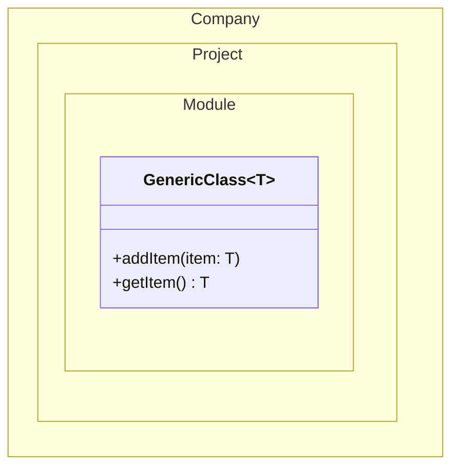

Fixed an issue when the mermaid classdiagram crashes when adding a . to the namespace.
Forexample

```mermaid

classDiagram
  namespace Company.Project.Module {
    class GenericClass~T~ {
      +addItem(item: T)
      +getItem() T
    }
  }
```
