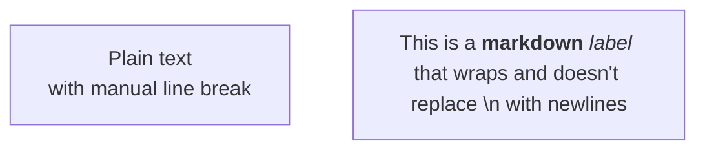

fix: Restore proper rendering of plain text flowchart labels without auto line-wrapping

This fix restores backwards compatibility with Mermaid v10 by ensuring that plain text labels in flowcharts are rendered correctly without auto line-wrapping. In Mermaid v11, all labels were incorrectly being treated as markdown by default, which caused issues with text wrapping, multiline breaks, and backwards compatibility.

**What changed:**

- Plain text labels (without markdown syntax) now render as regular text without auto line-wrapping
- Labels with `\n` characters now correctly create line breaks
- Text that looks like markdown (e.g., "1.", "- x") is no longer misinterpreted

**If you want markdown formatting:**
You can still use markdown in your flowchart labels by using the proper markdown syntax. Wrap your markdown text with double quotes and backticks:
``node["`_markdown_ **text**`"]``

Example:

````markdown

````
