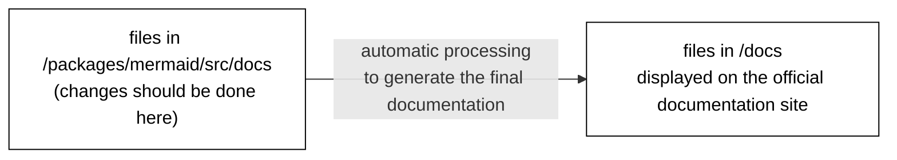

# Contributing

So you want to help? That's great!


Here are a few things to know to get you started on the right path.

Below link will help you making a copy of the repository in your local system.

https://docs.github.com/en/get-started/quickstart/fork-a-repo

## Requirements

- [volta](https://volta.sh/) to manage node versions.
- [Node.js](https://nodejs.org/en/). `volta install node`
- [pnpm](https://pnpm.io/) package manager. `volta install pnpm`

## Development Installation

```bash
git clone git@github.com:mermaid-js/mermaid.git
cd mermaid
# npx is required for first install as volta support for pnpm is not added yet.
npx pnpm install
pnpm test
```

## Committing code

We make all changes via pull requests. As we have many pull requests from developers new to mermaid, the current approach is to have _knsv, Knut Sveidqvist_ as a main reviewer of changes and merging pull requests. More precisely like this:

- Large changes reviewed by knsv or other developer asked to review by knsv
- Smaller low-risk changes like dependencies, documentation, etc. can be merged by active collaborators
- Documentation (updates to the `package/mermaid/src/docs` folder is also allowed via direct commits)

To commit code, create a branch, let it start with the type like feature or bug followed by the issue number for reference and some describing text.

One example:

`feature/945_state_diagrams`

Another:

`bug/123_nasty_bug_branch`

## Committing documentation

Less strict here, it is OK to commit directly in the `develop` branch if you are a collaborator.

The documentation is written in **Markdown**. For more information about Markdown [see the GitHub Markdown help page](https://help.github.com/en/github/writing-on-github/basic-writing-and-formatting-syntax).

### Documentation source files are in [`/packages/mermaid/src/docs`](packages/mermaid/src/docs)

The source files for the project documentation are located in the [`/packages/mermaid/src/docs`](packages/mermaid/src/docs) directory. This is where you should make changes.
The files under `/packages/mermaid/src/docs` are processed to generate the published documentation, and the resulting files are put into the `/docs` directory.



**_DO NOT CHANGE FILES IN `/docs`_**

### The official documentation site

**[The mermaid documentation site](https://mermaid-js.github.io/mermaid/) is powered by [Vitepress](https://vitepress.vuejs.org/), a simple documentation site generator.**

If you want to preview the whole documentation site on your machine:

```sh
cd mermaid
pnpm i
pnpm docs:dev
```

You can now build and serve the documentation site:

```sh
pnpm docs:build:vitepress
pnpm docs:serve
```

## Branching

Going forward we will use a git flow inspired approach to branching. So development is done in develop, to do the development in the develop.

Once development is done we branch a release branch from develop for testing.

Once the release happens we merge the release branch to master and kill the release branch.

This means... **branch off your pull request from develop**

## Content of a pull request

A new feature has been born. Great! But without the steps below it might just ... fade away ...

### **Add unit tests for the parsing part**

This is important so that, if someone else does a change to the grammar that does not know about this great feature, gets notified early on when that change breaks the parser. Another important aspect is that without proper parsing tests refactoring is pretty much impossible.

### **Add e2e tests**

This tests the rendering and visual appearance of the diagram. This ensures that the rendering of that feature in the e2e will be reviewed in the release process going forward. Less chance that it breaks!

To start working with the e2e tests, run `pnpm run dev` to start the dev server, after that start cypress by running `pnpm exec cypress open` in the mermaid folder.

The rendering tests are very straightforward to create. There is a function imgSnapshotTest. This function takes a diagram in text form, the mermaid options and renders that diagram in cypress.

When running in ci it will take a snapshot of the rendered diagram and compare it with the snapshot from last build and flag for review it if it differs.

This is what a rendering test looks like:

```javascript
it('should render forks and joins', () => {
  imgSnapshotTest(
    `
    stateDiagram
    state fork_state &lt;&lt;fork&gt;&gt;
      [*] --> fork_state
      fork_state --> State2
      fork_state --> State3

      state join_state &lt;&lt;join&gt;&gt;
      State2 --> join_state
      State3 --> join_state
      join_state --> State4
      State4 --> [*]
    `,
    { logLevel: 0 }
  );
  cy.get('svg');
});
```

### **Add documentation for it**

Finally, if it is not in the documentation, no one will know about it and then **no one will use it**. Wouldn't that be sad? With all the effort that was put into the feature?

The source files for documentation are in `/packages/mermaid/src/docs` and are written in markdown. Just pick the right section and start typing. See the [Committing Documentation](#committing-documentation) section for more about how the documentation is generated.

#### Adding to or changing the documentation organization

If you want to add a new section or change the organization (structure), then you need to make sure to **change the side navigation** in `mermaid/src/docs/.vitepress/config.js`.

When changes are committed and then released, they become part of the `master` branch and become part of the published documentation on https://mermaid-js.github.io/mermaid/

## Last words

Don't get daunted if it is hard in the beginning. We have a great community with only encouraging words. So if you get stuck, ask for help and hints in the slack forum. If you want to show off something good, show it off there.

[Join our slack community if you want closer contact!](https://join.slack.com/t/mermaid-talk/shared_invite/enQtNzc4NDIyNzk4OTAyLWVhYjQxOTI2OTg4YmE1ZmJkY2Y4MTU3ODliYmIwOTY3NDJlYjA0YjIyZTdkMDMyZTUwOGI0NjEzYmEwODcwOTE)


