<p align="center">

</p>
<h1 align="center">
Mermaid
</h1>
<p align="center">
Générez des diagrammes à partir de texte inspiré par Markdown.
<p>
<p align="center">
  <a href="https://www.npmjs.com/package/mermaid"></a>
<p>

<p align="center">
<a href="https://mermaid.ai/live/"><b>Éditeur en direct !</b></a>
</p>
<p align="center">
 <a href="https://mermaid.ai/open-source/">📖 Documentation</a> | <a href="https://mermaid.ai/open-source/intro/">🚀 Démarrage rapide</a> | <a href="https://www.jsdelivr.com/package/npm/mermaid">🌐 CDN</a> | <a href="https://discord.gg/sKeNQX4Wtj" title="Invitation Discord">🙌 Rejoignez-nous</a>
</p>
<p align="center">
<a href="./README.md">English</a> | <a href="./README.zh-CN.md">简体中文</a>
</p>
<p align="center">
Essayez les aperçus de futures versions de l'éditeur en direct : <a href="https://develop.git.mermaid.live/" title="Essayez la version mermaid de la branche develop.">Develop</a> | <a href="https://next.git.mermaid.live/" title="Essayez la version mermaid de la branche next.">Next</a>
</p>

<br>
<br>

[](https://www.npmjs.com/package/mermaid)
[](https://github.com/mermaid-js/mermaid/actions/workflows/build.yml)
[](https://bundlephobia.com/package/mermaid)
[](https://app.codecov.io/github/mermaid-js/mermaid/tree/develop)
[](https://www.jsdelivr.com/package/npm/mermaid)
[](https://www.npmjs.com/package/mermaid)
[](https://discord.gg/sKeNQX4Wtj)
[](https://twitter.com/mermaidjs_)
[](https://argos-ci.com?utm_source=mermaid&utm_campaign=oss)
[](https://securityscorecards.dev/viewer/?uri=github.com/mermaid-js/mermaid)

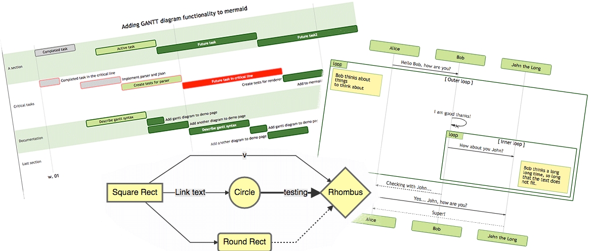

:trophy: **Mermaid a été nominé et a remporté les [JS Open Source Awards (2019)](https://osawards.com/javascript/2019) dans la catégorie "L'utilisation la plus excitante de la technologie" !!!**

**Merci à tous les contributeurs, aux personnes qui soumettent des demandes de tirage et à celles qui répondent aux questions ! 🙏**

<a href="https://mermaid.js.org/landing/"></a>

## Table des matières

<details>
<summary>Développer les contenus</summary>

- [À propos](#à-propos)
- [Exemples](#exemples)
- [Sortie](#sortie)
- [Projets connexes](#projets-connexes)
- [Contributeurs](#contributeurs---)
- [Sécurité et diagrammes sûrs](#sécurité-et-diagrammes-sûrs)
- [Signaler les vulnérabilités](#signaler-les-vulnérabilités)
- [Remerciements](#remerciements)

</details>

## À propos

<!-- <Description principale>   -->

Mermaid est un outil de diagrammatisation et de graphique basé sur JavaScript qui utilise des définitions de texte inspirées par Markdown et un moteur de rendu pour créer et modifier des diagrammes complexes. L'objectif principal de Mermaid est d'aider la documentation à suivre le rythme du développement.

> La pourriture documentaire est un problème de Catch-22 que Mermaid aide à résoudre.

La création de diagrammes et de documentation coûte aux développeurs un temps précieux et devient rapidement obsolète.
Mais ne pas avoir de diagrammes ou de documentation nuit à la productivité et entrave l'apprentissage organisationnel.<br/>
Mermaid résout ce problème en permettant aux utilisateurs de créer facilement des diagrammes modifiables. Il peut également être intégré dans des scripts de production (et d'autres morceaux de code).<br/>
<br/>

Mermaid permet même aux non-programmeurs de créer facilement des diagrammes détaillés via l'[Éditeur en direct Mermaid](https://mermaid.live/).<br/>
Pour les tutoriels vidéo, visitez notre page [Tutoriels](https://mermaid.js.org/ecosystem/tutorials.html).
Utilisez Mermaid avec vos applications préférées, consultez la liste des [Intégrations et utilisations de Mermaid](https://mermaid.js.org/ecosystem/integrations-community.html).

Vous pouvez également utiliser Mermaid dans [GitHub](https://github.blog/2022-02-14-include-diagrams-markdown-files-mermaid/) et dans de nombreuses autres applications que vous préférez—consultez la liste des [Intégrations et utilisations de Mermaid](https://mermaid.js.org/ecosystem/integrations-community.html).

Pour une introduction plus détaillée à Mermaid et à certains de ses usages plus basiques, consultez le [Guide du débutant](https://mermaid.js.org/intro/getting-started.html), [Utilisation](https://mermaid.js.org/config/usage.html) et [Tutoriels](https://mermaid.js.org/ecosystem/tutorials.html).

Notre test de régression visuelle des demandes de tirage est alimenté par [Argos](https://argos-ci.com/?utm_source=mermaid&utm_campaign=oss) avec leur généreux plan open source. Cela rend le processus d'examen des demandes de tirage avec des changements visuels très facile.

[](https://argos-ci.com?utm_source=mermaid&utm_campaign=oss)

Dans notre processus de sortie, nous nous appuyons fortement sur les tests de régression visuelle en utilisant [applitools](https://applitools.com/). Applitools est un excellent service qui a été facile à utiliser et à intégrer avec nos tests.

<a href="https://applitools.com/">
<svg width="170" height="32" viewBox="0 0 170 32" fill="none" xmlns="http://www.w3.org/2000/svg"><mask id="a" maskUnits="userSpaceOnUse" x="27" y="0" width="143" height="32"><path fill-rule="evenodd" clip-rule="evenodd" d="M27.732.227h141.391v31.19H27.733V.227z" fill="#fff"></path></mask><g mask="url(#a)"><path fill-rule="evenodd" clip-rule="evenodd" d="M153.851 22.562l1.971-3.298c1.291 1.219 3.837 2.402 5.988 2.402 1.971 0 2.903-.753 2.903-1.829 0-2.832-10.253-.502-10.253-7.313 0-2.904 2.51-5.45 7.099-5.45 2.904 0 5.234 1.004 6.955 2.367l-1.829 3.226c-1.039-1.075-3.011-2.008-5.126-2.008-1.65 0-2.725.717-2.725 1.685 0 2.546 10.289.395 10.289 7.386 0 3.19-2.724 5.52-7.528 5.52-3.012 0-5.916-1.003-7.744-2.688zm-5.7 2.259h4.553V.908h-4.553v23.913zm-6.273-8.676c0-2.689-1.578-5.02-4.446-5.02-2.832 0-4.409 2.331-4.409 5.02 0 2.724 1.577 5.055 4.409 5.055 2.868 0 4.446-2.33 4.446-5.055zm-13.588 0c0-4.912 3.442-9.07 9.142-9.07 5.736 0 9.178 4.158 9.178 9.07 0 4.911-3.442 9.106-9.178 9.106-5.7 0-9.142-4.195-9.142-9.106zm-5.628 0c0-2.689-1.577-5.02-4.445-5.02-2.832 0-4.41 2.331-4.41 5.02 0 2.724 1.578 5.055 4.41 5.055 2.868 0 4.445-2.33 4.445-5.055zm-13.587 0c0-4.912 3.441-9.07 9.142-9.07 5.736 0 9.178 4.158 9.178 9.07 0 4.911-3.442 9.106-9.178 9.106-5.701 0-9.142-4.195-9.142-9.106zm-8.425 4.338v-8.999h-2.868v-3.98h2.868V2.773h4.553v4.733h3.514v3.979h-3.514v7.78c0 1.111.574 1.936 1.578 1.936.681 0 1.326-.251 1.577-.538l.968 3.478c-.681.609-1.9 1.11-3.8 1.11-3.191 0-4.876-1.648-4.876-4.767zm-8.962 4.338h4.553V7.505h-4.553V24.82zm-.43-21.905a2.685 2.685 0 012.688-2.69c1.506 0 2.725 1.184 2.725 2.69a2.724 2.724 0 01-2.725 2.724c-1.47 0-2.688-1.219-2.688-2.724zM84.482 24.82h4.553V.908h-4.553v23.913zm-6.165-8.676c0-2.976-1.793-5.02-4.41-5.02-1.47 0-3.119.825-3.908 1.973v6.094c.753 1.111 2.438 2.008 3.908 2.008 2.617 0 4.41-2.044 4.41-5.055zm-8.318 6.453v8.82h-4.553V7.504H70v2.187c1.327-1.685 3.227-2.618 5.342-2.618 4.446 0 7.672 3.299 7.672 9.07 0 5.773-3.226 9.107-7.672 9.107-2.043 0-3.907-.86-5.342-2.653zm-10.718-6.453c0-2.976-1.793-5.02-4.41-5.02-1.47 0-3.119.825-3.908 1.973v6.094c.753 1.111 2.438 2.008 3.908 2.008 2.617 0 4.41-2.044 4.41-5.055zm-8.318 6.453v8.82H46.41V7.504h4.553v2.187c1.327-1.685 3.227-2.618 5.342-2.618 4.446 0 7.672 3.299 7.672 9.07 0 5.773-3.226 9.107-7.672 9.107-2.043 0-3.908-.86-5.342-2.653zm-11.758-1.936V18.51c-.753-1.004-2.187-1.542-3.657-1.542-1.793 0-3.263.968-3.263 2.617 0 1.65 1.47 2.582 3.263 2.582 1.47 0 2.904-.502 3.657-1.506zm0 4.159v-1.829c-1.183 1.434-3.227 2.259-5.485 2.259-2.761 0-5.988-1.864-5.988-5.736 0-4.087 3.227-5.593 5.988-5.593 2.33 0 4.337.753 5.485 2.115V13.85c0-1.756-1.506-2.904-3.8-2.904-1.829 0-3.55.717-4.984 2.044L28.63 9.8c2.115-1.901 4.84-2.726 7.564-2.726 3.98 0 7.6 1.578 7.6 6.561v11.186h-4.588z" fill="#00A298"></path></g><path fill-rule="evenodd" clip-rule="evenodd" d="M14.934 16.177c0 1.287-.136 2.541-.391 3.752-1.666-1.039-3.87-2.288-6.777-3.752 2.907-1.465 5.11-2.714 6.777-3.753.255 1.211.39 2.466.39 3.753m4.6-7.666V4.486a78.064 78.064 0 01-4.336 3.567c-1.551-2.367-3.533-4.038-6.14-5.207C11.1 4.658 12.504 6.7 13.564 9.262 5.35 15.155 0 16.177 0 16.177s5.35 1.021 13.564 6.915c-1.06 2.563-2.463 4.603-4.507 6.415 2.607-1.169 4.589-2.84 6.14-5.207a77.978 77.978 0 014.336 3.568v-4.025s-.492-.82-2.846-2.492c.6-1.611.93-3.354.93-5.174a14.8 14.8 0 00-.93-5.174c2.354-1.673 2.846-2.492 2.846-2.492" fill="#00A298"></path></svg>
</a>

<!-- </Description principale> -->

## Exemples

**Voici quelques exemples de diagrammes, graphiques et graphes qui peuvent être créés en utilisant Mermaid. Cliquez ici pour accéder à la [syntaxe texte](https://mermaid.js.org/intro/syntax-reference.html).**

<!-- <Organigramme> -->

### Organigramme [<a href="https://mermaid.js.org/syntax/flowchart.html">docs</a> - <a href="https://mermaid.live/edit#pako:eNpNkMtqwzAQRX9FzKqFJK7t1km8KDQP6KJQSLOLvZhIY1tgS0GWmgbb_165IaFaiXvOFTPqgGtBkEJR6zOv0Fj2scsU8-ft8I5G5Gw6fe339GN7tnrYaafE45WvRsLW3Ya4bKVWwzVe_xU-FfVsc9hR62rLwvw_2591z7Y3FuUwgYZMg1L4ObrRzMBW1FAGqb8KKtCLGWRq8Ko7CbS0FdJqA2mBdUsTQGf110VxSK1xdJM2EkuDzd2qNQrypQ7s5TQuXcrW-ie5VoUsx9yZ2seVtac2DYIRz0ppK3eccd0ErRTjD1XfyyRIomSBUUzJPMaXOBb8GC4XRfQcFmL-FEYIwzD8AggvcHE">éditeur en direct</a>]

```
organigramme LR

A[Difficile] -->|Texte| B(Rond)
B --> C{Décision}
C -->|Un| D[Résultat 1]
C -->|Deux| E[Résultat 2]
```

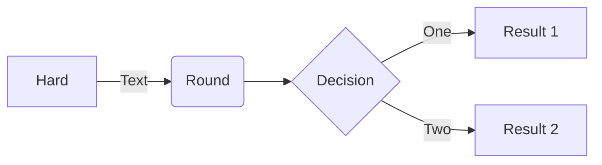

### Diagramme de séquence [<a href="https://mermaid.js.org/syntax/sequenceDiagram.html">docs</a> - <a href="https://mermaid.live/edit#pako:eNo9kMluwjAQhl_F-AykQMuSA1WrbuLQQ3v1ZbAnsVXHkzrjVhHi3etQwKfRv4w-z0FqMihL2eF3wqDxyUEdoVHhwTuNk-12RzaU4g29JzHMY2HpV0BE0VO6V8ETtdkGz1Zb1F8qiPyG5LX84mrLAmpwoWNh-5a0pWCiAxUwGBXeiVHEU4oq8V_6AHYUwAu2lLLTjVQ4bc1rT2yleI0IfJG320faZ9ABbk-Jz3hZnFxBduR9L2oiM5Jj2WBswJn8-cMArSRbbFDJMo8GK0ielVThmKOpNcD4bBxTlGUFvsOxhMT02QctS44JL6HzAS-iJzCYOwfJfTscunYd542aQuXqQU_RZ9kyt11ZFIM9rR3btJ9qaorOGQuR7c9mWSznyzXMF7hcLeBusTB6P9usq_ntrDKrm9kc5PF4_AMJE56Z">éditeur en direct</a>]

```
diagrammeDeSéquence
Alice->>John: Bonjour John, comment ça va ?
boucle VérificationSanté
    John->>John: Combattre l'hypocondrie
fin
Note à droite de John: Pensées rationnelles !
John-->>Alice: Bien !
John->>Bob: Et toi ?
Bob-->>John: Très bien !
```

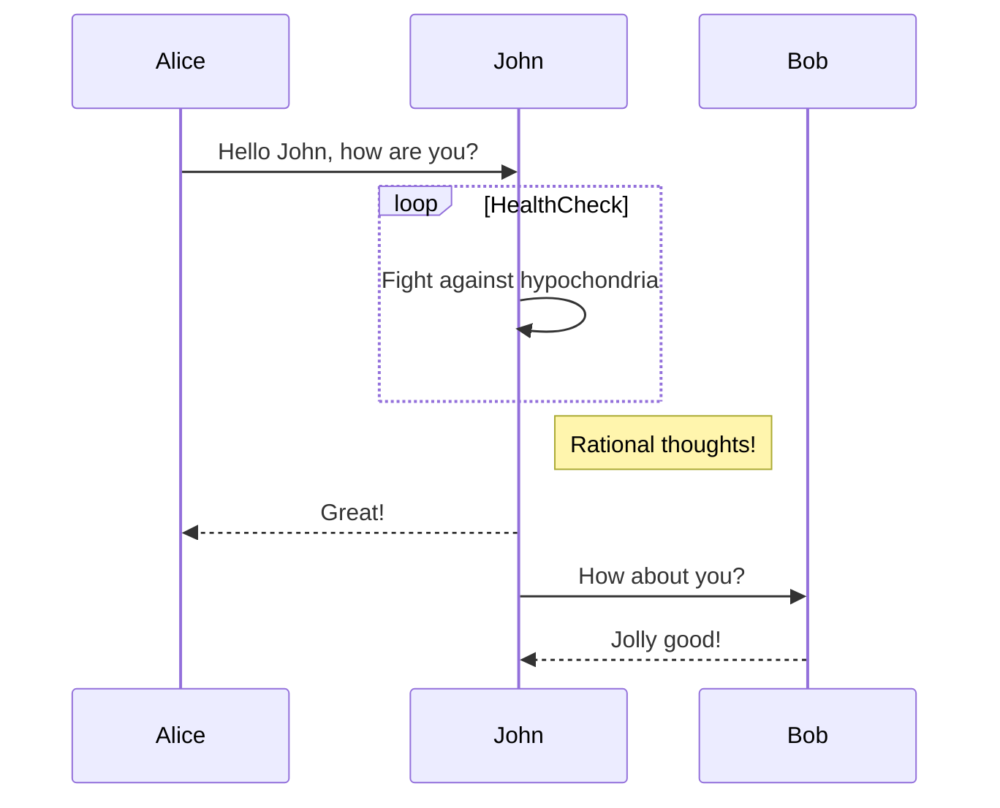

### Diagramme de Gantt [<a href="https://mermaid.js.org/syntax/gantt.html">docs</a> - <a href="https://mermaid.live/edit#pako:eNp90cGOgiAQBuBXIZxtFbG29bbZ3fsmvXKZylhJEAyOTZrGd1_sto3xsHMBhu-HBO689hp5xS_giJQbsCbjHTv9jcp9-q63SKhZpb3DhMXSOIiE5ZkoNpnYZGXynh6U-4jBK7JnVfBYJo9QvgjtEya1cj8QwFq0TMz4lZqxTBg0hOF5m1jifI2Lf7Bc490CyxUu1rhc4GLGPOEdhg6Mjq92V44xxanFDhWv4lRjA6MlxZWbIh17DYTf2pAPvGrADphwGMmfbq7mFYURX-jLwCVA91bWg8YYunO69Y8vMgPFI2vvGnOZ-2Owsd0S9UOVpvP29mKoHc_b2nfpYHQLgdrrsUzLvDxALrHcS9hJqeuzOB6avBCN3mciBz5N0y_wxZ0J">éditeur en direct</a>]

```
gantt
    section Section
    Terminé :terminé,    des1, 2014-01-06,2014-01-08
    Actif        :actif,  des2, 2014-01-07, 3d
    Parallèle 1   :         des3, après des1, 1d
    Parallèle 2   :         des4, après des1, 1d
    Parallèle 3   :         des5, après des3, 1d
    Parallèle 4   :         des6, après des4, 1d
```

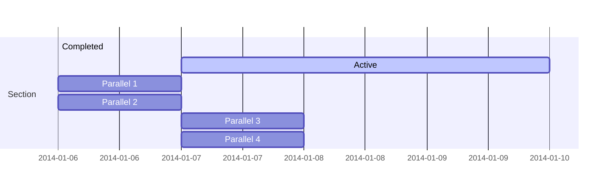

### Diagramme de classe [<a href="https://mermaid.js.org/syntax/classDiagram.html">docs</a> - <a href="https://mermaid.live/edit#pako:eNpdkTFPwzAQhf-K5QlQ2zQJJG1UBaGWDYmBgYEwXO1LYuTEwXYqlZL_jt02asXm--690zvfgTLFkWaUSTBmI6DS0BTt2lfzkKx-p1PytEO9f1FtdaQkI2ulZNGuVqK1qEtgmOfk7BitSzKdOhg59XuNGgk0RDxed-_IOr6uf8cZ6UhTZ8bvHqS5ub1mr9svZPbjk6DEBlu7AQuXyBkx4gcvDk9cUMJq0XT_YaW0kNK5j-ufAoRzcihaQvLcoN4Jv50vvVxw_xrnD3RCG9QNCO4-8OgpqK1dpoJm7smxhF7agp6kfcfB4jMXVmmalW4tnFDorXrbt4xmVvc4is53GKFUwNF5DtTuO3-sShjrJjLVlqLyvNfS4drazmRB4NuzSti6386YagIjeA3a1rtlEiRRsoAoxiSN4SGOOduGy0UZ3YclT-dhBHQYhj8dc6_I">éditeur en direct</a>]

```
diagrammeDeClasse
Classe01 <|-- UneClasseTrèsLongue : Sympa
<<Interface>> Classe01
Classe09 --> C2 : Où suis-je ?
Classe09 --* C3
Classe09 --|> Classe07
Classe07 : égale()
Classe07 : Object[] donnéesÉlément
Classe01 : taille()
Classe01 : int chimpanzé
Classe01 : int gorille
classe Classe10 {
  <<service>>
  int id
  taille()
}

```

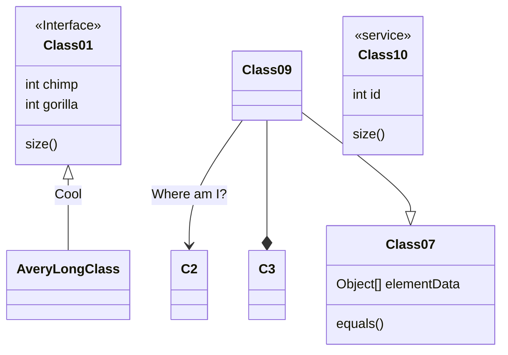

### Diagramme d'état [<a href="https://mermaid.js.org/syntax/stateDiagram.html">docs</a> - <a href="https://mermaid.live/edit#pako:eNpdkEFvgzAMhf8K8nEqpYSNthx22Xbcqcexg0sCiZQQlDhIFeK_L8A6TfXp6fOz9ewJGssFVOAJSbwr7ByadGR1n8T6evpO0vQ1uZDSekOrXGFsPqJPO6q-2-imH8f_0TeHXm50lfelsAMjnEHFY6xpMdRAUhhRQxUlFy0GTTXU_RytYeAx-AdXZB1ULWovdoCB7OXWN1CRC-Ju-r3uz6UtchGHJqDbsPygU57iysb2reoWHpyOWBINvsqypb3vFMlw3TfWZF5xiY7keC6zkpUnZIUojwW-FAVvrvn51LLnvOXHQ84Q5nn-AVtLcwk">éditeur en direct</a>]

```
diagrammeDétat-v2
[*] --> Immobile
Immobile --> [*]
Immobile --> Mouvement
Mouvement --> Immobile
Mouvement --> Crash
Crash --> [*]
```

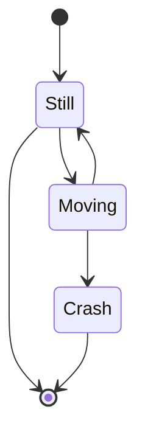

### Graphique circulaire [<a href="https://mermaid.js.org/syntax/pie.html">docs</a> - <a href="https://mermaid.live/edit#pako:eNo9jsFugzAMhl8F-VzBgEEh13Uv0F1zcYkTIpEEBadShXj3BU3dzf_n77e8wxQUgYDVkvQSbsFsEgpRtEN_5i_kvzx05XiC-xvUHVzAUXRoVe7v0heFBJ7JkQSRR0Ua08ISpD-ymlaFTN_KcoggNC4bXQATh5-Xn0BwTPSWbhZNRPdvLQEV5dIO_FrPZ43dOJ-cgtfWnDzFJeOZed1EVZ3r0lie06Ocgqs2q2aMPD_HvuqbfsCmpf7aYte2anrU46Cbz1qr60fdIBzH8QvW9lkl">éditeur en direct</a>]

```
graphiquecirculaire
"Chiens" : 386
"Chats" : 85,9
"Rats" : 15
```

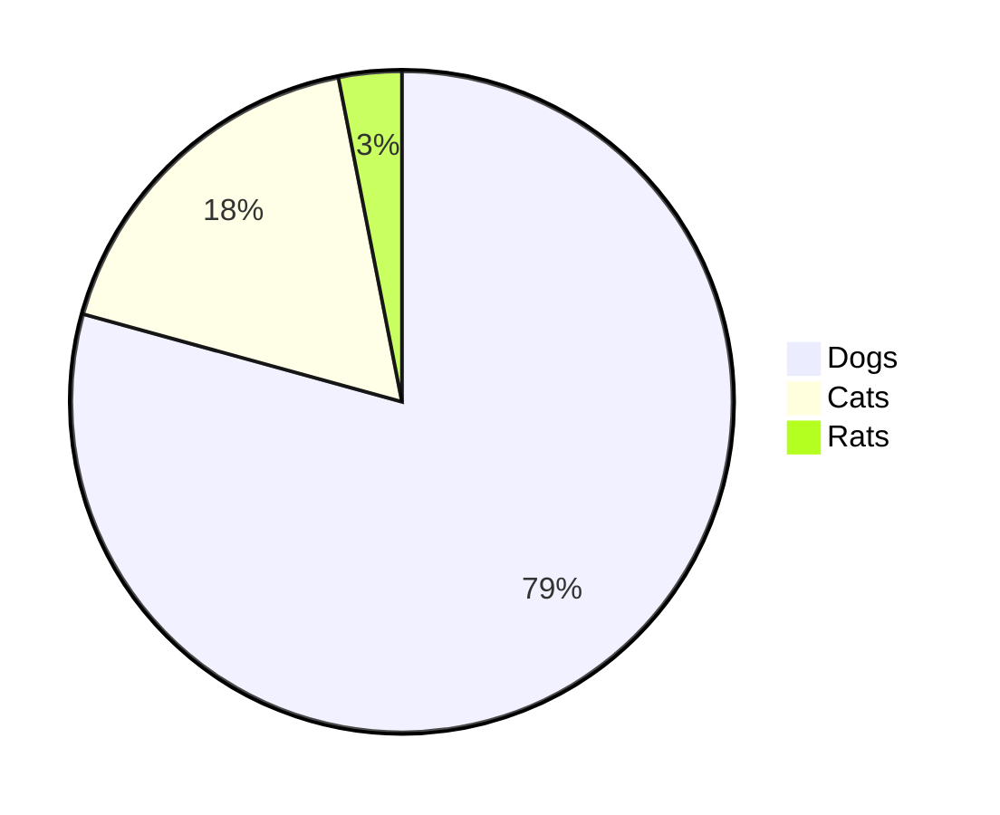

### Graphique Git [expérimental - <a href="https://mermaid.live/edit#pako:eNqNkMFugzAMhl8F-VyVAR1tOW_aA-zKxSSGRCMJCk6lCvHuNZPKZdM0n-zf3_8r8QIqaIIGMqnB8kfEybQ--y4VnLP8-9RF9Mpkmm40hmlnDKmvkPiH_kfS7nFo_VN0FAf6XwocQGgxa_nGsm1bYEOOWmik1dRjGrmF1q-Cpkkj07u2HCI0PY4zHQATh8-7V9BwTPSWbhZNRPdvLQEV5dIO_FrPZ43dOJ-cgtfWnDzFJeOZed1EVZ3r0lie06Ocgqs2q2aMPD_HvuqbfsCmpf7aYte2anrU46Cbz1qr60fdIBzH8QvW9lkl">éditeur en direct</a>]

```
graphiquegit
  commit
  commit
  branche développer
  vérifier développer
  commit
  commit
  vérifier principal
  fusionner développer
  commit
  commit
```

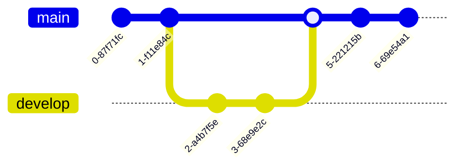

### Graphique en barres (utilisant un diagramme de Gantt) [<a href="https://mermaid.js.org/syntax/gantt.html">docs</a> - <a href="https://mermaid.live/edit#pako:eNptkU1vhCAQhv8KIenNugiI4rkf6bmXpvEyFVxJFDYyNt1u9r8X63Z7WQ9m5pknLzieaBeMpQ3dg0dsPUkPOhwteXZIXmJcbCT3xMAxkuh8Z8kIEclyMIB209fqKcwTICFvG4IvFy_oLrZ-g9F26ILfQgvNFN94VaRXQ1iWqpumZBcu1J8p1E1TXDx59eQNr5LyEqjJn6hv5QnGNlxevZJmdLLpy5xJSzut45biYCfb0iaVxvawjNjS1p-TCguG16PvaIPzYjO67e3BwX6GiTY9jPFKH43DMF_hGMDY1J4oHg-_f8hFTJFd8L3br3yZx4QHxENsdrt1nO8dDstH3oVpF50ZYMbhU6ud4qoGLqyqBJRCmO6j0HXPZdGbihUc6Pmc0QP49xD-b5X69ZQv2gjO81IwzWqhC1lKrjJ6pA3nVS7SMiVjrKirWlYp5fs3osgrWeo00lorLWvOzz8JVbXm">éditeur en direct</a>]

```
gantt
    title Problèmes Git - jours depuis la dernière mise à jour
    dateFormat  X
    axisFormat %s

    section Problème19062
    71   : 0, 71
    section Problème19401
    36   : 0, 36
    section Problème193
    34   : 0, 34
    section Problème7441
    9    : 0, 9
    section Problème1300
    5    : 0, 5
```

```mermaid
gantt
    title Git Issues - days since last update
    dateFormat  X
    axisFormat %s

    section Issue19062
    71   : 0, 71
    section Issue19401
    36   : 0, 36
    section Issue193
    34   : 0, 34
    section Issue7441
    9    : 0, 9
    section Issue1300
    5    : 0, 5
```

### Diagramme de parcours utilisateur [<a href="https://mermaid.js.org/syntax/userJourney.html">docs</a> - <a href="https://mermaid.live/edit#pako:eNplkMFuwjAQRH9l5TMiTVIC-FqqnjhxzWWJN4khsSN7XRSh_HsdKBVt97R6Mzsj-yoqq0hIAXCywRkaSwNxWHNHsB_hYt1ZmwYUfiueKtbWwIcFtjf5zgH2eCZgQgkrCXt64GgMg2fUzkvIn5Xd_V5COtMFvCH_62ht_5yk7MU8sn61HDTfxD8VYiF6cj1qFd94nWkpuKWYKWRcFdUYOi5FaaZoDYNCpnel2Toha-w8LQQGtofRVEKyC_Qw7TQ2DvsfV2dRUTy6Ch6H-UMb7TlGVtbUupl5cF3ELfPgZZLM8rLR3IbjsrJ94rVq0XH7uS2SIis2mOVUrHNc5bmqjul2U2evaa3WL2mGYpqmL2BGiho">éditeur en direct</a>]

```
  parcours
    titre Ma journée de travail
    section Aller travailler
      Faire du thé: 5: Moi
      Monter: 3: Moi
      Travailler: 1: Moi, Chat
    section Rentrer à la maison
      Descendre: 5: Moi
      S'asseoir: 3: Moi
```

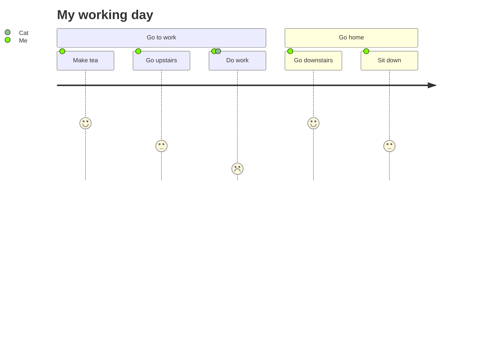

### Diagramme C4 [<a href="https://mermaid.js.org/syntax/c4.html">docs</a>]

```
C4Contexte
titre Diagramme de contexte du système pour le système de banque Internet

Personne(clientA, "Client bancaire A", "Un client de la banque, avec des comptes bancaires personnels.")
Personne(clientB, "Client bancaire B")
PersonneExt(clientC, "Client bancaire C")
Système(SystèmeAA, "Système de banque Internet", "Permet aux clients de consulter les informations relatives à leurs comptes bancaires et d'effectuer des paiements.")

Personne(clientD, "Client bancaire D", "Un client de la banque, <br/> avec des comptes bancaires personnels.")

LimiteFrontière(b1, "FrontièreBanque") {

  SystèmeBDD_Ext(SystèmeE, "Système bancaire de base", "Stocke toutes les informations bancaires essentielles sur les clients, les comptes, les transactions, etc.")

  LimiteSystème(b2, "FrontièreBanque2") {
    Système(SystèmeA, "Système bancaire A")
    Système(SystèmeB, "Système bancaire B", "Un système de la banque, avec des comptes bancaires personnels.")
  }

  SystèmeExt(SystèmeC, "Système de messagerie", "Le système de messagerie Microsoft Exchange interne.")
  SystèmeBDD(SystèmeD, "Base de données du système bancaire D", "Un système de la banque, avec des comptes bancaires personnels.")

  Limite(b3, "FrontièreBanque3", "limite") {
    FileSystème(SystèmeF, "File d'attente du système bancaire F", "Un système de la banque, avec des comptes bancaires personnels.")
    FileExterne(SystèmeG, "File d'attente du système bancaire G", "Un système de la banque, avec des comptes bancaires personnels.")
  }
}

RelBi(clientA, SystèmeAA, "Utilise")
RelBi(SystèmeAA, SystèmeE, "Utilise")
Rel(SystèmeAA, SystèmeC, "Envoie des e-mails", "SMTP")
Rel(SystèmeC, clientA, "Envoie des e-mails à")
```

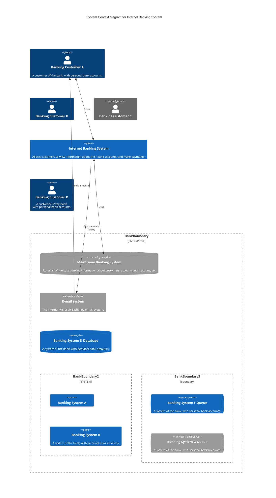

## Sortie

Pour ceux qui disposent des autorisations nécessaires :

Mettez à jour le numéro de version dans `package.json`.

```sh
npm publish
```

La commande ci-dessus génère des fichiers dans le dossier `dist` et les publie sur <https://www.npmjs.com>.

## Projets connexes

- [Interface de ligne de commande](https://github.com/mermaid-js/mermaid-cli)
- [Éditeur en direct](https://github.com/mermaid-js/mermaid-live-editor)
- [Serveur HTTP](https://github.com/TomWright/mermaid-server)

## Contributeurs [](https://github.com/mermaid-js/mermaid/issues?q=is%3Aissue+is%3Aopen+label%3A%22Good+first+issue%21%22) [](https://github.com/mermaid-js/mermaid/graphs/contributors) [](https://github.com/mermaid-js/mermaid/graphs/contributors)

Mermaid est une communauté en croissance et accueille toujours de nouveaux contributeurs. Il existe de nombreuses façons de nous aider et nous recherchons toujours des mains supplémentaires ! Consultez [ce problème](https://github.com/mermaid-js/mermaid/issues/866) si vous souhaitez savoir par où commencer.

Des informations détaillées sur la contribution peuvent être trouvées dans le [guide de contribution](https://mermaid.js.org/community/contributing.html)

## Sécurité et diagrammes sûrs

Pour les sites publics, il peut être risqué de récupérer le texte des utilisateurs sur Internet, de stocker ce contenu pour le présenter ultérieurement dans un navigateur. La raison en est que le contenu utilisateur peut contenir des scripts malveillants intégrés qui s'exécuteront lorsque les données seront présentées. Pour Mermaid, c'est un risque, notamment parce que les diagrammes mermaid contiennent de nombreux caractères utilisés en HTML, ce qui rend la désinfection standard inutilisable car elle casse également les diagrammes. Nous nous efforçons toujours de nettoyer le code entrant et d'affiner le processus, mais il est difficile de garantir qu'il n'y a pas de failles.

Comme niveau de sécurité supplémentaire pour les sites ayant des utilisateurs externes, nous sommes heureux d'introduire un nouveau niveau de sécurité dans lequel le diagramme est rendu dans un iframe en bac à sable (sandbox) empêchant l'exécution du JavaScript dans le code. C'est une grande étape en avant pour une meilleure sécurité.

_Malheureusement, vous ne pouvez pas avoir le beurre et l'argent du beurre en même temps, ce qui signifie dans ce cas que certaines fonctionnalités interactives sont bloquées en même temps que le code potentiellement malveillant._

## Signaler les vulnérabilités

Pour signaler une vulnérabilité, veuillez envoyer un courrier électronique à <security@mermaid.live> avec une description du problème, les étapes que vous avez suivies pour créer le problème, les versions affectées et, si connues, les atténuations pour le problème.

## Remerciements

Un bref mot de Knut Sveidqvist :

> _Un grand merci aux projets [d3](https://d3js.org/) et [dagre-d3](https://github.com/cpettitt/dagre-d3) pour fournir les bibliothèques de mise en page et de dessin graphiques !_
>
> _Merci également au projet [js-sequence-diagram](https://bramp.github.io/js-sequence-diagrams) pour l'utilisation de la grammaire pour les diagrammes de séquence. Merci à Jessica Peter pour l'inspiration et le point de départ pour le rendu de gantt._
>
> _Merci à [Tyler Long](https://github.com/tylerlong) qui collabore depuis avril 2017._
>
> _Merci à la liste croissante de [contributeurs](https://github.com/mermaid-js/mermaid/graphs/contributors) qui a amené le projet jusqu'à présent !_

---

_Mermaid a été créé par Knut Sveidqvist pour faciliter la documentation._
