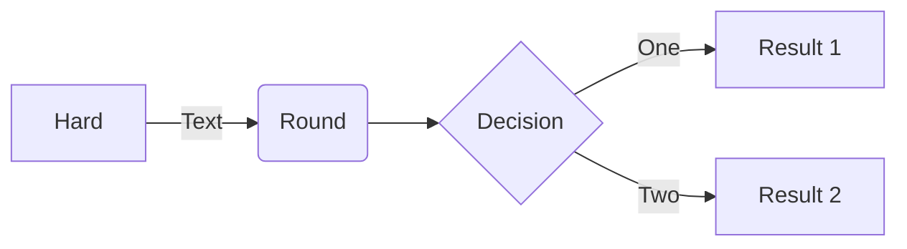
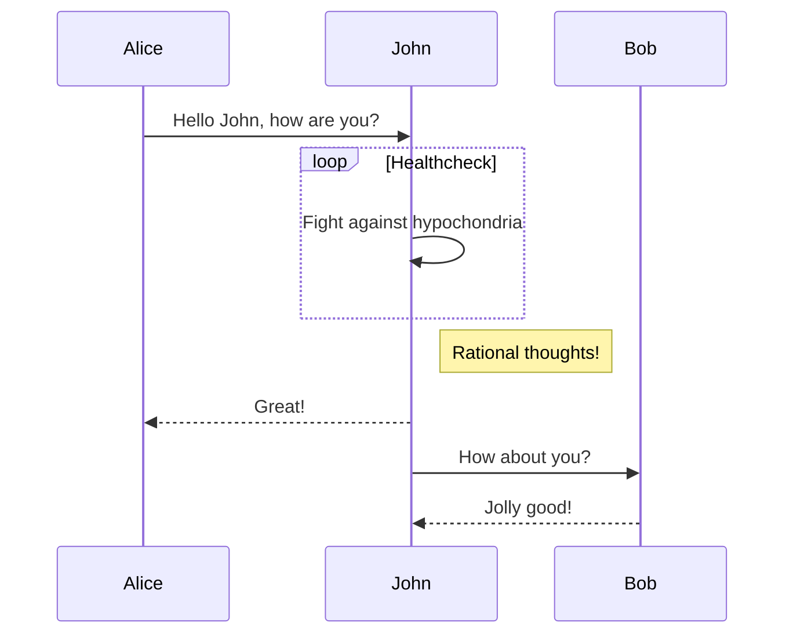
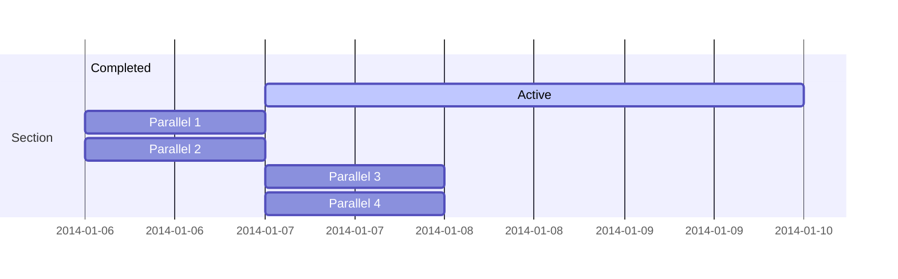
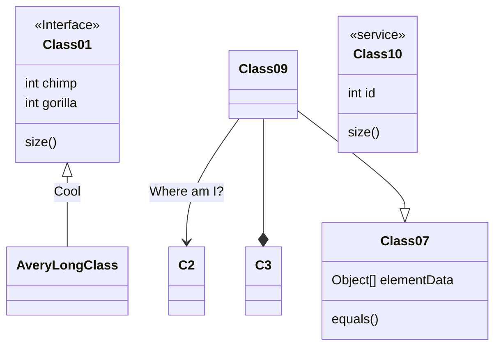
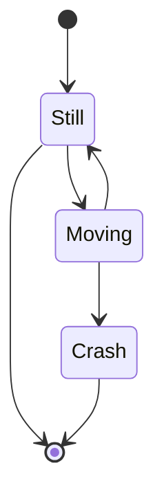
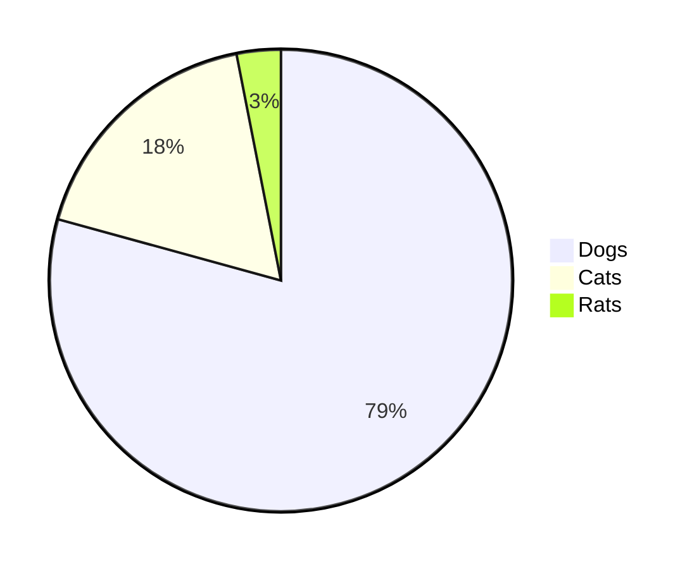
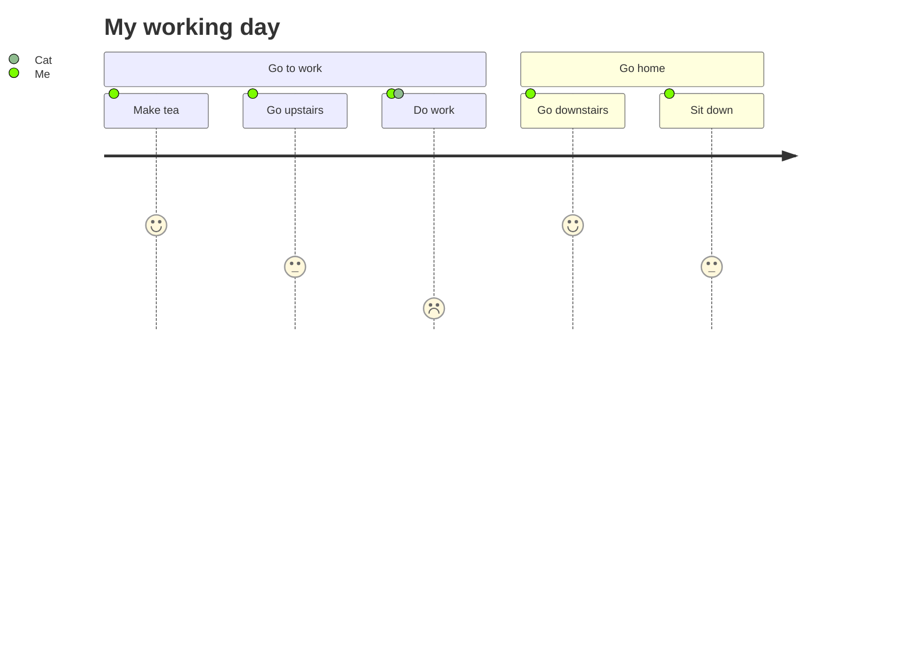
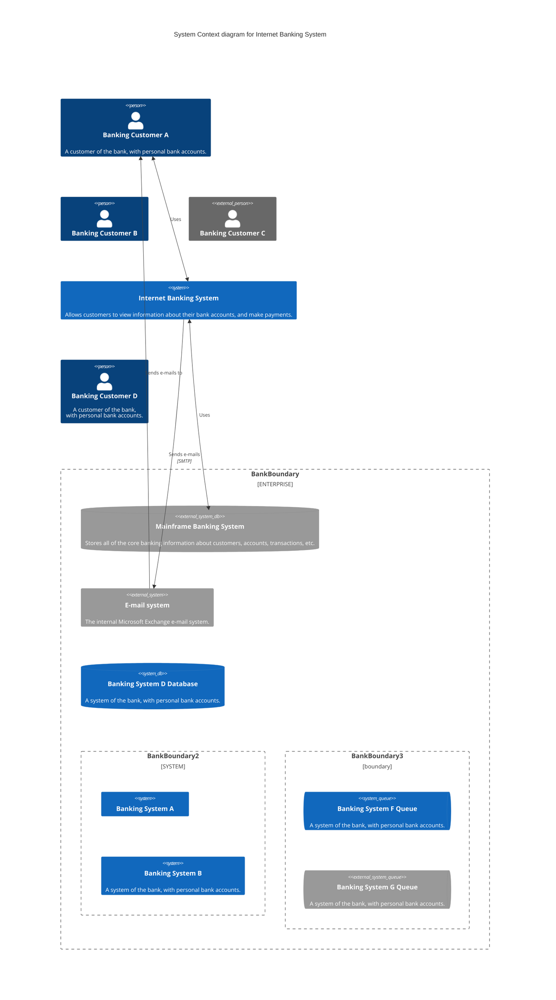

```mermaid
gantt
    title Git Issues - days since last update
    dateFormat  X
    axisFormat %s

    section Issue19062
    71   : 0, 71
    section Issue19401
    36   : 0, 36
    section Issue193
    34   : 0, 34
    section Issue7441
    9    : 0, 9
    section Issue1300
    5    : 0, 5
```

<p align="center">

</p>
<h1 align="center">
Mermaid
</h1>
<p align="center">
मार्कडाउन-जैसे पाठ से आरेखण बनाएँ।
<p>
<p align="center">
  <a href="https://www.npmjs.com/package/mermaid"></a>
<p>

<p align="center">
<a href="https://mermaid.live/"><b>लाइव संपादक!</b></a>
</p>
<p align="center">
 <a href="https://mermaid.js.org">📖 दस्तावेज़</a> | <a href="https://mermaid.js.org/intro/">🚀 प्रारंभ करें</a> | <a href="https://www.jsdelivr.com/package/npm/mermaid">🌐 CDN</a> | <a href="https://join.slack.com/t/mermaid-talk/shared_invite/enQtNzc4NDIyNzk4OTAyLWVhYjQxOTI2OTg4YmE1ZmJkY2Y4MTU3ODliYmIwOTY3NDJlYjA0YjIyZTdkMDMyZTUwOGI0NjEzYmEwODcwOTE" title="Slack invite">🙌 हमसे जुड़ें</a>
</p>
<p align="center">
<a href="./README.md">English</a>
</p>

<p align="center">
भविष्य के रिलीज़ के लाइव संपादक पूर्वावलोकन करें: <a href="https://develop.git.mermaid.live/" title="尝试来自develop分支的mermaid版本。">Develop</a> | <a href="https://next.git.mermaid.live/" title="尝试来自next分支的mermaid版本。">Next</a>
</p>

<br>
<br>

[](https://www.npmjs.com/package/mermaid)
[](https://github.com/mermaid-js/mermaid/actions/workflows/build.yml)
[](https://bundlephobia.com/package/mermaid)
[](https://app.codecov.io/github/mermaid-js/mermaid/tree/develop)
[](https://www.jsdelivr.com/package/npm/mermaid)
[](https://www.npmjs.com/package/mermaid)
[](https://join.slack.com/t/mermaid-talk/shared_invite/enQtNzc4NDIyNzk4OTAyLWVhYjQxOTI2OTg4YmE1ZmJkY2Y4MTU3ODliYmIwOTY3NDJlYjA0YjIyZTdkMDMyZTUwOGI0NjEzYmEwODcwOTE)
[](https://twitter.com/mermaidjs_)


:trophy: **Mermaid ने [JS Open Source Awards (2019)](https://osawards.com/javascript/2019) में "The most exciting use of technology" अवार्ड प्राप्त किया है!!!**

**सभी लोगों को PR सबमिट करने और सवालों के उत्तर देने के लिए धन्यवाद! 🙏**

<a href="https://mermaid-js.github.io/mermaid/landing/"></a>

## Mermaid के बारे में

<!-- <Main description>   -->

Mermaid एक JavaScript पर आधारित चार्ट निर्माण उपकरण है, जो टेक्स्ट संकेत सिद्धांत के माध्यम से चार्ट को बनाने और गतिशील रूप से संशोधित करने की क्षमता प्रदान करता है। Mermaid के मुख्य उद्देश्य यह है कि दस्तावेज़ीकरण को अपडेट करने की क्षमता अविलंब उनकी विकास प्रगति के साथ चल सके।

> Doc-Rot Mermaid द्वारा हल करने के लिए एक कठिनाई है।

चार्ट बनाना और दस्तावेज़ लिखना डेवलपर्स के मूल्यवान विकास समय का खर्च करता है, और व्यापार परिवर्तन के साथ, यह जल्द ही पुराना हो जाता है। लेकिन यदि चार्ट या दस्तावेज़ की कमी होती है, तो उत्पादकता और टीम के नए सदस्यों के व्यापार का विशाल बाधक बन सकता है। <br/>
Mermaid इस समस्या को हल करने के लिए उपयोगकर्ताओं को संशोधन आसान बनाने वाले चार्ट बनाने की अनुमति देता है, यह स्क्रिप्ट के रूप में एक उत्पादन भी हो सकता है (या किसी अन्य कोड)। <br/>
<br/>
Mermaid यहां [Mermaid Live Editor](https://mermaid.live/) के माध्यम से गैर-प्रोग्रामरों को भी आसानी से विस्तृत चार्ट बनाने की सुविधा प्रदान करता है। <br/>
आप [ट्यूटोरियल](./docs/config/Tutorials.md) देखने के लिए Live Editor देख सकते हैं，या आप यह जांच सकते हैं कि  [Mermaid का उपयोग करने वाले](./docs/ecosystem/integrations.md) आपके दस्तावेज़ उपकरणों में Mermaid समर्थन है या नहीं।

हमारी रिलीज प्रक्रिया में हम विजुअल परिवर्तन परीक्षण पर भारी रूप से भरोसा करते हैं, जिसमें हम [applitools](https://applitools.com/) का उपयोग करते हैं। Applitools एक बहुत अच्छी सेवा है जिसे हमने अपने परीक्षणों के साथ आसानी से इंटीग्रेट किया है।

<a href="https://applitools.com/">
<svg width="170" height="32" viewBox="0 0 170 32" fill="none" xmlns="http://www.w3.org/2000/svg"><mask id="a" maskUnits="userSpaceOnUse" x="27" y="0" width="143" height="32"><path fill-rule="evenodd" clip-rule="evenodd" d="M27.732.227h141.391v31.19H27.733V.227z" fill="#fff"></path></mask><g mask="url(#a)"><path fill-rule="evenodd" clip-rule="evenodd" d="M153.851 22.562l1.971-3.298c1.291 1.219 3.837 2.402 5.988 2.402 1.971 0 2.903-.753 2.903-1.829 0-2.832-10.253-.502-10.253-7.313 0-2.904 2.51-5.45 7.099-5.45 2.904 0 5.234 1.004 6.955 2.367l-1.829 3.226c-1.039-1.075-3.011-2.008-5.126-2.008-1.65 0-2.725.717-2.725 1.685 0 2.546 10.289.395 10.289 7.386 0 3.19-2.724 5.52-7.528 5.52-3.012 0-5.916-1.003-7.744-2.688zm-5.7 2.259h4.553V.908h-4.553v23.913zm-6.273-8.676c0-2.689-1.578-5.02-4.446-5.02-2.832 0-4.409 2.331-4.409 5.02 0 2.724 1.577 5.055 4.409 5.055 2.868 0 4.446-2.33 4.446-5.055zm-13.588 0c0-4.912 3.442-9.07 9.142-9.07 5.736 0 9.178 4.158 9.178 9.07 0 4.911-3.442 9.106-9.178 9.106-5.7 0-9.142-4.195-9.142-9.106zm-5.628 0c0-2.689-1.577-5.02-4.445-5.02-2.832 0-4.41 2.331-4.41 5.02 0 2.724 1.578 5.055 4.41 5.055 2.868 0 4.445-2.33 4.445-5.055zm-13.587 0c0-4.912 3.441-9.07 9.142-9.07 5.736 0 9.178 4.158 9.178 9.07 0 4.911-3.442 9.106-9.178 9.106-5.701 0-9.142-4.195-9.142-9.106zm-8.425 4.338v-8.999h-2.868v-3.98h2.868V2.773h4.553v4.733h3.514v3.979h-3.514v7.78c0 1.111.574 1.936 1.578 1.936.681 0 1.326-.251 1.577-.538l.968 3.478c-.681.609-1.9 1.11-3.8 1.11-3.191 0-4.876-1.648-4.876-4.767zm-8.962 4.338h4.553V7.505h-4.553V24.82zm-.43-21.905a2.685 2.685 0 012.688-2.69c1.506 0 2.725 1.184 2.725 2.69a2.724 2.724 0 01-2.725 2.724c-1.47 0-2.688-1.219-2.688-2.724zM84.482 24.82h4.553V.908h-4.553v23.913zm-6.165-8.676c0-2.976-1.793-5.02-4.41-5.02-1.47 0-3.119.825-3.908 1.973v6.094c.753 1.111 2.438 2.008 3.908 2.008 2.617 0 4.41-2.044 4.41-5.055zm-8.318 6.453v8.82h-4.553V7.504H70v2.187c1.327-1.685 3.227-2.618 5.342-2.618 4.446 0 7.672 3.299 7.672 9.07 0 5.773-3.226 9.107-7.672 9.107-2.043 0-3.907-.86-5.342-2.653zm-10.718-6.453c0-2.976-1.793-5.02-4.41-5.02-1.47 0-3.119.825-3.908 1.973v6.094c.753 1.111 2.438 2.008 3.908 2.008 2.617 0 4.41-2.044 4.41-5.055zm-8.318 6.453v8.82H46.41V7.504h4.553v2.187c1.327-1.685 3.227-2.618 5.342-2.618 4.446 0 7.672 3.299 7.672 9.07 0 5.773-3.226 9.107-7.672 9.107-2.043 0-3.908-.86-5.342-2.653zm-11.758-1.936V18.51c-.753-1.004-2.187-1.542-3.657-1.542-1.793 0-3.263.968-3.263 2.617 0 1.65 1.47 2.582 3.263 2.582 1.47 0 2.904-.502 3.657-1.506zm0 4.159v-1.829c-1.183 1.434-3.227 2.259-5.485 2.259-2.761 0-5.988-1.864-5.988-5.736 0-4.087 3.227-5.593 5.988-5.593 2.33 0 4.337.753 5.485 2.115V13.85c0-1.756-1.506-2.904-3.8-2.904-1.829 0-3.55.717-4.984 2.044L28.63 9.8c2.115-1.901 4.84-2.726 7.564-2.726 3.98 0 7.6 1.578 7.6 6.561v11.186h-4.588z" fill="#00A298"></path></g><path fill-rule="evenodd" clip-rule="evenodd" d="M14.934 16.177c0 1.287-.136 2.541-.391 3.752-1.666-1.039-3.87-2.288-6.777-3.752 2.907-1.465 5.11-2.714 6.777-3.753.255 1.211.39 2.466.39 3.753m4.6-7.666V4.486a78.064 78.064 0 01-4.336 3.567c-1.551-2.367-3.533-4.038-6.14-5.207C11.1 4.658 12.504 6.7 13.564 9.262 5.35 15.155 0 16.177 0 16.177s5.35 1.021 13.564 6.915c-1.06 2.563-2.463 4.603-4.507 6.415 2.607-1.169 4.589-2.84 6.14-5.207a77.978 77.978 0 014.336 3.568v-4.025s-.492-.82-2.846-2.492c.6-1.611.93-3.354.93-5.174a14.8 14.8 0 00-.93-5.174c2.354-1.673 2.846-2.492 2.846-2.492" fill="#00A298"></path></svg>
</a>

<!-- </Main description> -->

## उदाहरण

**निम्नलिखित मेरमेड का उपयोग करके बनाए जा सकने वाले आरेख, चार्ट और ग्राफ के कुछ उदाहरण हैं। [text syntax](https://mermaid-js.github.io/mermaid/#/n00b-syntaxReference) में जाने के लिए यहां क्लिक करें।**

<!-- <Flowchart> -->

### प्रवाह चार्ट [<a href="https://mermaid-js.github.io/mermaid/#/flowchart">दस्तावेज़</a> - <a href="https://mermaid.live/edit#pako:eNpNkMtqwzAQRX9FzKqFJK7t1km8KDQP6KJQSLOLvZhIY1tgS0GWmgbb_165IaFaiXvOFTPqgGtBkEJR6zOv0Fj2scsU8-ft8I5G5Gw6fe339GN7tnrYaafE45WvRsLW3Ya4bKVWwzVe_xU-FfVsc9hR62rLwvw_2591z7Y3FuUwgYZMg1L4ObrRzMBW1FAGqb8KKtCLGWRq8Ko7CbS0FdJqA2mBdUsTQGf110VxSK1xdJM2EkuDzd2qNQrypQ7s5TQuXcrW-ie5VoUsx9yZ2seVtac2DYIRz0ppK3eccd0ErRTjD1XfyyRIomSBUUzJPMaXOBb8GC4XRfQcFmL-FEYIwzD8AggvcHE">live editor</a>]

```
flowchart LR

A[Hard] -->|Text| B(Round)
B --> C{Decision}
C -->|One| D[Result 1]
C -->|Two| E[Result 2]
```



### क्रमबद्ध प्रवाह चार्ट [<a href="https://mermaid-js.github.io/mermaid/#/sequenceDiagram">दस्तावेज़</a> - <a href="https://mermaid.live/edit#pako:eNo9kMluwjAQhl_F-AykQMuSA1WrbuLQQ3v1ZbAnsVXHkzrjVhHi3etQwKfRv4w-z0FqMihL2eF3wqDxyUEdoVHhwTuNk-12RzaU4g29JzHMY2HpV0BE0VO6V8ETtdkGz1Zb1F8qiPyG5LX84mrLAmpwoWNh-5a0pWCiAxUwGBXeiVHEU4oq8V_6AHYUwAu2lLLTjVQ4bc1rT2yleI0IfJG320faZ9ABbk-Jz3hZnFxBduR9L2oiM5Jj2WBswJn8-cMArSRbbFDJMo8GK0ielVThmKOpNcD4bBxTlGUFvsOxhMT02QctS44JL6HzAS-iJzCYOwfJfTscunYd542aQuXqQU_RZ9kyt11ZFIM9rR3btJ9qaorOGQuR7c9mWSznyzXMF7hcLeBusTB6P9usq_ntrDKrm9kc5PF4_AMJE56Z">live editor</a>]

```
sequenceDiagram
Alice->>John: Hello John, how are you?
loop Healthcheck
    John->>John: Fight against hypochondria
end
Note right of John: Rational thoughts!
John-->>Alice: Great!
John->>Bob: How about you?
Bob-->>John: Jolly good!
```



### गांट चार्ट [<a href="https://mermaid-js.github.io/mermaid/#/gantt">दस्तावेज़</a> - <a href="https://mermaid.live/edit#pako:eNp90cGOgyAQBuBXIZxtFbG29bbZ3fsmvXKZylhJEAyOTZrGd1_sto3xsHMBhu-HBO689hp5xS_giJQbsCbjHTv9jcp9-q63SKhZpb3DhMXSOIiE5ZkoNpnYZGXynh6U-4jBK7JnVfBYJo9QvgjtEya1cj8QwFq0TMz4lZqxTBg0hOF5m1jifI2Lf7Bc490CyxUu1rhc4GLGPOEdhg6Mjq92V44xxanFDhWv4lRjA6MlxZWbIh17DYTf2pAPvGrADphwGMmfbq7mFYURX-jLwCVA91bWg8YYunO69Y8vMgPFI2vvGnOZ-2Owsd0S9UOVpvP29mKoHc_b2nfpYHQLgdrrsUzLvDxALrHcS9hJqeuzOB6avBCN3mciBz5N0y_wxZ0J">live editor</a>]

```
gantt
    section Section
    Completed :done,    des1, 2014-01-06,2014-01-08
    Active        :active,  des2, 2014-01-07, 3d
    Parallel 1   :         des3, after des1, 1d
    Parallel 2   :         des4, after des1, 1d
    Parallel 3   :         des5, after des3, 1d
    Parallel 4   :         des6, after des4, 1d
```



### कक्षा आरेख [<a href="https://mermaid-js.github.io/mermaid/#/classDiagram">दस्तावेज़</a> - <a href="https://mermaid.live/edit#pako:eNpdkTFPwzAQhf-K5QlQ2zQJJG1UBaGWDYmBgYEwXO1LYuTEwXYqlZL_jt02asXm--690zvfgTLFkWaUSTBmI6DS0BTt2lfzkKx-p1PytEO9f1FtdaQkI2ulZNGuVqK1qEtgmOfk7BitSzKdOhg59XuNGgk0RDxed-_IOr6uf8cZ6UhTZ8bvHqS5ub1mr9svZPbjk6DEBlu7AQuXyBkx4gcvDk9cUMJq0XT_YaW0kNK5j-ufAoRzcihaQvLcoN4Jv50vvVxw_xrnD3RCG9QNCO4-8OgpqK1dpoJm7smxhF7agp6kfcfB4jMXVmmalW4tnFDorXrbt4xmVvc4is53GKFUwNF5DtTuO3-sShjrJjLVlqLyvNfS4drazmRB4NuzSti6386YagIjeA3a1rtlEiRRsoAoxiSN4SGOOduGy0UZ3YclT-dhBHQYhj8dc6_I">live editor</a>]

```
classDiagram
Class01 <|-- AveryLongClass : Cool
<<Interface>> Class01
Class09 --> C2 : Where am I?
Class09 --* C3
Class09 --|> Class07
Class07 : equals()
Class07 : Object[] elementData
Class01 : size()
Class01 : int chimp
Class01 : int gorilla
class Class10 {
  <<service>>
  int id
  size()
}

```



### स्थिति आरेख [<a href="https://mermaid-js.github.io/mermaid/#/stateDiagram">दस्तावेज़</a> - <a href="https://mermaid.live/edit#pako:eNpdkEFvgzAMhf8K8nEqpYSNthx22Xbcqcexg0sCiZQQlDhIFeK_L8A6TfXp6fOz9ewJGssFVOAJSbwr7ByadGR1n8T6evpO0vQ1uZDSekOrXGFsPqJPO6q-2-imH8f_0TeHXm50lfelsAMjnEHFY6xpMdRAUhhRQxUlFy0GTTXU_RytYeAx-AdXZB1ULWovdoCB7OXWN1CRC-Ju-r3uz6UtchGHJqDbsPygU57iysb2reoWHpyOWBINvsqypb3vFMlw3TfWZF5xiY7keC6zkpUnZIUojwW-FAVvrvn51LLnvOXHQ84Q5nn-AVtLcwk">live editor</a>]

```
stateDiagram-v2
[*] --> Still
Still --> [*]
Still --> Moving
Moving --> Still
Moving --> Crash
Crash --> [*]
```



### पाई चार्ट [<a href="https://mermaid-js.github.io/mermaid/#/pie">दस्तावेज़</a> - <a href="https://mermaid.live/edit#pako:eNo9jsFugzAMhl8F-VzBgEEh13Uv0F1zcYkTIpEEBadShXj3BU3dzf_n77e8wxQUgYDVkvQSbsFsEgpRtEN_5i_kvzx05XiC-xvUHVzAUXRoVe7v0heFBJ7JkQSRR0Ua08ISpD-ymlaFTN_KcoggNC4bXQATh5-Xn0BwTPSWbhZNRPdvLQEV5dIO_FrPZ43dOJ-cgtfWnDzFJeOZed1EVZ3r0lie06Ocgqs2q2aMPD_HvuqbfsCmpf7aYte2anrU46Cbz1qr60fdIBzH8QvW9lkl">live editor</a>]

```
pie
"Dogs" : 386
"Cats" : 85.9
"Rats" : 15
```



### गिट ग्राफ [प्रयोगात्मक - <a href="https://mermaid.live/edit#pako:eNqNkMFugzAMhl8F-VyVAR1tOW_aA-zKxSSGRCMJCk6lCvHuNZPKZdM0n-zf3_8r8QIqaIIGMqnB8kfEybQ--y4VnLP8-9RF9Mpkmm40hmlnDKmvkPiH_kfS7nFo_VN0FAf6XwocQGgxa_nGsm1bYEOOWmik1dRjGrmF1q-Cpkkj07u2HCI0PY4zHQATh8-7V9BwTPSE3iwOEd1OjQE1iWkBvk_bzQY7s0Sq4Hs7bHqKo8iGeZqbPN_WR7mpSd1RHpvPVhuMbG7XOq_L-oJlRfW5wteq0qorrpe-PBW9Pr8UJcK6rg-BLYPQ">live editor</a>]

### बार चार्ट (गांट चार्ट का उपयोग करके) [<a href="https://mermaid-js.github.io/mermaid/#/gantt">दस्तावेज़</a> - <a href="https://mermaid.live/edit#pako:eNptkU1vhCAQhv8KIenNugiI4rkf6bmXpvEyFVxJFDYyNt1u9r8X63Z7WQ9m5pknLzieaBeMpQ3dg0dsPUkPOhwteXZIXmJcbCT3xMAxkuh8Z8kIEclyMIB209fqKcwTICFvG4IvFy_oLrZ-g9F26ILfQgvNFN94VaRXQ1iWqpumZBcu1J8p1E1TXDx59eQNr5LyEqjJn6hv5QnGNlxevZJmdLLpy5xJSzut45biYCfb0iaVxvawjNjS1p-TCguG16PvaIPzYjO67e3BwX6GiTY9jPFKH43DMF_hGMDY1J4oHg-_f8hFTJFd8L3br3yZx4QHxENsdrt1nO8dDstH3oVpF50ZYMbhU6ud4qoGLqyqBJRCmO6j0HXPZdGbihUc6Pmc0QP49xD-b5X69ZQv2gjO81IwzWqhC1lKrjJ6pA3nVS7SMiVjrKirWlYp5fs3osgrWeo00lorLWvOzz8JVbXm">live editor</a>]

```
gantt
    title Git Issues - days since last update
    dateFormat  X
    axisFormat %s

    section Issue19062
    71   : 0, 71
    section Issue19401
    36   : 0, 36
    section Issue193
    34   : 0, 34
    section Issue7441
    9    : 0, 9
    section Issue1300
    5    : 0, 5
```



### उपयोगकर्ता यात्रा आरेख [<a href="https://mermaid-js.github.io/mermaid/#/user-journey">दस्तावेज़</a> - <a href="https://mermaid.live/edit#pako:eNplkMFuwjAQRH9l5TMiTVIC-FqqnjhxzWWJN4khsSN7XRSh_HsdKBVt97R6Mzsj-yoqq0hIAXCywRkaSwNxWHNHsB_hYt1ZmwYUfiueKtbWwIcFtjf5zgH2eCZgQgkrCXt64GgMg2fUzkvIn5Xd_V5COtMFvCH_62ht_5yk7MU8sn61HDTfxD8VYiF6cj1qFd94nWkpuKWYKWRcFdUYOi5FaaZoDYNCpnel2Toha-w8LQQGtofRVEKyC_Qw7TQ2DvsfV2dRUTy6Ch6H-UMb7TlGVtbUupl5cF3ELfPgZZLM8rLR3IbjsrJ94rVq0XH7uS2SIis2mOVUrHNc5bmqjul2U2evaa3WL2mGYpqmL2BGiho">live editor</a>]

```
  journey
    title My working day
    section Go to work
      Make tea: 5: Me
      Go upstairs: 3: Me
      Do work: 1: Me, Cat
    section Go home
      Go downstairs: 5: Me
      Sit down: 3: Me
```



### C4 आरेख [<a href="https://mermaid-js.github.io/mermaid/#/c4c">दस्तावेज़</a>]

```
C4Context
title System Context diagram for Internet Banking System

Person(customerA, "Banking Customer A", "A customer of the bank, with personal bank accounts.")
Person(customerB, "Banking Customer B")
Person_Ext(customerC, "Banking Customer C")
System(SystemAA, "Internet Banking System", "Allows customers to view information about their bank accounts, and make payments.")

Person(customerD, "Banking Customer D", "A customer of the bank, <br/> with personal bank accounts.")

Enterprise_Boundary(b1, "BankBoundary") {

  SystemDb_Ext(SystemE, "Mainframe Banking System", "Stores all of the core banking information about customers, accounts, transactions, etc.")

  System_Boundary(b2, "BankBoundary2") {
    System(SystemA, "Banking System A")
    System(SystemB, "Banking System B", "A system of the bank, with personal bank accounts.")
  }

  System_Ext(SystemC, "E-mail system", "The internal Microsoft Exchange e-mail system.")
  SystemDb(SystemD, "Banking System D Database", "A system of the bank, with personal bank accounts.")

  Boundary(b3, "BankBoundary3", "boundary") {
    SystemQueue(SystemF, "Banking System F Queue", "A system of the bank, with personal bank accounts.")
    SystemQueue_Ext(SystemG, "Banking System G Queue", "A system of the bank, with personal bank accounts.")
  }
}

BiRel(customerA, SystemAA, "Uses")
BiRel(SystemAA, SystemE, "Uses")
Rel(SystemAA, SystemC, "Sends e-mails", "SMTP")
Rel(SystemC, customerA, "Sends e-mails to")
```



## रिलीज

उन लोगों के लिए जिनकी इसके लिए अनुमति है:

`package.json` में संस्करण नंबर को अपडेट करें।

```sh
npm publish
```

उपरोक्त कमांड `dist` फ़ोल्डर में फ़ाइलें उत्पन्न करता है और उन्हें <https://www.npmjs.com> पर प्रकाशित करता है।

## संबंधित परियोजनाएं

- [कमांड लाइन इंटरफेस](https://github.com/mermaid-js/mermaid-cli)
- [लाइव संपादक](https://github.com/mermaid-js/mermaid-live-editor)
- [HTTP सर्वर](https://github.com/TomWright/mermaid-server)

## योगदानकर्ता [](https://github.com/mermaid-js/mermaid/issues?q=is%3Aissue+is%3Aopen+label%3A%22Good+first+issue%21%22) [](https://github.com/mermaid-js/mermaid/graphs/contributors) [](https://github.com/mermaid-js/mermaid/graphs/contributors)

Mermaid एक बढ़ती हुई समुदाय है और हमेशा नए योगदानकर्ताओं का स्वागत करता है। यहां मदद करने के लिए कई विभिन्न तरीके हैं और हमेशा अतिरिक्त सहायता के लिए तत्पर रहते हैं! मदद करना शुरू करने के लिए [this issue](https://github.com/mermaid-js/mermaid/issues/866) को देखें।

योगदान करने के बारे में विस्तृत जानकारी  [योगदान गाइड](CONTRIBUTING.md) में उपलब्ध है।

## सुरक्षा और सुरक्षित आरेख

सार्वजनिक साइटों के लिए, इंटरनेट पर उपयोगकर्ताओं से पाठ प्राप्त करना और बाद में ब्राउज़र में प्रस्तुति के लिए उस सामग्री को संग्रहीत करना जोखिमपूर्ण हो सकता है। कारण यह है कि उपयोगकर्ता सामग्री में एम्बेड किए गए विकट स्क्रिप्ट शामिल हो सकते हैं जो जब डेटा प्रस्तुत किया जाता है, तो चलेंगे। मरमेड के लिए यह एक जोखिम है, विशेष रूप से क्योंकि मरमेड आरेखों में वे अक्षर होते हैं जो html में प्रयोग होते हैं, जिससे मानक स्वच्छता अनुप्रयोगी हो जाती है क्योंकि यह भी आरेखों को तोड़ देती है। हम अभी भी आने वाले कोड को स्वच्छ करने का प्रयास कर रहे हैं और इस प्रक्रिया को सुधारने का प्रयास कर रहे हैं, लेकिन यह कठिन है कि कोई भी छेद न हो।

बाहरी उपयोगकर्ताओं वाली साइटों के लिए एक अतिरिक्त सुरक्षा स्तर को हम खुशी से पेश करते हैं, जिसमें आरेख एक सैंडबॉक्स्ड आइफ्रेम में रेंडर किया जाता है जिससे कि कोड में विकट स्क्रिप्ट नहीं चलते हैं। यह बेहतर सुरक्षा के लिए एक महत्वपूर्ण कदम है।

_दुर्भाग्यवश, आप एक साथ खाना नहीं खा सकते जो इस मामले में यह माने जाता है कि कुछ इंटरैक्टिवता वाली क्षमताएं बंद कर दी जाती हैं साथ ही संभावित विकट कोड के साथ।_

## सुरक्षा दुरुपयोग की सूचना देने के लिए

कृपया <security@mermaid.live> पर ईमेल करें जिसमें मुद्दे का वर्णन, आपने मुद्दे को पैदा करने के लिए लिए गए कदम, प्रभावित संस्करणों की जानकारी, और यदि ज्ञात हो, मुद्दे के लिए संशोधनों की सूचना शामिल करें।

## धन्यवाद

कुट स्वेदक्विस्ट की ओर से एक त्वरित नोट:

> _ग्राफिकल लेआउट और ड्राइंग पुस्तकालय के लिए [d3](https://d3js.org/) और [dagre-d3](https://github.com/cpettitt/dagre-d3) परियोजनाओं के लिए बहुत धन्यवाद!_
>
> _अनुक्रमणिका आरेखांकन के लिए व्याकरण का उपयोग करने के लिए  [js-sequence-diagram](https://bramp.github.io/js-sequence-diagrams) परियोजना को भी धन्यवाद। गैंट रेंडरिंग के लिए प्रेरणा और आरंभिक स्थान के लिए जेसिका पीटर को धन्यवाद।_
>
> _अप्रैल 2017 से सहयोगी के रूप में  [टाइलर लॉंग](https://github.com/tylerlong) को धन्यवाद।_
>
> _यहां तक पहुंचाने वाले  [सहयोगियों](https://github.com/knsv/mermaid/graphs/contributors) की लगातार बढ़ती सूची को धन्यवाद!_

---

_Mermaid को आसान दस्तावेज़ीकरण के लिए कुट स्वेदक्विस्ट द्वारा बनाया गया था।_

