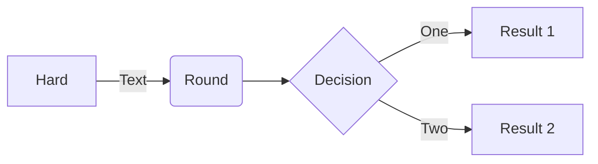
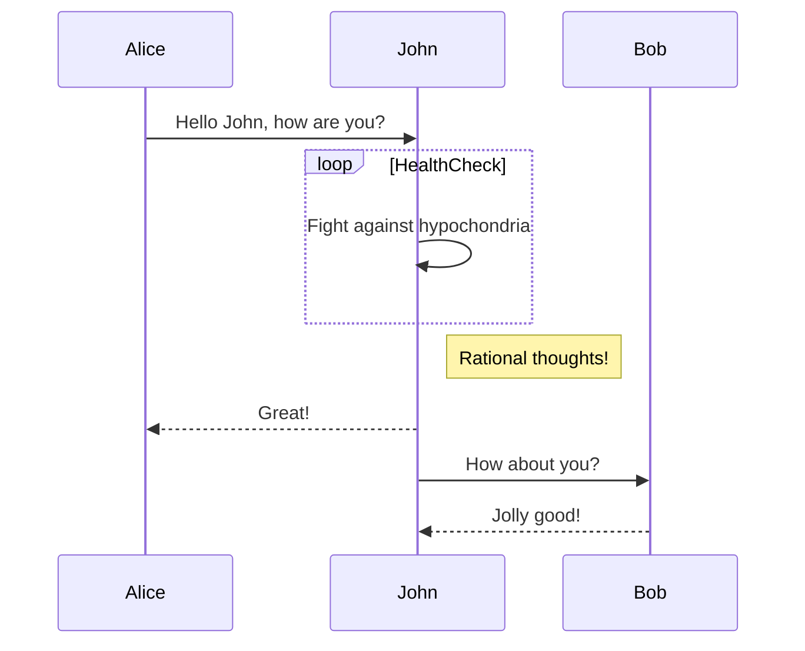
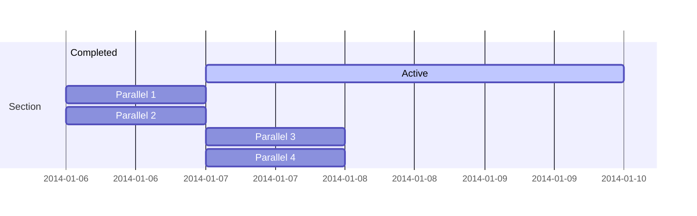
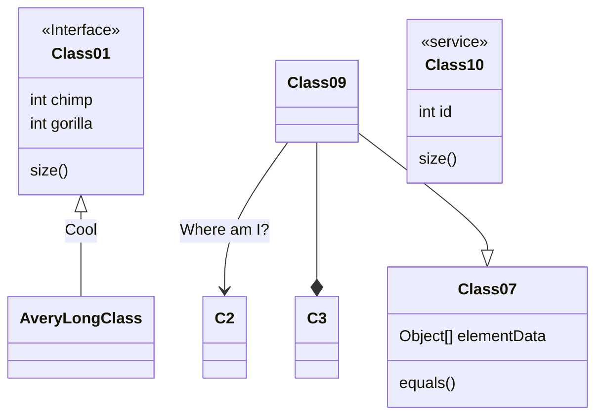
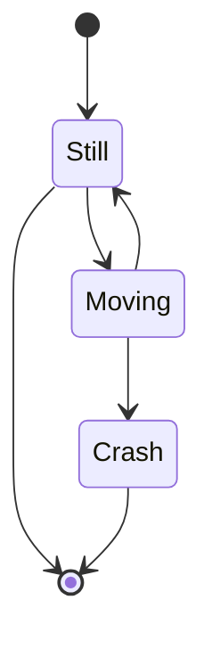
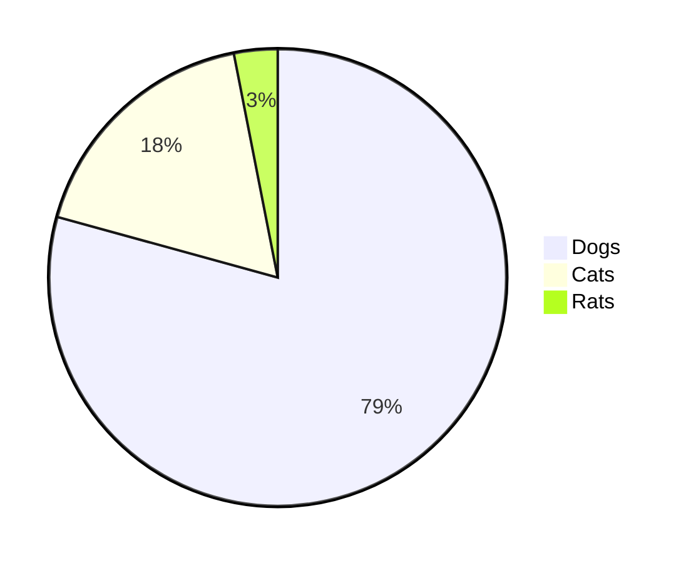
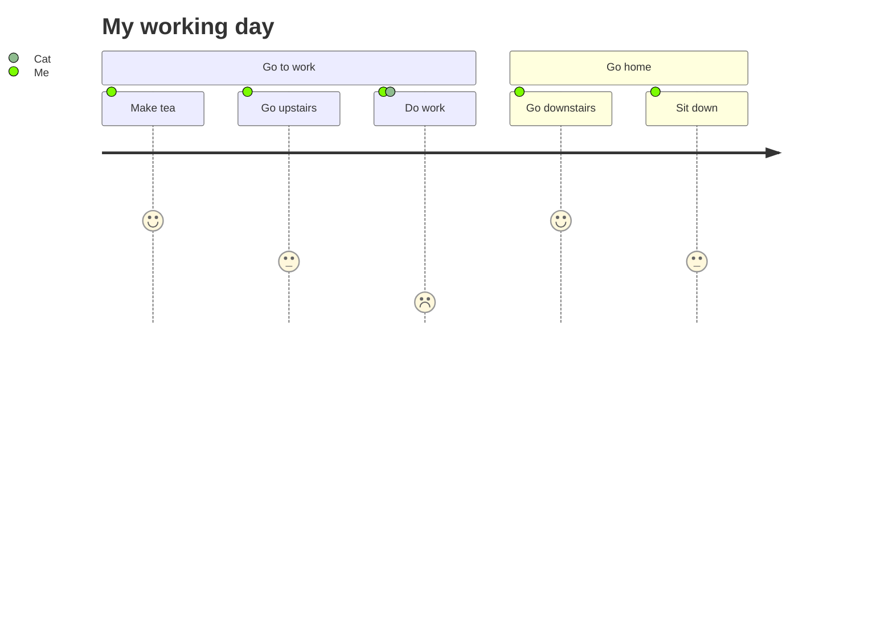
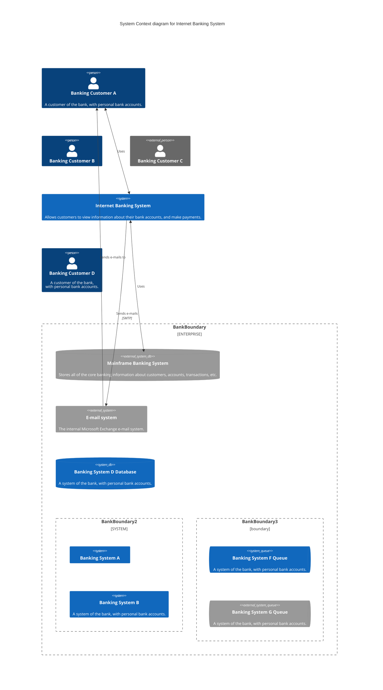

```mermaid
gantt
    title Git Issues - days since last update
    dateFormat  X
    axisFormat %s

    section Issue19062
    71   : 0, 71
    section Issue19401
    36   : 0, 36
    section Issue193
    34   : 0, 34
    section Issue7441
    9    : 0, 9
    section Issue1300
    5    : 0, 5
```

<p align="center">

</p>
<h1 align="center">
Mermaid
</h1>
<p align="center">
マークダウンみたいなテキストから図を生成しよう。
<p>
<p align="center">
  <a href="https://www.npmjs.com/package/mermaid"></a>
<p>

<p align="center">
<a href="https://mermaid.live/"><b>ライブエディタ！</b></a>
</p>
<p align="center">
 <a href="https://mermaid.js.org">📖 ドキュメント</a> | <a href="https://mermaid.js.org/intro/">🚀 はじめよう</a> | <a href="https://www.jsdelivr.com/package/npm/mermaid">🌐 CDN</a> | <a href="https://discord.gg/AgrbSrBer3" title="Discordへの招待">🙌 参加しよう</a>
</p>
<p align="center">
<a href="./README.md">English</a>
<a href="./README.zh-CN.md">简体中文</a>
</p>
<p align="center">
ライブエディタで将来のリリースのプレビューを試そう：<a href="https://develop.git.mermaid.live/" title="developブランチのバージョンのmermaidを試します。">Develop</a> | <a href="https://next.git.mermaid.live/" title="nextブランチのバージョンのmermaidを試します。">Next</a>
</p>

<br>
<br>

[](https://www.npmjs.com/package/mermaid)
[](https://github.com/mermaid-js/mermaid/actions/workflows/build.yml)
[](https://bundlephobia.com/package/mermaid)
[](https://app.codecov.io/github/mermaid-js/mermaid/tree/develop)
[](https://www.jsdelivr.com/package/npm/mermaid)
[](https://www.npmjs.com/package/mermaid)
[](https://discord.gg/AgrbSrBer3)
[](https://twitter.com/mermaidjs_)
[](https://argos-ci.com?utm_source=mermaid&utm_campaign=oss)
[](https://securityscorecards.dev/viewer/?uri=github.com/mermaid-js/mermaid)


:trophy: **[JS Open Source Awards
(2019)](https://osawards.com/javascript/2019)
の「最もエキサイティングな技術の使い方」部門に、Mermaidがノミネートされ、受賞しました！！！**

**これまで携わっていただいた方々、プルリクエストをお寄せいただいた方々、質問に答えていただいた方々に感謝します! 🙏**

<a href="https://mermaid.js.org/landing/"></a>

## 目次

<details>
<summary>目次を開く</summary>

- [Mermaidとは](#Mermaidとは)
- [例](#例)
- [リリース](#リリース)
- [関連するプロジェクト](#関連するプロジェクト)
- [貢献者](#貢献者)
- [セキュリティと安全な図](#セキュリティと安全な図)
- [脆弱性の報告](#脆弱性の報告)
- [謝辞](#謝辞)

</details>

## Mermaidとは

<!-- <説明本文>   -->

Mermaidは、JavaScriptベースの、図やチャートを作るツールです。
Markdownに着想を得たテキストの定義とレンダラーを使っており、複雑な図表を作ったり変更したりできます。
Mermaidの主な目的は、ドキュメントを開発に追従させる作業を補助することです。

> Doc-Rot is a Catch-22 that Mermaid helps to solve.

図とドキュメントは、開発者の貴重な時間において負担となっており、すぐに陳腐化します。
しかし図やドキュメントがないと、生産性が零落し、組織での習得が損なわれます。<br/>
Mermaidでは、ユーザーが簡単に変更できる図を作れるようにして、この問題に対処します。
製品のスクリプトの一部（や他のコードの一部）にすることもできます。<br/>
<br/>

Mermaidには、プログラマでない方でも簡単に詳細な図を作れるよう、[Mermaidライブエディタ](https://mermaid.live/)があります。<br/>
映像でのチュートリアルとしては、こちらの[チュートリアル](https://github.com/mermaid-js/mermaid/blob/develop/docs/config/Tutorials.md)をご覧ください。<br/>
お気に入りのアプリケーションと組み合わせてMermaidを使いたいときは、[Mermaidの統合と使い方](https://mermaid.js.org/ecosystem/integrations-community.html)をご確認ください。

またMermaidは、[GitHub](https://github.blog/2022-02-14-include-diagrams-markdown-files-mermaid/)や、その他多くのお好みのアプリケーションでも使えます。
[Mermaidの統合と使い方](https://mermaid.js.org/ecosystem/integrations-community.html)の一覧をご確認ください。

より詳しいMermaidの導入やより基本的な用途については、[初心者の手引き](https://mermaid.js.org/intro/getting-started.html)と[使い方](https://https://mermaid.js.org/config/usage.html)と[チュートリアル](https://mermaid.js.org/ecosystem/tutorials.html)をご覧ください。

プルリクエストの視覚的なリグレッションテストは、[Argos](https://argos-ci.com/?utm_source=mermaid&utm_campaign=oss)のオープンソースプランの寛大な支援を受けています。
これにより、プルリクエストをレビューする過程で視覚的な変化が一目で分かるようになっています。

[](https://argos-ci.com?utm_source=mermaid&utm_campaign=oss)

リリース工程では、[applitools](https://applitools.com/)を使った視覚的なリグレッションテストを大変頼りにしています。
applitoolsは素晴らしいサービスであり、Mermaidのテストで使いやすく統合しやすいものでした。

<a href="https://applitools.com/"> <svg width="170" height="32" viewBox="0 0 170 32" fill="none" xmlns="http://www.w3.org/2000/svg"><mask id="a" maskUnits="userSpaceOnUse" x="27" y="0" width="143" height="32"><path fill-rule="evenodd" clip-rule="evenodd" d="M27.732.227h141.391v31.19H27.733V.227z" fill="#fff"></path></mask><g mask="url(#a)"><path fill-rule="evenodd" clip-rule="evenodd" d="M153.851 22.562l1.971-3.298c1.291 1.219 3.837 2.402 5.988 2.402 1.971 0 2.903-.753 2.903-1.829 0-2.832-10.253-.502-10.253-7.313 0-2.904 2.51-5.45 7.099-5.45 2.904 0 5.234 1.004 6.955 2.367l-1.829 3.226c-1.039-1.075-3.011-2.008-5.126-2.008-1.65 0-2.725.717-2.725 1.685 0 2.546 10.289.395 10.289 7.386 0 3.19-2.724 5.52-7.528 5.52-3.012 0-5.916-1.003-7.744-2.688zm-5.7 2.259h4.553V.908h-4.553v23.913zm-6.273-8.676c0-2.689-1.578-5.02-4.446-5.02-2.832 0-4.409 2.331-4.409 5.02 0 2.724 1.577 5.055 4.409 5.055 2.868 0 4.446-2.33 4.446-5.055zm-13.588 0c0-4.912 3.442-9.07 9.142-9.07 5.736 0 9.178 4.158 9.178 9.07 0 4.911-3.442 9.106-9.178 9.106-5.7 0-9.142-4.195-9.142-9.106zm-5.628 0c0-2.689-1.577-5.02-4.445-5.02-2.832 0-4.41 2.331-4.41 5.02 0 2.724 1.578 5.055 4.41 5.055 2.868 0 4.445-2.33 4.445-5.055zm-13.587 0c0-4.912 3.441-9.07 9.142-9.07 5.736 0 9.178 4.158 9.178 9.07 0 4.911-3.442 9.106-9.178 9.106-5.701 0-9.142-4.195-9.142-9.106zm-8.425 4.338v-8.999h-2.868v-3.98h2.868V2.773h4.553v4.733h3.514v3.979h-3.514v7.78c0 1.111.574 1.936 1.578 1.936.681 0 1.326-.251 1.577-.538l.968 3.478c-.681.609-1.9 1.11-3.8 1.11-3.191 0-4.876-1.648-4.876-4.767zm-8.962 4.338h4.553V7.505h-4.553V24.82zm-.43-21.905a2.685 2.685 0 012.688-2.69c1.506 0 2.725 1.184 2.725 2.69a2.724 2.724 0 01-2.725 2.724c-1.47 0-2.688-1.219-2.688-2.724zM84.482 24.82h4.553V.908h-4.553v23.913zm-6.165-8.676c0-2.976-1.793-5.02-4.41-5.02-1.47 0-3.119.825-3.908 1.973v6.094c.753 1.111 2.438 2.008 3.908 2.008 2.617 0 4.41-2.044 4.41-5.055zm-8.318 6.453v8.82h-4.553V7.504H70v2.187c1.327-1.685 3.227-2.618 5.342-2.618 4.446 0 7.672 3.299 7.672 9.07 0 5.773-3.226 9.107-7.672 9.107-2.043 0-3.907-.86-5.342-2.653zm-10.718-6.453c0-2.976-1.793-5.02-4.41-5.02-1.47 0-3.119.825-3.908 1.973v6.094c.753 1.111 2.438 2.008 3.908 2.008 2.617 0 4.41-2.044 4.41-5.055zm-8.318 6.453v8.82H46.41V7.504h4.553v2.187c1.327-1.685 3.227-2.618 5.342-2.618 4.446 0 7.672 3.299 7.672 9.07 0 5.773-3.226 9.107-7.672 9.107-2.043 0-3.908-.86-5.342-2.653zm-11.758-1.936V18.51c-.753-1.004-2.187-1.542-3.657-1.542-1.793 0-3.263.968-3.263 2.617 0 1.65 1.47 2.582 3.263 2.582 1.47 0 2.904-.502 3.657-1.506zm0 4.159v-1.829c-1.183 1.434-3.227 2.259-5.485 2.259-2.761 0-5.988-1.864-5.988-5.736 0-4.087 3.227-5.593 5.988-5.593 2.33 0 4.337.753 5.485 2.115V13.85c0-1.756-1.506-2.904-3.8-2.904-1.829 0-3.55.717-4.984 2.044L28.63 9.8c2.115-1.901 4.84-2.726 7.564-2.726 3.98 0 7.6 1.578 7.6 6.561v11.186h-4.588z" fill="#00A298"></path></g><path fill-rule="evenodd" clip-rule="evenodd" d="M14.934 16.177c0 1.287-.136 2.541-.391 3.752-1.666-1.039-3.87-2.288-6.777-3.752 2.907-1.465 5.11-2.714 6.777-3.753.255 1.211.39 2.466.39 3.753m4.6-7.666V4.486a78.064 78.064 0 01-4.336 3.567c-1.551-2.367-3.533-4.038-6.14-5.207C11.1 4.658 12.504 6.7 13.564 9.262 5.35 15.155 0 16.177 0 16.177s5.35 1.021 13.564 6.915c-1.06 2.563-2.463 4.603-4.507 6.415 2.607-1.169 4.589-2.84 6.14-5.207a77.978 77.978 0 014.336 3.568v-4.025s-.492-.82-2.846-2.492c.6-1.611.93-3.354.93-5.174a14.8 14.8 0 00-.93-5.174c2.354-1.673 2.846-2.492 2.846-2.492" fill="#00A298"></path></svg>
</a>

<!-- </説明本文> -->

## 例

**以降では、Mermaidを使って作れる図、チャート、グラフの例があります。[テキスト構文](https://mermaid.js.org/intro/syntax-reference.html)をクリックしてご確認ください。**

<!-- <フローチャート> -->

### フローチャート [<a href="https://mermaid.js.org/syntax/flowchart.html">ドキュメント</a> - <a href="https://mermaid.live/edit#pako:eNpNkMtqwzAQRX9FzKqFJK7t1km8KDQP6KJQSLOLvZhIY1tgS0GWmgbb_165IaFaiXvOFTPqgGtBkEJR6zOv0Fj2scsU8-ft8I5G5Gw6fe339GN7tnrYaafE45WvRsLW3Ya4bKVWwzVe_xU-FfVsc9hR62rLwvw_2591z7Y3FuUwgYZMg1L4ObrRzMBW1FAGqb8KKtCLGWRq8Ko7CbS0FdJqA2mBdUsTQGf110VxSK1xdJM2EkuDzd2qNQrypQ7s5TQuXcrW-ie5VoUsx9yZ2seVtac2DYIRz0ppK3eccd0ErRTjD1XfyyRIomSBUUzJPMaXOBb8GC4XRfQcFmL-FEYIwzD8AggvcHE">ライブエディタ</a>]

```
flowchart LR

A[Hard] -->|Text| B(Round)
B --> C{Decision}
C -->|One| D[Result 1]
C -->|Two| E[Result 2]
```



### シーケンス図 [<a href="https://mermaid.js.org/syntax/sequenceDiagram.html">ドキュメント</a> - <a href="https://mermaid.live/edit#pako:eNo9kMluwjAQhl_F-AykQMuSA1WrbuLQQ3v1ZbAnsVXHkzrjVhHi3etQwKfRv4w-z0FqMihL2eF3wqDxyUEdoVHhwTuNk-12RzaU4g29JzHMY2HpV0BE0VO6V8ETtdkGz1Zb1F8qiPyG5LX84mrLAmpwoWNh-5a0pWCiAxUwGBXeiVHEU4oq8V_6AHYUwAu2lLLTjVQ4bc1rT2yleI0IfJG320faZ9ABbk-Jz3hZnFxBduR9L2oiM5Jj2WBswJn8-cMArSRbbFDJMo8GK0ielVThmKOpNcD4bBxTlGUFvsOxhMT02QctS44JL6HzAS-iJzCYOwfJfTscunYd542aQuXqQU_RZ9kyt11ZFIM9rR3btJ9qaorOGQuR7c9mWSznyzXMF7hcLeBusTB6P9usq_ntrDKrm9kc5PF4_AMJE56Z">ライブエディタ</a>]

```
sequenceDiagram
Alice->>John: Hello John, how are you?
loop HealthCheck
    John->>John: Fight against hypochondria
end
Note right of John: Rational thoughts!
John-->>Alice: Great!
John->>Bob: How about you?
Bob-->>John: Jolly good!
```



### ガントチャート [<a href="https://mermaid.js.org/syntax/gantt.html">ドキュメント</a> - <a href="https://mermaid.live/edit#pako:eNp90cGOgyAQBuBXIZxtFbG29bbZ3fsmvXKZylhJEAyOTZrGd1_sto3xsHMBhu-HBO689hp5xS_giJQbsCbjHTv9jcp9-q63SKhZpb3DhMXSOIiE5ZkoNpnYZGXynh6U-4jBK7JnVfBYJo9QvgjtEya1cj8QwFq0TMz4lZqxTBg0hOF5m1jifI2Lf7Bc490CyxUu1rhc4GLGPOEdhg6Mjq92V44xxanFDhWv4lRjA6MlxZWbIh17DYTf2pAPvGrADphwGMmfbq7mFYURX-jLwCVA91bWg8YYunO69Y8vMgPFI2vvGnOZ-2Owsd0S9UOVpvP29mKoHc_b2nfpYHQLgdrrsUzLvDxALrHcS9hJqeuzOB6avBCN3mciBz5N0y_wxZ0J">ライブエディタ</a>]

```
gantt
    section Section
    Completed :done,    des1, 2014-01-06,2014-01-08
    Active        :active,  des2, 2014-01-07, 3d
    Parallel 1   :         des3, after des1, 1d
    Parallel 2   :         des4, after des1, 1d
    Parallel 3   :         des5, after des3, 1d
    Parallel 4   :         des6, after des4, 1d
```



### クラス図 [<a href="https://mermaid.js.org/syntax/classDiagram.html">ドキュメント</a> - <a href="https://mermaid.live/edit#pako:eNpdkTFPwzAQhf-K5QlQ2zQJJG1UBaGWDYmBgYEwXO1LYuTEwXYqlZL_jt02asXm--690zvfgTLFkWaUSTBmI6DS0BTt2lfzkKx-p1PytEO9f1FtdaQkI2ulZNGuVqK1qEtgmOfk7BitSzKdOhg59XuNGgk0RDxed-_IOr6uf8cZ6UhTZ8bvHqS5ub1mr9svZPbjk6DEBlu7AQuXyBkx4gcvDk9cUMJq0XT_YaW0kNK5j-ufAoRzcihaQvLcoN4Jv50vvVxw_xrnD3RCG9QNCO4-8OgpqK1dpoJm7smxhF7agp6kfcfB4jMXVmmalW4tnFDorXrbt4xmVvc4is53GKFUwNF5DtTuO3-sShjrJjLVlqLyvNfS4drazmRB4NuzSti6386YagIjeA3a1rtlEiRRsoAoxiSN4SGOOduGy0UZ3YclT-dhBHQYhj8dc6_I">ライブエディタ</a>]

```
classDiagram
Class01 <|-- AveryLongClass : Cool
<<Interface>> Class01
Class09 --> C2 : Where am I?
Class09 --* C3
Class09 --|> Class07
Class07 : equals()
Class07 : Object[] elementData
Class01 : size()
Class01 : int chimp
Class01 : int gorilla
class Class10 {
  <<service>>
  int id
  size()
}

```



### 状態図 [<a href="https://mermaid.js.org/syntax/stateDiagram.html">ドキュメント</a> - <a href="https://mermaid.live/edit#pako:eNpdkEFvgzAMhf8K8nEqpYSNthx22Xbcqcexg0sCiZQQlDhIFeK_L8A6TfXp6fOz9ewJGssFVOAJSbwr7ByadGR1n8T6evpO0vQ1uZDSekOrXGFsPqJPO6q-2-imH8f_0TeHXm50lfelsAMjnEHFY6xpMdRAUhhRQxUlFy0GTTXU_RytYeAx-AdXZB1ULWovdoCB7OXWN1CRC-Ju-r3uz6UtchGHJqDbsPygU57iysb2reoWHpyOWBINvsqypb3vFMlw3TfWZF5xiY7keC6zkpUnZIUojwW-FAVvrvn51LLnvOXHQ84Q5nn-AVtLcwk">ライブエディタ</a>]

```
stateDiagram-v2
[*] --> Still
Still --> [*]
Still --> Moving
Moving --> Still
Moving --> Crash
Crash --> [*]
```



### 円グラフ [<a href="https://mermaid.js.org/syntax/pie.html">ドキュメント</a> - <a href="https://mermaid.live/edit#pako:eNo9jsFugzAMhl8F-VzBgEEh13Uv0F1zcYkTIpEEBadShXj3BU3dzf_n77e8wxQUgYDVkvQSbsFsEgpRtEN_5i_kvzx05XiC-xvUHVzAUXRoVe7v0heFBJ7JkQSRR0Ua08ISpD-ymlaFTN_KcoggNC4bXQATh5-Xn0BwTPSWbhZNRPdvLQEV5dIO_FrPZ43dOJ-cgtfWnDzFJeOZed1EVZ3r0lie06Ocgqs2q2aMPD_HvuqbfsCmpf7aYte2anrU46Cbz1qr60fdIBzH8QvW9lkl">ライブエディタ</a>]

```
pie
"Dogs" : 386
"Cats" : 85.9
"Rats" : 15
```



### Gitのグラフ [実験的な機能 - <a href="https://mermaid.live/edit#pako:eNqNkMFugzAMhl8F-VyVAR1tOW_aA-zKxSSGRCMJCk6lCvHuNZPKZdM0n-zf3_8r8QIqaIIGMqnB8kfEybQ--y4VnLP8-9RF9Mpkmm40hmlnDKmvkPiH_kfS7nFo_VN0FAf6XwocQGgxa_nGsm1bYEOOWmik1dRjGrmF1q-Cpkkj07u2HCI0PY4zHQATh8-7V9BwTPSE3iwOEd1OjQE1iWkBvk_bzQY7s0Sq4Hs7bHqKo8iGeZqbPN_WR7mpSd1RHpvPVhuMbG7XOq_L-oJlRfW5wteq0qorrpe-PBW9Pr8UJcK6rg-BLYPQ">ライブエディタ</a>]

### 棒グラフ（ガントチャートを使用） [<a href="https://mermaid.js.org/syntax/gantt.html">ドキュメント</a> - <a href="https://mermaid.live/edit#pako:eNptkU1vhCAQhv8KIenNugiI4rkf6bmXpvEyFVxJFDYyNt1u9r8X63Z7WQ9m5pknLzieaBeMpQ3dg0dsPUkPOhwteXZIXmJcbCT3xMAxkuh8Z8kIEclyMIB209fqKcwTICFvG4IvFy_oLrZ-g9F26ILfQgvNFN94VaRXQ1iWqpumZBcu1J8p1E1TXDx59eQNr5LyEqjJn6hv5QnGNlxevZJmdLLpy5xJSzut45biYCfb0iaVxvawjNjS1p-TCguG16PvaIPzYjO67e3BwX6GiTY9jPFKH43DMF_hGMDY1J4oHg-_f8hFTJFd8L3br3yZx4QHxENsdrt1nO8dDstH3oVpF50ZYMbhU6ud4qoGLqyqBJRCmO6j0HXPZdGbihUc6Pmc0QP49xD-b5X69ZQv2gjO81IwzWqhC1lKrjJ6pA3nVS7SMiVjrKirWlYp5fs3osgrWeo00lorLWvOzz8JVbXm">ライブエディタ</a>]

```
gantt
    title Git Issues - days since last update
    dateFormat  X
    axisFormat %s

    section Issue19062
    71   : 0, 71
    section Issue19401
    36   : 0, 36
    section Issue193
    34   : 0, 34
    section Issue7441
    9    : 0, 9
    section Issue1300
    5    : 0, 5
```



### カスタマージャーニーマップ [<a href="https://mermaid.js.org/syntax/userJourney.html">ドキュメント</a> - <a href="https://mermaid.live/edit#pako:eNplkMFuwjAQRH9l5TMiTVIC-FqqnjhxzWWJN4khsSN7XRSh_HsdKBVt97R6Mzsj-yoqq0hIAXCywRkaSwNxWHNHsB_hYt1ZmwYUfiueKtbWwIcFtjf5zgH2eCZgQgkrCXt64GgMg2fUzkvIn5Xd_V5COtMFvCH_62ht_5yk7MU8sn61HDTfxD8VYiF6cj1qFd94nWkpuKWYKWRcFdUYOi5FaaZoDYNCpnel2Toha-w8LQQGtofRVEKyC_Qw7TQ2DvsfV2dRUTy6Ch6H-UMb7TlGVtbUupl5cF3ELfPgZZLM8rLR3IbjsrJ94rVq0XH7uS2SIis2mOVUrHNc5bmqjul2U2evaa3WL2mGYpqmL2BGiho">ライブエディタ</a>]

```
  journey
    title My working day
    section Go to work
      Make tea: 5: Me
      Go upstairs: 3: Me
      Do work: 1: Me, Cat
    section Go home
      Go downstairs: 5: Me
      Sit down: 3: Me
```



### C4モデル [<a href="https://mermaid.js.org/syntax/c4.html">ドキュメント</a>]

```
C4Context
title System Context diagram for Internet Banking System

Person(customerA, "Banking Customer A", "A customer of the bank, with personal bank accounts.")
Person(customerB, "Banking Customer B")
Person_Ext(customerC, "Banking Customer C")
System(SystemAA, "Internet Banking System", "Allows customers to view information about their bank accounts, and make payments.")

Person(customerD, "Banking Customer D", "A customer of the bank, <br/> with personal bank accounts.")

Enterprise_Boundary(b1, "BankBoundary") {

  SystemDb_Ext(SystemE, "Mainframe Banking System", "Stores all of the core banking information about customers, accounts, transactions, etc.")

  System_Boundary(b2, "BankBoundary2") {
    System(SystemA, "Banking System A")
    System(SystemB, "Banking System B", "A system of the bank, with personal bank accounts.")
  }

  System_Ext(SystemC, "E-mail system", "The internal Microsoft Exchange e-mail system.")
  SystemDb(SystemD, "Banking System D Database", "A system of the bank, with personal bank accounts.")

  Boundary(b3, "BankBoundary3", "boundary") {
    SystemQueue(SystemF, "Banking System F Queue", "A system of the bank, with personal bank accounts.")
    SystemQueue_Ext(SystemG, "Banking System G Queue", "A system of the bank, with personal bank accounts.")
  }
}

BiRel(customerA, SystemAA, "Uses")
BiRel(SystemAA, SystemE, "Uses")
Rel(SystemAA, SystemC, "Sends e-mails", "SMTP")
Rel(SystemC, customerA, "Sends e-mails to")
```



## リリース

以下はパーミッションのある方向けです。

`package.json`のバージョン番号を更新します。

```sh
npm publish
```

上記のコマンドにより、`dist`フォルダにファイルを生成し、<https://www.npmjs.com>へ公開します。

## 関連するプロジェクト

- [コマンドラインインターフェース](https://github.com/mermaid-js/mermaid-cli)
- [ライブエディタ](https://github.com/mermaid-js/mermaid-live-editor)
- [HTTPサーバー](https://github.com/TomWright/mermaid-server)

## 貢献者 [](https://github.com/mermaid-js/mermaid/issues?q=is%3Aissue+is%3Aopen+label%3A%22Good+first+issue%21%22) [](https://github.com/mermaid-js/mermaid/graphs/contributors) [](https://github.com/mermaid-js/mermaid/graphs/contributors)

Mermaidには成長中のコミュニティがあり、いつでも新しいコントリビュータを受け入れています。
多種多様な方法で手助けしていただけますし、いつも猫の手も借りたいほどです！
どこから手伝えばよいか知りたい方は、[こちらのイシュー](https://github.com/mermaid-js/mermaid/issues/866)をご覧ください。

貢献方法についての詳しい情報は、[貢献の手引き](https://mermaid.js.org/community/contributing.html)にあります。

## セキュリティと安全な図

公開されているサイトについて、インターネット上のユーザーからテキストを受け取り、内容を保管して後の段階でブラウザで表示することは危険な場合があります。
その理由として、ユーザーの内容には悪意のあるスクリプトが埋め込まれていることがあり、データが表示されたときに実行される可能性があるからです。
Mermaidについてもこの危険性があり、特にmermaidの図には、htmlで使われている文字が多く含まれるからです。
これらの文字があることで標準的なサニタイズが使えないのですが、それはサニタイズにより図も壊れてしまうからです。
それでも入力のコードをサニタイズし、プロセスを改善し続けるよう努めてはいますが、全く抜け穴がないと保証することは困難です。

外部のユーザーが使うサイト向けに、追加のセキュリティ水準の朗報があります。
この新しく導入されたセキュリティ水準では、図はサンドボックスのiframeにレンダリングされ、コード中のjavascriptが実行されることを防ぎます。
より良いセキュリティに向けた、大きな一歩です。

_残念ながら、二兎追う者は一兎も得ずと言うように、この場合は幾つかのインタラクティブな機能が、悪意のある可能性のあるコード諸共、ブロックされてしまいます。_

## 脆弱性の報告

脆弱性の報告は、問題の説明、問題を発生させる工程、影響するバージョンを添えたEメールを<security@mermaid.live>へお寄せください。
もしわかるようでしたら、問題の緩和策もいただけますと幸いです。

## 謝辞

Knut Sveidqvistからひとこと。

> _グラフィカルなレイアウトと描画のライブラリを提供してくれた[d3](https://d3js.org/)プロジェクトと[dagre-d3](https://github.com/cpettitt/dagre-d3)プロジェクトに感謝します。_
>
> _シーケンス図の文法を使える機能を提供してくれた[js-sequence-diagram](https://bramp.github.io/js-sequence-diagrams)にも感謝します。
> ガントチャートのレンダリングの着想と開始地点を教えていただいたJessica Peterにも感謝します。_
>
> _2017年4月からコラボレーターになっていただいている[Tyler Long](https://github.com/tylerlong)に感謝します。_
>
> _プロジェクトがここまでこれたのは、益々多くの方々に[貢献](https://github.com/knsv/mermaid/graphs/contributors)していただいたおかげです。
> 貢献者の方々に感謝します。_

---

_Mermaidは、ドキュメントをより簡単に書けるように、Knut Sveidqvistが作りました。_
