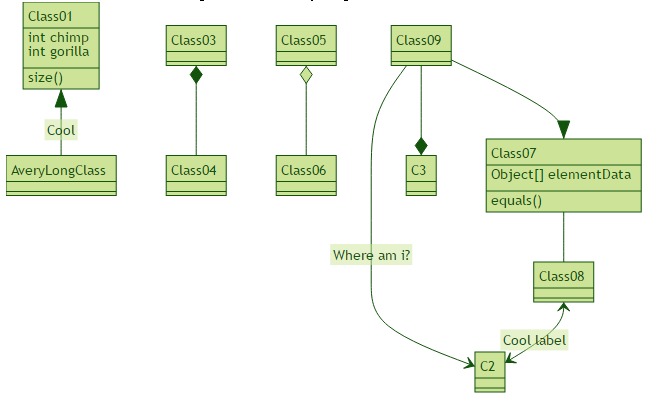

mermaid  
=======

Generation of diagrams and flowcharts from text in a similar manner as markdown.

Ever wanted to simplify documentation and avoid heavy tools like Visio when explaining your code?

This is why mermaid was born, a simple markdown-like script language for generating charts from text via javascript.

The code below would render the following image
<table>
    <tr><th>Code</th><th>Rendered diagram</th></tr>
    <tr>
        <td>
            <pre>
                <code>
graph TD;
    A-->B;
    A-->C;
    B-->D;
    C-->D;
                </code>
            </pre>
        </td>
        <td>
            

                
            

        </td>
    </tr>
    <tr>
        <td>
            <pre>
                <code>
sequenceDiagram
    participant Alice
    participant Bob
    Alice->>John: Hello John, how are you?
    loop Healthcheck
        John->>John: Fight against hypochondria
    end
    Note right of John: Rational thoughts &lt;br/>prevail...
    John-->>Alice: Great!
    John->>Bob: How about you?
    Bob-->>John: Jolly good!
                </code>
            </pre>
        </td>
        <td>
            
        </td>
    </tr>
    <tr>
        <td>
            <pre>
                <code>
classDiagram
    Class01 <|-- AveryLongClass : Cool
    Class03 *-- Class04
    Class05 o-- Class06
    Class07 .. Class08
    Class09 --> C2 : Where am i?
    Class09 --* C3
    Class09 --|> Class07
    Class07 : equals()
    Class07 : Object[] elementData
    Class01 : size()
    Class01 : int chimp
    Class01 : int gorilla
    Class08 <--> C2: Cool label
                </code>
            </pre>
        </td>
        <td>
            
        </td>
    </tr>
</table>

## Further reading

* [Usage](http://knsv.github.io/mermaid/#usage)
* [Flowchart syntax](http://knsv.github.io/mermaid/#flowcharts-basic-syntax)
* [Sequence diagram syntax](http://knsv.github.io/mermaid/#sequence-diagrams)
* [Mermaid client](http://knsv.github.io/mermaid/#mermaid-cli)
* [Demos](http://knsv.github.io/mermaid/#demos)

# Credits
Many thanks to the [d3](http://d3js.org/) and [dagre-d3](https://github.com/cpettitt/dagre-d3) projects for providing
the graphical layout and drawing libraries! Thanks also to the
[js-sequence-diagram](http://bramp.github.io/js-sequence-diagrams) project for usage of the grammar for the
sequence diagrams. Thanks to Jessica Peter for inspiration and starting point for gantt rendering.

*Mermaid was created by Knut Sveidqvist for easier documentation.*

Knut has not done all work by him self, here is the full list of the projects [contributors](https://github.com/knsv/mermaid/graphs/contributors).
