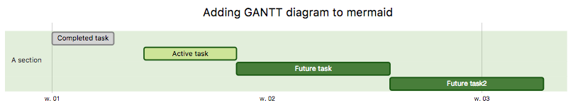
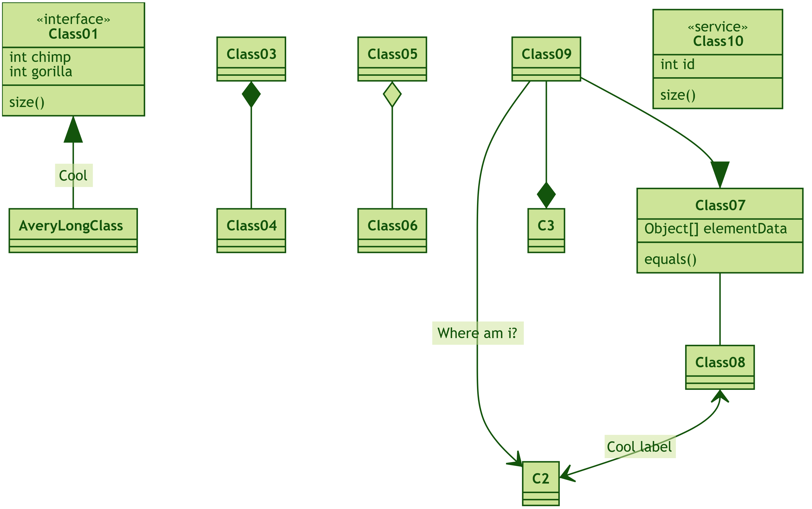

# mermaid

[](https://travis-ci.org/knsv/mermaid)
[](https://codeclimate.com/github/knsv/mermaid)
[](https://gitter.im/knsv/mermaid?utm_source=badge&utm_medium=badge&utm_campaign=pr-badge&utm_content=badge)


Generation of diagrams and flowcharts from text in a similar manner as markdown.

Ever wanted to simplify documentation and avoid heavy tools like Visio when explaining your code?

This is why mermaid was born, a simple markdown-like script language for generating charts from text via javascript.

The code below would render the following image
<table>
    <tr><th>Code</th><th>Rendered diagram</th></tr>
    <tr>
        <td>
            <pre>
                <code>
graph TD;
    A-->B;
    A-->C;
    B-->D;
    C-->D;
                </code>
            </pre>
        </td>
        <td>
            <p align="center">
                
            </p>
        </td>
    </tr>
    <tr>
        <td>
            <pre>
                <code>
sequenceDiagram
    participant Alice
    participant Bob
    Alice->>John: Hello John, how are you?
    loop Healthcheck
        John->>John: Fight against hypochondria
    end
    Note right of John: Rational thoughts &lt;br/>prevail...
    John-->>Alice: Great!
    John->>Bob: How about you?
    Bob-->>John: Jolly good!
                </code>
            </pre>
        </td>
        <td>
            
        </td>
    </tr>
        <tr>
        <td>
            <pre>
                <code>
gantt
dateFormat  YYYY-MM-DD
title Adding GANTT diagram to mermaid

section A section
Completed task            :done,    des1, 2014-01-06,2014-01-08
Active task               :active,  des2, 2014-01-09, 3d
Future task               :         des3, after des2, 5d
Future task2               :         des4, after des3, 5d
                </code>
            </pre>
        </td>
        <td>
            
        </td>
    </tr>
    <tr>
        <td>
            <pre>
                <code>
classDiagram
    Class01 &lt;|-- AveryLongClass : Cool
    Class03 *-- Class04
    Class05 o-- Class06
    Class07 .. Class08
    Class09 --> C2 : Where am i?
    Class09 --* C3
    Class09 --|> Class07
    Class07 : equals()
    Class07 : Object[] elementData
    Class01 : size()
    Class01 : int chimp
    Class01 : int gorilla
    Class08 &lt;--> C2: Cool label
                </code>
            </pre>
        </td>
        <td>
            
        </td>
    </tr>
    <tr>
        <td>
            <pre>
                <code>
gitGraph :
options
{
    "key": "value",
    "nodeWidth": 150,
    "nodeSpacing" : 150
}
end
    commit
    branch newbranch
    checkout newbranch
    commit
    commit
    checkout master
    commit
    commit
    merge newbranch
                </code>
            </pre>
        </td>
        <td>
            
        </td>
    </tr>

</table>


## Installation

### CDN

```
https://unpkg.com/mermaid@<version>/dist/
```

Replace `<version>` with expected version number.

Example: https://unpkg.com/mermaid@7.1.0/dist/

### Node.js

```
yarn add mermaid
```


## Documentation

https://mermaidjs.github.io


## Sibling projects

- [mermaid CLI](https://github.com/mermaidjs/mermaid.cli)
- [mermaid live editor](https://github.com/mermaidjs/mermaid-live-editor)
- [mermaid webpack demo](https://github.com/mermaidjs/mermaid-webpack-demo)


# Request for assistance

Things are piling up and I have hard time keeping up. To remedy this
it would be great if we could form a core team of developers to cooperate
with the future development mermaid.

As part of this team you would get write access to the repository and would
represent the project when answering questions and issues.

Together we could continue the work with things like:
* adding more typers of diagrams like mindmaps, ert digrams etc
* improving existing diagrams

Don't hesitate to contact me if you want to get involved.


# For contributors

## Setup

Make sure you have Chrome browser installed, this project uses Chrome headless to running tests.

    yarn install


## Build

    yarn build

If you want real time incremental build:

    yarn build:watch


## Lint

    yarn lint

We use [JavaScript Standard Style](https://github.com/feross/standard).
We recommend you installing [editor plugins](https://github.com/feross/standard#are-there-text-editor-plugins) so you can get real time lint result.


## Test

    yarn test

Manual test in browser:

    open dist/demo/index.html


## Release

For those who have the permission to do so:

Update version number in `package.json`.

    npm publish

Command above generates files into the `dist` folder and publishes them to npmjs.org.


# Credits

Many thanks to the [d3](http://d3js.org/) and [dagre-d3](https://github.com/cpettitt/dagre-d3) projects for providing the graphical layout and drawing libraries!

Thanks also to the [js-sequence-diagram](http://bramp.github.io/js-sequence-diagrams) project for usage of the grammar for the sequence diagrams. Thanks to Jessica Peter for inspiration and starting point for gantt rendering.

*Mermaid was created by Knut Sveidqvist for easier documentation.*

*[Tyler Long](https://github.com/tylerlong) has became a collaborator since April 2017.*

Here is the full list of the projects [contributors](https://github.com/knsv/mermaid/graphs/contributors).
