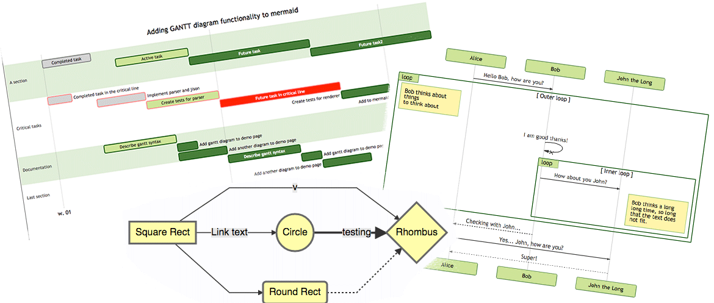
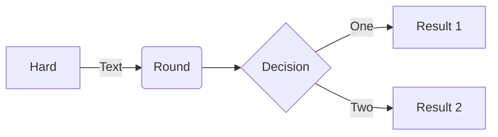
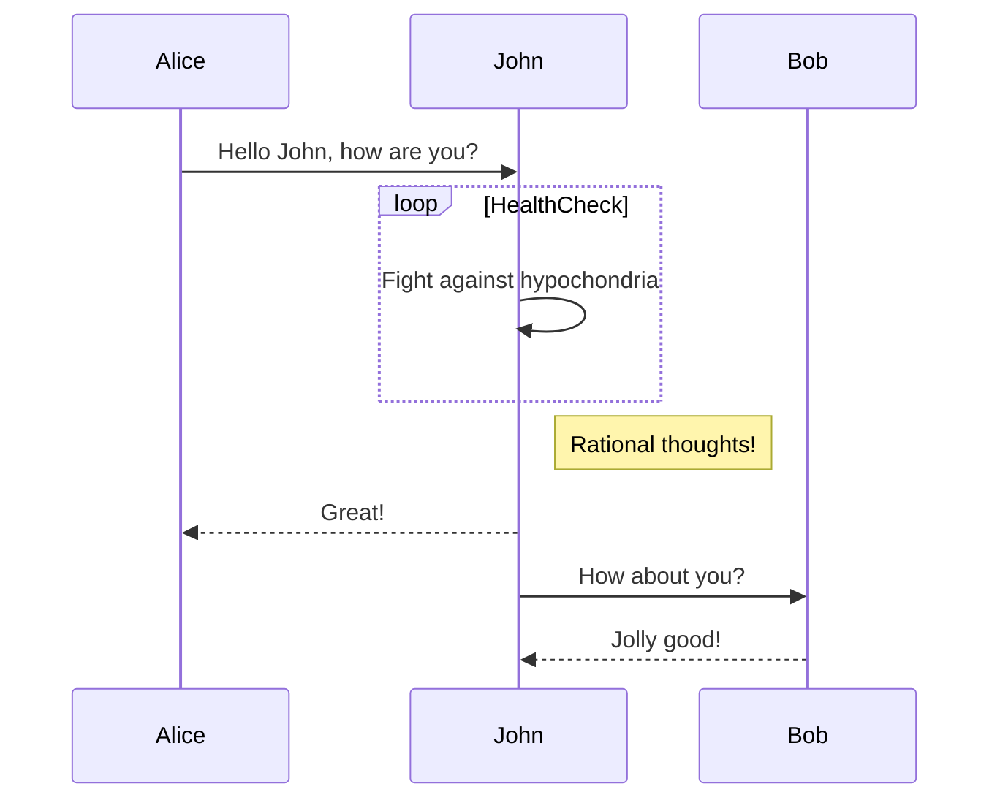
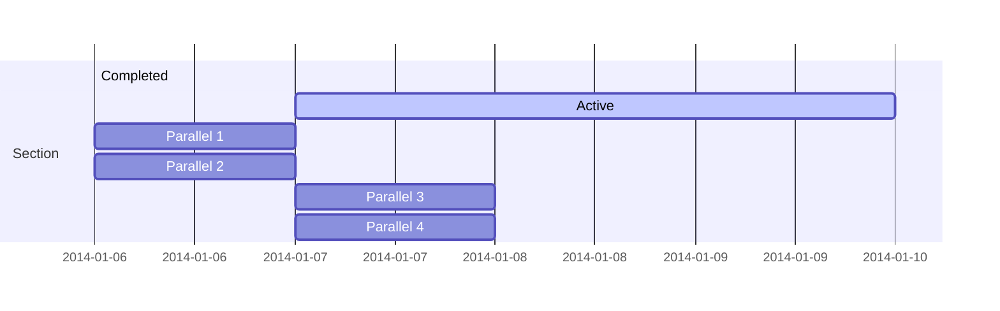
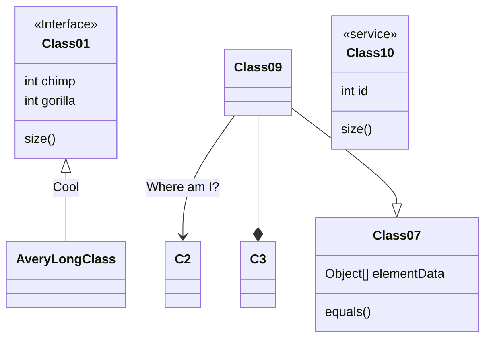
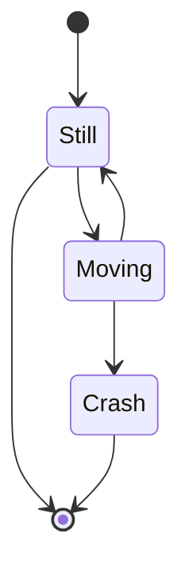
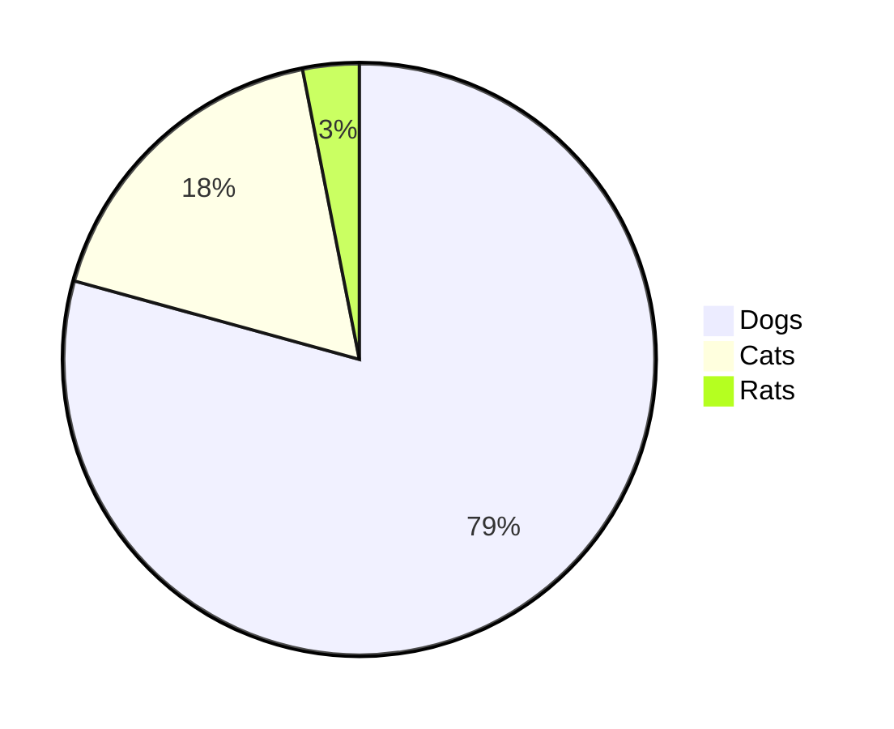
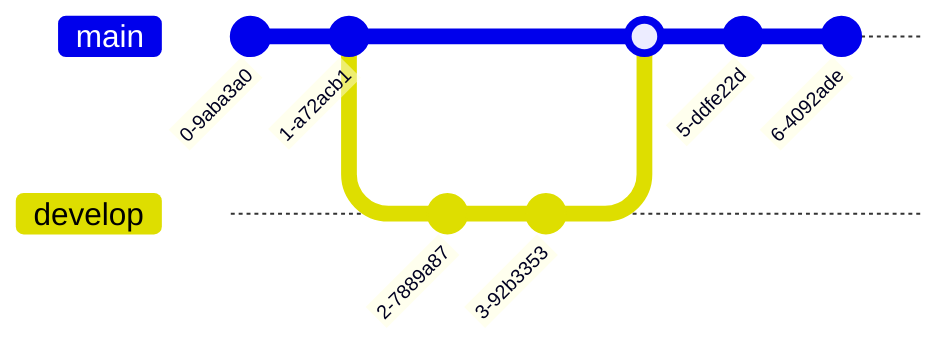
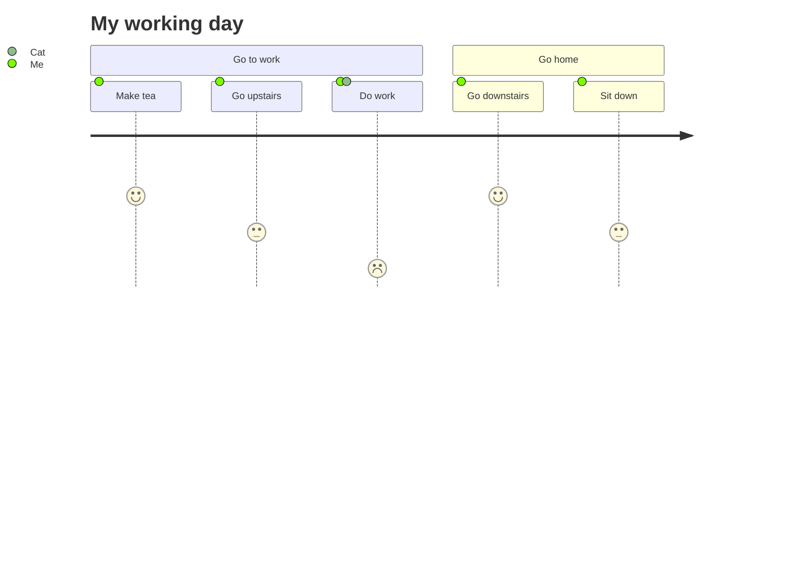
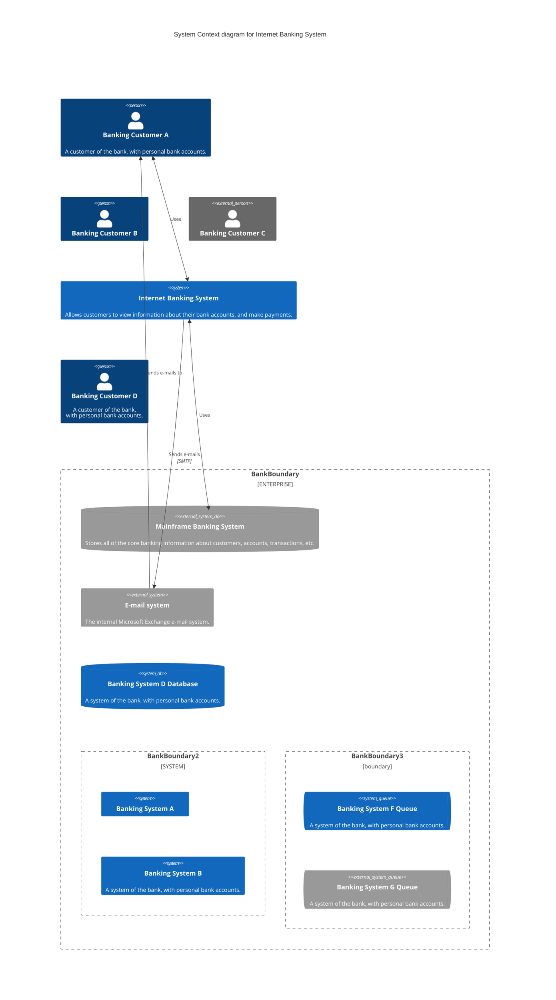

<p align="center">

</p>
<h1 align="center">
Mermaid
</h1>
<p align="center">
Generate diagrams from markdown-like text.
<p>
<p align="center">
  <a href="https://www.npmjs.com/package/mermaid"></a>
<p>

<p align="center">
<a href="https://mermaid.ai/live/"><b>Live Editor!</b></a>
</p>
<p align="center">
 <a href="https://mermaid.ai/open-source/">📖 Documentation</a> | <a href="https://mermaid.ai/open-source/intro/">🚀 Getting Started</a> | <a href="https://www.jsdelivr.com/package/npm/mermaid">🌐 CDN</a> | <a href="https://discord.gg/sKeNQX4Wtj" title="Discord invite">🙌 Join Us</a>
</p>
<p align="center">
<a href="./README.zh-CN.md">简体中文</a>
</p>
<p align="center">
Try Live Editor previews of future releases: <a href="https://develop.git.mermaid.live/" title="Try the mermaid version from the develop branch.">Develop</a> | <a href="https://next.git.mermaid.live/" title="Try the mermaid version from the next branch.">Next</a>
</p>

<br>
<br>

[](https://www.npmjs.com/package/mermaid)
[](https://github.com/mermaid-js/mermaid/actions/workflows/build.yml)
[](https://bundlephobia.com/package/mermaid)
[](https://app.codecov.io/github/mermaid-js/mermaid/tree/develop)
[](https://www.jsdelivr.com/package/npm/mermaid)
[](https://www.npmjs.com/package/mermaid)
[](https://discord.gg/sKeNQX4Wtj)
[](https://twitter.com/mermaidjs_)
[](https://argos-ci.com?utm_source=mermaid&utm_campaign=oss)
[](https://securityscorecards.dev/viewer/?uri=github.com/mermaid-js/mermaid)



:trophy: **Mermaid was nominated and won the [JS Open Source Awards (2019)](https://osawards.com/javascript/2019) in the category "The most exciting use of technology"!!!**

**Thanks to all involved, people committing pull requests, people answering questions! 🙏**

<a href="https://mermaid.js.org/landing/"></a>

## Table of content

<details>
<summary>Expand contents</summary>

- [About](#about)
- [Examples](#examples)
- [Release](#release)
- [Related projects](#related-projects)
- [Contributors](#contributors---)
- [Security and safe diagrams](#security-and-safe-diagrams)
- [Reporting vulnerabilities](#reporting-vulnerabilities)
- [Appreciation](#appreciation)

</details>

## About

<!-- <Main description>   -->

Mermaid is a JavaScript-based diagramming and charting tool that uses Markdown-inspired text definitions and a renderer to create and modify complex diagrams. The main purpose of Mermaid is to help documentation catch up with development.

> Doc-Rot is a Catch-22 that Mermaid helps to solve.

Diagramming and documentation costs precious developer time and gets outdated quickly.
But not having diagrams or docs ruins productivity and hurts organizational learning.<br/>
Mermaid addresses this problem by enabling users to create easily modifiable diagrams. It can also be made part of production scripts (and other pieces of code).<br/>
<br/>

Mermaid allows even non-programmers to easily create detailed diagrams through the [Mermaid Live Editor](https://mermaid.live/).<br/>
For video tutorials, visit our [Tutorials](https://mermaid.js.org/ecosystem/tutorials.html) page.
Use Mermaid with your favorite applications, check out the list of [Integrations and Usages of Mermaid](https://mermaid.js.org/ecosystem/integrations-community.html).

You can also use Mermaid within [GitHub](https://github.blog/2022-02-14-include-diagrams-markdown-files-mermaid/) as well many of your other favorite applications—check out the list of [Integrations and Usages of Mermaid](https://mermaid.js.org/ecosystem/integrations-community.html).

For a more detailed introduction to Mermaid and some of its more basic uses, look to the [Beginner's Guide](https://mermaid.js.org/intro/getting-started.html), [Usage](https://mermaid.js.org/config/usage.html) and [Tutorials](https://mermaid.js.org/ecosystem/tutorials.html).

Our PR Visual Regression Testing is powered by [Argos](https://argos-ci.com/?utm_source=mermaid&utm_campaign=oss) with their generous Open Source plan. It makes the process of reviewing PRs with visual changes a breeze.

[](https://argos-ci.com?utm_source=mermaid&utm_campaign=oss)

In our release process we rely heavily on visual regression tests using [applitools](https://applitools.com/). Applitools is a great service which has been easy to use and integrate with our tests.

<a href="https://applitools.com/">
<svg width="170" height="32" viewBox="0 0 170 32" fill="none" xmlns="http://www.w3.org/2000/svg"><mask id="a" maskUnits="userSpaceOnUse" x="27" y="0" width="143" height="32"><path fill-rule="evenodd" clip-rule="evenodd" d="M27.732.227h141.391v31.19H27.733V.227z" fill="#fff"></path></mask><g mask="url(#a)"><path fill-rule="evenodd" clip-rule="evenodd" d="M153.851 22.562l1.971-3.298c1.291 1.219 3.837 2.402 5.988 2.402 1.971 0 2.903-.753 2.903-1.829 0-2.832-10.253-.502-10.253-7.313 0-2.904 2.51-5.45 7.099-5.45 2.904 0 5.234 1.004 6.955 2.367l-1.829 3.226c-1.039-1.075-3.011-2.008-5.126-2.008-1.65 0-2.725.717-2.725 1.685 0 2.546 10.289.395 10.289 7.386 0 3.19-2.724 5.52-7.528 5.52-3.012 0-5.916-1.003-7.744-2.688zm-5.7 2.259h4.553V.908h-4.553v23.913zm-6.273-8.676c0-2.689-1.578-5.02-4.446-5.02-2.832 0-4.409 2.331-4.409 5.02 0 2.724 1.577 5.055 4.409 5.055 2.868 0 4.446-2.33 4.446-5.055zm-13.588 0c0-4.912 3.442-9.07 9.142-9.07 5.736 0 9.178 4.158 9.178 9.07 0 4.911-3.442 9.106-9.178 9.106-5.7 0-9.142-4.195-9.142-9.106zm-5.628 0c0-2.689-1.577-5.02-4.445-5.02-2.832 0-4.41 2.331-4.41 5.02 0 2.724 1.578 5.055 4.41 5.055 2.868 0 4.445-2.33 4.445-5.055zm-13.587 0c0-4.912 3.441-9.07 9.142-9.07 5.736 0 9.178 4.158 9.178 9.07 0 4.911-3.442 9.106-9.178 9.106-5.701 0-9.142-4.195-9.142-9.106zm-8.425 4.338v-8.999h-2.868v-3.98h2.868V2.773h4.553v4.733h3.514v3.979h-3.514v7.78c0 1.111.574 1.936 1.578 1.936.681 0 1.326-.251 1.577-.538l.968 3.478c-.681.609-1.9 1.11-3.8 1.11-3.191 0-4.876-1.648-4.876-4.767zm-8.962 4.338h4.553V7.505h-4.553V24.82zm-.43-21.905a2.685 2.685 0 012.688-2.69c1.506 0 2.725 1.184 2.725 2.69a2.724 2.724 0 01-2.725 2.724c-1.47 0-2.688-1.219-2.688-2.724zM84.482 24.82h4.553V.908h-4.553v23.913zm-6.165-8.676c0-2.976-1.793-5.02-4.41-5.02-1.47 0-3.119.825-3.908 1.973v6.094c.753 1.111 2.438 2.008 3.908 2.008 2.617 0 4.41-2.044 4.41-5.055zm-8.318 6.453v8.82h-4.553V7.504H70v2.187c1.327-1.685 3.227-2.618 5.342-2.618 4.446 0 7.672 3.299 7.672 9.07 0 5.773-3.226 9.107-7.672 9.107-2.043 0-3.907-.86-5.342-2.653zm-10.718-6.453c0-2.976-1.793-5.02-4.41-5.02-1.47 0-3.119.825-3.908 1.973v6.094c.753 1.111 2.438 2.008 3.908 2.008 2.617 0 4.41-2.044 4.41-5.055zm-8.318 6.453v8.82H46.41V7.504h4.553v2.187c1.327-1.685 3.227-2.618 5.342-2.618 4.446 0 7.672 3.299 7.672 9.07 0 5.773-3.226 9.107-7.672 9.107-2.043 0-3.908-.86-5.342-2.653zm-11.758-1.936V18.51c-.753-1.004-2.187-1.542-3.657-1.542-1.793 0-3.263.968-3.263 2.617 0 1.65 1.47 2.582 3.263 2.582 1.47 0 2.904-.502 3.657-1.506zm0 4.159v-1.829c-1.183 1.434-3.227 2.259-5.485 2.259-2.761 0-5.988-1.864-5.988-5.736 0-4.087 3.227-5.593 5.988-5.593 2.33 0 4.337.753 5.485 2.115V13.85c0-1.756-1.506-2.904-3.8-2.904-1.829 0-3.55.717-4.984 2.044L28.63 9.8c2.115-1.901 4.84-2.726 7.564-2.726 3.98 0 7.6 1.578 7.6 6.561v11.186h-4.588z" fill="#00A298"></path></g><path fill-rule="evenodd" clip-rule="evenodd" d="M14.934 16.177c0 1.287-.136 2.541-.391 3.752-1.666-1.039-3.87-2.288-6.777-3.752 2.907-1.465 5.11-2.714 6.777-3.753.255 1.211.39 2.466.39 3.753m4.6-7.666V4.486a78.064 78.064 0 01-4.336 3.567c-1.551-2.367-3.533-4.038-6.14-5.207C11.1 4.658 12.504 6.7 13.564 9.262 5.35 15.155 0 16.177 0 16.177s5.35 1.021 13.564 6.915c-1.06 2.563-2.463 4.603-4.507 6.415 2.607-1.169 4.589-2.84 6.14-5.207a77.978 77.978 0 014.336 3.568v-4.025s-.492-.82-2.846-2.492c.6-1.611.93-3.354.93-5.174a14.8 14.8 0 00-.93-5.174c2.354-1.673 2.846-2.492 2.846-2.492" fill="#00A298"></path></svg>
</a>

<!-- </Main description> -->

## Features

- **20+ Diagram Types** – Flowchart, Sequence, Class, State, ER, Gantt, Pie, Git Graph, Mindmap, Timeline, Sankey, and more
- **Markdown-Inspired Syntax** – Write diagrams as text, no drag-and-drop required
- **No Design Tool Needed** – Generate professional diagrams straight from code
- **Live Editor** – Prototype instantly at [mermaid.live](https://mermaid.live)
- **Version-Control Friendly** – Diagrams live as text, so diffs and reviews just work
- **Native GitHub Rendering** – Mermaid code blocks render directly in Markdown on GitHub
- **Highly Customizable** – Themes, colors, fonts, and layout directions
- **Security First** – Built-in sanitization plus a sandboxed rendering mode
- **Lightweight** – Small footprint, no heavy dependencies
- **Active Community** – Frequent releases and thousands of contributors
- **Open Source** – MIT licensed

## Examples

**The following are some examples of the diagrams, charts and graphs that can be made using Mermaid. Click here to jump into the [text syntax](https://mermaid.js.org/intro/syntax-reference.html).**

<!-- <Flowchart> -->

### Flowchart [<a href="https://mermaid.js.org/syntax/flowchart.html">docs</a> - <a href="https://mermaid.live/edit#pako:eNpNkMtqwzAQRX9FzKqFJK7t1km8KDQP6KJQSLOLvZhIY1tgS0GWmgbb_165IaFaiXvOFTPqgGtBkEJR6zOv0Fj2scsU8-ft8I5G5Gw6fe339GN7tnrYaafE45WvRsLW3Ya4bKVWwzVe_xU-FfVsc9hR62rLwvw_2591z7Y3FuUwgYZMg1L4ObrRzMBW1FAGqb8KKtCLGWRq8Ko7CbS0FdJqA2mBdUsTQGf110VxSK1xdJM2EkuDzd2qNQrypQ7s5TQuXcrW-ie5VoUsx9yZ2seVtac2DYIRz0ppK3eccd0ErRTjD1XfyyRIomSBUUzJPMaXOBb8GC4XRfQcFmL-FEYIwzD8AggvcHE">live editor</a>]

```
flowchart LR

A[Hard] -->|Text| B(Round)
B --> C{Decision}
C -->|One| D[Result 1]
C -->|Two| E[Result 2]
```


```mermaid
flowchart LR

A[Hard] -->|Text| B(Round)
B --> C{Decision}
C -->|One| D[Result 1]
C -->|Two| E[Result 2]
```

### Sequence diagram [<a href="https://mermaid.js.org/syntax/sequenceDiagram.html">docs</a> - <a href="https://mermaid.live/edit#pako:eNo9kMluwjAQhl_F-AykQMuSA1WrbuLQQ3v1ZbAnsVXHkzrjVhHi3etQwKfRv4w-z0FqMihL2eF3wqDxyUEdoVHhwTuNk-12RzaU4g29JzHMY2HpV0BE0VO6V8ETtdkGz1Zb1F8qiPyG5LX84mrLAmpwoWNh-5a0pWCiAxUwGBXeiVHEU4oq8V_6AHYUwAu2lLLTjVQ4bc1rT2yleI0IfJG320faZ9ABbk-Jz3hZnFxBduR9L2oiM5Jj2WBswJn8-cMArSRbbFDJMo8GK0ielVThmKOpNcD4bBxTlGUFvsOxhMT02QctS44JL6HzAS-iJzCYOwfJfTscunYd542aQuXqQU_RZ9kyt11ZFIM9rR3btJ9qaorOGQuR7c9mWSznyzXMF7hcLeBusTB6P9usq_ntrDKrm9kc5PF4_AMJE56Z">live editor</a>]

```
sequenceDiagram
Alice->>John: Hello John, how are you?
loop HealthCheck
    John->>John: Fight against hypochondria
end
Note right of John: Rational thoughts!
John-->>Alice: Great!
John->>Bob: How about you?
Bob-->>John: Jolly good!
```


```mermaid
sequenceDiagram
Alice->>John: Hello John, how are you?
loop HealthCheck
    John->>John: Fight against hypochondria
end
Note right of John: Rational thoughts!
John-->>Alice: Great!
John->>Bob: How about you?
Bob-->>John: Jolly good!
```

### Gantt chart [<a href="https://mermaid.js.org/syntax/gantt.html">docs</a> - <a href="https://mermaid.live/edit#pako:eNp90cGOgyAQBuBXIZxtFbG29bbZ3fsmvXKZylhJEAyOTZrGd1_sto3xsHMBhu-HBO689hp5xS_giJQbsCbjHTv9jcp9-q63SKhZpb3DhMXSOIiE5ZkoNpnYZGXynh6U-4jBK7JnVfBYJo9QvgjtEya1cj8QwFq0TMz4lZqxTBg0hOF5m1jifI2Lf7Bc490CyxUu1rhc4GLGPOEdhg6Mjq92V44xxanFDhWv4lRjA6MlxZWbIh17DYTf2pAPvGrADphwGMmfbq7mFYURX-jLwCVA91bWg8YYunO69Y8vMgPFI2vvGnOZ-2Owsd0S9UOVpvP29mKoHc_b2nfpYHQLgdrrsUzLvDxALrHcS9hJqeuzOB6avBCN3mciBz5N0y_wxZ0J">live editor</a>]

```
gantt
    section Section
    Completed :done,    des1, 2014-01-06,2014-01-08
    Active        :active,  des2, 2014-01-07, 3d
    Parallel 1   :         des3, after des1, 1d
    Parallel 2   :         des4, after des1, 1d
    Parallel 3   :         des5, after des3, 1d
    Parallel 4   :         des6, after des4, 1d
```


```mermaid
gantt
    section Section
    Completed :done,    des1, 2014-01-06,2014-01-08
    Active        :active,  des2, 2014-01-07, 3d
    Parallel 1   :         des3, after des1, 1d
    Parallel 2   :         des4, after des1, 1d
    Parallel 3   :         des5, after des3, 1d
    Parallel 4   :         des6, after des4, 1d
```

### Class diagram [<a href="https://mermaid.js.org/syntax/classDiagram.html">docs</a> - <a href="https://mermaid.live/edit#pako:eNpdkTFPwzAQhf-K5QlQ2zQJJG1UBaGWDYmBgYEwXO1LYuTEwXYqlZL_jt02asXm--690zvfgTLFkWaUSTBmI6DS0BTt2lfzkKx-p1PytEO9f1FtdaQkI2ulZNGuVqK1qEtgmOfk7BitSzKdOhg59XuNGgk0RDxed-_IOr6uf8cZ6UhTZ8bvHqS5ub1mr9svZPbjk6DEBlu7AQuXyBkx4gcvDk9cUMJq0XT_YaW0kNK5j-ufAoRzcihaQvLcoN4Jv50vvVxw_xrnD3RCG9QNCO4-8OgpqK1dpoJm7smxhF7agp6kfcfB4jMXVmmalW4tnFDorXrbt4xmVvc4is53GKFUwNF5DtTuO3-sShjrJjLVlqLyvNfS4drazmRB4NuzSti6386YagIjeA3a1rtlEiRRsoAoxiSN4SGOOduGy0UZ3YclT-dhBHQYhj8dc6_I">live editor</a>]

```
classDiagram
Class01 <|-- AveryLongClass : Cool
<<Interface>> Class01
Class09 --> C2 : Where am I?
Class09 --* C3
Class09 --|> Class07
Class07 : equals()
Class07 : Object[] elementData
Class01 : size()
Class01 : int chimp
Class01 : int gorilla
class Class10 {
  <<service>>
  int id
  size()
}

```


```mermaid
classDiagram
Class01 <|-- AveryLongClass : Cool
<<Interface>> Class01
Class09 --> C2 : Where am I?
Class09 --* C3
Class09 --|> Class07
Class07 : equals()
Class07 : Object[] elementData
Class01 : size()
Class01 : int chimp
Class01 : int gorilla
class Class10 {
  <<service>>
  int id
  size()
}

```

### State diagram [<a href="https://mermaid.js.org/syntax/stateDiagram.html">docs</a> - <a href="https://mermaid.live/edit#pako:eNpdkEFvgzAMhf8K8nEqpYSNthx22Xbcqcexg0sCiZQQlDhIFeK_L8A6TfXp6fOz9ewJGssFVOAJSbwr7ByadGR1n8T6evpO0vQ1uZDSekOrXGFsPqJPO6q-2-imH8f_0TeHXm50lfelsAMjnEHFY6xpMdRAUhhRQxUlFy0GTTXU_RytYeAx-AdXZB1ULWovdoCB7OXWN1CRC-Ju-r3uz6UtchGHJqDbsPygU57iysb2reoWHpyOWBINvsqypb3vFMlw3TfWZF5xiY7keC6zkpUnZIUojwW-FAVvrvn51LLnvOXHQ84Q5nn-AVtLcwk">live editor</a>]

```
stateDiagram-v2
[*] --> Still
Still --> [*]
Still --> Moving
Moving --> Still
Moving --> Crash
Crash --> [*]
```


```mermaid
stateDiagram-v2
[*] --> Still
Still --> [*]
Still --> Moving
Moving --> Still
Moving --> Crash
Crash --> [*]
```

### Pie chart [<a href="https://mermaid.js.org/syntax/pie.html">docs</a> - <a href="https://mermaid.live/edit#pako:eNo9jsFugzAMhl8F-VzBgEEh13Uv0F1zcYkTIpEEBadShXj3BU3dzf_n77e8wxQUgYDVkvQSbsFsEgpRtEN_5i_kvzx05XiC-xvUHVzAUXRoVe7v0heFBJ7JkQSRR0Ua08ISpD-ymlaFTN_KcoggNC4bXQATh5-Xn0BwTPSWbhZNRPdvLQEV5dIO_FrPZ43dOJ-cgtfWnDzFJeOZed1EVZ3r0lie06Ocgqs2q2aMPD_HvuqbfsCmpf7aYte2anrU46Cbz1qr60fdIBzH8QvW9lkl">live editor</a>]

```
pie
"Dogs" : 386
"Cats" : 85.9
"Rats" : 15
```


```mermaid
pie
"Dogs" : 386
"Cats" : 85.9
"Rats" : 15
```

### Git graph [experimental - <a href="https://mermaid.live/edit#pako:eNqNkMFugzAMhl8F-VyVAR1tOW_aA-zKxSSGRCMJCk6lCvHuNZPKZdM0n-zf3_8r8QIqaIIGMqnB8kfEybQ--y4VnLP8-9RF9Mpkmm40hmlnDKmvkPiH_kfS7nFo_VN0FAf6XwocQGgxa_nGsm1bYEOOWmik1dRjGrmF1q-Cpkkj07u2HCI0PY4zHQATh8-7V9BwTPSE3iwOEd1OjQE1iWkBvk_bzQY7s0Sq4Hs7bHqKo8iGeZqbPN_WR7mpSd1RHpvPVhuMbG7XOq_L-oJlRfW5wteq0qorrpe-PBW9Pr8UJcK6rg-BLYPQ">live editor</a>]

```
gitGraph
  commit
  commit
  branch develop
  checkout develop
  commit
  commit
  checkout main
  merge develop
  commit
  commit
```


```mermaid
gitGraph
  commit
  commit
  branch develop
  checkout develop
  commit
  commit
  checkout main
  merge develop
  commit
  commit
```

### Bar chart (using gantt chart) [<a href="https://mermaid.js.org/syntax/gantt.html">docs</a> - <a href="https://mermaid.live/edit#pako:eNptkU1vhCAQhv8KIenNugiI4rkf6bmXpvEyFVxJFDYyNt1u9r8X63Z7WQ9m5pknLzieaBeMpQ3dg0dsPUkPOhwteXZIXmJcbCT3xMAxkuh8Z8kIEclyMIB209fqKcwTICFvG4IvFy_oLrZ-g9F26ILfQgvNFN94VaRXQ1iWqpumZBcu1J8p1E1TXDx59eQNr5LyEqjJn6hv5QnGNlxevZJmdLLpy5xJSzut45biYCfb0iaVxvawjNjS1p-TCguG16PvaIPzYjO67e3BwX6GiTY9jPFKH43DMF_hGMDY1J4oHg-_f8hFTJFd8L3br3yZx4QHxENsdrt1nO8dDstH3oVpF50ZYMbhU6ud4qoGLqyqBJRCmO6j0HXPZdGbihUc6Pmc0QP49xD-b5X69ZQv2gjO81IwzWqhC1lKrjJ6pA3nVS7SMiVjrKirWlYp5fs3osgrWeo00lorLWvOzz8JVbXm">live editor</a>]

```
gantt
    title Git Issues - days since last update
    dateFormat  X
    axisFormat %s

    section Issue19062
    71   : 0, 71
    section Issue19401
    36   : 0, 36
    section Issue193
    34   : 0, 34
    section Issue7441
    9    : 0, 9
    section Issue1300
    5    : 0, 5
```


```mermaid
gantt
    title Git Issues - days since last update
    dateFormat  X
    axisFormat %s

    section Issue19062
    71   : 0, 71
    section Issue19401
    36   : 0, 36
    section Issue193
    34   : 0, 34
    section Issue7441
    9    : 0, 9
    section Issue1300
    5    : 0, 5
```

### User Journey diagram [<a href="https://mermaid.js.org/syntax/userJourney.html">docs</a> - <a href="https://mermaid.live/edit#pako:eNplkMFuwjAQRH9l5TMiTVIC-FqqnjhxzWWJN4khsSN7XRSh_HsdKBVt97R6Mzsj-yoqq0hIAXCywRkaSwNxWHNHsB_hYt1ZmwYUfiueKtbWwIcFtjf5zgH2eCZgQgkrCXt64GgMg2fUzkvIn5Xd_V5COtMFvCH_62ht_5yk7MU8sn61HDTfxD8VYiF6cj1qFd94nWkpuKWYKWRcFdUYOi5FaaZoDYNCpnel2Toha-w8LQQGtofRVEKyC_Qw7TQ2DvsfV2dRUTy6Ch6H-UMb7TlGVtbUupl5cF3ELfPgZZLM8rLR3IbjsrJ94rVq0XH7uS2SIis2mOVUrHNc5bmqjul2U2evaa3WL2mGYpqmL2BGiho">live editor</a>]

```
  journey
    title My working day
    section Go to work
      Make tea: 5: Me
      Go upstairs: 3: Me
      Do work: 1: Me, Cat
    section Go home
      Go downstairs: 5: Me
      Sit down: 3: Me
```


```mermaid
  journey
    title My working day
    section Go to work
      Make tea: 5: Me
      Go upstairs: 3: Me
      Do work: 1: Me, Cat
    section Go home
      Go downstairs: 5: Me
      Sit down: 3: Me
```

### C4 diagram [<a href="https://mermaid.js.org/syntax/c4.html">docs</a>]

```
C4Context
title System Context diagram for Internet Banking System

Person(customerA, "Banking Customer A", "A customer of the bank, with personal bank accounts.")
Person(customerB, "Banking Customer B")
Person_Ext(customerC, "Banking Customer C")
System(SystemAA, "Internet Banking System", "Allows customers to view information about their bank accounts, and make payments.")

Person(customerD, "Banking Customer D", "A customer of the bank, <br/> with personal bank accounts.")

Enterprise_Boundary(b1, "BankBoundary") {

  SystemDb_Ext(SystemE, "Mainframe Banking System", "Stores all of the core banking information about customers, accounts, transactions, etc.")

  System_Boundary(b2, "BankBoundary2") {
    System(SystemA, "Banking System A")
    System(SystemB, "Banking System B", "A system of the bank, with personal bank accounts.")
  }

  System_Ext(SystemC, "E-mail system", "The internal Microsoft Exchange e-mail system.")
  SystemDb(SystemD, "Banking System D Database", "A system of the bank, with personal bank accounts.")

  Boundary(b3, "BankBoundary3", "boundary") {
    SystemQueue(SystemF, "Banking System F Queue", "A system of the bank, with personal bank accounts.")
    SystemQueue_Ext(SystemG, "Banking System G Queue", "A system of the bank, with personal bank accounts.")
  }
}

BiRel(customerA, SystemAA, "Uses")
BiRel(SystemAA, SystemE, "Uses")
Rel(SystemAA, SystemC, "Sends e-mails", "SMTP")
Rel(SystemC, customerA, "Sends e-mails to")
```


```mermaid
C4Context
title System Context diagram for Internet Banking System

Person(customerA, "Banking Customer A", "A customer of the bank, with personal bank accounts.")
Person(customerB, "Banking Customer B")
Person_Ext(customerC, "Banking Customer C")
System(SystemAA, "Internet Banking System", "Allows customers to view information about their bank accounts, and make payments.")

Person(customerD, "Banking Customer D", "A customer of the bank, <br/> with personal bank accounts.")

Enterprise_Boundary(b1, "BankBoundary") {

  SystemDb_Ext(SystemE, "Mainframe Banking System", "Stores all of the core banking information about customers, accounts, transactions, etc.")

  System_Boundary(b2, "BankBoundary2") {
    System(SystemA, "Banking System A")
    System(SystemB, "Banking System B", "A system of the bank, with personal bank accounts.")
  }

  System_Ext(SystemC, "E-mail system", "The internal Microsoft Exchange e-mail system.")
  SystemDb(SystemD, "Banking System D Database", "A system of the bank, with personal bank accounts.")

  Boundary(b3, "BankBoundary3", "boundary") {
    SystemQueue(SystemF, "Banking System F Queue", "A system of the bank, with personal bank accounts.")
    SystemQueue_Ext(SystemG, "Banking System G Queue", "A system of the bank, with personal bank accounts.")
  }
}

BiRel(customerA, SystemAA, "Uses")
BiRel(SystemAA, SystemE, "Uses")
Rel(SystemAA, SystemC, "Sends e-mails", "SMTP")
Rel(SystemC, customerA, "Sends e-mails to")
```

## Release

For those who have the permission to do so:

Update version number in `package.json`.

```sh
npm publish
```

The above command generates files into the `dist` folder and publishes them to <https://www.npmjs.com>.

## Related projects

- [Command Line Interface](https://github.com/mermaid-js/mermaid-cli)
- [Live Editor](https://github.com/mermaid-js/mermaid-live-editor)
- [HTTP Server](https://github.com/TomWright/mermaid-server)

## Contributors [](https://github.com/mermaid-js/mermaid/issues?q=is%3Aissue+is%3Aopen+label%3A%22Good+first+issue%21%22) [](https://github.com/mermaid-js/mermaid/graphs/contributors) [](https://github.com/mermaid-js/mermaid/graphs/contributors)

Mermaid is a growing community and is always accepting new contributors. There's a lot of different ways to help out and we're always looking for extra hands! Look at [this issue](https://github.com/mermaid-js/mermaid/issues/866) if you want to know where to start helping out.

Detailed information about how to contribute can be found in the [contribution guide](https://mermaid.js.org/community/contributing.html)

## Security and safe diagrams

For public sites, it can be precarious to retrieve text from users on the internet, storing that content for presentation in a browser at a later stage. The reason is that the user content can contain embedded malicious scripts that will run when the data is presented. For Mermaid this is a risk, specially as mermaid diagrams contain many characters that are used in html which makes the standard sanitation unusable as it also breaks the diagrams. We still make an effort to sanitize the incoming code and keep refining the process but it is hard to guarantee that there are no loop holes.

As an extra level of security for sites with external users we are happy to introduce a new security level in which the diagram is rendered in a sandboxed iframe preventing javascript in the code from being executed. This is a great step forward for better security.

_Unfortunately you cannot have a cake and eat it at the same time which in this case means that some of the interactive functionality gets blocked along with the possible malicious code._

## Reporting vulnerabilities

To report a vulnerability, please e-mail <security@mermaid.live> with a description of the issue, the steps you took to create the issue, affected versions, and if known, mitigations for the issue.

## Appreciation

A quick note from Knut Sveidqvist:

> _Many thanks to the [d3](https://d3js.org/) and [dagre-d3](https://github.com/cpettitt/dagre-d3) projects for providing the graphical layout and drawing libraries!_
>
> _Thanks also to the [js-sequence-diagram](https://bramp.github.io/js-sequence-diagrams) project for usage of the grammar for the sequence diagrams. Thanks to Jessica Peter for inspiration and starting point for gantt rendering._
>
> _Thank you to [Tyler Long](https://github.com/tylerlong) who has been a collaborator since April 2017._
>
> _Thank you to the ever-growing list of [contributors](https://github.com/mermaid-js/mermaid/graphs/contributors) that brought the project this far!_

---

_Mermaid was created by Knut Sveidqvist for easier documentation._


## 🌐 Web Resources & Interactive Index
- [ROBLO X ZOMBIE](https://theskillquest.pages.dev/roblo-x-zombie.html)
- [COIN COLOR SORT](https://iskillcrafts.pages.dev/coin-color-sort.html)
- [THE LAST TIGER TANK SIMULATOR](https://quizverses-9d2f2.web.app/the-last-tiger-tank-simulator.html)
- [CHALLENGER CITY DRIVER](https://studyquests.github.io/challenger-city-driver.html)
- [SAMURAI VS YAKUZA BEAT EM UP](https://quizverses.github.io/samurai-vs-yakuza-beat-em-up.html)
- [CATEGORY ADVENTURE](https://learnquester.pages.dev/category-adventure.html)
- [SURVIVAL RACING EXTREME ROAD](https://learnquesters.pages.dev/survival-racing-extreme-road.html)
- [DIRTY MONEY THE RICH GET RICH](https://quizverses.github.io/dirty-money-the-rich-get-rich.html)
- [CUBATORIA MERGE 2048](https://thelearnquester.web.app/cubatoria-merge-2048.html)
- [INDEX30](https://thelearnquesters.pages.dev/index30.html)
- [FOOTBALL FUN](https://thelearnquesters.pages.dev/football-fun.html)
- [SNAKE IO](https://thelearnquesters.pages.dev/snake-io.html)
- [PIZZA MAKER COOKING GAMES FOR KIDS](https://studyplayings.pages.dev/pizza-maker-cooking-games-for-kids.html)
- [JAILBREAK ROBLOX JUMPER](https://thelearnquesters.pages.dev/jailbreak-roblox-jumper.html)
- [CATEGORY BASKETBALL](https://quizverses.github.io/category-basketball.html)
- [ITALIAN BRAINROT CHALLENGE](https://thelearnquesters.pages.dev/italian-brainrot-challenge.html)
- [CATEGORY DRESS UP 3](https://thelearnquesters.pages.dev/category-dress-up-3.html)
- [CATEGORY SHOOTER](https://studyplayings.web.app/category-shooter.html)
- [TANK BATTLEIO](https://thelearnquesters.pages.dev/tank-battleio.html)
- [CATEGORY ARENA255](https://learnquester.pages.dev/category-arena255.html)
- [CATEGORY CASUAL](https://learnquesters.pages.dev/category-casual.html)
- [2048 MAYHEMIO](https://thelearnquesters.pages.dev/2048-mayhemio.html)
- [SQUID ESCAPE BUT BLOCKWORLD](https://studyplayings.web.app/squid-escape-but-blockworld.html)
- [RUMMY CLASSIC](https://learnquester.pages.dev/rummy-classic.html)
- [CATEGORY ESCAPE 3](https://thelearnquesters.pages.dev/category-escape-3.html)
- [KOI FISH POND IDLE MERGE GAME](https://thelearnquesters.pages.dev/koi-fish-pond-idle-merge-game.html)
- [K POP HUNTERS VALENTINE STYLE](https://studyquests.github.io/k-pop-hunters-valentine-style.html)
- [CLOWNFISH PIN OUT](https://thelearnquester.web.app/clownfish-pin-out.html)
- [JEWELS COLORING PUZZLE](https://thelearnquesters.pages.dev/jewels-coloring-puzzle.html)
- [TINY BAKER RAINBOW BUTTERCREAM CAKE](https://studyplayings.web.app/tiny-baker-rainbow-buttercream-cake.html)
- [DAILY CHESS PUZZLE](https://studyplayings.web.app/daily-chess-puzzle.html)
- [CATEGORY DIFFICULT81](https://thelearnquesters.pages.dev/category-difficult81.html)
- [FASHION PRINCESS DRESS UP](https://thelearnquesters.pages.dev/fashion-princess-dress-up.html)
- [VARIETY MECHA](https://studyplaying.github.io/variety-mecha.html)
- [TWO STUNT SUPERCARS](https://thelearnquesters.pages.dev/two-stunt-supercars.html)
- [MONSTER SCHOOL 2](https://quizverses-9d2f2.web.app/monster-school-2.html)
- [HORROR SCHOOL DETECTIVE STORY](https://studyquests.github.io/horror-school-detective-story.html)
- [SAVE MY PET](https://learnquester.pages.dev/save-my-pet.html)
- [STICK NINJA SURVIVAL](https://studyplaying.github.io/stick-ninja-survival.html)
- [CATEGORY FPS 2](https://thelearnquesters.pages.dev/category-fps-2.html)
- [ONLINE PORTAL](https://studyplayings.web.app/)
- [INDEX11](https://studyplayings.web.app/index11.html)
- [STICKMAN ESCAPE SCHOOL](https://learnquester.pages.dev/stickman-escape-school.html)
- [FESTIVAL VIBES MAKEUP](https://learnquester.pages.dev/festival-vibes-makeup.html)
- [VEGA MIX SEA ADVENTURES](https://thelearnquesters.pages.dev/vega-mix-sea-adventures.html)
- [CATEGORY CASUAL 6](https://learnquester.pages.dev/category-casual-6.html)
- [CATEGORY CASUAL 7](https://studyquests.github.io/category-casual-7.html)
- [BFFS SPRING BREAK FASHIONISTA](https://learnquester.pages.dev/bffs-spring-break-fashionista.html)
- [ZOMBIES AND GUNS](https://studyplaying.github.io/zombies-and-guns.html)
- [CATEGORY THINKY 3](https://thelearnquesters.pages.dev/category-thinky-3.html)
- [ATHENA MATCH 2](https://quizverses.github.io/athena-match-2.html)
- [CATEGORY DIRT BIKE](https://thelearnquesters.pages.dev/category-dirt-bike.html)
- [THE SORTING MART](https://thelearnquester.web.app/the-sorting-mart.html)
- [MATCH MASTERS](https://thelearnquesters.pages.dev/match-masters.html)
- [CATEGORY RACING DRIVING](https://thelearnquesters.pages.dev/category-racing-driving.html)
- [VEX HYPER DASH](https://studyplaying.github.io/vex-hyper-dash.html)
- [GANGSTA DUEL](https://learnquester.pages.dev/gangsta-duel.html)
- [FISH RAIN 2](https://quizverses-9d2f2.web.app/fish-rain-2.html)
- [LADY POOL](https://quizverses.github.io/lady-pool.html)
- [DOODLE DINO RUN](https://studyplayings.web.app/doodle-dino-run.html)
- [FROGGA](https://quizverses-9d2f2.web.app/frogga.html)
- [CATEGORY MAGIC46](https://thequizzone.pages.dev/category-magic46.html)
- [PARTY ANIMALS CATS EVOLUTION](https://learnquester.pages.dev/party-animals-cats-evolution.html)
- [SUPERMARKET CASHIER SIMULATOR](https://quizverses-9d2f2.web.app/supermarket-cashier-simulator.html)
- [SHADOWMAN RUNNER](https://studyplaying.github.io/shadowman-runner.html)
- [PACKING LINE](https://quizverses-9d2f2.web.app/packing-line.html)
- [SAVE THE BEAUTY](https://quizverses-9d2f2.web.app/save-the-beauty.html)
- [CUT THE GRASS 3D](https://quizverses.github.io/cut-the-grass-3d.html)
- [INDEX16](https://quizverses.pages.dev/index16.html)
- [CATEGORY MONSTER206](https://thelearnquesters.pages.dev/category-monster206.html)
- [CATEGORY UNBLOCKED WEBSITES](https://quizverses.pages.dev/category-unblocked-websites.html)
- [ANGRY PLANTS FLOWER](https://studyplaying.github.io/angry-plants-flower.html)
- [CATEGORY ART](https://quizverses.pages.dev/category-art.html)
- [CATEGORY JUMPING150](https://thequizzone.pages.dev/category-jumping150.html)
- [BRAWL STARS BATTLE](https://studyplaying.github.io/brawl-stars-battle.html)
- [CATEGORY ANIMAL216](https://studyplayings.web.app/category-animal216.html)
- [GRANNY PILLS DEFEND CACTUSES](https://studyplaying.github.io/granny-pills-defend-cactuses.html)
- [MOJICON GARDEN CONNECT](https://studyplayings.web.app/mojicon-garden-connect.html)
- [INDEX20](https://quizverses.pages.dev/index20.html)
- [SQUID SPRUNKI SLITHER GAME 2](https://studyplayings.web.app/squid-sprunki-slither-game-2.html)
- [SINGLE LINE PUZZLE DRAWING](https://quizverses.github.io/single-line-puzzle-drawing.html)
- [REDLINE IDLE FRONT](https://learnquester.pages.dev/redline-idle-front.html)
- [HORSEBACK SURVIVAL](https://quizverses.github.io/horseback-survival.html)
- [NAIL QUEEN](https://quizverses.github.io/nail-queen.html)
- [STICKMAN ROCKET](https://studyquests.github.io/stickman-rocket.html)
- [PRIVACY](https://studyquests.github.io/privacy.html)
- [HAPPY MONSTERS 2](https://learnquester.pages.dev/happy-monsters-2.html)
- [REAL MOTORBIKE SUPER HERO STUNT 3D](https://studyplayings.web.app/real-motorbike-super-hero-stunt-3d.html)
- [ZOMBIE RODEO MULTIPLICATION](https://studyplayings.web.app/zombie-rodeo-multiplication.html)
- [CATEGORY IO](https://studyplayings.web.app/category-io.html)
- [HAZEL TANGLE ROPE 3D SORTING PUZZLE](https://studyquests.github.io/hazel-tangle-rope-3d-sorting-puzzle.html)
- [CROSS CONNECT WORD](https://studyplaying.github.io/cross-connect-word.html)
- [INDEX6](https://studyquests.github.io/index6.html)
- [SCALA 40](https://studyplayings.web.app/scala-40.html)
- [WAVE CHIC OCEAN FASHION FRENZY](https://learnquester.pages.dev/wave-chic-ocean-fashion-frenzy.html)
- [CATEGORY TURN BASED30](https://learnquester.pages.dev/category-turn-based30.html)
- [CATEGORY INCREMENTAL](https://learnquesters.pages.dev/category-incremental.html)
- [DRIFT IO](https://thelearnquesters.pages.dev/drift-io.html)
- [UNDERWATER SURVIVAL](https://studyplaying.github.io/underwater-survival.html)
- [JOIN CLASH COLOR BUTTON](https://thequizzone.pages.dev/join-clash-color-button.html)
- [CATEGORY INTERSTELLAR](https://thequizzone.pages.dev/category-interstellar.html)
- [FUN SORTING THROUGH THE SHELVES](https://studyplayings.web.app/fun-sorting-through-the-shelves.html)
- [INDEX8](https://learnquesters.pages.dev/index8.html)
- [INDEX7](https://studyplayings.web.app/index7.html)
- [LOGIC BLAST EXPLORER](https://thelearnquesters.pages.dev/logic-blast-explorer.html)
- [MURDER MYSTERY](https://thelearnquesters.pages.dev/murder-mystery.html)
- [UNPUZZLE MASTER](https://learnquester.github.io/unpuzzle-master.html)
- [TIKTOK BRAIDED HAIRSTYLES](https://thelearnquester.web.app/tiktok-braided-hairstyles.html)
- [TERMS](https://studyquests.github.io/terms.html)
- [COLOR DASH](https://thelearnquester.web.app/color-dash.html)
- [INDEX21](https://studyplayings.web.app/index21.html)
- [CATEGORY PIXEL313](https://thelearnquester.web.app/category-pixel313.html)
- [DRIVERZ ED](https://studyplaying.github.io/driverz-ed.html)
- [COZY GARDEN IDLE](https://studyplayings.web.app/cozy-garden-idle.html)
- [FURY OF THE STEAMPUNK PRINCESS](https://studyplayings.web.app/fury-of-the-steampunk-princess.html)
- [CATEGORY CARE](https://learnquesters.pages.dev/category-care.html)
- [BLACK PINK STPATRICKS DAY CONCERT](https://studyplayings.web.app/black-pink-stpatricks-day-concert.html)
- [CATEGORY MOBILE2 112](https://learnquesters.pages.dev/category-mobile2-112.html)
- [BALL SORT COLOR PUZZLE](https://studyplayings.web.app/ball-sort-color-puzzle.html)
- [SLINGER BLOCK](https://thelearnquesters.pages.dev/slinger-block.html)
- [CATEGORY MINECRAFT 2](https://learnquesters.pages.dev/category-minecraft-2.html)
- [BUBBLE POP LEGEND](https://thelearnquesters.pages.dev/bubble-pop-legend.html)
- [SCREWDOM 3D](https://quizverses.pages.dev/screwdom-3d.html)
- [CANNON BLAST THE LAST STAND](https://studyquests.github.io/cannon-blast-the-last-stand.html)
- [PIZZA PUZZLE](https://thelearnquesters.pages.dev/pizza-puzzle.html)
- [COLOR NONOGRAM PUZZLE 2](https://learnquester.pages.dev/color-nonogram-puzzle-2.html)
- [DELTA FORCE AIRBORNE](https://studyplayings.web.app/delta-force-airborne.html)
- [CATEGORY BASKETBALL](https://learnquester.pages.dev/category-basketball.html)
- [BELOTE 3IN1](https://studyplayings.web.app/belote-3in1.html)
- [TERMS](https://studyplayings.web.app/terms.html)
