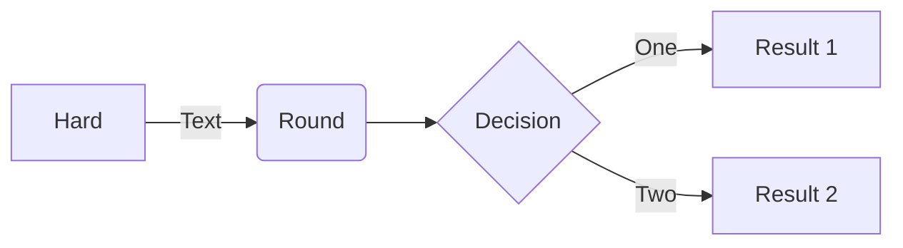
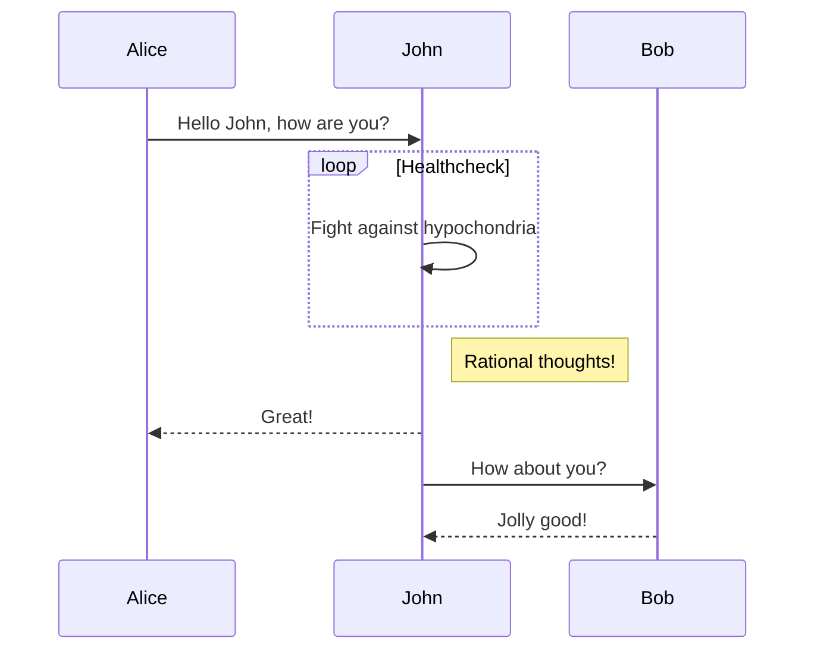
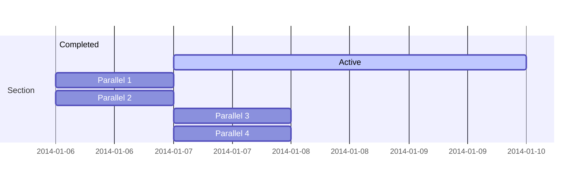
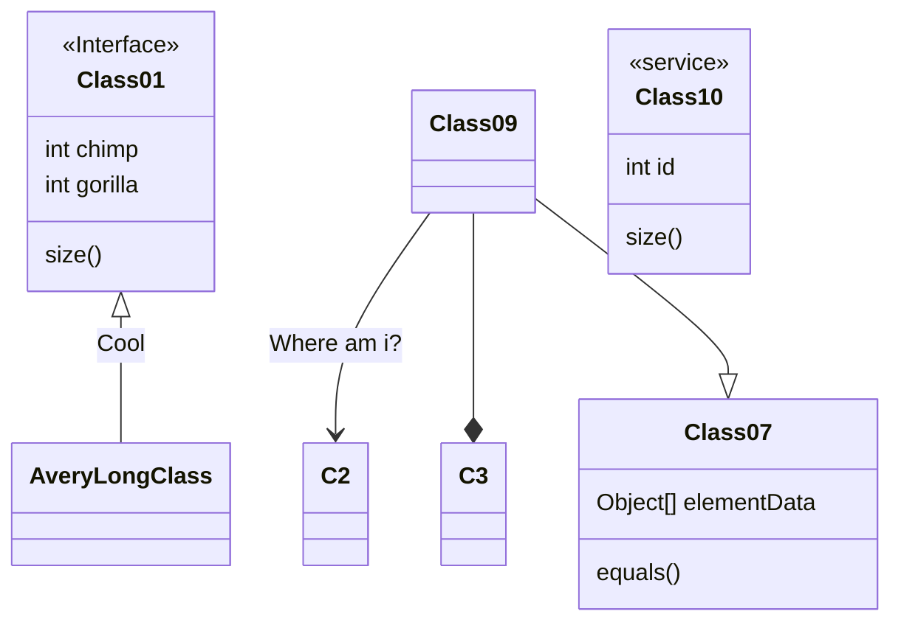
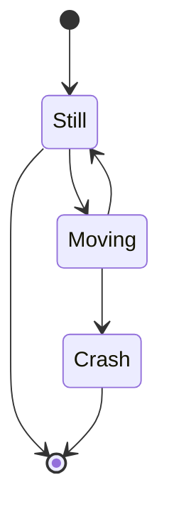
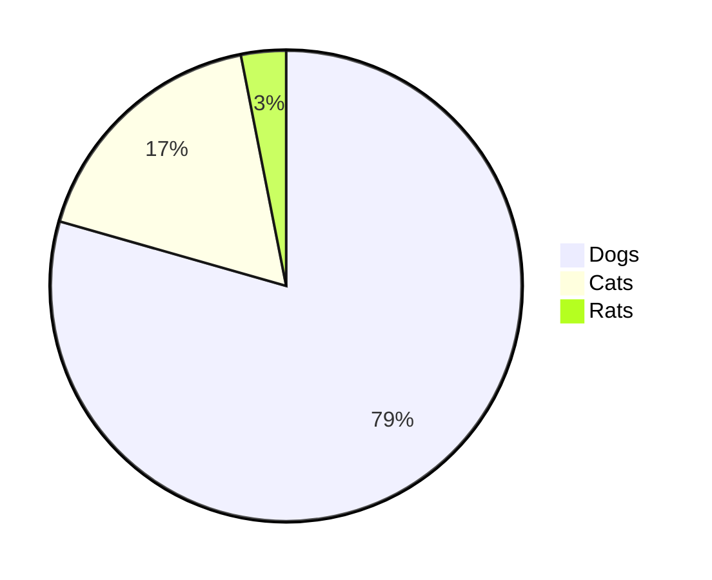
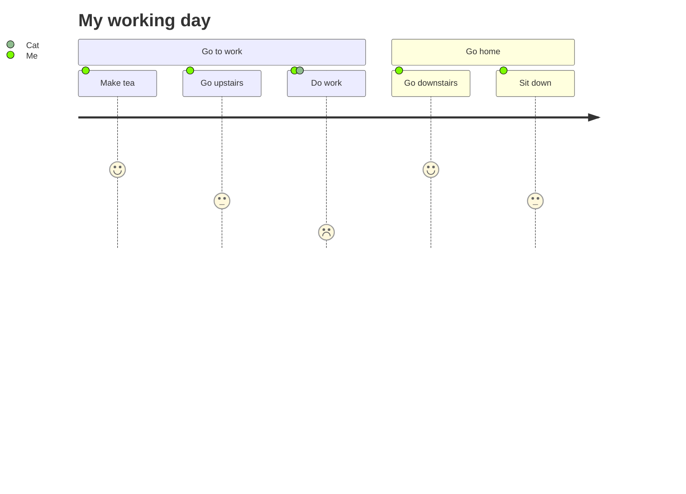

# mermaid [](https://travis-ci.org/mermaid-js/mermaid) [](https://www.npmjs.com/package/mermaid) [](https://coveralls.io/github/mermaid-js/mermaid?branch=master) [](https://join.slack.com/t/mermaid-talk/shared_invite/enQtNzc4NDIyNzk4OTAyLWVhYjQxOTI2OTg4YmE1ZmJkY2Y4MTU3ODliYmIwOTY3NDJlYjA0YjIyZTdkMDMyZTUwOGI0NjEzYmEwODcwOTE)

English | [简体中文](./README.zh-CN.md)


:trophy: **Mermaid was nominated and won the [JS Open Source Awards (2019)](https://osawards.com/javascript/2019) in the category "The most exciting use of technology"!!!**


**Thanks to all involved, people committing pull requests, people answering questions! 🙏**

<a href="https://mermaid-js.github.io/mermaid/landing/"></a>

## About

<!-- <Main description>   -->
Mermaid is a Javascript based diagramming and charting tool that uses Markdown-inspired text definitions and a renderer to create and modify complex diagrams.  The main purpose of Mermaid is to help documentation catch up with development.

> Doc-Rot is a Catch-22 that Mermaid helps to solve.

Diagramming and documentation costs precious developer time and gets outdated quickly.
But not having diagrams or docs ruins productivity and hurts organizational learning.<br/>
Mermaid addresses this problem by enabling users to create easily modifiable diagrams, it can also be made part of production scripts (and other pieces of code).<br/>
 <br/>

Mermaid allows even non-programmers to easily create detailed diagrams through the [Mermaid Live Editor](https://mermaid-js.github.io/mermaid-live-editor/).<br/>
[Tutorials](./docs/Tutorials.md) has video tutorials.
Use Mermaid with your favorite applications, check out the list of [Integrations and Usages of Mermaid](./docs/integrations.md).

You can also use Mermaid within [GitHub](https://github.blog/2022-02-14-include-diagrams-markdown-files-mermaid/) as well many of your other favorite applications, check out the list of [Integrations and Usages of Mermaid](./docs/integrations.md).

For a more detailed introduction to Mermaid and some of its more basic uses, look to the [Beginner's Guide](./docs/n00b-overview.md), [Usage](./docs/usage.md) and [Tutorials](./docs/Tutorials.md).

🌐 [CDN](https://unpkg.com/mermaid/) | 📖 [Documentation](https://mermaidjs.github.io) | 🙌 [Contribution](https://github.com/mermaid-js/mermaid/blob/develop/CONTRIBUTING.md) | 📜 [Changelog](./docs/CHANGELOG.md)


In our release process we rely heavily on visual regression tests using [applitools](https://applitools.com/). Applitools is a great service which has been easy to use and integrate with our tests.


<a href="https://applitools.com/">
<svg width="170" height="32" viewBox="0 0 170 32" fill="none" xmlns="http://www.w3.org/2000/svg"><mask id="a" maskUnits="userSpaceOnUse" x="27" y="0" width="143" height="32"><path fill-rule="evenodd" clip-rule="evenodd" d="M27.732.227h141.391v31.19H27.733V.227z" fill="#fff"></path></mask><g mask="url(#a)"><path fill-rule="evenodd" clip-rule="evenodd" d="M153.851 22.562l1.971-3.298c1.291 1.219 3.837 2.402 5.988 2.402 1.971 0 2.903-.753 2.903-1.829 0-2.832-10.253-.502-10.253-7.313 0-2.904 2.51-5.45 7.099-5.45 2.904 0 5.234 1.004 6.955 2.367l-1.829 3.226c-1.039-1.075-3.011-2.008-5.126-2.008-1.65 0-2.725.717-2.725 1.685 0 2.546 10.289.395 10.289 7.386 0 3.19-2.724 5.52-7.528 5.52-3.012 0-5.916-1.003-7.744-2.688zm-5.7 2.259h4.553V.908h-4.553v23.913zm-6.273-8.676c0-2.689-1.578-5.02-4.446-5.02-2.832 0-4.409 2.331-4.409 5.02 0 2.724 1.577 5.055 4.409 5.055 2.868 0 4.446-2.33 4.446-5.055zm-13.588 0c0-4.912 3.442-9.07 9.142-9.07 5.736 0 9.178 4.158 9.178 9.07 0 4.911-3.442 9.106-9.178 9.106-5.7 0-9.142-4.195-9.142-9.106zm-5.628 0c0-2.689-1.577-5.02-4.445-5.02-2.832 0-4.41 2.331-4.41 5.02 0 2.724 1.578 5.055 4.41 5.055 2.868 0 4.445-2.33 4.445-5.055zm-13.587 0c0-4.912 3.441-9.07 9.142-9.07 5.736 0 9.178 4.158 9.178 9.07 0 4.911-3.442 9.106-9.178 9.106-5.701 0-9.142-4.195-9.142-9.106zm-8.425 4.338v-8.999h-2.868v-3.98h2.868V2.773h4.553v4.733h3.514v3.979h-3.514v7.78c0 1.111.574 1.936 1.578 1.936.681 0 1.326-.251 1.577-.538l.968 3.478c-.681.609-1.9 1.11-3.8 1.11-3.191 0-4.876-1.648-4.876-4.767zm-8.962 4.338h4.553V7.505h-4.553V24.82zm-.43-21.905a2.685 2.685 0 012.688-2.69c1.506 0 2.725 1.184 2.725 2.69a2.724 2.724 0 01-2.725 2.724c-1.47 0-2.688-1.219-2.688-2.724zM84.482 24.82h4.553V.908h-4.553v23.913zm-6.165-8.676c0-2.976-1.793-5.02-4.41-5.02-1.47 0-3.119.825-3.908 1.973v6.094c.753 1.111 2.438 2.008 3.908 2.008 2.617 0 4.41-2.044 4.41-5.055zm-8.318 6.453v8.82h-4.553V7.504H70v2.187c1.327-1.685 3.227-2.618 5.342-2.618 4.446 0 7.672 3.299 7.672 9.07 0 5.773-3.226 9.107-7.672 9.107-2.043 0-3.907-.86-5.342-2.653zm-10.718-6.453c0-2.976-1.793-5.02-4.41-5.02-1.47 0-3.119.825-3.908 1.973v6.094c.753 1.111 2.438 2.008 3.908 2.008 2.617 0 4.41-2.044 4.41-5.055zm-8.318 6.453v8.82H46.41V7.504h4.553v2.187c1.327-1.685 3.227-2.618 5.342-2.618 4.446 0 7.672 3.299 7.672 9.07 0 5.773-3.226 9.107-7.672 9.107-2.043 0-3.908-.86-5.342-2.653zm-11.758-1.936V18.51c-.753-1.004-2.187-1.542-3.657-1.542-1.793 0-3.263.968-3.263 2.617 0 1.65 1.47 2.582 3.263 2.582 1.47 0 2.904-.502 3.657-1.506zm0 4.159v-1.829c-1.183 1.434-3.227 2.259-5.485 2.259-2.761 0-5.988-1.864-5.988-5.736 0-4.087 3.227-5.593 5.988-5.593 2.33 0 4.337.753 5.485 2.115V13.85c0-1.756-1.506-2.904-3.8-2.904-1.829 0-3.55.717-4.984 2.044L28.63 9.8c2.115-1.901 4.84-2.726 7.564-2.726 3.98 0 7.6 1.578 7.6 6.561v11.186h-4.588z" fill="#00A298"></path></g><path fill-rule="evenodd" clip-rule="evenodd" d="M14.934 16.177c0 1.287-.136 2.541-.391 3.752-1.666-1.039-3.87-2.288-6.777-3.752 2.907-1.465 5.11-2.714 6.777-3.753.255 1.211.39 2.466.39 3.753m4.6-7.666V4.486a78.064 78.064 0 01-4.336 3.567c-1.551-2.367-3.533-4.038-6.14-5.207C11.1 4.658 12.504 6.7 13.564 9.262 5.35 15.155 0 16.177 0 16.177s5.35 1.021 13.564 6.915c-1.06 2.563-2.463 4.603-4.507 6.415 2.607-1.169 4.589-2.84 6.14-5.207a77.978 77.978 0 014.336 3.568v-4.025s-.492-.82-2.846-2.492c.6-1.611.93-3.354.93-5.174a14.8 14.8 0 00-.93-5.174c2.354-1.673 2.846-2.492 2.846-2.492" fill="#00A298"></path></svg>
</a>


<!-- </Main description> -->

## Examples

__The following are some examples of the diagrams, charts and graphs that can be made using Mermaid. Click here jump into the [text syntax](https://mermaid-js.github.io/mermaid/#/n00b-syntaxReference).__
<!-- <Flowchart> -->

### Flowchart [<a href="https://mermaid-js.github.io/mermaid/#/flowchart">docs</a> - <a href="https://mermaidjs.github.io/mermaid-live-editor/#/edit/eyJjb2RlIjoiZ3JhcGggVERcbiAgICBBW0hhcmRdIC0tPnxUZXh0fCBCKFJvdW5kKVxuICAgIEIgLS0-IEN7RGVjaXNpb259XG4gICAgQyAtLT58T25lfCBEW1Jlc3VsdCAxXVxuICAgIEMgLS0-fFR3b3wgRVtSZXN1bHQgMl0iLCJtZXJtYWlkIjp7InRoZW1lIjoiZGVmYXVsdCJ9fQ">live editor</a>]

```
flowchart LR

A[Hard] -->|Text| B(Round)
B --> C{Decision}
C -->|One| D[Result 1]
C -->|Two| E[Result 2]
```



### Sequence diagram [<a href="https://mermaid-js.github.io/mermaid/#/sequenceDiagram">docs</a> - <a href="https://mermaidjs.github.io/mermaid-live-editor/#/edit/eyJjb2RlIjoic2VxdWVuY2VEaWFncmFtXG5BbGljZS0-PkpvaG46IEhlbGxvIEpvaG4sIGhvdyBhcmUgeW91P1xubG9vcCBIZWFsdGhjaGVja1xuICAgIEpvaG4tPj5Kb2huOiBGaWdodCBhZ2FpbnN0IGh5cG9jaG9uZHJpYVxuZW5kXG5Ob3RlIHJpZ2h0IG9mIEpvaG46IFJhdGlvbmFsIHRob3VnaHRzIVxuSm9obi0tPj5BbGljZTogR3JlYXQhXG5Kb2huLT4-Qm9iOiBIb3cgYWJvdXQgeW91P1xuQm9iLS0-PkpvaG46IEpvbGx5IGdvb2QhIiwibWVybWFpZCI6eyJ0aGVtZSI6ImRlZmF1bHQifX0">live editor</a>]

```
sequenceDiagram
Alice->>John: Hello John, how are you?
loop Healthcheck
    John->>John: Fight against hypochondria
end
Note right of John: Rational thoughts!
John-->>Alice: Great!
John->>Bob: How about you?
Bob-->>John: Jolly good!
```


### Gantt chart [<a href="https://mermaid-js.github.io/mermaid/#/gantt">docs</a> - <a href="https://mermaidjs.github.io/mermaid-live-editor/#/edit/eyJjb2RlIjoiZ2FudHRcbnNlY3Rpb24gU2VjdGlvblxuQ29tcGxldGVkIDpkb25lLCAgICBkZXMxLCAyMDE0LTAxLTA2LDIwMTQtMDEtMDhcbkFjdGl2ZSAgICAgICAgOmFjdGl2ZSwgIGRlczIsIDIwMTQtMDEtMDcsIDNkXG5QYXJhbGxlbCAxICAgOiAgICAgICAgIGRlczMsIGFmdGVyIGRlczEsIDFkXG5QYXJhbGxlbCAyICAgOiAgICAgICAgIGRlczQsIGFmdGVyIGRlczEsIDFkXG5QYXJhbGxlbCAzICAgOiAgICAgICAgIGRlczUsIGFmdGVyIGRlczMsIDFkXG5QYXJhbGxlbCA0ICAgOiAgICAgICAgIGRlczYsIGFmdGVyIGRlczQsIDFkIiwibWVybWFpZCI6eyJ0aGVtZSI6ImRlZmF1bHQifX0">live editor</a>]

```
gantt
    section Section
    Completed :done,    des1, 2014-01-06,2014-01-08
    Active        :active,  des2, 2014-01-07, 3d
    Parallel 1   :         des3, after des1, 1d
    Parallel 2   :         des4, after des1, 1d
    Parallel 3   :         des5, after des3, 1d
    Parallel 4   :         des6, after des4, 1d
```


### Class diagram [<a href="https://mermaid-js.github.io/mermaid/#/classDiagram">docs</a> - <a href="https://mermaidjs.github.io/mermaid-live-editor/#/edit/eyJjb2RlIjoiY2xhc3NEaWFncmFtXG5DbGFzczAxIDx8LS0gQXZlcnlMb25nQ2xhc3MgOiBDb29sXG48PGludGVyZmFjZT4-IENsYXNzMDFcbkNsYXNzMDkgLS0-IEMyIDogV2hlcmUgYW0gaT9cbkNsYXNzMDkgLS0qIEMzXG5DbGFzczA5IC0tfD4gQ2xhc3MwN1xuQ2xhc3MwNyA6IGVxdWFscygpXG5DbGFzczA3IDogT2JqZWN0W10gZWxlbWVudERhdGFcbkNsYXNzMDEgOiBzaXplKClcbkNsYXNzMDEgOiBpbnQgY2hpbXBcbkNsYXNzMDEgOiBpbnQgZ29yaWxsYVxuY2xhc3MgQ2xhc3MxMCB7XG4gID4-c2VydmljZT4-XG4gIGludCBpZFxuICBzaXplKClcbn0iLCJtZXJtYWlkIjp7InRoZW1lIjoiZGVmYXVsdCJ9fQ">live editor</a>]

```
classDiagram
Class01 <|-- AveryLongClass : Cool
<<Interface>> Class01
Class09 --> C2 : Where am i?
Class09 --* C3
Class09 --|> Class07
Class07 : equals()
Class07 : Object[] elementData
Class01 : size()
Class01 : int chimp
Class01 : int gorilla
class Class10 {
  <<service>>
  int id
  size()
}
```


### State diagram [<a href="https://mermaid-js.github.io/mermaid/#/stateDiagram">docs</a> - <a href="https://mermaid-js.github.io/mermaid-live-editor/#/edit/eyJjb2RlIjoic3RhdGVEaWFncmFtLXYyXG4gICAgWypdIC0tPiBTdGlsbFxuICAgIFN0aWxsIC0tPiBbKl1cbiAgICBTdGlsbCAtLT4gTW92aW5nXG4gICAgTW92aW5nIC0tPiBTdGlsbFxuICAgIE1vdmluZyAtLT4gQ3Jhc2hcbiAgICBDcmFzaCAtLT4gWypdIiwibWVybWFpZCI6eyJ0aGVtZSI6ImRlZmF1bHQiLCJ0aGVtZVZhcmlhYmxlcyI6eyJiYWNrZ3JvdW5kIjoid2hpdGUiLCJwcmltYXJ5Q29sb3IiOiIjRUNFQ0ZGIiwic2Vjb25kYXJ5Q29sb3IiOiIjZmZmZmRlIiwidGVydGlhcnlDb2xvciI6ImhzbCg4MCwgMTAwJSwgOTYuMjc0NTA5ODAzOSUpIiwicHJpbWFyeUJvcmRlckNvbG9yIjoiaHNsKDI0MCwgNjAlLCA4Ni4yNzQ1MDk4MDM5JSkiLCJzZWNvbmRhcnlCb3JkZXJDb2xvciI6ImhzbCg2MCwgNjAlLCA4My41Mjk0MTE3NjQ3JSkiLCJ0ZXJ0aWFyeUJvcmRlckNvbG9yIjoiaHNsKDgwLCA2MCUsIDg2LjI3NDUwOTgwMzklKSIsInByaW1hcnlUZXh0Q29sb3IiOiIjMTMxMzAwIiwic2Vjb25kYXJ5VGV4dENvbG9yIjoiIzAwMDAyMSIsInRlcnRpYXJ5VGV4dENvbG9yIjoicmdiKDkuNTAwMDAwMDAwMSwgOS41MDAwMDAwMDAxLCA5LjUwMDAwMDAwMDEpIiwibGluZUNvbG9yIjoiIzMzMzMzMyIsInRleHRDb2xvciI6IiMzMzMiLCJtYWluQmtnIjoiI0VDRUNGRiIsInNlY29uZEJrZyI6IiNmZmZmZGUiLCJib3JkZXIxIjoiIzkzNzBEQiIsImJvcmRlcjIiOiIjYWFhYTMzIiwiYXJyb3doZWFkQ29sb3IiOiIjMzMzMzMzIiwiZm9udEZhbWlseSI6IlwidHJlYnVjaGV0IG1zXCIsIHZlcmRhbmEsIGFyaWFsIiwiZm9udFNpemUiOiIxNnB4IiwibGFiZWxCYWNrZ3JvdW5kIjoiI2U4ZThlOCIsIm5vZGVCa2ciOiIjRUNFQ0ZGIiwibm9kZUJvcmRlciI6IiM5MzcwREIiLCJjbHVzdGVyQmtnIjoiI2ZmZmZkZSIsImNsdXN0ZXJCb3JkZXIiOiIjYWFhYTMzIiwiZGVmYXVsdExpbmtDb2xvciI6IiMzMzMzMzMiLCJ0aXRsZUNvbG9yIjoiIzMzMyIsImVkZ2VMYWJlbEJhY2tncm91bmQiOiIjZThlOGU4IiwiYWN0b3JCb3JkZXIiOiJoc2woMjU5LjYyNjE2ODIyNDMsIDU5Ljc3NjUzNjMxMjglLCA4Ny45MDE5NjA3ODQzJSkiLCJhY3RvckJrZyI6IiNFQ0VDRkYiLCJhY3RvclRleHRDb2xvciI6ImJsYWNrIiwiYWN0b3JMaW5lQ29sb3IiOiJncmV5Iiwic2lnbmFsQ29sb3IiOiIjMzMzIiwic2lnbmFsVGV4dENvbG9yIjoiIzMzMyIsImxhYmVsQm94QmtnQ29sb3IiOiIjRUNFQ0ZGIiwibGFiZWxCb3hCb3JkZXJDb2xvciI6ImhzbCgyNTkuNjI2MTY4MjI0MywgNTkuNzc2NTM2MzEyOCUsIDg3LjkwMTk2MDc4NDMlKSIsImxhYmVsVGV4dENvbG9yIjoiYmxhY2siLCJsb29wVGV4dENvbG9yIjoiYmxhY2siLCJub3RlQm9yZGVyQ29sb3IiOiIjYWFhYTMzIiwibm90ZUJrZ0NvbG9yIjoiI2ZmZjVhZCIsIm5vdGVUZXh0Q29sb3IiOiJibGFjayIsImFjdGl2YXRpb25Cb3JkZXJDb2xvciI6IiM2NjYiLCJhY3RpdmF0aW9uQmtnQ29sb3IiOiIjZjRmNGY0Iiwic2VxdWVuY2VOdW1iZXJDb2xvciI6IndoaXRlIiwic2VjdGlvbkJrZ0NvbG9yIjoicmdiYSgxMDIsIDEwMiwgMjU1LCAwLjQ5KSIsImFsdFNlY3Rpb25Ca2dDb2xvciI6IndoaXRlIiwic2VjdGlvbkJrZ0NvbG9yMiI6IiNmZmY0MDAiLCJ0YXNrQm9yZGVyQ29sb3IiOiIjNTM0ZmJjIiwidGFza0JrZ0NvbG9yIjoiIzhhOTBkZCIsInRhc2tUZXh0TGlnaHRDb2xvciI6IndoaXRlIiwidGFza1RleHRDb2xvciI6IndoaXRlIiwidGFza1RleHREYXJrQ29sb3IiOiJibGFjayIsInRhc2tUZXh0T3V0c2lkZUNvbG9yIjoiYmxhY2siLCJ0YXNrVGV4dENsaWNrYWJsZUNvbG9yIjoiIzAwMzE2MyIsImFjdGl2ZVRhc2tCb3JkZXJDb2xvciI6IiM1MzRmYmMiLCJhY3RpdmVUYXNrQmtnQ29sb3IiOiIjYmZjN2ZmIiwiZ3JpZENvbG9yIjoibGlnaHRncmV5IiwiZG9uZVRhc2tCa2dDb2xvciI6ImxpZ2h0Z3JleSIsImRvbmVUYXNrQm9yZGVyQ29sb3IiOiJncmV5IiwiY3JpdEJvcmRlckNvbG9yIjoiI2ZmODg4OCIsImNyaXRCa2dDb2xvciI6InJlZCIsInRvZGF5TGluZUNvbG9yIjoicmVkIiwibGFiZWxDb2xvciI6ImJsYWNrIiwiZXJyb3JCa2dDb2xvciI6IiM1NTIyMjIiLCJlcnJvclRleHRDb2xvciI6IiM1NTIyMjIiLCJjbGFzc1RleHQiOiIjMTMxMzAwIiwiZmlsbFR5cGUwIjoiI0VDRUNGRiIsImZpbGxUeXBlMSI6IiNmZmZmZGUiLCJmaWxsVHlwZTIiOiJoc2woMzA0LCAxMDAlLCA5Ni4yNzQ1MDk4MDM5JSkiLCJmaWxsVHlwZTMiOiJoc2woMTI0LCAxMDAlLCA5My41Mjk0MTE3NjQ3JSkiLCJmaWxsVHlwZTQiOiJoc2woMTc2LCAxMDAlLCA5Ni4yNzQ1MDk4MDM5JSkiLCJmaWxsVHlwZTUiOiJoc2woLTQsIDEwMCUsIDkzLjUyOTQxMTc2NDclKSIsImZpbGxUeXBlNiI6ImhzbCg4LCAxMDAlLCA5Ni4yNzQ1MDk4MDM5JSkiLCJmaWxsVHlwZTciOiJoc2woMTg4LCAxMDAlLCA5My41Mjk0MTE3NjQ3JSkifX0sInVwZGF0ZUVkaXRvciI6ZmFsc2V9">live editor</a>]
```
stateDiagram-v2
[*] --> Still
Still --> [*]
Still --> Moving
Moving --> Still
Moving --> Crash
Crash --> [*]
```


### Pie chart [<a href="https://mermaid-js.github.io/mermaid/#/pie">docs</a> - <a href="https://mermaidjs.github.io/mermaid-live-editor/#/edit/eyJjb2RlIjoicGllXG5cIkRvZ3NcIiA6IDQyLjk2XG5cIkNhdHNcIiA6IDUwLjA1XG5cIlJhdHNcIiA6IDEwLjAxIiwibWVybWFpZCI6eyJ0aGVtZSI6ImRlZmF1bHQifX0">live editor</a>]

```
pie
"Dogs" : 386
"Cats" : 85
"Rats" : 15
```


### Git graph [experimental - <a href="https://mermaidjs.github.io/mermaid-live-editor/#/edit/eyJjb2RlIjoiZ2l0R3JhcGg6XG5vcHRpb25zXG57XG4gICAgXCJub2RlU3BhY2luZ1wiOiAxNTAsXG4gICAgXCJub2RlUmFkaXVzXCI6IDEwXG59XG5lbmRcbmNvbW1pdFxuYnJhbmNoIG5ld2JyYW5jaFxuY2hlY2tvdXQgbmV3YnJhbmNoXG5jb21taXRcbmNvbW1pdFxuY2hlY2tvdXQgbWFzdGVyXG5jb21taXRcbmNvbW1pdFxubWVyZ2UgbmV3YnJhbmNoXG4iLCJtZXJtYWlkIjp7InRoZW1lIjoiZGVmYXVsdCJ9fQ">live editor</a>]

### User Journey diagram [<a href="https://mermaid-js.github.io/mermaid/#/user-journey">docs</a> - <a href="https://mermaidjs.github.io/mermaid-live-editor/#/edit/eyJjb2RlIjoic3RhdGVEaWFncmFtXG4gICAgWypdIC0tPiBTdGlsbFxuICAgIFN0aWxsIC0tPiBbKl1cbiAgICBTdGlsbCAtLT4gTW92aW5nXG4gICAgTW92aW5nIC0tPiBTdGlsbFxuICAgIE1vdmluZyAtLT4gQ3Jhc2hcbiAgICBDcmFzaCAtLT4gWypdIiwibWVybWFpZCI6eyJ0aGVtZSI6ImRlZmF1bHQifX0">live editor</a>]
```
  journey
    title My working day
    section Go to work
      Make tea: 5: Me
      Go upstairs: 3: Me
      Do work: 1: Me, Cat
    section Go home
      Go downstairs: 5: Me
      Sit down: 3: Me
```


## Release

For those who have the permission to do so:

Update version number in `package.json`.

```sh
npm publish
```

The above command generates files into the `dist` folder and publishes them to npmjs.org.

## Related projects

- [Command Line Interface](https://github.com/mermaid-js/mermaid-cli)
- [Live Editor](https://github.com/mermaid-js/mermaid-live-editor)
- [HTTP Server](https://github.com/TomWright/mermaid-server)

## Contributors [](https://github.com/mermaid-js/mermaid/issues?q=is%3Aissue+is%3Aopen+label%3A%22Good+first+issue%21%22) [](https://github.com/mermaid-js/mermaid/graphs/contributors) [](https://github.com/mermaid-js/mermaid/graphs/contributors)

Mermaid is a growing community and is always accepting new contributors. There's a lot of different ways to help out and we're always looking for extra hands! Look at [this issue](https://github.com/mermaid-js/mermaid/issues/866) if you want to know where to start helping out.

Detailed information about how to contribute can be found in the [contribution guide](CONTRIBUTING.md)

## Security and safe diagrams

For public sites, it can be precarious to retrieve text from users on the internet, storing that content for presentation in a browser at a later stage. The reason is that the user content can contain embedded malicious scripts that will run when the data is presented. For Mermaid this is a risk, specially as mermaid diagrams contain many characters that are used in html which makes the standard sanitation unusable as it also breaks the diagrams. We still make an effort to sanitise the incoming code and keep refining the process but  it is hard to guarantee that there are no loop holes.

As an extra level of security for sites with external users we are happy to introduce a new security level in which the diagram is rendered in a sandboxed iframe preventing javascript in the code from  being executed. This is a great step forward for better security.

*Unfortunately you can not have a cake and eat it at the same time which in this case means that some of the interactive functionality gets blocked along with the possible malicious code.*

## Reporting vulnerabilities
To report a vulnerability, please e-mail security@mermaid.live with a description of the issue, the steps you took to create the issue, affected versions, and if known, mitigations for the issue.

## Appreciation
A quick note from Knut Sveidqvist:
>*Many thanks to the [d3](https://d3js.org/) and [dagre-d3](https://github.com/cpettitt/dagre-d3) projects for providing the graphical layout and drawing libraries!*
>*Thanks also to the [js-sequence-diagram](https://bramp.github.io/js-sequence-diagrams) project for usage of the grammar for the sequence diagrams. Thanks to Jessica Peter for inspiration and starting point for gantt rendering.*
>*Thank you to [Tyler Long](https://github.com/tylerlong) who has been a collaborator since April 2017.*
>
>*Thank you to the ever-growing list of [contributors](https://github.com/knsv/mermaid/graphs/contributors) that brought the project this far!*

---

*Mermaid was created by Knut Sveidqvist for easier documentation.*
