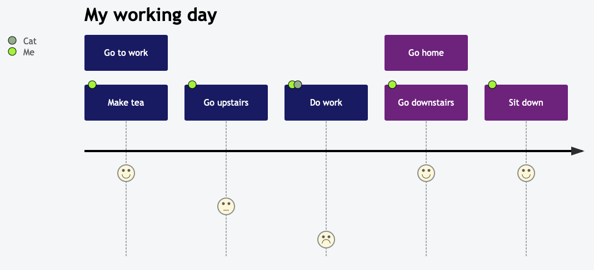

# mermaid     

[English](./README.md) | 简体中文

:trophy: **Mermaid 被提名并获得了 [JS Open Source Awards (2019)](https://osawards.com/javascript/2019) 的 "The most exciting use of technology" 奖项!!!**

**感谢所有参与进来提交 PR，解答疑问的人们! 🙏**

## 关于 Mermaid

<!-- <Main description>   -->
Mermaid 是一个基于 Javascript 的图表绘制工具，通过解析类 Markdown 的文本语法来实现图表的创建和动态修改。Mermaid 诞生的主要目的是让文档的更新能够及时跟上开发进度。

> Mermaid 致力于解决 Doc-Rot 这个令人头疼的问题。

绘图和编写文档花费了开发者宝贵的开发时间，而且随着业务的变更，它很快就会过期。 但是如果缺少了图表或文档，对于生产力和团队新人的业务学习都会产生巨大的阻碍。  
Mermaid 通过减少创建可修改的图表所需要的时间、精力和工具来解决这一难题，从而提高了内容的智能化和可重用性。 作为一个基于文本的绘图工具， Mermaid 天生就易于维护和更新，它也可以作为生产脚本（或其他代码）的一部分，使得文档编写变得更加简单。 有了它之后，开发者可以从维护文档这个与开发割离且麻烦的任务中解放出来。  
即使是从未接触过编程的非专业人员也可以通过 [Mermaid Live Editor](https://mermaid-js.github.io/mermaid-live-editor/)来创建图表。 
你可以访问 [教程](./docs/Tutorials.md) 来查看 Live Editor 的视频教程。
U也可以查看 [Mermaid 的集成和使用](./docs/integrations.md) 这个清单来检查你的文档工具是否已经集成了 Mermaid 支持。

如果想要查看关于 Mermaid 更详细的介绍及基础使用方式，可以查看 [入门指引](./docs/n00b-overview.md) and [用法](./docs/usage.md).

🌐 [CDN](https://unpkg.com/mermaid/) | 📖 [文档](https://mermaidjs.github.io) | 🙌 [贡献](https://github.com/mermaid-js/mermaid/blob/develop/CONTRIBUTING.md) | 📜 [更新日志](./docs/CHANGELOG.md)

<!-- </Main description> -->

## 示例

__下面是一些使用 Mermaid 和类 Markdown 语法创建的图表示例。点击 [语法](https://mermaid-js.github.io/mermaid/#/n00b-syntaxReference) 查看详情__
<table>
<!-- <Flowchart> -->
<tr><td colspan=2 align="center">
    <b>流程图</b> 
    [<a href="http://mermaid-js.github.io/mermaid/#/flowchart">文档</a> - <a href="https://mermaidjs.github.io/mermaid-live-editor/#/edit/eyJjb2RlIjoiZ3JhcGggVERcbiAgICBBW0hhcmRdIC0tPnxUZXh0fCBCKFJvdW5kKVxuICAgIEIgLS0-IEN7RGVjaXNpb259XG4gICAgQyAtLT58T25lfCBEW1Jlc3VsdCAxXVxuICAgIEMgLS0-fFR3b3wgRVtSZXN1bHQgMl0iLCJtZXJtYWlkIjp7InRoZW1lIjoiZGVmYXVsdCJ9fQ">live editor</a>]
</td></tr>
<tr>
    <td><pre>
graph TD
A[Hard] -->|Text| B(Round)
B --> C{Decision}
C -->|One| D[Result 1]
C -->|Two| E[Result 2]
    </pre></td>
    <td align="center">
        
    </td>
</tr>
<!-- </Flowchart> -->
<!-- <Sequence> -->
<tr><td colspan=2 align="center">
    <b>时序图</b> 
    [<a href="http://mermaid-js.github.io/mermaid/#/sequenceDiagram">文档</a> - <a href="https://mermaidjs.github.io/mermaid-live-editor/#/edit/eyJjb2RlIjoic2VxdWVuY2VEaWFncmFtXG5BbGljZS0-PkpvaG46IEhlbGxvIEpvaG4sIGhvdyBhcmUgeW91P1xubG9vcCBIZWFsdGhjaGVja1xuICAgIEpvaG4tPj5Kb2huOiBGaWdodCBhZ2FpbnN0IGh5cG9jaG9uZHJpYVxuZW5kXG5Ob3RlIHJpZ2h0IG9mIEpvaG46IFJhdGlvbmFsIHRob3VnaHRzIVxuSm9obi0tPj5BbGljZTogR3JlYXQhXG5Kb2huLT4-Qm9iOiBIb3cgYWJvdXQgeW91P1xuQm9iLS0-PkpvaG46IEpvbGx5IGdvb2QhIiwibWVybWFpZCI6eyJ0aGVtZSI6ImRlZmF1bHQifX0">live editor</a>]
</td></tr>
<tr>
    <td><pre>
sequenceDiagram
Alice->>John: Hello John, how are you?
loop Healthcheck
    John->>John: Fight against hypochondria
end
Note right of John: Rational thoughts!
John-->>Alice: Great!
John->>Bob: How about you?
Bob-->>John: Jolly good!
    </pre></td>
    <td align="center">
        
    </td>
</tr>
<!-- </Sequence> -->
<!-- <Gantt> -->
<tr><td colspan=2 align="center">
    <b>甘特图</b> 
    [<a href="http://mermaid-js.github.io/mermaid/#/gantt">文档</a> - <a href="https://mermaidjs.github.io/mermaid-live-editor/#/edit/eyJjb2RlIjoiZ2FudHRcbnNlY3Rpb24gU2VjdGlvblxuQ29tcGxldGVkIDpkb25lLCAgICBkZXMxLCAyMDE0LTAxLTA2LDIwMTQtMDEtMDhcbkFjdGl2ZSAgICAgICAgOmFjdGl2ZSwgIGRlczIsIDIwMTQtMDEtMDcsIDNkXG5QYXJhbGxlbCAxICAgOiAgICAgICAgIGRlczMsIGFmdGVyIGRlczEsIDFkXG5QYXJhbGxlbCAyICAgOiAgICAgICAgIGRlczQsIGFmdGVyIGRlczEsIDFkXG5QYXJhbGxlbCAzICAgOiAgICAgICAgIGRlczUsIGFmdGVyIGRlczMsIDFkXG5QYXJhbGxlbCA0ICAgOiAgICAgICAgIGRlczYsIGFmdGVyIGRlczQsIDFkIiwibWVybWFpZCI6eyJ0aGVtZSI6ImRlZmF1bHQifX0">live editor</a>]
</td></tr>
<tr>
    <td><pre>
gantt
section Section
Completed :done,    des1, 2014-01-06,2014-01-08
Active        :active,  des2, 2014-01-07, 3d
Parallel 1   :         des3, after des1, 1d
Parallel 2   :         des4, after des1, 1d
Parallel 3   :         des5, after des3, 1d
Parallel 4   :         des6, after des4, 1d
    </pre></td>
    <td align="center">
        
    </td>
</tr>
<!-- </Gantt> -->
<!-- <Class> -->
<tr><td colspan=2 align="center">
    <b>类图</b> 
    [<a href="http://mermaid-js.github.io/mermaid/#/classDiagram">文档</a> - <a href="https://mermaidjs.github.io/mermaid-live-editor/#/edit/eyJjb2RlIjoiY2xhc3NEaWFncmFtXG5DbGFzczAxIDx8LS0gQXZlcnlMb25nQ2xhc3MgOiBDb29sXG48PGludGVyZmFjZT4-IENsYXNzMDFcbkNsYXNzMDkgLS0-IEMyIDogV2hlcmUgYW0gaT9cbkNsYXNzMDkgLS0qIEMzXG5DbGFzczA5IC0tfD4gQ2xhc3MwN1xuQ2xhc3MwNyA6IGVxdWFscygpXG5DbGFzczA3IDogT2JqZWN0W10gZWxlbWVudERhdGFcbkNsYXNzMDEgOiBzaXplKClcbkNsYXNzMDEgOiBpbnQgY2hpbXBcbkNsYXNzMDEgOiBpbnQgZ29yaWxsYVxuY2xhc3MgQ2xhc3MxMCB7XG4gID4-c2VydmljZT4-XG4gIGludCBpZFxuICBzaXplKClcbn0iLCJtZXJtYWlkIjp7InRoZW1lIjoiZGVmYXVsdCJ9fQ">live editor</a>]
</td></tr>
<tr>
    <td><pre>
classDiagram
Class01 &lt;|-- AveryLongClass : Cool
&lt;&lt;interface>> Class01
Class09 --> C2 : Where am i?
Class09 --* C3
Class09 --|> Class07
Class07 : equals()
Class07 : Object[] elementData
Class01 : size()
Class01 : int chimp
Class01 : int gorilla
class Class10 {
  &lt;&lt;service>>
  int id
  size()
}
</pre></td>
    <td align="center">
        
    </td>
</tr>
<!-- </Class> -->
<!-- <State> -->
<tr><td colspan=2 align="center">
    <b>状态图</b> 
    [<a href="http://mermaid-js.github.io/mermaid/#/stateDiagram">文档</a> - <a href="https://mermaid-js.github.io/mermaid-live-editor/#/edit/eyJjb2RlIjoic3RhdGVEaWFncmFtLXYyXG4gICAgWypdIC0tPiBTdGlsbFxuICAgIFN0aWxsIC0tPiBbKl1cbiAgICBTdGlsbCAtLT4gTW92aW5nXG4gICAgTW92aW5nIC0tPiBTdGlsbFxuICAgIE1vdmluZyAtLT4gQ3Jhc2hcbiAgICBDcmFzaCAtLT4gWypdIiwibWVybWFpZCI6eyJ0aGVtZSI6ImRlZmF1bHQiLCJ0aGVtZVZhcmlhYmxlcyI6eyJiYWNrZ3JvdW5kIjoid2hpdGUiLCJwcmltYXJ5Q29sb3IiOiIjRUNFQ0ZGIiwic2Vjb25kYXJ5Q29sb3IiOiIjZmZmZmRlIiwidGVydGlhcnlDb2xvciI6ImhzbCg4MCwgMTAwJSwgOTYuMjc0NTA5ODAzOSUpIiwicHJpbWFyeUJvcmRlckNvbG9yIjoiaHNsKDI0MCwgNjAlLCA4Ni4yNzQ1MDk4MDM5JSkiLCJzZWNvbmRhcnlCb3JkZXJDb2xvciI6ImhzbCg2MCwgNjAlLCA4My41Mjk0MTE3NjQ3JSkiLCJ0ZXJ0aWFyeUJvcmRlckNvbG9yIjoiaHNsKDgwLCA2MCUsIDg2LjI3NDUwOTgwMzklKSIsInByaW1hcnlUZXh0Q29sb3IiOiIjMTMxMzAwIiwic2Vjb25kYXJ5VGV4dENvbG9yIjoiIzAwMDAyMSIsInRlcnRpYXJ5VGV4dENvbG9yIjoicmdiKDkuNTAwMDAwMDAwMSwgOS41MDAwMDAwMDAxLCA5LjUwMDAwMDAwMDEpIiwibGluZUNvbG9yIjoiIzMzMzMzMyIsInRleHRDb2xvciI6IiMzMzMiLCJtYWluQmtnIjoiI0VDRUNGRiIsInNlY29uZEJrZyI6IiNmZmZmZGUiLCJib3JkZXIxIjoiIzkzNzBEQiIsImJvcmRlcjIiOiIjYWFhYTMzIiwiYXJyb3doZWFkQ29sb3IiOiIjMzMzMzMzIiwiZm9udEZhbWlseSI6IlwidHJlYnVjaGV0IG1zXCIsIHZlcmRhbmEsIGFyaWFsIiwiZm9udFNpemUiOiIxNnB4IiwibGFiZWxCYWNrZ3JvdW5kIjoiI2U4ZThlOCIsIm5vZGVCa2ciOiIjRUNFQ0ZGIiwibm9kZUJvcmRlciI6IiM5MzcwREIiLCJjbHVzdGVyQmtnIjoiI2ZmZmZkZSIsImNsdXN0ZXJCb3JkZXIiOiIjYWFhYTMzIiwiZGVmYXVsdExpbmtDb2xvciI6IiMzMzMzMzMiLCJ0aXRsZUNvbG9yIjoiIzMzMyIsImVkZ2VMYWJlbEJhY2tncm91bmQiOiIjZThlOGU4IiwiYWN0b3JCb3JkZXIiOiJoc2woMjU5LjYyNjE2ODIyNDMsIDU5Ljc3NjUzNjMxMjglLCA4Ny45MDE5NjA3ODQzJSkiLCJhY3RvckJrZyI6IiNFQ0VDRkYiLCJhY3RvclRleHRDb2xvciI6ImJsYWNrIiwiYWN0b3JMaW5lQ29sb3IiOiJncmV5Iiwic2lnbmFsQ29sb3IiOiIjMzMzIiwic2lnbmFsVGV4dENvbG9yIjoiIzMzMyIsImxhYmVsQm94QmtnQ29sb3IiOiIjRUNFQ0ZGIiwibGFiZWxCb3hCb3JkZXJDb2xvciI6ImhzbCgyNTkuNjI2MTY4MjI0MywgNTkuNzc2NTM2MzEyOCUsIDg3LjkwMTk2MDc4NDMlKSIsImxhYmVsVGV4dENvbG9yIjoiYmxhY2siLCJsb29wVGV4dENvbG9yIjoiYmxhY2siLCJub3RlQm9yZGVyQ29sb3IiOiIjYWFhYTMzIiwibm90ZUJrZ0NvbG9yIjoiI2ZmZjVhZCIsIm5vdGVUZXh0Q29sb3IiOiJibGFjayIsImFjdGl2YXRpb25Cb3JkZXJDb2xvciI6IiM2NjYiLCJhY3RpdmF0aW9uQmtnQ29sb3IiOiIjZjRmNGY0Iiwic2VxdWVuY2VOdW1iZXJDb2xvciI6IndoaXRlIiwic2VjdGlvbkJrZ0NvbG9yIjoicmdiYSgxMDIsIDEwMiwgMjU1LCAwLjQ5KSIsImFsdFNlY3Rpb25Ca2dDb2xvciI6IndoaXRlIiwic2VjdGlvbkJrZ0NvbG9yMiI6IiNmZmY0MDAiLCJ0YXNrQm9yZGVyQ29sb3IiOiIjNTM0ZmJjIiwidGFza0JrZ0NvbG9yIjoiIzhhOTBkZCIsInRhc2tUZXh0TGlnaHRDb2xvciI6IndoaXRlIiwidGFza1RleHRDb2xvciI6IndoaXRlIiwidGFza1RleHREYXJrQ29sb3IiOiJibGFjayIsInRhc2tUZXh0T3V0c2lkZUNvbG9yIjoiYmxhY2siLCJ0YXNrVGV4dENsaWNrYWJsZUNvbG9yIjoiIzAwMzE2MyIsImFjdGl2ZVRhc2tCb3JkZXJDb2xvciI6IiM1MzRmYmMiLCJhY3RpdmVUYXNrQmtnQ29sb3IiOiIjYmZjN2ZmIiwiZ3JpZENvbG9yIjoibGlnaHRncmV5IiwiZG9uZVRhc2tCa2dDb2xvciI6ImxpZ2h0Z3JleSIsImRvbmVUYXNrQm9yZGVyQ29sb3IiOiJncmV5IiwiY3JpdEJvcmRlckNvbG9yIjoiI2ZmODg4OCIsImNyaXRCa2dDb2xvciI6InJlZCIsInRvZGF5TGluZUNvbG9yIjoicmVkIiwibGFiZWxDb2xvciI6ImJsYWNrIiwiZXJyb3JCa2dDb2xvciI6IiM1NTIyMjIiLCJlcnJvclRleHRDb2xvciI6IiM1NTIyMjIiLCJjbGFzc1RleHQiOiIjMTMxMzAwIiwiZmlsbFR5cGUwIjoiI0VDRUNGRiIsImZpbGxUeXBlMSI6IiNmZmZmZGUiLCJmaWxsVHlwZTIiOiJoc2woMzA0LCAxMDAlLCA5Ni4yNzQ1MDk4MDM5JSkiLCJmaWxsVHlwZTMiOiJoc2woMTI0LCAxMDAlLCA5My41Mjk0MTE3NjQ3JSkiLCJmaWxsVHlwZTQiOiJoc2woMTc2LCAxMDAlLCA5Ni4yNzQ1MDk4MDM5JSkiLCJmaWxsVHlwZTUiOiJoc2woLTQsIDEwMCUsIDkzLjUyOTQxMTc2NDclKSIsImZpbGxUeXBlNiI6ImhzbCg4LCAxMDAlLCA5Ni4yNzQ1MDk4MDM5JSkiLCJmaWxsVHlwZTciOiJoc2woMTg4LCAxMDAlLCA5My41Mjk0MTE3NjQ3JSkifX0sInVwZGF0ZUVkaXRvciI6ZmFsc2V9">live editor</a>]
</td></tr>
<tr>
    <td><pre>
stateDiagram-v2
[*] --> Still
Still --> [*]
Still --> Moving
Moving --> Still
Moving --> Crash
Crash --> [*]
</pre></td>
    <td align="center">
        
    </td>
</tr>
<!-- </State> -->
<!-- <Pie> -->
<tr><td colspan=2 align="center">
    <b>饼图</b> 
    [<a href="http://mermaid-js.github.io/mermaid/#/pie">文档</a> - <a href="https://mermaidjs.github.io/mermaid-live-editor/#/edit/eyJjb2RlIjoicGllXG5cIkRvZ3NcIiA6IDQyLjk2XG5cIkNhdHNcIiA6IDUwLjA1XG5cIlJhdHNcIiA6IDEwLjAxIiwibWVybWFpZCI6eyJ0aGVtZSI6ImRlZmF1bHQifX0">live editor</a>]
</td></tr>
<tr>
    <td><pre>
pie
"Dogs" : 386
"Cats" : 85
"Rats" : 15
</pre></td>
    <td align="center">
        
    </td>
</tr>
<!-- </Pie> -->
<!-- <Git> -->
<tr><td colspan=2 align="center">
    <b>Git图</b> 
    [实验特性 - <a href="https://mermaidjs.github.io/mermaid-live-editor/#/edit/eyJjb2RlIjoiZ2l0R3JhcGg6XG5vcHRpb25zXG57XG4gICAgXCJub2RlU3BhY2luZ1wiOiAxNTAsXG4gICAgXCJub2RlUmFkaXVzXCI6IDEwXG59XG5lbmRcbmNvbW1pdFxuYnJhbmNoIG5ld2JyYW5jaFxuY2hlY2tvdXQgbmV3YnJhbmNoXG5jb21taXRcbmNvbW1pdFxuY2hlY2tvdXQgbWFzdGVyXG5jb21taXRcbmNvbW1pdFxubWVyZ2UgbmV3YnJhbmNoXG4iLCJtZXJtYWlkIjp7InRoZW1lIjoiZGVmYXVsdCJ9fQ">live editor</a>]
</td></tr>
<tr>
    <td colspan="2" align="center"><i>敬请期待!</i></td>
</tr>
<!-- </Git> -->
<!-- <Journey> -->
<tr><td colspan=2 align="center">
    <b>用户体验旅程图</b> 
    [<a href="http://mermaid-js.github.io/mermaid/#/user-journey">文档</a> - <a href="https://mermaidjs.github.io/mermaid-live-editor/#/edit/eyJjb2RlIjoic3RhdGVEaWFncmFtXG4gICAgWypdIC0tPiBTdGlsbFxuICAgIFN0aWxsIC0tPiBbKl1cbiAgICBTdGlsbCAtLT4gTW92aW5nXG4gICAgTW92aW5nIC0tPiBTdGlsbFxuICAgIE1vdmluZyAtLT4gQ3Jhc2hcbiAgICBDcmFzaCAtLT4gWypdIiwibWVybWFpZCI6eyJ0aGVtZSI6ImRlZmF1bHQifX0">live editor</a>]
</td></tr>
<tr>
  <td>
  <pre>
  journey
    title My working day
    section Go to work
      Make tea: 5: Me
      Go upstairs: 3: Me
      Do work: 1: Me, Cat
    section Go home
      Go downstairs: 5: Me
      Sit down: 3: Me
</pre></td>
  <td align="center">
    
  </td>
</tr>
<!-- </Journey> -->

</table>

## 相关项目

- [Command Line Interface](https://github.com/mermaid-js/mermaid-cli)
- [Live Editor](https://github.com/mermaid-js/mermaid-live-editor)
- [HTTP Server](https://github.com/TomWright/mermaid-server)

## 贡献者   

Mermaid 是一个不断发展中的社区，并且还在接收新的贡献者。有很多不同的方式可以参与进来，而且我们还在寻找额外的帮助。如果你想知道如何开始贡献，请查看 [这个 issue](https://github.com/mermaid-js/mermaid/issues/866)。

关于如何贡献的详细信息可以在 [贡献指南](CONTRIBUTING.md) 中找到。

## 鸣谢
来自 Knut Sveidqvist:
>*特别感谢 [d3](http://d3js.org/) 和 [dagre-d3](https://github.com/cpettitt/dagre-d3) 这两个优秀的项目，它们提供了图形布局和绘图工具库! *
>*同样感谢 [js-sequence-diagram](http://bramp.github.io/js-sequence-diagrams) 提供了时序图语法的使用。 感谢 Jessica Peter 提供了甘特图渲染的灵感。*
>*感谢 [Tyler Long](https://github.com/tylerlong) 从 2017年四月开始成为了项目的合作者。*
>
>*感谢越来越多的 [贡献者们](https://github.com/knsv/mermaid/graphs/contributors)，没有你们，就没有这个项目的今天！*

---

*Mermaid 是由 Knut Sveidqvist 创建，它为了更简单的文档编写而生。*
