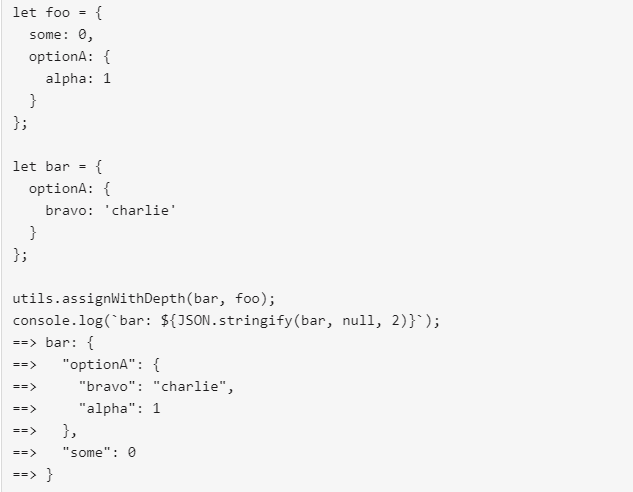

# THIS IS AN AUTOGENERATED FILE. DO NOT EDIT. Please edit the corresponding file in src/docs.

# Version 8.6.0 Changes

## [New Mermaid Live-Editor Beta](https://mermaid-js.github.io/docs/mermaid-live-editor-beta/#/edit/eyJjb2RlIjoiJSV7aW5pdDoge1widGhlbWVcIjogXCJmb3Jlc3RcIiwgXCJsb2dMZXZlbFwiOiAxIH19JSVcbmdyYXBoIFREXG4gIEFbQ2hyaXN0bWFzXSAtLT58R2V0IG1vbmV5fCBCKEdvIHNob3BwaW5nKVxuICBCIC0tPiBDe0xldCBtZSB0aGlua31cbiAgQyAtLT58T25lfCBEW0xhcHRvcF1cbiAgQyAtLT58VHdvfCBFW2lQaG9uZV1cbiAgQyAtLT58VGhyZWV8IEZbZmE6ZmEtY2FyIENhcl1cblx0XHQiLCJtZXJtYWlkIjp7InRoZW1lIjoiZGFyayJ9fQ)

## [CDN](https://unpkg.com/mermaid/)

With version 8.6.0 comes the release of directives for mermaid, a new system for modifying configurations, with the aim of establishing centralized, sane defaults and simple implementation.

`directives` allow for a single-use overwriting of `config`, as it has been discussed in [Configurations](./Setup.md).
This allows site Diagram Authors to instantiate temporary modifications to `config` through the use of [Directives](), which are parsed before rendering diagram definitions. This allows the Diagram Authors to alter the appearance of the diagrams.

**A likely application for this is in the creation of diagrams/charts inside company/organizational webpages, that rely on mermaid for diagram and chart rendering.**

the `init` directive is the main method of configuration for Site and Current Levels.

The three levels of are Configuration, Global, Site and Current.

| Level of Configuration | Description                         |
| ---------------------- | ----------------------------------- |
| Global Configuration   | Default Mermaid Configurations      |
| Site Configuration     | Configurations made by site owner   |
| Current Configuration  | Configurations made by Implementors |

# Limits to Modifying Configurations

**secure Array**

| Parameter | Description                                      | Type  | Required | Values         |
| --------- | ------------------------------------------------ | ----- | -------- | -------------- |
| secure    | Array of parameters excluded from init directive | Array | Required | Any parameters |

The modifiable parts of the Configuration are limited by the secure array, which is an array of immutable parameters, this array can be expanded by site owners.

**Notes**: secure arrays work like nesting dolls, with the Global Configurations’ secure array holding the default and immutable list of immutable parameters, or the smallest doll, to which site owners may add to, but implementors may not modify it.

# Secure Arrays

Site owners can add to the **secure** array using this command:
mermaidAPI.initialize( { startOnLoad: true, secure: \['parameter1', 'parameter2'] } );

Default values for the `secure array` consists of: \['secure', 'securityLevel', 'startOnLoad', 'maxTextSize']. These default values are immutable.

Implementors can only modify configurations using directives, and cannot change the `secure` array.

# Modifying Configurations and directives:

The Two types of directives: are `init` (or `initialize`) and `wrap`.

```note
All directives are enclosed in `%%{ }%%`
```

Older versions of mermaid will not parse directives because `%%` will comment out the directive. This makes the update backwards-compatible.

# Init

`init`, or `initialize`: this directive gives the user the ability to overwrite and change the values for any configuration parameters not set in the secure array.

| Parameter | Description             | Type      | Required | Values                                          |
| --------- | ----------------------- | --------- | -------- | ----------------------------------------------- |
| init      | modifies configurations | Directive | Optional | Any parameters not included in the secure array |

```note
init would be an argument-directive: `%%{init: { **insert argument here**}}%%`

The json object that is passed as {**argument** } must be valid, quoted json or it will be ignored.
    **for example**:

`%%{init: {"theme": "default", "logLevel": 1 }}%%`

Configurations that are passed through init cannot change the parameters in a secure array at a higher level. In the event of a collision, mermaid will give priority to secure arrays and parse the request without changing the values of those parameters in conflict.

When deployed within code, init is called before the graph/diagram description.
```

**for example**:

```mmd
%%{init: {"theme": "default", "logLevel": 1 }}%%
 graph LR
  a-->b
  b-->c
  c-->d
  d-->e
  e-->f
  f-->g
  g-->
```

# Wrap

| Parameter | Description                   | Type      | Required | Values     |
| --------- | ----------------------------- | --------- | -------- | ---------- |
| wrap      | a callable text-wrap function | Directive | Optional | %%{wrap}%% |

```note
Wrap is a function that is currently only deployable for sequence diagrams.

Wrap respects a manually added <br\>, so if the user wants to break up their text, they have full control over line breaks by adding <br\> tags.

It is a non-argument directive and can be executed thusly:

`%%{wrap}%%` .
```

**An example of text wrapping in a sequence diagram**:


# Resetting Configurations:

There are two more functions in the mermaidAPI that can be called by site owners: **reset** and **globalReset**.

**reset**: resets the configuration to whatever the last configuration was. This can be done to undo more recent changes set from the last mermaidAPI.initialize({...}) configuration.

**globalReset** will reset both the current configuration AND the site configuration back to the global defaults.

**Notes**: Both `reset` and `globalReset` are only available to site owners, and as such implementors have to edit their configs using `init`.

# Additional Utils to mermaid

• **memoize**: simple caching for computationally expensive functions, reducing rendering time by about 90%.

• **assignWithDepth** - an improvement on previous functions with config.js and `Object.assign`. The purpose of this function is to provide a sane mechanism for merging objects, similar to `object.assign`, but with depth.

Example of **assignWithDepth**:



Example of **object.Assign**:


• **calculateTextDimensions**, **calculateTextWidth**， and **calculateTextHeight** - for measuring text dimensions, width and height.

**Notes**: For more information on usage, parameters, and return info for these new functions take a look at the jsdocs for them in the utils package.

# New API Requests Introduced in Version 8.6.0

## setSiteConfig

| Function        | Description                           | Type        | Values                                  | Parameters | Returns    |
| --------------- | ------------------------------------- | ----------- | --------------------------------------- | ---------- | ---------- |
| `setSiteConfig` | Sets the siteConfig to desired values | Put Request | Any Values, except ones in secure array | conf       | siteConfig |

```note
Sets the siteConfig. The siteConfig is a protected configuration for repeat use. Calls to reset() will reset
the currentConfig to siteConfig. Calls to reset(configApi.defaultConfig) will reset siteConfig and currentConfig
to the defaultConfig
Note: currentConfig is set in this function。
Default value: will mirror Global Config
```

## getSiteConfig

| Function        | Description                                         | Type        | Values                             |
| --------------- | --------------------------------------------------- | ----------- | ---------------------------------- |
| `getSiteConfig` | Returns the current `siteConfig` base configuration | Get Request | Returns Any Values in `siteConfig` |

```note
Returns   any   values in siteConfig.
```

## setConfig

| Function    | Description                                | Type        | Values                            | Parameters | Returns                                        |
| ----------- | ------------------------------------------ | ----------- | --------------------------------- | ---------- | ---------------------------------------------- |
| `setConfig` | Sets the `currentConfig` to desired values | Put Request | Any Values, those in secure array | conf       | `currentConfig` merged with the sanitized conf |

```note
Sets the currentConfig. The parameter conf is sanitized based on the siteConfig.secure keys. Any
values found in conf with key found in siteConfig.secure will be replaced with the corresponding
siteConfig value.
```

## getConfig

| Function    | Description                 | Type        | Return Values                   |
| ----------- | --------------------------- | ----------- | ------------------------------- |
| `getConfig` | Obtains the `currentConfig` | Get Request | Any Values from `currentConfig` |

```note
Returns any values in currentConfig.
```

## sanitize

| Function   | Description                              | Type           | Values |
| ---------- | ---------------------------------------- | -------------- | ------ |
| `sanitize` | Sets the `siteConfig` to desired values. | Put Request(?) | None   |

```note
modifies options in-place
Ensures options parameter does not attempt to override siteConfig secure keys.
```

## reset

| Function | Description                    | Type        | Required | Values | Parameter |
| -------- | ------------------------------ | ----------- | -------- | ------ | --------- |
| `reset`  | Resets `currentConfig` to conf | Put Request | Required | None   | conf      |

## conf

| Parameter | Description                                                  | Type       | Required | Values                                       |
| --------- | ------------------------------------------------------------ | ---------- | -------- | -------------------------------------------- |
| `conf`    | base set of values, which `currentConfig` could be reset to. | Dictionary | Required | Any Values, with respect to the secure Array |

```note
default: current siteConfig  (optional, default `getSiteConfig()`)
```

## For more information, read [Setup](Setup.md).
