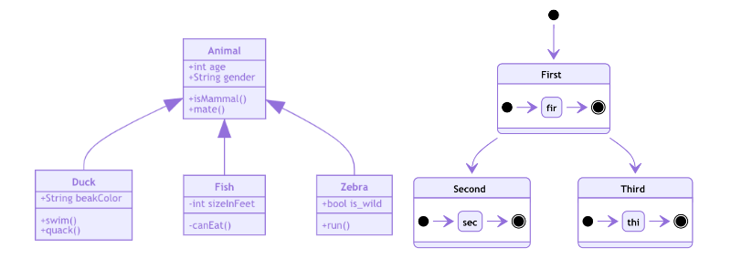
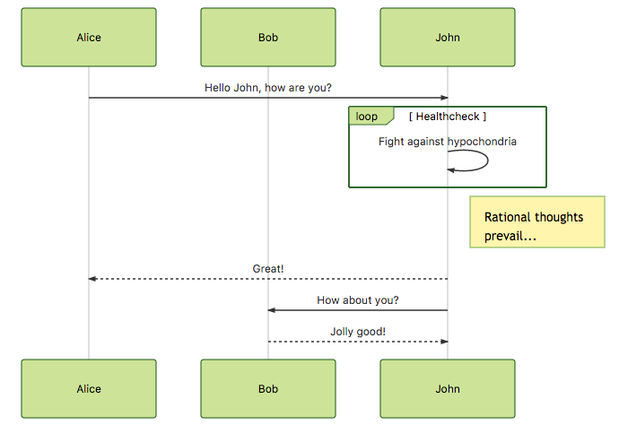
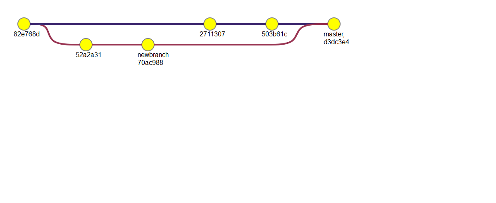

[](https://travis-ci.org/mermaid-js/mermaid)
[](https://coveralls.io/github/knsv/mermaid?branch=master)
[](https://gitter.im/knsv/mermaid?utm_source=badge&utm_medium=badge&utm_campaign=pr-badge&utm_content=badge)

# mermaid

## New diagrams in 8.4

With version 8.4 class diagrams has got some new features, bug fixes and documentation. Another new feature in 8.4 is the new diagram
type, state diagrams.




## Special note regarding version 8.2

In version 8.2 a security improvement was introduced. A securityLevel configuration was introduced which sets the level of trust to be used on the parsed diagrams.

* **true**: (default) tags in text are encoded, click functionality is disabled
* false: tags in text are allowed, click functionality is enabled

Closed issues:

⚠️ **Note** : This changes the default behaviour of mermaid so that after upgrade to 8.2, if the securityLevel is not configured, tags in flowcharts are encoded as tags and clicking is prohibited.

If your application is taking resposibility for the diagram source security you can set the securityLevel accordingly. By doing this clicks and tags are again allowed.

```javascript
    mermaidAPI.initialize({
        securityLevel: 'loose'
    });
```

**🖖 Keep a steady pulse: mermaid needs more Collaborators [#866](https://github.com/knsv/mermaid/issues/866)**


Generation of diagrams and flowcharts from text in a similar manner as markdown.

Ever wanted to simplify documentation and avoid heavy tools like Visio when explaining your code?

This is why mermaid was born, a simple markdown-like script language for generating charts from text via javascript.

**Mermaid was nominated and won the JS Open Source Awards (2019) in the category "The most exciting use of technology"!!! Thanks to all involved, people committing pull requests, people answering questions and special thanks to Tyler Long who is helping me maintain the project.**

### Flowchart

```
graph TD;
    A-->B;
    A-->C;
    B-->D;
    C-->D;
```


### Sequence diagram

```
sequenceDiagram
    participant Alice
    participant Bob
    Alice->>John: Hello John, how are you?
    loop Healthcheck
        John->>John: Fight against hypochondria
    end
    Note right of John: Rational thoughts <br/>prevail!
    John-->>Alice: Great!
    John->>Bob: How about you?
    Bob-->>John: Jolly good!
```



### Gantt diagram

```
gantt
dateFormat  YYYY-MM-DD
title Adding GANTT diagram to mermaid
excludes weekdays 2014-01-10

section A section
Completed task            :done,    des1, 2014-01-06,2014-01-08
Active task               :active,  des2, 2014-01-09, 3d
Future task               :         des3, after des2, 5d
Future task2               :         des4, after des3, 5d
```


### Class diagram - :exclamation: experimental

```
classDiagram
Class01 <|-- AveryLongClass : Cool
Class03 *-- Class04
Class05 o-- Class06
Class07 .. Class08
Class09 --> C2 : Where am i?
Class09 --* C3
Class09 --|> Class07
Class07 : equals()
Class07 : Object[] elementData
Class01 : size()
Class01 : int chimp
Class01 : int gorilla
Class08 <--> C2: Cool label
```


### Git graph - :exclamation: experimental

```
gitGraph:
options
{
    "nodeSpacing": 150,
    "nodeRadius": 10
}
end
commit
branch newbranch
checkout newbranch
commit
commit
checkout master
commit
commit
merge newbranch

```




## Installation

### CDN

```
https://unpkg.com/mermaid@<version>/dist/
```

Replace `<version>` with expected version number.

Example: https://unpkg.com/mermaid@7.1.0/dist/

### Node.js

```
yarn add mermaid
```


## Documentation

https://mermaidjs.github.io


## Sibling projects

- [mermaid CLI](https://github.com/mermaidjs/mermaid.cli)
- [mermaid live editor](https://github.com/mermaidjs/mermaid-live-editor)
- [mermaid webpack demo](https://github.com/mermaidjs/mermaid-webpack-demo)
- [mermaid Parcel demo](https://github.com/mermaidjs/mermaid-parcel-demo)


# Request for assistance

Things are piling up and I have a hard time keeping up. To remedy this
it would be great if we could form a core team of developers to cooperate
with the future development of mermaid.

As part of this team you would get write access to the repository and would
represent the project when answering questions and issues.

Together we could continue the work with things like:
* adding more types of diagrams like mindmaps, ert diagrams, etc.
* improving existing diagrams

Don't hesitate to contact me if you want to get involved.


# For contributors

## Setup

    yarn install


## Build

    yarn build:watch


## Lint

    yarn lint

We use [eslint](https://eslint.org/).
We recommend you installing [editor plugins](https://eslint.org/docs/user-guide/integrations) so you can get real time lint result.


## Test

    yarn test

Manual test in browser:

    open dist/index.html


## Release

For those who have the permission to do so:

Update version number in `package.json`.

    npm publish

Command above generates files into the `dist` folder and publishes them to npmjs.org.


# Credits

Many thanks to the [d3](http://d3js.org/) and [dagre-d3](https://github.com/cpettitt/dagre-d3) projects for providing the graphical layout and drawing libraries!

Thanks also to the [js-sequence-diagram](http://bramp.github.io/js-sequence-diagrams) project for usage of the grammar for the sequence diagrams. Thanks to Jessica Peter for inspiration and starting point for gantt rendering.

*Mermaid was created by Knut Sveidqvist for easier documentation.*

*[Tyler Long](https://github.com/tylerlong) has became a collaborator since April 2017.*

Here is the full list of the projects [contributors](https://github.com/knsv/mermaid/graphs/contributors).
