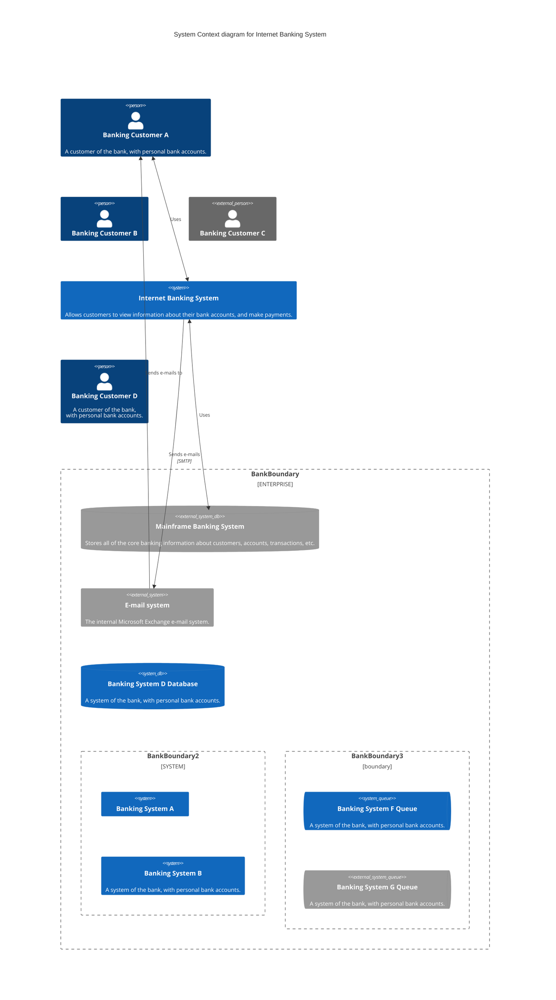

# C4C Diagrams

**Edit this Page** 
> C4 Diagram: This is an experimental diagram for now. The syntax and properties can change in future releases. Proper documentation will be provided when the syntax is stable.

Mermaid's c4 diagram syntax is compatible with plantUML. See example below:

