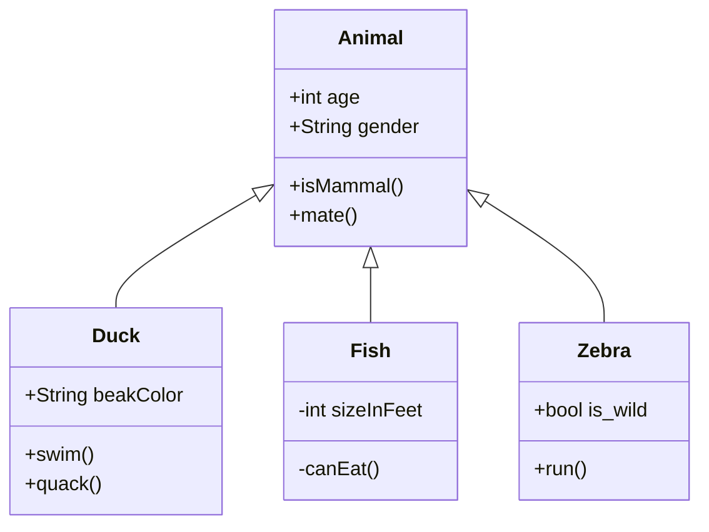
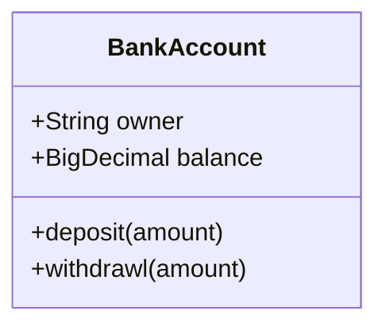
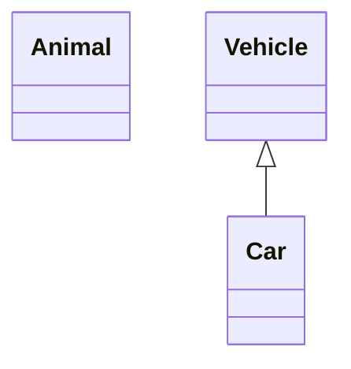
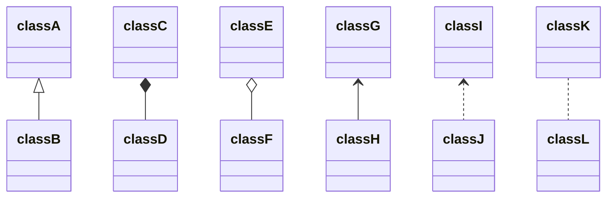
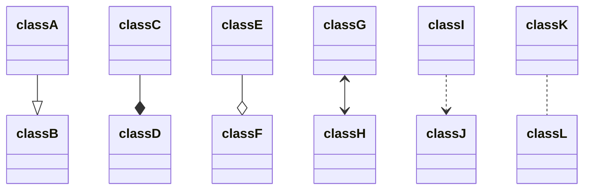
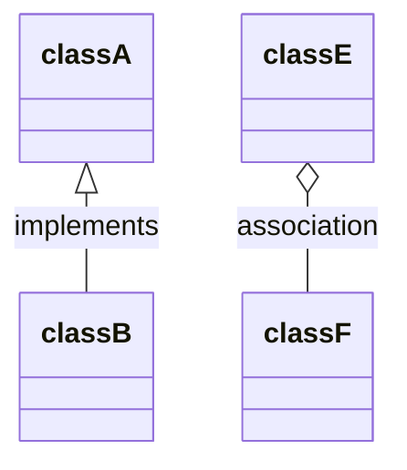
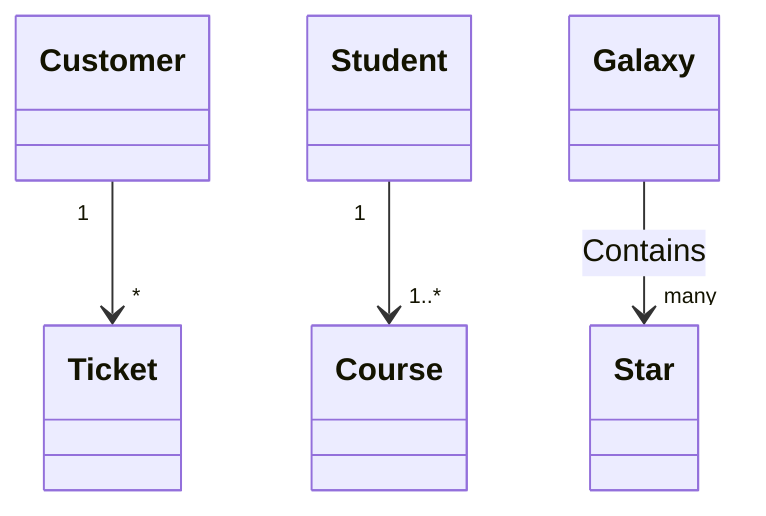
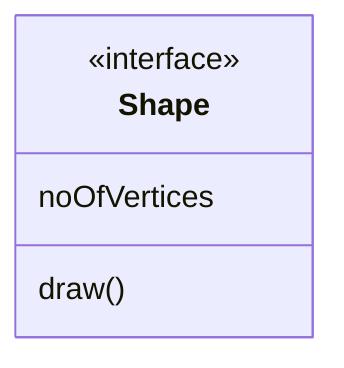
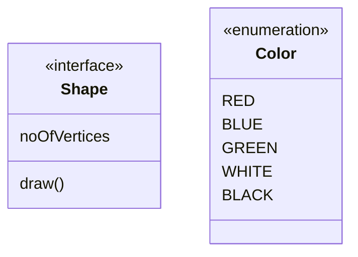

# Class diagrams

> "In software engineering, a class diagram in the Unified Modeling Language (UML) is a type of static structure diagram that describes the structure of a system by showing the system's classes, their attributes, operations (or methods), and the relationships among objects."
 Wikipedia

The class diagram is the main building block of object-oriented modeling. It is used for general conceptual modeling of the structure of the application, and for detailed modeling translating the models into programming code. Class diagrams can also be used for data modeling. The classes in a class diagram represent both the main elements, interactions in the application, and the classes to be programmed.

Mermaid can render class diagrams.

```
 classDiagram
      Animal <|-- Duck
      Animal <|-- Fish
      Animal <|-- Zebra
      Animal : +int age
      Animal : +String gender
      Animal: +isMammal()
      Animal: +mate()
      class Duck{
          +String beakColor
          +swim()
          +quack()
      }
      class Fish{
          -int sizeInFeet
          -canEat()
      }
      class Zebra{
          +bool is_wild
          +run()
      }
     
```


## Syntax

### Class

UML provides mechanisms to represent class members, such as attributes and methods, and additional information about them.
A single instance of a class in the diagram contains three compartments:
 - The top compartment contains the name of the class. It is printed in bold and centered, and the first letter is capitalized. It may also contain optional annotation text describing the nature of the class.
 - The middle compartment contains the attributes of the class. They are left-aligned and the first letter is lowercase.
 - The bottom compartment contains the operations the class can execute. They are also left-aligned and the first letter is lowercase.

```
classDiagram
    class BankAccount
    BankAccount : +String owner
    BankAccount : +Bigdecimal balance
    BankAccount : +deposit(amount)
    BankAccount : +withdrawl(amount)
```

## Define a class

There are two ways to define a class:
- Explicitly defining a class using keyword **class** like `class Animal`. This defines the Animal class
- Define two classes via a **relationship** between them `Vehicle <|-- Car`. This defines two classes Vehicle and Car along with their relationship.

```
classDiagram
    class Animal
    Vehicle <|-- Car
```


Naming convention: a class name should be composed of alphanumeric (unicode allowed) and underscore characters.

## Defining Members of a class

UML provides mechanisms to represent class members, such as attributes and methods, and additional information about them.

#### Visibility
To specify the visibility of a class member (i.e. any attribute or method), these notations may be placed before the member's name, but is it optional:

- `+`	Public
- `-`	Private
- `#`	Protected
- `~`	Package

Mermaid distinguishes between attributes and functions/methods based on if the **parenthesis** `()` are present or not. The one with `()` are treated as functions/methods, and others as attributes.

There are two ways to define the members of a class, and regardless of the whichever syntax is used to define the members, the output will still be same. The two different ways are :
- Associate a member of a class using **:** (colon) followed by member name, useful to define one member at a time. For example: 

 ```
  class BankAccount
  BankAccount : +String owner
  BankAccount : +BigDecimal balance
  BankAccount : +deposit(amount)
  BankAccount : +withdrawl(amount)
  ```
  ```mermaid
    classDiagram
    class BankAccount
    BankAccount : +String owner
    BankAccount : +BigDecimal balance
    BankAccount : +deposit(amount)
    BankAccount : +withdrawl(amount)
```

- Associate members of a class using **{}** brackets, where members are grouped within curly brackets. Suitable for defining multiple members at once. For example:
```
class BankAccount{
    +String owner
    +BigDecimal balance
    +deposit(amount)
    +withdrawl(amount)
}
```
```mermaid
    classDiagram
    class BankAccount{
        +String owner
        +BigDecimal balance
        +deposit(amount)
        +withdrawl(amount)
}```

## Defining Relationship
A relationship is a general term covering the specific types of logical connections found on class and object diagrams. 
```
[classA][Arrow][ClassB]:LabelText
```

There are different types of relations defined for classes under UML which are currently supported:

Type | Description
---  | ---
<\|--| Inheritance
*--  | Composition
o--  | Aggregation
-->  | Association
--   | Link 

<!--- TODO ..>  Dependency--->
```
classDiagram
classA <|-- classB
classC *-- classD
classE o-- classF
classG <-- classH
classI <.. classJ
classK .. classL

```


We can use the arrowheads in opposite directions as well :
```
classDiagram
classA --|> classB
classC --* classD
classE --o classF
classG <--> classH
classI ..> classJ
classK .. classL

```


## Labels on Relations 

It is possible to add a label text to a relation:
```
[classA][Arrow][ClassB]:LabelText
```
```
classDiagram
classA <|-- classB : implements
classC *-- classD : composition
classE o-- classF : association
```

## Cardinality / Multiplicity on relations
Multiplicity or cardinality in class diagrams indicates the number of instances of one class linked to one instance of the other class. For example, one company will have one or more employees, but each employee works for just one company.

Multiplicity notations are placed near the ends of an association. 

The different cardinality options are :
- `0..1`        Zero or one
- `1`           Only 1
- `0..1`	    Zero or One
- `1..*`        One or more
- `*`           Many
- `n`           n {where n>1}
- `0..n`        zeor to n {where n>1}
- `1..n`        one to n {where n>1}

Cardinality can be easily defined by placing cardinality text within qoutes `"` before(optional) and after(optional) a given arrow.
```
[classA] "cardinality1" [Arrow] "cardinality2" [ClassB]:LabelText
```
```
classDiagram
    Customer "1" --> "*" Ticket
    Student "1" --> "1..*" Course
    Galaxy --> "many" Star : Contains
```

## Annotations on classes 

It is possible to annotate classes with a specific marker text which is like meta-data for the class, giving a clear indication about its nature. Some common annotations examples could be:
- `<<Interface>>`   To represent an Interface class
- `<<abstract>>`      To represent an abstract class
- `<<Service>>`     To represent a service class
- `<<enumeration>>` To represent an enum

Annotations are defined within the opening `<<` and closing `>>`. There are two ways to add an annotation to a class and regardless of the syntax used output will be same. The two ways are :
- In a ***separate line*** after a class is defined. For example:
```
classDiagram
class Shape
<<interface>> Shape
```


- In a ***nested structure*** along with class definition. For example:

```
classDiagram
class Shape{
    <<interface>>
    noOfVertices
    draw()
}
class Color{
    <<enumeration>>
    RED
    BLUE
    GREEN
    WHITE
    BLACK
}

```




## Styling

Styling of the class diagram is done by defining a number of css classes.  During rendering these classes are extracted from the file located at src/themes/class.scss

### Styling Classes used

Class               | Description
---                 | ---
g.classGroup text   | Styles for general class text
classGroup .title   | Styles for general class title
g.classGroup rect   | Styles for class diagram rectangle 
g.classGroup line   | Styles for class diagram line
.classLabel .box    | Styles for class label box
.classLabel .label  | Styles for class label text
composition         | Styles for componsition arrow head and arrow line
aggregation         | Styles for aggregation arrow head and arrow line(dashed or solid)
dependency          | Styles for dependency arrow head and arrow line


### Sample stylesheet


```css
body {
    background: white;
}

g.classGroup text {
  fill: $nodeBorder;
  stroke: none;
  font-family: 'trebuchet ms', verdana, arial;
  font-family: var(--mermaid-font-family);
  font-size: 10px;

  .title {
    font-weight: bolder;
  }
}

g.classGroup rect {
  fill: $nodeBkg;
  stroke: $nodeBorder;
}

g.classGroup line {
  stroke: $nodeBorder;
  stroke-width: 1;
}

.classLabel .box {
  stroke: none;
  stroke-width: 0;
  fill: $nodeBkg;
  opacity: 0.5;
}

.classLabel .label {
  fill: $nodeBorder;
  font-size: 10px;
}

.relation {
  stroke: $nodeBorder;
  stroke-width: 1;
  fill: none;
}

@mixin composition {
  fill: $nodeBorder;
  stroke: $nodeBorder;
  stroke-width: 1;
}

#compositionStart {
  @include composition;
}

#compositionEnd {
  @include composition;
}

@mixin aggregation {
  fill: $nodeBkg;
  stroke: $nodeBorder;
  stroke-width: 1;
}

#aggregationStart {
  @include aggregation;
}

#aggregationEnd {
  @include aggregation;
}

#dependencyStart {
  @include composition;
}

#dependencyEnd {
  @include composition;
}

#extensionStart {
  @include composition;
}

#extensionEnd {
  @include composition;
}

```


## Configuration
`Coming soon`

