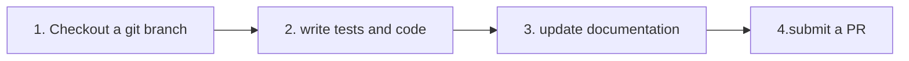

> **Warning**
>
> ## THIS IS AN AUTOGENERATED FILE. DO NOT EDIT.
>
> ## Please edit the corresponding file in [/packages/mermaid/src/docs/community/development.md](../../packages/mermaid/src/docs/community/development.md).

# Contributing to Mermaid

## Contents

- [Technical Requirements and Setup](#technical-requirements-and-setup)
- [Contributing Code](#contributing-code)
- [Contributing Documentation](#contributing-documentation)
- [Questions or Suggestions?](#questions-or-suggestions)
- [Last Words](#last-words)

---

So you want to help? That's great!


Here are a few things to get you started on the right path.

## Technical Requirements and Setup

### Technical Requirements

These are the tools we use for working with the code and documentation.

- [volta](https://volta.sh/) to manage node versions.
- [Node.js](https://nodejs.org/en/). `volta install node`
- [pnpm](https://pnpm.io/) package manager. `volta install pnpm`
- [npx](https://docs.npmjs.com/cli/v8/commands/npx) the packaged executor in npm. This is needed [to install pnpm.](#2-install-pnpm)

Follow [the setup steps below](#setup) to install them and verify they are working

### Setup

Follow these steps to set up the environment you need to work on code and/or documentation.

#### 1. Fork and clone the repository

In GitHub, you first _fork_ a repository when you are going to make changes and submit pull requests.

Then you _clone_ a copy to your local development machine (e.g. where you code) to make a copy with all the files to work with.

[Here is a GitHub document that gives an overview of the process.](https://docs.github.com/en/get-started/quickstart/fork-a-repo)

#### 2. Install pnpm

Once you have cloned the repository onto your development machine, change into the `mermaid` project folder so that you can install `pnpm`. You will need `npx` to install pnpm because volta doesn't support it yet.

Ex:

```bash
# Change into the mermaid directory (the top level director of the mermaid project repository)
cd mermaid
# npx is required for first install because volta does not support pnpm yet
npx pnpm install
```

#### 3. Verify Everything Is Working

Once you have installed pnpm, you can run the `test` script to verify that pnpm is working _and_ that the repository has been cloned correctly:

```bash
pnpm test
```

The `test` script and others are in the top-level `package.json` file.

All tests should run successfully without any errors or failures. (You might see _lint_ or _formatting_ warnings; those are ok during this step.)

## Contributing Code

The basic steps for contributing code are:




1.  **Create** and checkout a git branch and work on your code in the branch
2.  Write and update **tests** (unit and perhaps even integration (e2e) tests) (If you do TDD/BDD, the order might be different.)
3.  **Let users know** that things have changed or been added in the documents! This is often overlooked, but _critical_
4.  **Submit** your code as a _pull request._

### 1. Checkout a git branch

Mermaid uses a [Git Flow](https://guides.github.com/introduction/flow/)–inspired approach to branching.

Development is done in the `develop` branch.

Once development is done we create a `release/vX.X.X` branch from `develop` for testing.

Once the release happens we add a tag to the `release` branch and merge it with `master`. The live product and on-line documentation are what is in the `master` branch.

**All new work should be based on the `develop` branch.**

**When you are ready to do work, always, ALWAYS:**

1.  Make sure you have the most up-to-date version of the `develop` branch. (fetch or pull to update it)
2.  Check out the `develop` branch
3.  Create a new branch for your work. Please name the branch following our naming convention below.

We use the follow naming convention for branches:

```text
   [feature | bug | chore | docs]/[issue number]_[short description using dashes ('-') or underscores ('_') instead of spaces]
```

- The first part is the **type** of change: a feature, bug, chore, or documentation change ('docs')
- followed by a _slash_ (which helps to group like types together in many git tools)
- followed by the **issue number**
- followed by an _underscore_ ('\_')
- followed by a short text description (but use dashes ('-') or underscores ('\_') instead of spaces)

If your work is specific to a single diagram type, it is a good idea to put the diagram type at the start of the description. This will help us keep release notes organized: it will help us keep changes for a diagram type together.

**Ex: A new feature described in issue 2945 that adds a new arrow type called 'florbs' to state diagrams**

`feature/2945_state-diagram-new-arrow-florbs`

**Ex: A bug described in issue 1123 that causes random ugly red text in multiple diagram types**
`bug/1123_fix_random_ugly_red_text`

### 2. Write Tests

Tests ensure that each function, module, or part of code does what it says it will do. This is critically
important when other changes are made to ensure that existing code is not broken (no regression).

Just as important, the tests act as _specifications:_ they specify what the code does (or should do).
Whenever someone is new to a section of code, they should be able to read the tests to get a thorough understanding of what it does and why.

If you are fixing a bug, you should add tests to ensure that your code has actually fixed the bug, to specify/describe what the code is doing, and to ensure the bug doesn't happen again.
(If there had been a test for the situation, the bug never would have happened in the first place.)
You may need to change existing tests if they were inaccurate.

If you are adding a feature, you will definitely need to add tests. Depending on the size of your feature, you may need to add integration tests.

#### Unit Tests for Parsing

If you are adding or changing the text that describes a diagram (the _grammar_), you will need to add (or change) tests for the _parser._

#### Integration/End-to-End (e2e) tests

These test the rendering and visual appearance of the diagrams.
This ensures that the rendering of that feature in the e2e will be reviewed in the release process going forward. Less chance that it breaks!

To start working with the e2e tests:

1.  Run `pnpm run dev` to start the dev server (or use the `pnpm dev` script)
2.  Start **Cypress** by running `pnpm exec cypress open` in the **mermaid** folder (or use the `pnpm cypress:open` script).

The rendering tests are very straightforward to create. There is a function `imgSnapshotTest`, which takes a diagram in text form and the mermaid options, and it renders that diagram in Cypress.

When running in CI it will take a snapshot of the rendered diagram and compare it with the snapshot from last build and flag it for review if it differs.

This is what a rendering test looks like:

```js
it('should render forks and joins', () => {
  imgSnapshotTest(
    `
    stateDiagram
    state fork_state &lt;&lt;fork&gt;&gt;
      [*] --> fork_state
      fork_state --> State2
      fork_state --> State3

      state join_state &lt;&lt;join&gt;&gt;
      State2 --> join_state
      State3 --> join_state
      join_state --> State4
      State4 --> [*]
    `,
    { logLevel: 0 }
  );
  cy.get('svg');
});
```

**_\[TODO - running the tests against what is expected in development. ]_**

**_\[TODO - how to generate new screenshots]_**
....

### 3. Update Documentation

If the users have no way to know that things have changed, then you haven't really _fixed_ anything for the users; you've just added to making Mermaid feel broken.
Likewise, if users don't know that there is a new feature that you've implemented, it will forever remain unknown and unused.

The documentation has to be updated to users know that things have changed and added!

We know it can sometimes be hard to code _and_ write user documentation.

**\*\[TODO - how to submit documentation changes.** A few words plus a link to [Contributing Documentation](#contributing-documentation)]\*

Create another issue specifically for the documentation.\
You will need to help with the PR, but definitely ask for help if you feel stuck.
When it feels hard to write stuff out, explaining it to someone and having that person ask you clarifying questions can often be 80% of the work!]

When in doubt, write up and submit what you can. It can be clarified and refined later. (With documentation, something is better than nothing!)

### 4. Submit your pull request

**\[TODO - PR titles should start with (fix | feat | ....)]**

We make all changes via Pull Requests (PRs). As we have many Pull Requests from developers new to Mermaid, \
we have put in place a process wherein _knsv, Knut Sveidqvist_ is the primary reviewer of changes and merging pull requests. The process is as follows:

- Large changes are reviewed by knsv or other developer asked to review by knsv
- Smaller, low-risk changes like dependencies, documentation, etc. can be reviewed and merged by active collaborators

**Reminder: Pull Requests should be submitted to the develop branch.**

## Contributing Documentation

**_\[TODO: This section is still a WIP. It still needs MAJOR revision.]_**

If it is not in the documentation, it's like it never happened. Wouldn't that be sad? With all the effort that was put into the feature?

The docs are located in the `packages/mermaid/src/docs` folder and are written in Markdown. Just pick the right section and start typing.

The contents of <https://mermaid-js.github.io/mermaid/> are based on the docs from the `master` branch.
Updates committed to the `master` branch are reflected in the [Mermaid Docs](https://mermaid-js.github.io/mermaid/) once released.

### Documentation organization: sidebar navigation

If you want to propose changes to how the documentation is _organized_, such as adding a new section or re-arranging or renaming a section, you must update the **sidebar navigation.**

The sidebar navigation is defined in [the vitepress configuration file config.ts](../.vitepress/config.ts).

### How to Contribute to Documentation

We are a little less strict here, it is OK to commit directly in the `develop` branch if you are a collaborator.

The documentation is located in the `packages/mermaid/src/docs` directory and organized according to relevant subfolder.

The contents of <https://mermaid-js.github.io/mermaid/> are based on the docs from the `master` branch. Updates committed to the `master` branch are reflected in the [Mermaid Docs](https://mermaid-js.github.io/mermaid/) once released.

The `docs` folder will be automatically generated when committing to `packages/mermaid/src/docs` and should not be edited manually.

We encourage contributions to the documentation at [mermaid-js/mermaid/src/docs](https://github.com/mermaid-js/mermaid/tree/develop/src/docs). We publish documentation to GitHub Pages with [Docsify](https://www.youtube.com/watch?v=TV88lp7egMw&t=3s)

- Documentation (we encourage updates to the `packages/mermaid/src/docs` folder; you can submit them via direct commits)

**_DO NOT CHANGE FILES IN `/docs`_**

The source files for documentation are in `/packages/mermaid/docs` and are written in markdown.

### The official documentation site

**[The mermaid documentation site](https://mermaid-js.github.io/mermaid/) is powered by [Vitepress](https://vitepress.vuejs.org/).**

**_\[TODO - how to preview the documents on a local machine? how to run VitePress?]_**

If you want to preview the whole documentation site on your machine, you need to install `docsify-cli`:

Markdown is used to format the text, for more information about Markdown [see the GitHub Markdown help page](https://help.github.com/en/github/writing-on-github/basic-writing-and-formatting-syntax).

To edit Docs on your computer:

_\[TODO: need to keep this in sync with [check out a git branch in Contributing Code above](#1-checkout-a-git-branch) ]_

1.  Create a fork of the develop branch to work on.
2.  Find the Markdown file (.md) to edit in the `packages/mermaid/src/docs` directory.
3.  Make changes or add new documentation.
4.  Commit changes to your branch and push it to GitHub (which should create a new branch).
5.  Create a Pull Request of your fork.

To edit Docs on GitHub:

1.  Login to [GitHub.com](https://www.github.com).
2.  Navigate to [mermaid-js/mermaid/src/docs](https://github.com/mermaid-js/mermaid/tree/develop/src/docs).
3.  To edit a file, click the pencil icon at the top-right of the file contents panel.
4.  Describe what you changed in the **Propose file change** section, located at the bottom of the page.
5.  Submit your changes by clicking the button **Propose file change** at the bottom (by automatic creation of a fork and a new branch).
6.  Create a Pull Request of your newly forked branch by clicking the green **Create Pull Request** button.

## Questions or Suggestions?

#### First search to see if someone has already asked (and hopefully been answered) or suggested the same thing.

- Search in Discussions
- Search in open Issues
- Search in closed Issues

If you find an open issue or discussion thread that is similar to your question but isn't answered,
you can let us know that you are also interested in it. **_\[TODO: describe upvoting]_**
This helps the team know the relative interest in something and helps them set priorities and assignments.

Feel free to add to the discussion on the issue or topic.

If you can't find anything that already addresses your question or suggestion, _open a new issue:_

Log in to [GitHub.com](https://www.github.com), open or append to an issue [using the GitHub issue tracker of the mermaid-js repository](https://github.com/mermaid-js/mermaid/issues?q=is%3Aissue+is%3Aopen+label%3A%22Area%3A+Documentation%22).

### How to Contribute a Suggestion

## Last Words

Don't get daunted if it is hard in the beginning. We have a great community with only encouraging words. So, if you get stuck, ask for help and hints in the Slack forum. If you want to show off something good, show it off there.

[Join our Slack community if you want closer contact!](https://join.slack.com/t/mermaid-talk/shared_invite/enQtNzc4NDIyNzk4OTAyLWVhYjQxOTI2OTg4YmE1ZmJkY2Y4MTU3ODliYmIwOTY3NDJlYjA0YjIyZTdkMDMyZTUwOGI0NjEzYmEwODcwOTE)


