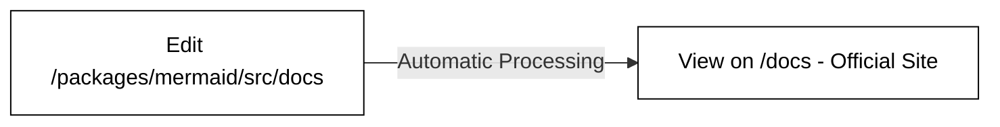

> **Warning**
>
> ## THIS IS AN AUTOGENERATED FILE. DO NOT EDIT.
>
> ## Please edit the corresponding file in [/packages/mermaid/src/docs/community/documentation.md](../../packages/mermaid/src/docs/community/documentation.md).

# Contributing to Documentation

**_If it's not in the documentation, it's like it never happened. So let's make every feature count!_**

## Where is the Documentation Located?

- **Directory:** `packages/mermaid/src/docs`.
- **Format:** Written in Markdown.
- [mermaid.js.org](https://mermaid.js.org/) reflects the `master` branch contents.

## How to Contribute

1.  **Collaborators:** Direct commits to the `develop` branch are acceptable.
2.  **Documentation Path:** `packages/mermaid/src/docs`.
3.  **DO NOT** manually edit the `/docs` folder. It's auto-generated.




### Markdown Tips:

You can use specialized blocks for notes, tips, warnings, or dangers:

````markdown
```note
This is a note.
```

```tip
This is a tip.
```

```warning
This is a warning.
```

```danger
This is a danger alert.
```
````

> **Note**
> 📌 **Note:** If you're only updating documentation, speed up publication by creating a PR to the `master` branch. Ensure your branch is based on `master`, not `develop`.

## Running the Documentation Site Locally

The [mermaid documentation site](https://mermaid.js.org/) uses [Vitepress](https://vitepress.vuejs.org/).

1.  Run `pnpm --filter mermaid run docs:dev` or `pnpm docs:dev` within `packages/mermaid`.
2.  Visit <http://localhost:3333/>.

## How to Edit the Documentation

### On Your Computer:

1.  Fork the `develop` branch.
2.  Navigate to `packages/mermaid/src/docs` to find the `.md` file.
3.  Edit or add content.
4.  Commit and push your changes to GitHub (creating a new branch).
5.  Make a Pull Request from your branch.

### Directly on GitHub:

1.  Go to [GitHub.com](https://www.github.com).
2.  Find [packages/mermaid/src/docs](https://github.com/mermaid-js/mermaid/tree/develop/packages/mermaid/src/docs) in the mermaid-js repo.
3.  Click the pencil icon on the file you wish to edit.
4.  Describe your changes in the **Propose file change** section.
5.  Click **Propose file change** to automatically fork and branch.
6.  Go to `https://github.com/<Your Username>/mermaid/actions` and activate the actions for your fork.
7.  Click **Create Pull Request** for your new branch.

## Documentation Organization: Sidebar Navigation

To modify how documentation is structured, update the **sidebar navigation** in [config.ts](../.vitepress/config.ts).
