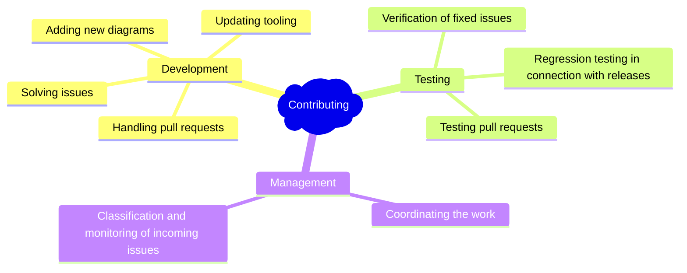

> **Warning**
>
> ## THIS IS AN AUTOGENERATED FILE. DO NOT EDIT.
>
> ## Please edit the corresponding file in [/packages/mermaid/src/docs/community/intro.md](../../packages/mermaid/src/docs/community/intro.md).

# Contributing to Mermaid

So you want to help? That's great!

Here are a few things to get you started on the right path.

## How can I help?

## Join the development

Detailed information about contributing can be found in the [contribution guide](../contributing/contributing.md).

<!-- ## Help with testing -->

<!-- ## Manage tasks -->

## Where do I start?

- You could confirm the bugs in [these issues](https://github.com/knsv/mermaid/issues?utf8=%E2%9C%93&q=is%3Aissue+is%3Aopen+label%3A%22Type%3A+Bug+%2F+Error%22+label%3A%22Status%3A+Pending%22).
- You could help write and improve the documentation! [Here's ](https://github.com/knsv/mermaid/issues?utf8=%E2%9C%93&q=is%3Aissue+is%3Aopen+label%3A%22Help+wanted%21%22+label%3A%22Area%3A+Documentation%22)some inspiration.
- You could start getting some knowledge of the code base by working on [these "good first issues"](https://github.com/knsv/mermaid/issues?utf8=%E2%9C%93&q=is%3Aissue+is%3Aopen+label%3A%22Good+first+issue%21%22+).
- You could jump right in and help us fix any of [these bugs](https://github.com/knsv/mermaid/issues?utf8=%E2%9C%93&q=is%3Aissue+is%3Aopen+label%3A%22Type%3A+Bug+%2F+Error%22+label%3A%22Help+wanted%21%22+label%3A%22Area%3A+Development%22)!
- You could work on a new feature! [These](https://github.com/knsv/mermaid/issues?utf8=%E2%9C%93&q=is%3Aissue+is%3Aopen+label%3A%22Area%3A+Development%22+label%3A%22Help+wanted%21%22+label%3A%22Type%3A+Enhancement%22+label%3A%22Status%3A+Approved%22) are some ideas!
- [Join our slack community if you want closer contact!](https://join.slack.com/t/mermaid-talk/shared_invite/enQtNzc4NDIyNzk4OTAyLWVhYjQxOTI2OTg4YmE1ZmJkY2Y4MTU3ODliYmIwOTY3NDJlYjA0YjIyZTdkMDMyZTUwOGI0NjEzYmEwODcwOTE)

## Last Words

Don't get daunted if it is hard in the beginning. We have a great community with only encouraging words. So, if you get stuck, ask for help and hints in the Slack forum. If you want to show off something good, show it off there.

[Join our Slack community if you want closer contact!](https://join.slack.com/t/mermaid-talk/shared_invite/enQtNzc4NDIyNzk4OTAyLWVhYjQxOTI2OTg4YmE1ZmJkY2Y4MTU3ODliYmIwOTY3NDJlYjA0YjIyZTdkMDMyZTUwOGI0NjEzYmEwODcwOTE)

