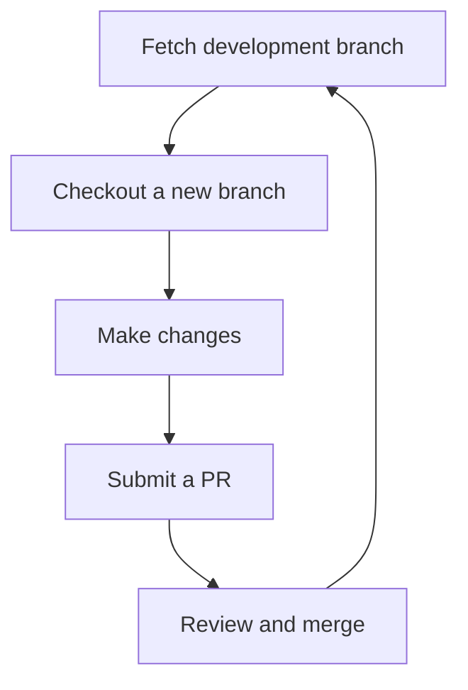
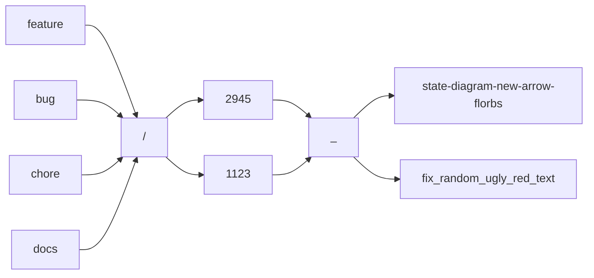

> **Warning**
>
> ## THIS IS AN AUTOGENERATED FILE. DO NOT EDIT.
>
> ## Please edit the corresponding file in [/packages/mermaid/src/docs/community/workflow.md](../../packages/mermaid/src/docs/community/workflow.md).

# Workflow

Mermaid uses a [Git Flow](https://guides.github.com/introduction/flow/)–inspired approach to branching.

Development is done in the `develop` branch.

Once development is done we create a `release/vX.X.X` branch from `develop` for testing.

Once the release happens we add a tag to the `release` branch and merge it with `master`. The live product and on-line documentation are what is in the `master` branch.

The basic steps to start contributing code and documentation are:



## Fech latest code

> **💡 Tip**
> All new work should be based on the `develop` branch.

Make sure you have the most up-to-date version of the `develop` branch.

Check out the `develop` branch, then `fetch` or `pull` to update it:

```bash
git checkout develop
git fetch # or `git pull`
```

## Checkout new branch

Create a new branch for your work:

```bash
git checkout develop # make sure you are on development branch
git checkout -b docs/2910_update-contributing-guidelines
```

We use the following naming convention for branches:

```txt
[feature | bug | chore | docs]/[issue number]_[short-description]
```

You can always check current [configuration of labelling and branch prefixes](https://github.com/mermaid-js/mermaid/blob/develop/.github/pr-labeler.yml)

- The first part is the **type** of change: a `feature`, `bug`, `chore`, `docs`
- followed by a **slash** (`/`),which helps to group like types together in many git tools
- followed by the **issue number**, e.g. `2910`
- followed by an **underscore** (`_`)
- followed by a **short description** with dashes (`-`) or underscores (`_`) instead of spaces



If your work is specific to a single diagram type, it is a good idea to put the diagram type at the start of the description. This will help us keep release notes organized by a diagram type.

> **Note**
> A new feature described in issue 2945 that adds a new arrow type called 'florbs' to state diagrams
>
> `feature/2945_state-diagram-new-arrow-florbs`

> **💡 Tip**
> A bug described in issue 1123 that causes random ugly red text in multiple diagram types
>
> `bug/1123_fix_random_ugly_red_text`

## Make changes

Source code and the documentation are located \[`packages/mermaid`]\((<https://github.com/mermaid-js/mermaid/tree/develop/packages/mermaid>) folder.
You may need to update both, depending on your task.

Read our guides on [how to contribute to code](./code.md) and [how to contribute to documentation](./documentation.md).

## Submit your pull request

> **Note**
> Do not forget to push your changes
>
> ```bash
> git push -u origin docs/2910_update-contributing-guidelines
> ```

We make all changes via Pull Requests (PRs). Open a new one.

Right now we are not following any strict rules about naming PRs. Give it a representative title and short description. There is also a [pull_request_template](https://github.com/mermaid-js/mermaid/blob/develop/.github/pull_request_template.md) which will help you with it.

In case in its description contains a [magic comment](https://docs.github.com/en/issues/tracking-your-work-with-issues/linking-a-pull-request-to-an-issue) your PR will be automatically attached to the issue:

```markdown
Resolves #<your issue ID here>
```

You can edit it if needed.

## Congratulations

You have successfully submitted your improvements! What is next?

- PRs will be reviewed by active maintainers, who will provide feedback and request changes as needed.
- The maintainers will request a review from _knsv_, if necessary.
- Once the PR is approved, the maintainers will merge the PR into the `develop` branch.
- When a release is ready, the `release/x.x.x` branch will be created, extensively tested and knsv will be in charge of the release process.

_knsv, Knut Sveidqvist_ is in charge of the final release process and the active maintainers are in charge of reviewing and merging most PRs.
