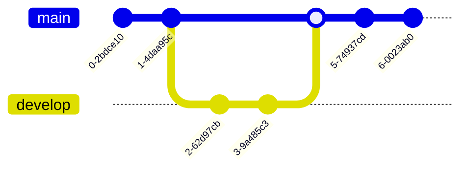

> **Warning**
>
> ## THIS IS AN AUTOGENERATED FILE. DO NOT EDIT.
>
> ## Please edit the corresponding file in [/packages/mermaid/src/docs/config/accessibility.md](../../packages/mermaid/src/docs/config/accessibility.md).

# Accessibility Options

## Accessibility

Now with Mermaid library in much wider use, we have started to work towards more accessible features, based on the feedback from the community.

Adding accessibility means that the rich information communicated by visual diagrams can be made available to those using assistive technologies (and of course to search engines).
[Read more about Accessible Rich Internet Applications and the W3 standards.](https://www.w3.org/WAI/standards-guidelines/aria/)

Mermaid will automatically insert the [aria-roledescription](#aria-roledescription) and, if provided in the diagram text by the diagram author, the [accessible title and description.](#accessible-title-and-description)

### aria-roledescription

The [aria-roledescription](https://www.w3.org/TR/wai-aria-1.1/#aria-roledescription) for the SVG HTML element is set to the diagram type key. (Note this may be slightly different than the keyword used for the diagram in the diagram text.)

For example: The diagram type key for a state diagram is "stateDiagram". Here (a part of) the HTML of the SVG tag that shows the automatically inserted aria-roledescription set to "stateDiagram". _(Note that some of the SVG attributes and the SVG contents are omitted for clarity.):_

```html
<svg
  aria-roledescription="stateDiagram"
  class="statediagram"
  xmlns="http://www.w3.org/2000/svg"
  width="100%"
  id="mermaid-1668720491568"
></svg>
```

### Accessible Title and Description

Support for accessible titles and descriptions is available for all diagrams/chart types. We have tried to keep the same keywords and format for all diagrams so that it is easy to understand and maintain.

The accessible title and description will add `<title>` and `<desc>` elements within the SVG element and the [aria-labelledby](https://www.w3.org/TR/wai-aria/#aria-labelledby) and [aria-describedby](https://www.w3.org/TR/wai-aria/#aria-describedby) attributes in the SVG tag.

Here is HTML that is generated, showing that the SVG element is labelled by the accessible title (id = `chart-title-mermaid-1668725057758`)
and described by the accessible description (id = `chart-desc-mermaid-1668725057758` );
and the accessible title element (text = "This is the accessible title")
and the accessible description element (text = "This is an accessible description").

_(Note that some of the SVG attributes and the SVG contents are omitted for clarity.)_

```html
<svg
  aria-labelledby="chart-title-mermaid-1668725057758"
  aria-describedby="chart-desc-mermaid-1668725057758"
  xmlns="http://www.w3.org/2000/svg"
  width="100%"
  id="mermaid-1668725057758"
>
  <title id="chart-title-mermaid-1668725057758">This is the accessible title</title>
  <desc id="chart-desc-mermaid-1668725057758">This is an accessible description</desc>
</svg>
```

Details for the syntax follow.

#### accessible title

The **accessible title** is specified with the **accTitle** _keyword_, followed by a colon (`:`), and the string value for the title.
The string value ends at the end of the line. (It can only be a single line.)

Ex: `accTitle: This is a single line title`

See [the accTitle and accDescr usage examples](#acctitle-and-accdescr-usage-examples) for how this can be used in a diagram and the resulting HTML generated.

#### accessible description

An accessible description can be 1 line long (a single line) or many lines long.

The **single line accessible description** is specified with the **accDescr** _keyword_, followed by a colon (`:`), followed by the string value for the description.

Ex: `accDescr: This is a single line description.`

A **multiple line accessible description** _does not have a colon (`:`) after the accDescr keyword_ and is surrounded by curly brackets (`{}`).

Ex:

```markdown
accDescr {
This is a multiple line accessible description.
It does not have a colon and is surrounded by curly brackets.
}
```

See [the accTitle and accDescr usage examples](#acctitle-and-accdescr-usage-examples) for how this can be used in a diagram and the resulting HTML generated.

#### accTitle and accDescr Usage Examples

- Flowchart with the accessible title "Big Decisions" and the single-line accessible description "Bob's Burgers process for making big decisions"


Here is the HTML generated for the SVG element: _(Note that some of the SVG attributes and the SVG contents are omitted for clarity.):_

```html
<svg
  aria-labelledby="chart-title-mermaid_382ee221"
  aria-describedby="chart-desc-mermaid_382ee221"
  aria-roledescription="flowchart-v2"
  xmlns="http://www.w3.org/2000/svg"
  width="100%"
  id="mermaid_382ee221"
>
  <title id="chart-title-mermaid_382ee221">Big decisions</title>
  <desc id="chart-desc-mermaid_382ee221">Bob's Burgers process for making big decisions</desc>
</svg>
```

- Flowchart with the accessible title "Bob's Burger's Making Big Decisions" and the multiple line accessible description "The official Bob's Burgers corporate processes that are used
  for making very, very big decisions.
  This is actually a very simple flow: identify the big decision and then make the big decision."


Here is the HTML generated for the SVG element: _(Note that some of the SVG attributes and the SVG contents are omitted for clarity.):_

```html
<svg
  aria-labelledby="chart-title-mermaid_382ee221"
  aria-describedby="chart-desc-mermaid_382ee221"
  aria-roledescription="flowchart-v2"
  xmlns="http://www.w3.org/2000/svg"
  width="100%"
  id="mermaid_382ee221"
>
  <title id="chart-title-mermaid_382ee221">Big decisions</title>
  <desc id="chart-desc-mermaid_382ee221">
    The official Bob's Burgers corporate processes that are used for making very, very big
    decisions. This is actually a very simple flow: identify the big decision and then make the big
    decision.
  </desc>
</svg>
```

#### Sample Code Snippets for other diagram types

##### Class Diagram


##### Entity Relationship Diagram


##### Gantt Chart


##### GitGraph




##### Pie Chart


##### Requirement Diagram


##### Sequence Diagram


##### State Diagram


##### User Journey Diagram

```mermaid-example
  journey
      accTitle: My User Journey Diagram
      accDescr: My User Journey Diagram Description

      title My working day
      section Go to work
        Make tea: 5: Me
        Go upstairs: 3: Me
        Do work: 1: Me, Cat
      section Go home
        Go downstairs: 5: Me
        Sit down: 5: Me

```

```mermaid
  journey
      accTitle: My User Journey Diagram
      accDescr: My User Journey Diagram Description

      title My working day
      section Go to work
        Make tea: 5: Me
        Go upstairs: 3: Me
        Do work: 1: Me, Cat
      section Go home
        Go downstairs: 5: Me
        Sit down: 5: Me

```
