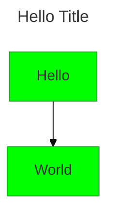
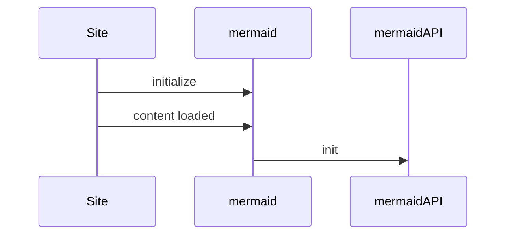

> **Warning**
>
> ## THIS IS AN AUTOGENERATED FILE. DO NOT EDIT.
>
> ## Please edit the corresponding file in [/packages/mermaid/src/docs/config/configuration.md](../../packages/mermaid/src/docs/config/configuration.md).

# Configuration

When mermaid starts, configuration is extracted to determine a configuration to be used for a diagram. There are 3 sources for configuration:

- The default configuration
- Overrides at the site level are set by the initialize call, and will be applied to all diagrams in the site/app. The term for this is the **siteConfig**.
- Frontmatter (v10.5.0+) - diagram authors can update select configuration parameters in the frontmatter of the diagram. These are applied to the render config.
- Directives (Deprecated by Frontmatter) - diagram authors can update select configuration parameters directly in the diagram code via directives. These are applied to the render config.

**The render config** is configuration that is used when rendering by applying these configurations.

## Frontmatter config

The entire mermaid configuration (except the secure configs) can be overridden by the diagram author in the frontmatter of the diagram. The frontmatter is a YAML block at the top of the diagram.

## Theme configuration

## Starting mermaid

## Initialize

The initialize call is applied **only once**. It is called by the site integrator in order to override the default configuration at a site level.

## configApi.reset

This method resets the configuration for a diagram to the overall site configuration, which is the configuration provided by the site integrator. Before each rendering of a diagram, reset is called at the very beginning.
