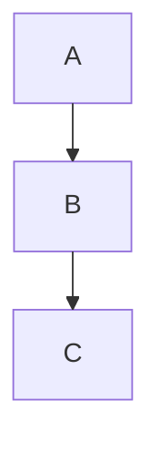

> **Warning**
>
> ## THIS IS AN AUTOGENERATED FILE. DO NOT EDIT.
>
> ## Please edit the corresponding file in [/packages/mermaid/src/docs/config/layouts.md](../../packages/mermaid/src/docs/config/layouts.md).

# Layouts

This page lists the available layout algorithms supported in Mermaid diagrams.

## Supported Layouts

- **elk**: [ELK (Eclipse Layout Kernel)](https://www.eclipse.org/elk/)
- **tidy-tree**: Tidy tree layout for hierarchical diagrams [Tidy Tree Configuration](/config/tidy-tree)
- **cose-bilkent**: Cose Bilkent layout for force-directed graphs
- **dagre**: Dagre layout for layered graphs

## How to Use

You can specify the layout in your diagram's YAML config or initialization options. For example:

