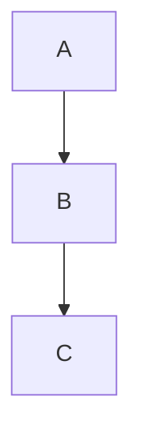

> **Warning**
>
> ## THIS IS AN AUTOGENERATED FILE. DO NOT EDIT.
>
> ## Please edit the corresponding file in [/packages/mermaid/src/docs/config/layouts.md](../../packages/mermaid/src/docs/config/layouts.md).

# Layouts

This page lists the available layout algorithms supported in Mermaid diagrams.

## Supported Layouts

- **elk** (default): [ELK (Eclipse Layout Kernel)](https://www.eclipse.org/elk/). Bundled with Mermaid; no setup required. Specific ELK algorithms can be selected as `elk.stress`, `elk.force`, `elk.mrtree`, `elk.sporeOverlap`, `elk.box`, and `elk.rectpacking`.
- **dagre**: Dagre layout for layered graphs
- **cose-bilkent**: Cose Bilkent layout for force-directed graphs
- **tidy-tree**: Tidy tree layout for hierarchical diagrams, from the [`@mermaid-js/layout-tidy-tree`](https://www.npmjs.com/package/@mermaid-js/layout-tidy-tree) package [Tidy Tree Configuration](/config/tidy-tree)

Mindmaps are the one diagram type not laid out with ELK by default; they use
Dagre unless you ask for something else.

The **tiny** build omits ELK to stay small, and falls back to Dagre for
diagrams that request it.

## How to Use

Since `elk` is the default, a diagram needs no configuration to use it. To pick
a different layout, set it in your diagram's YAML config or initialization
options. For example:

```mermaid-example
---
config:
  layout: dagre
---
graph TD;
  A-->B;
  B-->C;
```

```mermaid
---
config:
  layout: dagre
---
graph TD;
  A-->B;
  B-->C;
```
