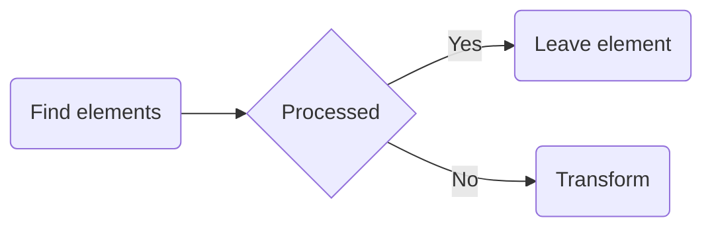

> **Warning**
>
> ## THIS IS AN AUTOGENERATED FILE. DO NOT EDIT.
>
> ## Please edit the corresponding file in [/packages/mermaid/src/docs/config/setup/interfaces/mermaid.Mermaid.md](../../../../packages/mermaid/src/docs/config/setup/interfaces/mermaid.Mermaid.md).

# Interface: Mermaid

[mermaid](../modules/mermaid.md).Mermaid

## Properties

### contentLoaded

• **contentLoaded**: () => `void`

#### Type declaration

▸ (): `void`

\##contentLoaded Callback function that is called when page is loaded. This functions fetches
configuration for mermaid rendering and calls init for rendering the mermaid diagrams on the
page.

##### Returns

`void`

#### Defined in

[packages/mermaid/src/mermaid.ts:436](https://github.com/mermaid-js/mermaid/blob/master/packages/mermaid/src/mermaid.ts#L436)

---

### detectType

• **detectType**: (`text`: `string`, `config?`: [`MermaidConfig`](mermaid.MermaidConfig.md)) => `string`

#### Type declaration

▸ (`text`, `config?`): `string`

Detects the type of the graph text.

Takes into consideration the possible existence of an `%%init` directive

##### Parameters

| Name      | Type                                        | Description                                                                                                                                                         |
| :-------- | :------------------------------------------ | :------------------------------------------------------------------------------------------------------------------------------------------------------------------ |
| `text`    | `string`                                    | The text defining the graph. For example: `mermaid %%{initialize: {"startOnLoad": true, logLevel: "fatal" }}%% graph LR a-->b b-->c c-->d d-->e e-->f f-->g g-->h ` |
| `config?` | [`MermaidConfig`](mermaid.MermaidConfig.md) | The mermaid config.                                                                                                                                                 |

##### Returns

`string`

A graph definition key

#### Defined in

[packages/mermaid/src/mermaid.ts:438](https://github.com/mermaid-js/mermaid/blob/master/packages/mermaid/src/mermaid.ts#L438)

---

### init

• **init**: (`config?`: [`MermaidConfig`](mermaid.MermaidConfig.md), `nodes?`: `string` | `HTMLElement` | `NodeListOf`<`HTMLElement`>, `callback?`: (`id`: `string`) => `unknown`) => `Promise`<`void`>

**`Deprecated`**

Use [initialize](mermaid.Mermaid.md#initialize) and [run](mermaid.Mermaid.md#run) instead.

#### Type declaration

▸ (`config?`, `nodes?`, `callback?`): `Promise`<`void`>

##### Parameters

| Name        | Type                                                     |
| :---------- | :------------------------------------------------------- |
| `config?`   | [`MermaidConfig`](mermaid.MermaidConfig.md)              |
| `nodes?`    | `string` \| `HTMLElement` \| `NodeListOf`<`HTMLElement`> |
| `callback?` | (`id`: `string`) => `unknown`                            |

##### Returns

`Promise`<`void`>

#### Defined in

[packages/mermaid/src/mermaid.ts:431](https://github.com/mermaid-js/mermaid/blob/master/packages/mermaid/src/mermaid.ts#L431)

---

### initialize

• **initialize**: (`config`: [`MermaidConfig`](mermaid.MermaidConfig.md)) => `void`

#### Type declaration

▸ (`config`): `void`

Used to set configurations for mermaid.
This function should be called before the run function.

##### Parameters

| Name     | Type                                        | Description                       |
| :------- | :------------------------------------------ | :-------------------------------- |
| `config` | [`MermaidConfig`](mermaid.MermaidConfig.md) | Configuration object for mermaid. |

##### Returns

`void`

#### Defined in

[packages/mermaid/src/mermaid.ts:435](https://github.com/mermaid-js/mermaid/blob/master/packages/mermaid/src/mermaid.ts#L435)

---

### mermaidAPI

• **mermaidAPI**: `Readonly`<{ `defaultConfig`: [`MermaidConfig`](mermaid.MermaidConfig.md) = configApi.defaultConfig; `getConfig`: () => [`MermaidConfig`](mermaid.MermaidConfig.md) = configApi.getConfig; `getDiagramFromText`: (`text`: `string`, `metadata`: `Pick`<`DiagramMetadata`, `"title"`>) => `Promise`<`Diagram`> ; `getSiteConfig`: () => [`MermaidConfig`](mermaid.MermaidConfig.md) = configApi.getSiteConfig; `globalReset`: () => `void` ; `initialize`: (`userOptions`: [`MermaidConfig`](mermaid.MermaidConfig.md)) => `void` ; `parse`: (`text`: `string`, `parseOptions`: [`ParseOptions`](mermaid.ParseOptions.md) & { `suppressErrors`: `true` }) => `Promise`<[`ParseResult`](mermaid.ParseResult.md) | `false`>(`text`: `string`, `parseOptions?`: [`ParseOptions`](mermaid.ParseOptions.md)) => `Promise`<[`ParseResult`](mermaid.ParseResult.md)> ; `render`: (`id`: `string`, `text`: `string`, `svgContainingElement?`: `Element`) => `Promise`<[`RenderResult`](mermaid.RenderResult.md)> ; `reset`: () => `void` ; `setConfig`: (`conf`: [`MermaidConfig`](mermaid.MermaidConfig.md)) => [`MermaidConfig`](mermaid.MermaidConfig.md) = configApi.setConfig; `updateSiteConfig`: (`conf`: [`MermaidConfig`](mermaid.MermaidConfig.md)) => [`MermaidConfig`](mermaid.MermaidConfig.md) = configApi.updateSiteConfig }>

**`Deprecated`**

Use [parse](mermaid.Mermaid.md#parse) and [render](mermaid.Mermaid.md#render) instead. Please [open a discussion](https://github.com/mermaid-js/mermaid/discussions) if your use case does not fit the new API.

#### Defined in

[packages/mermaid/src/mermaid.ts:425](https://github.com/mermaid-js/mermaid/blob/master/packages/mermaid/src/mermaid.ts#L425)

---

### parse

• **parse**: (`text`: `string`, `parseOptions`: [`ParseOptions`](mermaid.ParseOptions.md) & { `suppressErrors`: `true` }) => `Promise`<[`ParseResult`](mermaid.ParseResult.md) | `false`>(`text`: `string`, `parseOptions?`: [`ParseOptions`](mermaid.ParseOptions.md)) => `Promise`<[`ParseResult`](mermaid.ParseResult.md)>

#### Type declaration

▸ (`text`, `parseOptions`): `Promise`<[`ParseResult`](mermaid.ParseResult.md) | `false`>

Parse the text and validate the syntax.

##### Parameters

| Name           | Type                                                                     | Description                     |
| :------------- | :----------------------------------------------------------------------- | :------------------------------ |
| `text`         | `string`                                                                 | The mermaid diagram definition. |
| `parseOptions` | [`ParseOptions`](mermaid.ParseOptions.md) & { `suppressErrors`: `true` } | Options for parsing.            |

##### Returns

`Promise`<[`ParseResult`](mermaid.ParseResult.md) | `false`>

An object with the `diagramType` set to type of the diagram if valid. Otherwise `false` if parseOptions.suppressErrors is `true`.

**`See`**

[ParseOptions](mermaid.ParseOptions.md)

**`Throws`**

Error if the diagram is invalid and parseOptions.suppressErrors is false or not set.

▸ (`text`, `parseOptions?`): `Promise`<[`ParseResult`](mermaid.ParseResult.md)>

##### Parameters

| Name            | Type                                      |
| :-------------- | :---------------------------------------- |
| `text`          | `string`                                  |
| `parseOptions?` | [`ParseOptions`](mermaid.ParseOptions.md) |

##### Returns

`Promise`<[`ParseResult`](mermaid.ParseResult.md)>

#### Defined in

[packages/mermaid/src/mermaid.ts:426](https://github.com/mermaid-js/mermaid/blob/master/packages/mermaid/src/mermaid.ts#L426)

---

### parseError

• `Optional` **parseError**: [`ParseErrorFunction`](../modules/mermaid.md#parseerrorfunction)

#### Defined in

[packages/mermaid/src/mermaid.ts:420](https://github.com/mermaid-js/mermaid/blob/master/packages/mermaid/src/mermaid.ts#L420)

---

### registerExternalDiagrams

• **registerExternalDiagrams**: (`diagrams`: [`ExternalDiagramDefinition`](mermaid.ExternalDiagramDefinition.md)\[], `opts`: { `lazyLoad?`: `boolean` = true }) => `Promise`<`void`>

#### Type declaration

▸ (`diagrams`, `opts?`): `Promise`<`void`>

Used to register external diagram types.

##### Parameters

| Name             | Type                                                                   | Default value | Description                                                                 |
| :--------------- | :--------------------------------------------------------------------- | :------------ | :-------------------------------------------------------------------------- |
| `diagrams`       | [`ExternalDiagramDefinition`](mermaid.ExternalDiagramDefinition.md)\[] | `undefined`   | Array of [ExternalDiagramDefinition](mermaid.ExternalDiagramDefinition.md). |
| `opts`           | `Object`                                                               | `{}`          | If opts.lazyLoad is false, the diagrams will be loaded immediately.         |
| `opts.lazyLoad?` | `boolean`                                                              | `true`        | -                                                                           |

##### Returns

`Promise`<`void`>

#### Defined in

[packages/mermaid/src/mermaid.ts:434](https://github.com/mermaid-js/mermaid/blob/master/packages/mermaid/src/mermaid.ts#L434)

---

### registerIconPacks

• **registerIconPacks**: (`iconLoaders`: `IconLoader`\[]) => `void`

#### Type declaration

▸ (`iconLoaders`): `void`

##### Parameters

| Name          | Type            |
| :------------ | :-------------- |
| `iconLoaders` | `IconLoader`\[] |

##### Returns

`void`

#### Defined in

[packages/mermaid/src/mermaid.ts:439](https://github.com/mermaid-js/mermaid/blob/master/packages/mermaid/src/mermaid.ts#L439)

---

### registerLayoutLoaders

• **registerLayoutLoaders**: (`loaders`: [`LayoutLoaderDefinition`](mermaid.LayoutLoaderDefinition.md)\[]) => `void`

#### Type declaration

▸ (`loaders`): `void`

##### Parameters

| Name      | Type                                                             |
| :-------- | :--------------------------------------------------------------- |
| `loaders` | [`LayoutLoaderDefinition`](mermaid.LayoutLoaderDefinition.md)\[] |

##### Returns

`void`

#### Defined in

[packages/mermaid/src/mermaid.ts:433](https://github.com/mermaid-js/mermaid/blob/master/packages/mermaid/src/mermaid.ts#L433)

---

### render

• **render**: (`id`: `string`, `text`: `string`, `svgContainingElement?`: `Element`) => `Promise`<[`RenderResult`](mermaid.RenderResult.md)>

#### Type declaration

▸ (`id`, `text`, `svgContainingElement?`): `Promise`<[`RenderResult`](mermaid.RenderResult.md)>

##### Parameters

| Name                    | Type      |
| :---------------------- | :-------- |
| `id`                    | `string`  |
| `text`                  | `string`  |
| `svgContainingElement?` | `Element` |

##### Returns

`Promise`<[`RenderResult`](mermaid.RenderResult.md)>

#### Defined in

[packages/mermaid/src/mermaid.ts:427](https://github.com/mermaid-js/mermaid/blob/master/packages/mermaid/src/mermaid.ts#L427)

---

### run

• **run**: (`options`: [`RunOptions`](mermaid.RunOptions.md)) => `Promise`<`void`>

#### Type declaration

▸ (`options?`): `Promise`<`void`>

## run

Function that goes through the document to find the chart definitions in there and render them.

The function tags the processed attributes with the attribute data-processed and ignores found
elements with the attribute already set. This way the init function can be triggered several
times.




Renders the mermaid diagrams

##### Parameters

| Name      | Type                                  | Description              |
| :-------- | :------------------------------------ | :----------------------- |
| `options` | [`RunOptions`](mermaid.RunOptions.md) | Optional runtime configs |

##### Returns

`Promise`<`void`>

#### Defined in

[packages/mermaid/src/mermaid.ts:432](https://github.com/mermaid-js/mermaid/blob/master/packages/mermaid/src/mermaid.ts#L432)

---

### setParseErrorHandler

• **setParseErrorHandler**: (`parseErrorHandler`: (`err`: `any`, `hash`: `any`) => `void`) => `void`

#### Type declaration

▸ (`parseErrorHandler`): `void`

## setParseErrorHandler Alternative to directly setting parseError using:

```js
mermaid.parseError = function (err, hash) {
  forExampleDisplayErrorInGui(err); // do something with the error
};
```

This is provided for environments where the mermaid object can't directly have a new member added
to it (eg. dart interop wrapper). (Initially there is no parseError member of mermaid).

##### Parameters

| Name                | Type                                    | Description                |
| :------------------ | :-------------------------------------- | :------------------------- |
| `parseErrorHandler` | (`err`: `any`, `hash`: `any`) => `void` | New parseError() callback. |

##### Returns

`void`

#### Defined in

[packages/mermaid/src/mermaid.ts:437](https://github.com/mermaid-js/mermaid/blob/master/packages/mermaid/src/mermaid.ts#L437)

---

### startOnLoad

• **startOnLoad**: `boolean`

#### Defined in

[packages/mermaid/src/mermaid.ts:419](https://github.com/mermaid-js/mermaid/blob/master/packages/mermaid/src/mermaid.ts#L419)
