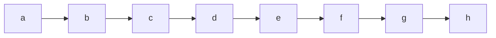
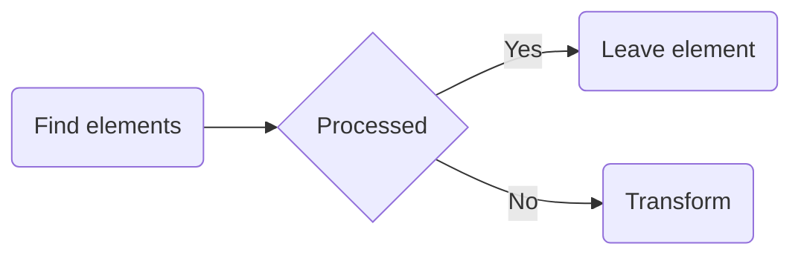

> **Warning**
>
> ## THIS IS AN AUTOGENERATED FILE. DO NOT EDIT.
>
> ## Please edit the corresponding file in [/packages/mermaid/src/docs/config/setup/mermaid/interfaces/Mermaid.md](../../../../../packages/mermaid/src/docs/config/setup/mermaid/interfaces/Mermaid.md).

[**mermaid**](../../README.md)

---

# Interface: Mermaid

Defined in: [packages/mermaid/src/mermaid.ts:418](https://github.com/mermaid-js/mermaid/blob/master/packages/mermaid/src/mermaid.ts#L418)

## Properties

### contentLoaded()

> **contentLoaded**: () => `void`

Defined in: [packages/mermaid/src/mermaid.ts:436](https://github.com/mermaid-js/mermaid/blob/master/packages/mermaid/src/mermaid.ts#L436)

\##contentLoaded Callback function that is called when page is loaded. This functions fetches
configuration for mermaid rendering and calls init for rendering the mermaid diagrams on the
page.

#### Returns

`void`

---

### detectType()

> **detectType**: (`text`, `config`?) => `string`

Defined in: [packages/mermaid/src/mermaid.ts:438](https://github.com/mermaid-js/mermaid/blob/master/packages/mermaid/src/mermaid.ts#L438)

Detects the type of the graph text.

Takes into consideration the possible existence of an `%%init` directive

#### Parameters

##### text

`string`

The text defining the graph. For example:




##### config?

[`MermaidConfig`](MermaidConfig.md)

The mermaid config.

#### Returns

`string`

A graph definition key

---

### ~~init()~~

> **init**: (`config`?, `nodes`?, `callback`?) => `Promise`<`void`>

Defined in: [packages/mermaid/src/mermaid.ts:431](https://github.com/mermaid-js/mermaid/blob/master/packages/mermaid/src/mermaid.ts#L431)

## init

#### Parameters

##### config?

[`MermaidConfig`](MermaidConfig.md)

**Deprecated**, please set configuration in [initialize](Mermaid.md#initialize).

##### nodes?

**Default**: `.mermaid`. One of the following:

- A DOM Node
- An array of DOM nodes (as would come from a jQuery selector)
- A W3C selector, a la `.mermaid`

`string` | `HTMLElement` | `NodeListOf`<`HTMLElement`>

##### callback?

(`id`) => `unknown`

Called once for each rendered diagram's id.

#### Returns

`Promise`<`void`>

#### Deprecated

Use [initialize](Mermaid.md#initialize) and [run](Mermaid.md#run) instead.

Renders the mermaid diagrams

#### Deprecated

Use [initialize](Mermaid.md#initialize) and [run](Mermaid.md#run) instead.

---

### initialize()

> **initialize**: (`config`) => `void`

Defined in: [packages/mermaid/src/mermaid.ts:435](https://github.com/mermaid-js/mermaid/blob/master/packages/mermaid/src/mermaid.ts#L435)

Used to set configurations for mermaid.
This function should be called before the run function.

#### Parameters

##### config

[`MermaidConfig`](MermaidConfig.md)

Configuration object for mermaid.

#### Returns

`void`

---

### ~~mermaidAPI~~

> **mermaidAPI**: `Readonly`<{ `defaultConfig`: [`MermaidConfig`](MermaidConfig.md); `getConfig`: () => [`MermaidConfig`](MermaidConfig.md); `getDiagramFromText`: (`text`, `metadata`) => `Promise`<`Diagram`>; `getSiteConfig`: () => [`MermaidConfig`](MermaidConfig.md); `globalReset`: () => `void`; `initialize`: (`userOptions`) => `void`; `parse`: (`text`, `parseOptions`) => `Promise`<`false` | [`ParseResult`](ParseResult.md)>(`text`, `parseOptions`?) => `Promise`<[`ParseResult`](ParseResult.md)>; `render`: (`id`, `text`, `svgContainingElement`?) => `Promise`<[`RenderResult`](RenderResult.md)>; `reset`: () => `void`; `setConfig`: (`conf`) => [`MermaidConfig`](MermaidConfig.md); `updateSiteConfig`: (`conf`) => [`MermaidConfig`](MermaidConfig.md); }>

Defined in: [packages/mermaid/src/mermaid.ts:425](https://github.com/mermaid-js/mermaid/blob/master/packages/mermaid/src/mermaid.ts#L425)

**`Internal`**

#### Deprecated

Use [parse](Mermaid.md#parse) and [render](Mermaid.md#render) instead. Please [open a discussion](https://github.com/mermaid-js/mermaid/discussions) if your use case does not fit the new API.

---

### parse()

> **parse**: (`text`, `parseOptions`) => `Promise`<`false` | [`ParseResult`](ParseResult.md)>(`text`, `parseOptions`?) => `Promise`<[`ParseResult`](ParseResult.md)>

Defined in: [packages/mermaid/src/mermaid.ts:426](https://github.com/mermaid-js/mermaid/blob/master/packages/mermaid/src/mermaid.ts#L426)

Parse the text and validate the syntax.

#### Parameters

##### text

`string`

The mermaid diagram definition.

##### parseOptions

[`ParseOptions`](ParseOptions.md) & `object`

Options for parsing.

#### Returns

`Promise`<`false` | [`ParseResult`](ParseResult.md)>

An object with the `diagramType` set to type of the diagram if valid. Otherwise `false` if parseOptions.suppressErrors is `true`.

#### See

[ParseOptions](ParseOptions.md)

#### Throws

Error if the diagram is invalid and parseOptions.suppressErrors is false or not set.

Parse the text and validate the syntax.

#### Parameters

##### text

`string`

The mermaid diagram definition.

##### parseOptions?

[`ParseOptions`](ParseOptions.md)

Options for parsing.

#### Returns

`Promise`<[`ParseResult`](ParseResult.md)>

An object with the `diagramType` set to type of the diagram if valid. Otherwise `false` if parseOptions.suppressErrors is `true`.

#### See

[ParseOptions](ParseOptions.md)

#### Throws

Error if the diagram is invalid and parseOptions.suppressErrors is false or not set.

---

### parseError?

> `optional` **parseError**: [`ParseErrorFunction`](../type-aliases/ParseErrorFunction.md)

Defined in: [packages/mermaid/src/mermaid.ts:420](https://github.com/mermaid-js/mermaid/blob/master/packages/mermaid/src/mermaid.ts#L420)

---

### registerExternalDiagrams()

> **registerExternalDiagrams**: (`diagrams`, `opts`) => `Promise`<`void`>

Defined in: [packages/mermaid/src/mermaid.ts:434](https://github.com/mermaid-js/mermaid/blob/master/packages/mermaid/src/mermaid.ts#L434)

Used to register external diagram types.

#### Parameters

##### diagrams

[`ExternalDiagramDefinition`](ExternalDiagramDefinition.md)\[]

Array of [ExternalDiagramDefinition](ExternalDiagramDefinition.md).

##### opts

If opts.lazyLoad is false, the diagrams will be loaded immediately.

###### lazyLoad?

`boolean` = `true`

#### Returns

`Promise`<`void`>

---

### registerIconPacks()

> **registerIconPacks**: (`iconLoaders`) => `void`

Defined in: [packages/mermaid/src/mermaid.ts:439](https://github.com/mermaid-js/mermaid/blob/master/packages/mermaid/src/mermaid.ts#L439)

#### Parameters

##### iconLoaders

`IconLoader`\[]

#### Returns

`void`

---

### registerLayoutLoaders()

> **registerLayoutLoaders**: (`loaders`) => `void`

Defined in: [packages/mermaid/src/mermaid.ts:433](https://github.com/mermaid-js/mermaid/blob/master/packages/mermaid/src/mermaid.ts#L433)

#### Parameters

##### loaders

[`LayoutLoaderDefinition`](LayoutLoaderDefinition.md)\[]

#### Returns

`void`

---

### render()

> **render**: (`id`, `text`, `svgContainingElement`?) => `Promise`<[`RenderResult`](RenderResult.md)>

Defined in: [packages/mermaid/src/mermaid.ts:427](https://github.com/mermaid-js/mermaid/blob/master/packages/mermaid/src/mermaid.ts#L427)

#### Parameters

##### id

`string`

##### text

`string`

##### svgContainingElement?

`Element`

#### Returns

`Promise`<[`RenderResult`](RenderResult.md)>

#### Deprecated

- use the `mermaid.render` function instead of `mermaid.mermaidAPI.render`

Deprecated for external use.

---

### run()

> **run**: (`options`) => `Promise`<`void`>

Defined in: [packages/mermaid/src/mermaid.ts:432](https://github.com/mermaid-js/mermaid/blob/master/packages/mermaid/src/mermaid.ts#L432)

## run

Function that goes through the document to find the chart definitions in there and render them.

The function tags the processed attributes with the attribute data-processed and ignores found
elements with the attribute already set. This way the init function can be triggered several
times.




Renders the mermaid diagrams

#### Parameters

##### options

[`RunOptions`](RunOptions.md) = `...`

Optional runtime configs

#### Returns

`Promise`<`void`>

---

### setParseErrorHandler()

> **setParseErrorHandler**: (`parseErrorHandler`) => `void`

Defined in: [packages/mermaid/src/mermaid.ts:437](https://github.com/mermaid-js/mermaid/blob/master/packages/mermaid/src/mermaid.ts#L437)

## setParseErrorHandler Alternative to directly setting parseError using:

```js
mermaid.parseError = function (err, hash) {
  forExampleDisplayErrorInGui(err); // do something with the error
};
```

This is provided for environments where the mermaid object can't directly have a new member added
to it (eg. dart interop wrapper). (Initially there is no parseError member of mermaid).

#### Parameters

##### parseErrorHandler

(`err`, `hash`) => `void`

New parseError() callback.

#### Returns

`void`

---

### startOnLoad

> **startOnLoad**: `boolean`

Defined in: [packages/mermaid/src/mermaid.ts:419](https://github.com/mermaid-js/mermaid/blob/master/packages/mermaid/src/mermaid.ts#L419)
