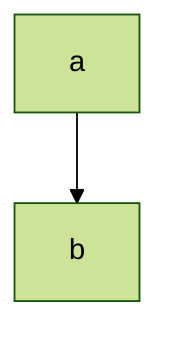
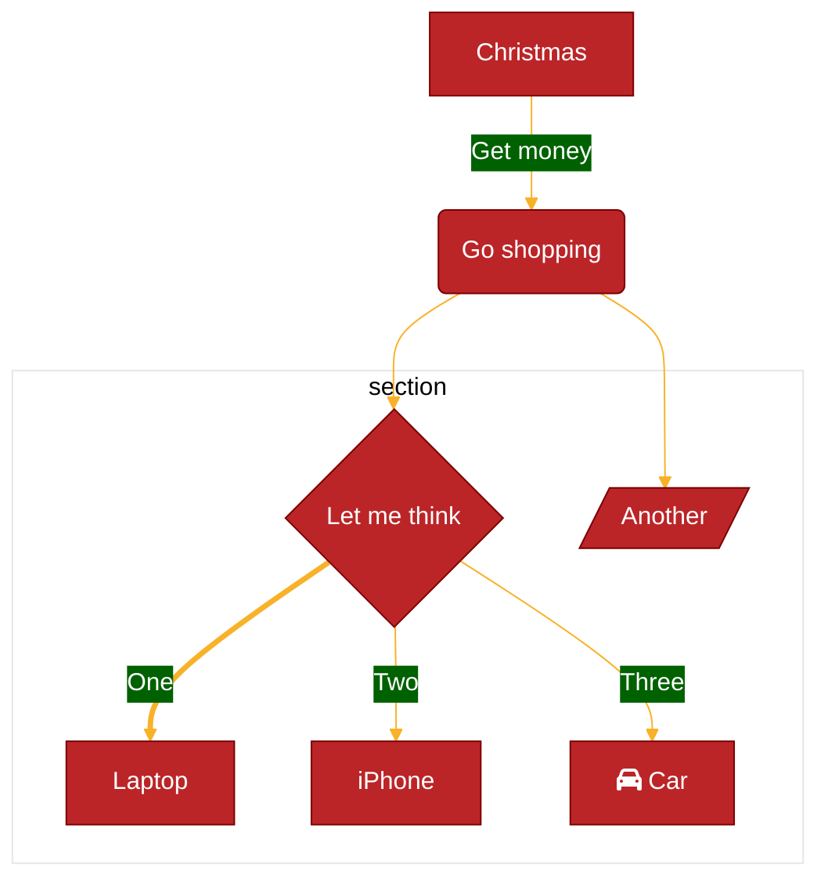

> **Warning**
>
> ## THIS IS AN AUTOGENERATED FILE. DO NOT EDIT.
>
> ## Please edit the corresponding file in [/packages/mermaid/src/docs/config/theming.md](../../packages/mermaid/src/docs/config/theming.md).
>
> **Warning**
>
> ## THIS IS AN AUTOGENERATED FILE. DO NOT EDIT.
>
> ## Please edit the corresponding file in [/packages/mermaid/src/docs/config/theming.md](../../packages/mermaid/src/docs/config/theming.md).

# Theme Configuration

Dynamic and integrated theme configuration was introduced in Mermaid version 8.7.0.

Themes can now be customized at the site-wide level, or on individual Mermaid diagrams. For site-wide theme customization, the `initialize` call is used. For diagram specific customization, the `init` directive is used.

## Available Themes

1.  [**default**](https://github.com/mermaid-js/mermaid/blob/develop/packages/mermaid/src/themes/theme-default.js) - This is the default theme for all diagrams.

2.  [**neutral**](https://github.com/mermaid-js/mermaid/blob/develop/packages/mermaid/src/themes/theme-neutral.js) - This theme is great for black and white documents that will be printed.

3.  [**dark**](https://github.com/mermaid-js/mermaid/blob/develop/packages/mermaid/src/themes/theme-dark.js) - This theme goes well with dark-colored elements or dark-mode.

4.  [**forest**](https://github.com/mermaid-js/mermaid/blob/develop/packages/mermaid/src/themes/theme-forest.js) - This theme contains shades of green.

5.  [**base**](https://github.com/mermaid-js/mermaid/blob/develop/packages/mermaid/src/themes/theme-base.js) - This is the only theme that can be modified. Use this theme as the base for customizations.

## Site-wide Theme

To customize themes site-wide, call the `initialize` method on the `mermaidAPI`.

Example of `initialize` call setting `theme` to `base`:

```javascript
mermaidAPI.initialize({
  securityLevel: 'loose',
  theme: 'base',
});
```

## Diagram-specific Themes

To customize the theme of an individual diagram, use the `init` directive.

Example of `init` directive setting the `theme` to `forest`:




> **Reminder**: the only theme that can be customed is the `base` theme. The following section covers how to use `themeVariables` for customizations.

## Customizing Themes with `themeVariables`

To make a custom theme, modify `themeVariables` via `init`.

You will need to use the [base](#available-themes) theme as it is the only modifiable theme.

| Parameter      | Description                          | Type   | Properties                                                                                          |
| -------------- | ------------------------------------ | ------ | --------------------------------------------------------------------------------------------------- |
| themeVariables | Modifiable with the `init` directive | Object | `primaryColor`, `primaryTextColor`, `lineColor` ([see full list](#theme-variables-reference-table)) |

Example of modifying `themeVariables` using the `init` directive:




## Color and Color Calculation

To ensure diagram readability, the default value of certain variables is calculated or derived from other variables. For example, `primaryBorderColor` is derived from the `primaryColor` variable. So if the `primaryColor` variable is customized, Mermaid will adjust `primaryBorderColor` automatically. Adjustments can mean a color inversion, a hue change, a darkening/lightening by 10%, etc.

The theming engine will only recognize hex colors and not color names. So, the value `#ff0000` will work, but `red` will not.

## Theme Variables

| Variable             | Default value                      | Description                                                                                                                      |
| -------------------- | ---------------------------------- | -------------------------------------------------------------------------------------------------------------------------------- |
| darkMode             | false                              | Affects how derived colors are calculated. Set value to `true` for dark mode.                                                    |
| background           | #f4f4f4                            | Used to calculate color for items that should either be background colored or contrasting to the background                      |
| fontFamily           | trebuchet ms, verdana, arial       |                                                                                                                                  |
| fontSize             | 16px                               | Font size in pixels                                                                                                              |
| primaryColor         | #fff4dd                            | Color to be used as background in nodes, other colors will be derived from this                                                  |
| primaryBorderColor   | calculated from primaryColor       | Color to be used as border in nodes using `primaryColor`                                                                         |
| primaryBorderColor   | calculated from primaryColor       | Color to be used as border in nodes using `primaryColor`                                                                         |
| primaryTextColor     | calculated from darkMode #ddd/#333 | Color to be used as text color in nodes using `primaryColor`                                                                     |
| secondaryColor       | calculated from primaryColor       |                                                                                                                                  |
| primaryBorderColor   | calculated from primaryColor       | Color to be used as border in nodes using `primaryColor`                                                                         |
| secondaryBorderColor | calculated from secondaryColor     | Color to be used as border in nodes using `secondaryColor`                                                                       |
| primaryBorderColor   | calculated from primaryColor       | Color to be used as border in nodes using `primaryColor`                                                                         |
| secondaryTextColor   | calculated from secondaryColor     | Color to be used as text color in nodes using `secondaryColor`                                                                   |
| tertiaryColor        | calculated from primaryColor       |                                                                                                                                  |
| tertiaryBorderColor  | calculated from tertiaryColor      | Color to be used as border in nodes using `tertiaryColor`                                                                        |
| tertiaryTextColor    | calculated from tertiaryColor      | Color to be used as text color in nodes using `tertiaryColor`                                                                    |
| noteBkgColor         | #fff5ad                            | Color used as background in notes                                                                                                |
| noteTextColor        | #333                               | Text color in note rectangles                                                                                                    |
| noteBorderColor      | calculated from noteBkgColor       | Border color in note rectangles                                                                                                  |
| lineColor            | calculated from background         |                                                                                                                                  |
| textColor            | calculated from primaryTextColor   | Text in diagram over the background for instance text on labels and on signals in sequence diagram or the title in Gantt diagram |
| mainBkg              | calculated from primaryColor       | Background in flowchart objects like rects/circles, class diagram classes, sequence diagram etc                                  |
| errorBkgColor        | tertiaryColor                      | Color for syntax error message                                                                                                   |
| errorTextColor       | tertiaryTextColor                  | Color for syntax error message                                                                                                   |

## Flowchart Variables

| Variable            | Default value                  | Description                 |
| ------------------- | ------------------------------ | --------------------------- |
| nodeBorder          | primaryBorderColor             | Node Border Color           |
| clusterBkg          | tertiaryColor                  | Background in subgraphs     |
| clusterBorder       | tertiaryBorderColor            | Cluster Border Color        |
| defaultLinkColor    | lineColor                      | Link Color                  |
| titleColor          | tertiaryTextColor              | Title Color                 |
| edgeLabelBackground | calculated from secondaryColor |                             |
| nodeTextColor       | primaryTextColor               | Color for text inside Nodes |

## Sequence Diagram Variables

| Variable              | Default value                  | Description                 |
| --------------------- | ------------------------------ | --------------------------- |
| actorBkg              | mainBkg                        | Actor Background Color      |
| actorBorder           | primaryBorderColor             | Actor Border Color          |
| actorTextColor        | primaryTextColor               | Actor Text Color            |
| actorLineColor        | grey                           | Actor Line Color            |
| signalColor           | textColor                      | Signal Color                |
| signalTextColor       | textColor                      | Signal Text Color           |
| labelBoxBkgColor      | actorBkg                       | Label Box Background Color  |
| labelBoxBorderColor   | actorBorder                    | Label Box Border Color      |
| labelTextColor        | actorTextColor                 | Label Text Color            |
| loopTextColor         | actorTextColor                 | Loop Text Color             |
| activationBorderColor | calculated from secondaryColor | Activation Border Color     |
| activationBkgColor    | secondaryColor                 | Activation Background Color |
| sequenceNumberColor   | calculated from lineColor      | Sequence Number Color       |

## State Colors

| Variable      | Default value    | Description                                  |
| ------------- | ---------------- | -------------------------------------------- |
| labelColor    | primaryTextColor |                                              |
| altBackground | tertiaryColor    | Used for background in deep composite states |

## Class Colors

| Variable  | Default value | Description                     |
| --------- | ------------- | ------------------------------- |
| classText | textColor     | Color of Text in class diagrams |

## User Journey Colors

| Variable  | Default value                  | Description                             |
| --------- | ------------------------------ | --------------------------------------- |
| fillType0 | primaryColor                   | Fill for 1st section in journey diagram |
| fillType1 | secondaryColor                 | Fill for 2nd section in journey diagram |
| fillType2 | calculated from primaryColor   | Fill for 3rd section in journey diagram |
| fillType3 | calculated from secondaryColor | Fill for 4th section in journey diagram |
| fillType4 | calculated from primaryColor   | Fill for 5th section in journey diagram |
| fillType5 | calculated from secondaryColor | Fill for 6th section in journey diagram |
| fillType6 | calculated from primaryColor   | Fill for 7th section in journey diagram |
| fillType7 | calculated from secondaryColor | Fill for 8th section in journey diagram |
