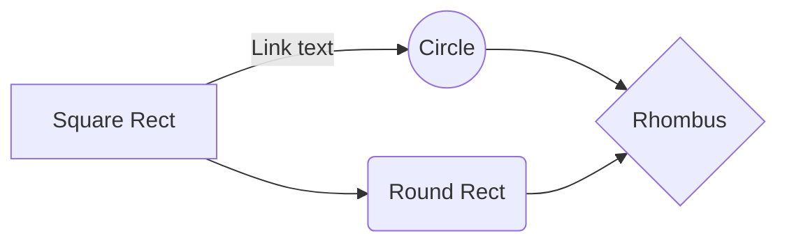
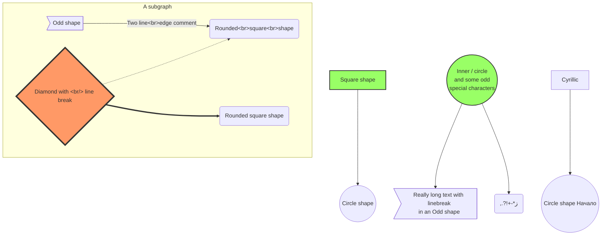
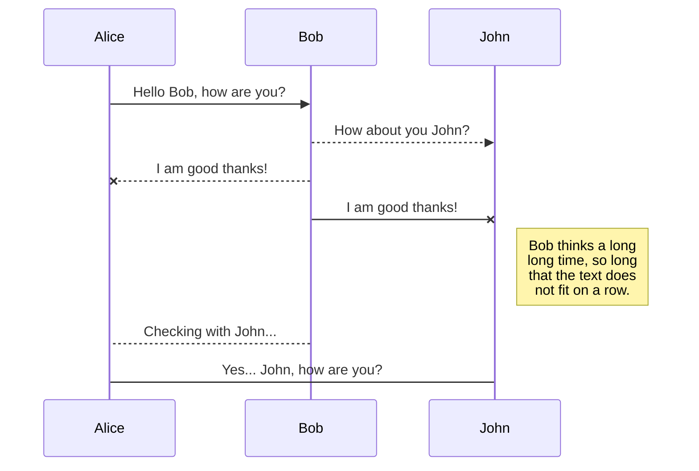
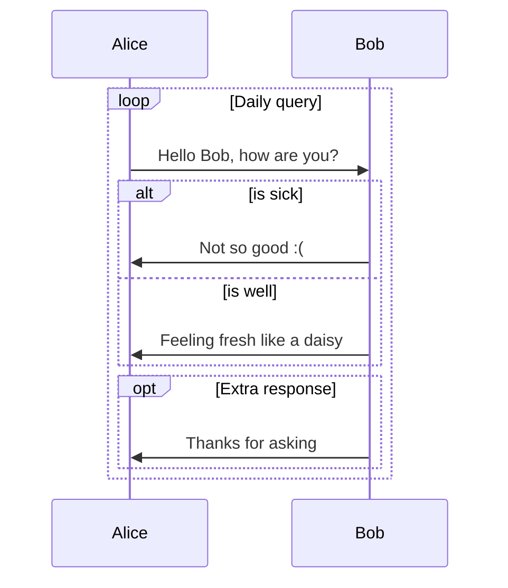
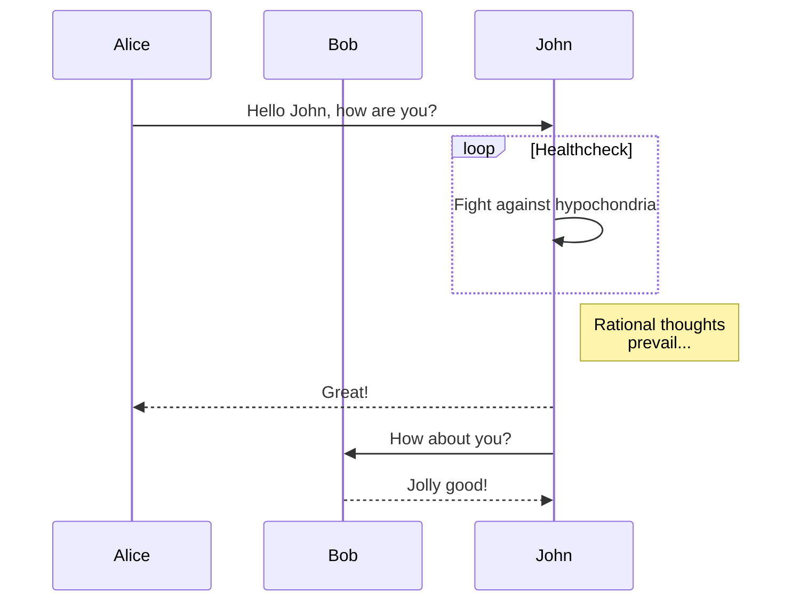

# Demos
## Basic flowchart
```
%% Example diagram
graph LR
	A[Square Rect] -- Link text --> B((Circle))
	A --> C(Round Rect)
	B --> D{Rhombus}
	C --> D
```



## Larger flowchart with some styling


```
%% Code for flowchart below
graph TB
	sq[Square shape] --> ci((Circle shape))

	subgraph A subgraph
		od>Odd shape]-- Two line&lt;br>edge comment --> ro
		di{Diamond with &lt;br/> line break} -.-> ro(Rounded&lt;br>square&lt;br>shape)
		di==>ro2(Rounded square shape)
	end

	%% Notice that no text in shape are added here instead that is appended further down
	e --> od3>Really long text with linebreak&lt;br>in an Odd shape]

	%% Comments after double percent signs
	e((Inner / circle&lt;br>and some odd &lt;br>special characters)) --> f(,.?!+-*ز)

	cyr[Cyrillic]-->cyr2((Circle shape Начало));

 	classDef green fill:#9f6,stroke:#333,stroke-width:2px;
 	classDef orange fill:#f96,stroke:#333,stroke-width:4px;
 	class sq,e green
 	class di orange
```


## Basic sequence diagram
```
%% Sequence diagram code
sequenceDiagram
	Alice ->> Bob: Hello Bob, how are you?
	Bob-->>John: How about you John?
	Bob--x Alice: I am good thanks!
	Bob-x John: I am good thanks!
	Note right of John: Bob thinks a long&lt;br/>long time, so long&lt;br/>that the text does&lt;br/>not fit on a row.

	Bob-->Alice: Checking with John...
	Alice->John: Yes... John, how are you?
```

## Loops, alt and opt
```
%% Sequence diagram code
sequenceDiagram
	loop Daily query
		Alice-&gt;&gt;Bob: Hello Bob, how are you?
		alt is sick
			Bob-&gt;&gt;Alice: Not so good :(
		else is well
			Bob-&gt;&gt;Alice: Feeling fresh like a daisy
		end

		opt Extra response
			Bob-&gt;&gt;Alice: Thanks for asking
		end
	end
```

## Message to self in loop
```
%% Sequence diagram code
sequenceDiagram
	participant Alice
	participant Bob
	Alice->>John: Hello John, how are you?
	loop Healthcheck
		John->>John: Fight against hypochondria
	end
	Note right of John: Rational thoughts&lt;br/>prevail...
	John-->>Alice: Great!
	John->>Bob: How about you?
	Bob-->>John: Jolly good!
```
