# Flowcharts - Basic Syntax
## Graph
This statement declares a new graph and the direction of the graph layout.

```
%% Example code
graph TD
```
This declares a graph oriented from top to bottom.

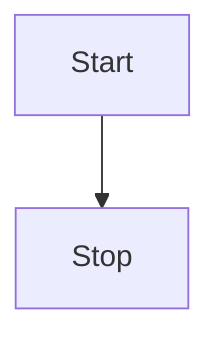

```
%% Example code
graph LR
```

This declares a graph oriented from left to right.

Possible directions are:

* TB - top bottom
* BT - bottom top
* RL - right left
* LR - left right

* TD - same as TB

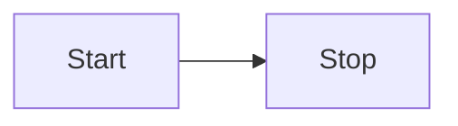

## Nodes & shapes

### A node (default)
```
graph LR
    id1
```
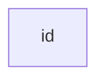
Note that the id is what is displayed in the box.

### A node with text
It is also possible to set text in the box that differs from the id. If this is done several times, it is the last text
found for the node that will be used. Also if you define edges for the node later on, you can omit text definitions. The
one previously defined will be used when rendering the box.

```
graph LR
    id1[This is the text in the box]
```

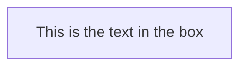


### A node with round edges
```
graph LR
    id1(This is the text in the box);
```

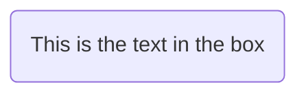

### A node in the form of a circle
```
graph LR
    id1((This is the text in the circle));
```

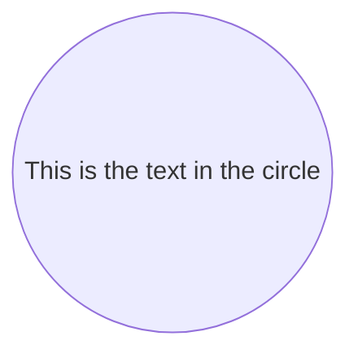

### A node in an asymetric shape
```
graph LR
    id1>This is the text in the box]
```

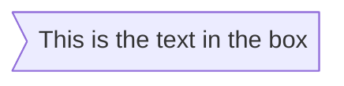
Currently only the shape above is possible and not its mirror. *This might change with future releases.*

### A node (rhombus)
```
graph LR
    id1{This is the text in the box}
```

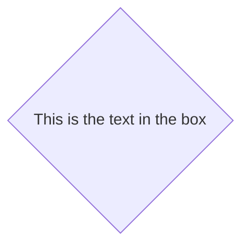
## Links between nodes

Nodes can be connected with links/edges. It is possible to have different types of links or attach a text string to a link.

### A link with arrow head
```
graph LR
    A-->B
```
```
graph LR;
    A-->B
```

### An open link

```
graph LR
    A --- B
```

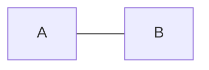

### Text on links

```
A-- This is the text --- B
```
or
```
A---|This is the text|B;
```

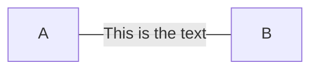

### A link with arrow head and text
```
A-->|text|B
```
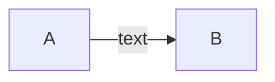

or
```
A-- text -->B
```


### Dotted link
-.->
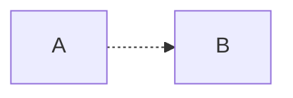
### Dotted link with text
-. text .->
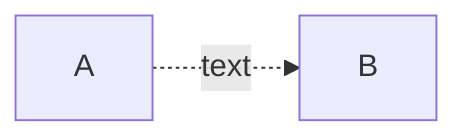
### Thick link
==>
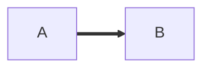
### Thick link with text
== text ==>
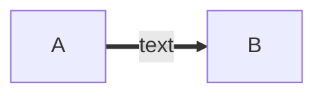

## Special characters that break syntax

It is possible to put text within quotes in order to render more troublesome characters. As in the example below:

```
graph LR
    d1["This is the (text) in the box"]
```

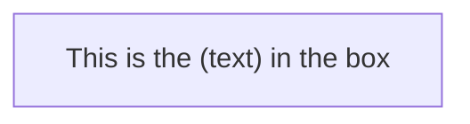

### Entity codes to escape characters

It is possible to escape characters using the syntax examplified here.

The flowchart defined by the following code:
```
    graph LR
        A["A double quote:#quot;"] -->B["A dec char:#9829;"]
```

This would render to the diagram below:

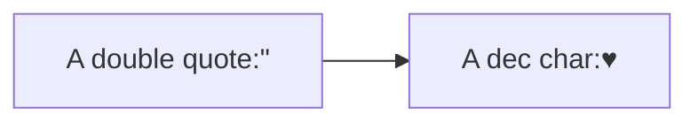

## Subgraphs

```
subgraph title
    graph definition
end
```

An example below:
 ```
 %% Subgraph example
 graph TB
         subgraph one
         a1-->a2
         end
         subgraph two
         b1-->b2
         end
         subgraph three
         c1-->c2
         end
         c1-->a2
 ```

 ```mermaid
graph TB
    c1-->a2
    subgraph one
    a1-->a2
    end
    subgraph two
    b1-->b2
    end
    subgraph three
    c1-->c2
    end

 ```


## Interaction

It is possible to bind a click event to a node, the click can lead to either a javascript callback or to a link which will be opened in a new browser tab.

```
click nodeId callback
```

* nodeId is the id of the node
* callback is the name of a javascript function defined on the page displaying the graph, the function will be called with the nodeId as parameter.

Examples of tooltip usage below:

```
&lt;script&gt;
    var callback = function(){
        alert(&#39;A callback was triggered&#39;);
    }
&lt;script&gt;
```

```
graph LR;
    A-->B;
    click A callback "Tooltip for a callback"
    click B "http://www.github.com" "This is a tooltip for a link"
```


The tooltip text is surrounded in double quotes. The styles of the tooltip are set by the class .mermaidTooltip.


<aside class="success">The tooltip functionality and the ability to link to urls are available from version 0.5.2.</aside>

When integration mermaid using the mermaidAPI #mermaidapi the function that binds the events need to be run when the finished graph has been added to the page. This is described in the [API usage](#api-usage) section.

## Styling and classes

### Styling links
It is possible to style links. For instance you might want to style a link that is going backwards in the flow. As links
have no ids in the same way as nodes, some other way of deciding what style the links should be attached to is required.
Instead of ids, the order number of when the link was defined in the graph is used. In the example below the style
defined in the linkStyle statement will belong to the fourth link in the graph:

```
linkStyle 3 stroke:#ff3,stroke-width:4px;
```

### Styling a node
It is possible to apply specific styles such as a thicker border or a different background color to a node.

```
%% Example code
graph LR
    id1(Start)-->id2(Stop)
    style id1 fill:#f9f,stroke:#333,stroke-width:4px;
    style id2 fill:#ccf,stroke:#f66,stroke-width:2px,stroke-dasharray: 5, 5;
```
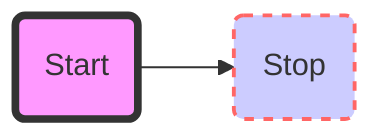

#### Classes
More convenient then defining the style every time is to define a class of styles and attach this class to the nodes that
should have a different look.

a class definition looks like the example below:

```
    classDef className fill:#f9f,stroke:#333,stroke-width:4px;
```

Attachment of a class to a node is done as per below:

```
    class nodeId1 className;
```

It is also possible to attach a class to a list of nodes in one statement:

```
    class nodeId1,nodeId2 className;
```
### Css classes

It is also possible to pre dine classes in css styles that can be applied from the graph definition as in the example
below:
**Example style**
```
<style>
    .cssClass > rect{
        fill:#FF0000;
        stroke:#FFFF00;
        stroke-width:4px;
    }
</style>
```
**Example definition**
```
graph LR;
    A-->B[AAA<span>BBB</span>];
    B-->D;
    class A cssClass;
```

<aside class="warning">Class definitions in the graph defnition is broken in version 0.5.1 but has been fixed in the master branch of mermaid. This fix will be included in 0.5.2</aside>


### Default class

If a class is named default it will be assigned to all classes without specific class definitions.

```
    classDef default fill:#f9f,stroke:#333,stroke-width:4px;
```

## Basic support for fontawesome

It is possible to add icons from fontawesome. In order to do so, you need to add the fontwesome as described in the instructions at 
[the fontawesome web site](https://fortawesome.github.io/Font-Awesome/).

The icons are acessed via the syntax fa:#icon class name#.

The example code below
```
graph TD
    B["fa:fa-twitter for peace"]
    B-->C[fa:fa-ban forbidden]
    B-->D(fa:fa-spinner);
    B-->E(A fa:fa-camera-retro perhaps?);
```

Would render the graph below:

```mermaid
graph TD
    B["fa:fa-twitter for peace"]
    B-->C[fa:fa-ban forbidden]
    B-->D(fa:fa-spinner);
    B-->E(A fa:fa-camera-retro perhaps?);
```

<aside class="success">Support for fontawesome has been comitted to the  master branch and will be included in 0.5.3</aside>

## Graph declarations with spaces between vertices and link and without semicolon

* In graph declarations, the statements also can now end without a semicolon. After release 0.2.16, ending a graph statement with semicolon is just optional. So the below graph declaration is also valid along with the old declarations of the graph.

* A single space is allowed between vertices and the link. However there should not be any space between a vertex and its text and a link and its text. The old syntax of graph declaration will also work and hence this new feature is optional and is introduce to improve readability.

Below is the new declaration of the graph edges which is also valid along with the old declaration of the graph edges.

```
    A[Hard edge] -->|Link text| B(Round edge)
    B --> C{Decision}
    C -->|One| D[Result one]
    C -->|Two| E[Result two]
```


```mermaid
graph LR
    A[Hard edge] -->|Link text| B(Round edge)
    B --> C{Decision}
    C -->|One| D[Result one]
    C -->|Two| E[Result two]
```
