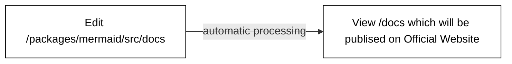

> **Warning**
>
> ## THIS IS AN AUTOGENERATED FILE. DO NOT EDIT.
>
> ## Please edit the corresponding file in [/packages/mermaid/src/docs/contributing/documentation.md](../../packages/mermaid/src/docs/contributing/documentation.md).

# Contributing Documentation

If it is not in the documentation, it's like it never happened. Wouldn't that be sad? With all the effort that was put into the feature?

## Where is the Documentation Located?

> **Warning**
> DO NOT CHANGE FILES IN `/docs`
>
> The `docs` folder will be automatically generated when committing to `packages/mermaid/src/docs` and **should not** be edited manually.

It is located in the [`packages/mermaid/src/docs`](https://github.com/mermaid-js/mermaid/tree/develop/packages/mermaid/src/docs) folder. Just pick the right section and start typing.

The contents of [mermaid.js.org](https://mermaid.js.org/) are based on the docs from the `master` branch. Updates committed to the `master` branch are reflected in the [Mermaid Docs](https://mermaid.js.org/) once published.




## Enable Github Actions

> **Warning**
> So as to allow automatic compilation of documentation pages you have to enable github actions on your fork first

## Running the Documentation Website Locally

**[The mermaid documentation site](https://mermaid.js.org/) is powered by [Vitepress](https://vitepress.vuejs.org/).**

Start development server for the documentation site

**Host**

```bash
pnpm --filter mermaid run docs:dev
```

or

```bash
cd packages/mermaid
pnpm docs:dev
```

**Docker**

    ./run docs:dev

Open <http://localhost:3333/> in your browser.

## Format

The documentation is written in Markdown. To get acquainted with its syntax [see the GitHub Markdown help page](https://help.github.com/en/github/writing-on-github/basic-writing-and-formatting-syntax).

You can use `note`, `tip`, `warning` and `danger` in triple backticks to add a note, tip, warning or danger box.

> **‼️ Danger**
> Do not use vitepress specific markdown syntax `::: warning` as it will not be processed correctly.

````markdown
```note
This is a note
```

```tip
This is a tip
```

```warning
This is a warning
```

```danger
This is a danger alert
```
````

## Documentation organization: Sidebar navigation

If you want to propose changes to how the documentation is _organized_, such as adding a new section or re-arranging or renaming a section, you must update the **sidebar navigation.**

The sidebar navigation is defined in [the vitepress configuration file config.ts](../.vitepress/config.ts).
