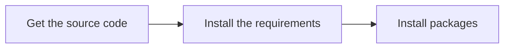

> **Warning**
>
> ## THIS IS AN AUTOGENERATED FILE. DO NOT EDIT.
>
> ## Please edit the corresponding file in [/packages/mermaid/src/docs/contributing/setup.md](../../packages/mermaid/src/docs/contributing/setup.md).

# Initial Setup

Initial setup consists of 3 main steps:



## Get the Source Code

In GitHub, you first **fork** a repository when you are going to make changes and submit pull requests.

Then you **clone** a copy to your local development machine (e.g. where you code) to make a copy with all the files to work with.

[Fork mermaid](https://github.com/mermaid-js/mermaid/fork) to start contributing to the main project and its documentation, or [search for other repositories](https://github.com/orgs/mermaid-js/repositories).

[Here is a GitHub document that gives an overview of the process](https://docs.github.com/en/get-started/quickstart/fork-a-repo).

```bash
git clone git@github.com/your-fork/mermaid
```

Once you have cloned the repository onto your development machine, change into the `mermaid` project folder (the top level directory of the mermaid project repository)

```bash
cd mermaid
```

## Install Requirements

We support **development within Docker** environment along with **host setup**. You may choose it up to your preferences.

### Host

These are the tools we use for working with the code and documentation:

- [volta](https://volta.sh/) to manage node versions.
- [Node.js](https://nodejs.org/en/). `volta install node`
- [pnpm](https://pnpm.io/) package manager. `volta install pnpm`
- [npx](https://docs.npmjs.com/cli/v8/commands/npx) the packaged executor in npm. This is needed [to install pnpm.](#install-packages)

### Docker

[Install Docker](https://docs.docker.com/engine/install/). And that is pretty much all you need.

Optionally, to run GUI (Cypress) within Docker you will also need an X11 server installed.
You might already have it installed, so check this by running:

```bash
echo $DISPLAY
```

If the `$DISPLAY` variable is not empty, then an X11 server is running. Otherwise you may need to install one.

## Install packages

### Host

Run `npx pnpm install`. You will need `npx` for this because `volta` doesn't support it yet.

```bash
npx pnpm install # npx is required for first install
```

### Docker

For development using Docker there is a self-documented `run` bash script, which provides convenient aliases for `docker compose` commands.

Make sure that `./run` script is executable:

```bash
chmod +x run
```

> **💡 Tip**
> To get detailed help simply type `./run` or `./run help`.
>
> It also has short _Development quick start guide_ embedded.

```bash
./run pnpm install # Install packages
```

## Verify Everything Works

This step is optional, but it helps to make sure that everything in development branch was OK before you started making any changes.

You can run the `test` script to verify that pnpm is working _and_ that the repository has been cloned correctly:

**Host**

```bash
pnpm test
```

**Docker**

```bash
./run pnpm test
```

The `test` script and others are in the top-level `package.json` file.

All tests should run successfully without any errors or failures. (You might see _lint_ or _formatting_ warnings; those are ok during this step.)
