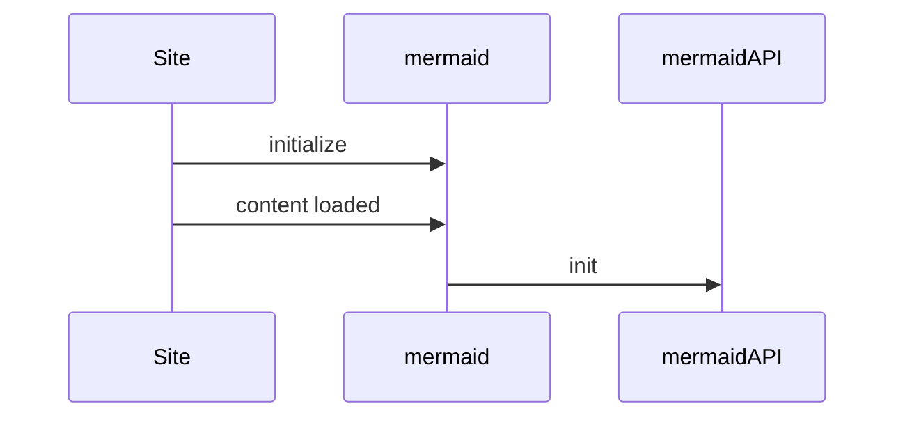

# Configuration

When mermaid starts configuration is extracted to a configuration to be used for a diagram. There a 3 sources for configuration:

* The default configuration
* Overrides on the site level, set is set by the initialize call and will  be applied for all diagrams in the site/app. The term for this is the **siteConfig**.
* Directives - diagram authors can update select configuration parameters directly in the diagram code via directives and these are applied to the render config.

**The render config** is configuration that is used when rendering by applying these configurations.

## Theme configuration

## Starting mermaid

## Initialize

Initialize call is called **only once**. It is called by the site integrator in order to override the default configuration on a site level.

## configApi.reset

This method resets the configuration for a diagram to the site configuration, the configuration provided by the site integrator. Before each rendering of a diagram reset is called in the very beginning of render.

##
