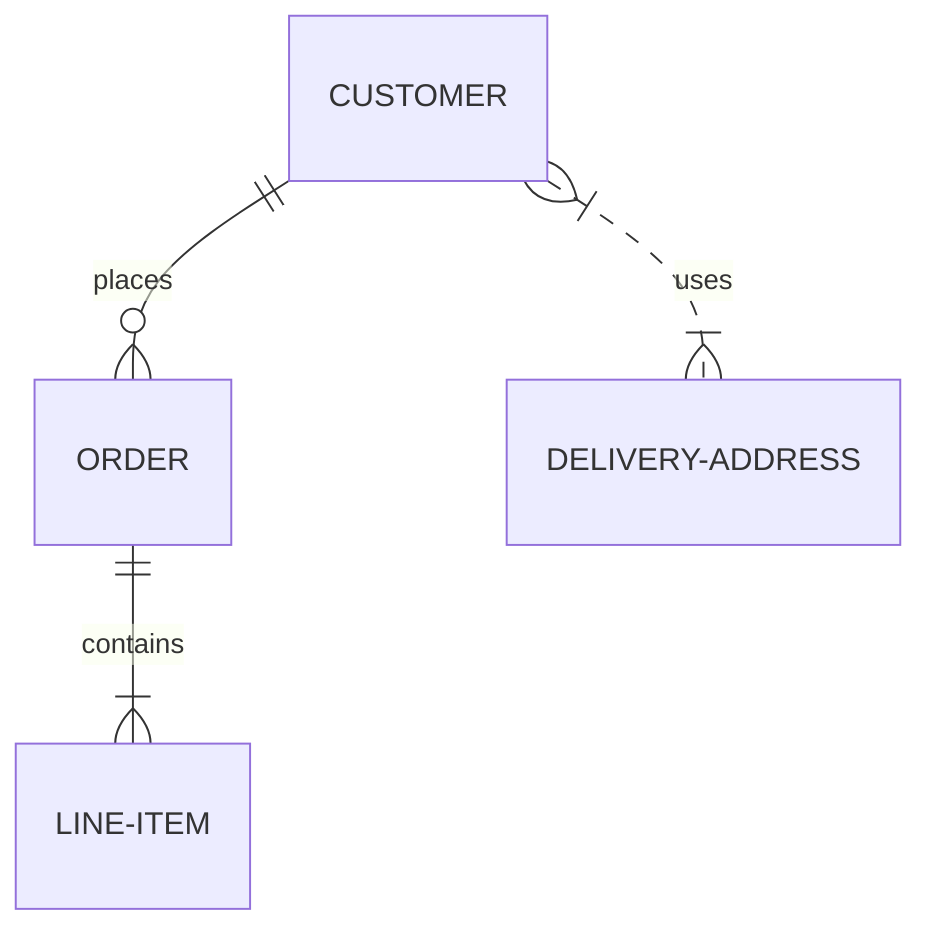

# Entity Relationship Diagrams

> An entity–relationship model (or ER model) describes interrelated things of interest in a specific domain of knowledge. A basic ER model is composed of entity types (which classify the things of interest) and specifies relationships that can exist between entities (instances of those entity types). Wikipedia.

Note that practitioners of ER modelling almost always refer to *entity types* simply as *entities*.  For example the CUSTOMER entity type would be referred to simply as the CUSTOMER entity.  This is so common it would be inadvisable to do anything else, but technically an entity is an abstract *instance* of an entity type, and this is what an ER diagram shows - abstract instances, and the relationships between them.  This is why entities are always named using singular nouns.

Mermaid can render ER diagrams




Entity names are often capitalised, although there is no accepted standard on this, and it is not required in Mermaid.

Relationships between entities are represented by lines with end markers representing cardinality.  Mermaid uses the most popular crow's foot notation. The crow's foot intuitively conveys the possibility of many instances of the entity that it connects to.

## Status

ER diagrams are a new feature in Mermaid and are **experimental**.  There are likely to be a few bugs and constraints, and enhancements will be made in due course.  Currently you can only define entities and relationships, but not attributes.

## Syntax

### Entities and Relationships

Mermaid syntax for ER diagrams is compatible with PlantUML, with an extension to label the relationship.  Each statement consists of the following parts, all of which are mandatory:

```mermaid
    <first-entity> <relationship> <second-entity> : <relationship-label>
```

Where:

- `first-entity` is the name of an entity.  Names must begin with an alphabetic character and may also contain digits and hyphens
- `relationship` describes the way that both entities inter-relate.  See below.
- `second-entity` is the name of the other entity
- `relationship-label` describes the relationship from the perspective of the first entity.

For example:

```mermaid
    PROPERTY ||--|{ ROOM : contains
```

This statement can be read as *a property contains one or more rooms, and a room is part of one and only one property*. You can see that the label here is from the first entity's perspective: a property contains a room, but a room does not contain a property.  When considered from the perspective of the second entity, the equivalent label is usually very easy to infer. (Some ER diagrams label relationships from both perspectives, but this is not supported here, and is usually superfluous).

### Relationship Syntax

The `relationship` part of each statement can be broken down into three sub-components:

- the cardinality of the first entity with respect to the second,
- whether the relationship confers identity on a 'child' entity
- the cardinality of the second entity with respect to the first

Cardinality is a property that describes how many elements of another entity can be related to the entity in question.  In the above example a `PROPERTY` can have one or more `ROOM` instances associated to it, whereas a `ROOM` can only be associated with one `PROPERTY`.  In each cardinality marker there are two characters.  The outermost character represents a maximum value, and the innermost character represents a minimum value.  The table below summarises possible cardinalities.

| Value (left) | Value (right) | Meaning                                                |
|:------------:|:-------------:|--------------------------------------------------------|
|     `\|o`    |       `o\|`   | Zero or one                                            |
|     `\|\|`   |       `\|\|`  | Exactly one                                            |
|     `}o`     |       `o{`    | Zero or more (no upper limit)                          |
|     `}\|`    |       `\|{`   | One or more (no upper limit)                           |

### Identification

Relationships may be classified as either *identifying* or *non-identifying* and these are rendered with either solid or dashed lines respectively. This is relevant when one of the entities in question can not have independent existence without the other.  For example a firm that insures people to drive cars might need to store data on `NAMED-DRIVER`s. In modelling this we might start out by observing that a `CAR` can be driven by many `PERSON` instances, and a `PERSON` can drive many `CAR`s - both entities can exist without the other, so this is a non-identifying relationship that we might specify in Mermaid as: `PERSON }|..|{ CAR : "driver"`.  Note the two dots in the middle of the relationship that will result in a dashed line being drawn between the two entities.  But when this many-to-many relationship is resolved into two one-to-many relationships, we observe that a `NAMED-DRIVER` cannot exist without both a `PERSON` and a `CAR` - the relationships become identifying and would be specified using hyphens, which translate to a solid line:

```mermaid
    CAR ||--o{ NAMED-DRIVER : allows
    PERSON ||--o{ NAMED-DRIVER : is
```

### Other Things

- If you want the relationship label to be more than one word, you must use double quotes around the phrase
- If you don't want a label at all on a relationship, you must use an empty double-quoted string

## Styling

### Config options

For simple color customization:

| Name     | Used as                                                 |
| :------- | :------------------------------------------------------ |
| `fill`   | Background color of an entity                           |
| `stroke` | Border color of an entity, line color of a relationship |

### Classes used

The following CSS class selectors are available for richer styling:

| Selector                   | Description                                           |
| :------------------------- | :---------------------------------------------------- |
| `.er.entityBox`            | The box representing an entity                        |
| `.er.entityLabel`          | The label for an entity                               |
| `.er.relationshipLabel`    | The label for a relationship                          |
| `.er.relationshipLabelBox` | The box surrounding a relationship label              |
| `.er.relationshipLine`     | The line representing a relationship between entities |
