# Flowcharts - Basic Syntax

**Edit this Page** [](https://github.com/mermaid-js/mermaid/blob/develop/docs/flowchart.md)

All Flowcharts are composed of **nodes**, the geometric shapes and **edges**, the arrows or lines. The mermaid code defines the way that these **nodes** and **edges** are made and interact.

It can also accomodate different arrow types, multi directional arrows, and linking to and from subgraphs.

> **Important note**: Do not type the word "end" as a Flowchart node. Capitalize all or any one the letters to keep the flowchart from breaking, i.e, "End" or "END". Or you can apply this [workaround](https://github.com/mermaid-js/mermaid/issues/1444#issuecomment-639528897).**
Node
### A node (default)

```
graph LR
    id
```

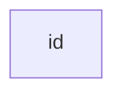

> **Note** The id is what is displayed in the box.

### A node with text

It is also possible to set text in the box that differs from the id. If this is done several times, it is the last text
found for the node that will be used. Also if you define edges for the node later on, you can omit text definitions. The
one previously defined will be used when rendering the box.

```
graph LR
    id1[This is the text in the box]
```
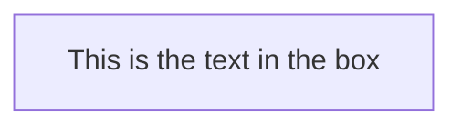

## Graph

This statement declares the direction of the Flowchart.

This declares the graph is oriented from top to bottom (`TD` or `TB`).

```
graph TD
    Start --> Stop
```
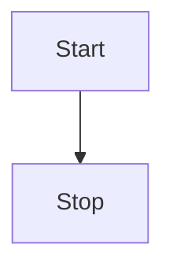

This declares the graph is oriented from left to right (`LR`).

```
graph LR
    Start --> Stop
```
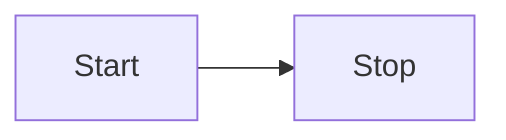

## Flowchart Orientation

Possible FlowChart orientations are:

* TB - top to bottom
* TD - top-down/ same as top to bottom
* BT - bottom to top
* RL - right to left
* LR - left to right

## Node shapes

### A node with round edges

```
graph LR
    id1(This is the text in the box)
```
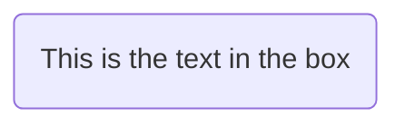

### A stadium-shaped node

```
graph LR
    id1([This is the text in the box])
```


### A node in a subroutine shape

```
graph LR
    id1[[This is the text in the box]]
```
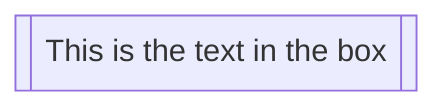

### A node in a cylindrical shape

```
graph LR
    id1[(Database)]
```
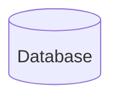

### A node in the form of a circle

```
graph LR
    id1((This is the text in the circle))
```
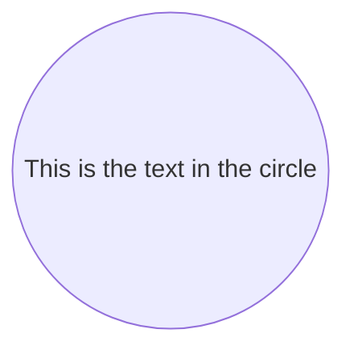

### A node in an asymmetric shape

```
graph LR
    id1>This is the text in the box]
```

Currently only the shape above is possible and not its mirror. *This might change with future releases.*

### A node (rhombus)

```
graph LR
    id1{This is the text in the box}
```
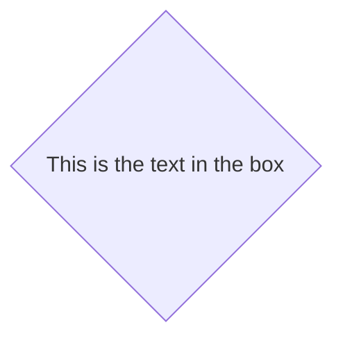

### A hexagon node
```
graph LR
    id1{{This is the text in the box}}
```

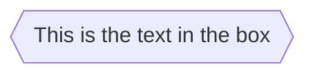

### Parallelogram

```
graph TD
    id1[/This is the text in the box/]
```
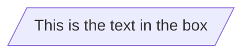

### Parallelogram alt

```
graph TD
    id1[\This is the text in the box\]
```
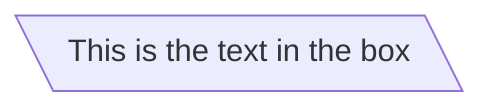

### Trapezoid

```
graph TD
    A[/Christmas\]
```
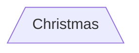
### Trapezoid alt

```
graph TD
    B[\Go shopping/]
```
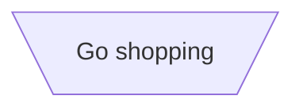

## Links between nodes

Nodes can be connected with links/edges. It is possible to have different types of links or attach a text string to a link.

### A link with arrow head

```
graph LR
    A-->B
```
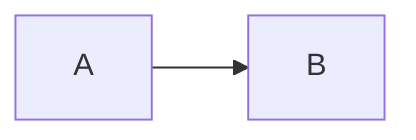

### An open link

```
graph LR
    A --- B
```
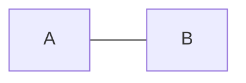

### Text on links

```
graph LR
    A-- This is the text! ---B
```
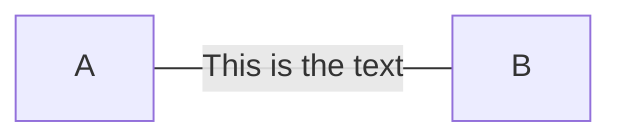

or

```
graph LR
    A---|This is the text|B
```


### A link with arrow head and text

```
graph LR
    A-->|text|B
```
```mermaid
graph LR
    A-->|text|B
```

or

```
graph LR
    A-- text -->B
```
```mermaid
graph LR
    A-- text -->B
```

### Dotted link

```
graph LR;
   A-.->B;
```
```mermaid
graph LR;
   A-.->B;
```

### Dotted link with text

```
graph LR
   A-. text .-> B
```
```mermaid
graph LR
   A-. text .-> B
```

### Thick link

```
graph LR
   A ==> B
```
```mermaid
graph LR
   A ==> B
```

### Thick link with text

```
graph LR
   A == text ==> B
```
```mermaid
graph LR
   A == text ==> B
```

### Chaining of links

It is possible declare many links in the same line as per below:
```
graph LR
   A -- text --> B -- text2 --> C
```
```mermaid
graph LR
   A -- text --> B -- text2 --> C
```

It is also possible to declare multiple nodes links in the same line as per below:
```
graph LR
   a --> b & c--> d
```
```mermaid
graph LR
   a --> b & c--> d
```

You can then describe dependencies in a very expressive way. Like the one-liner below:
```
graph TB
    A & B--> C & D
```
```mermaid
graph TB
    A & B--> C & D
```
If you describe the same diagram using the the basic syntax, it will take four lines. A
word of warning, one could go overboard with this making the graph harder to read in
markdown form. The Swedish word `lagom` comes to mind. It means, not too much and not too little.
This goes for expressive syntaxes as well.
```
graph TB
    A --> C
    A --> D
    B --> C
    B --> D
```

### Beta: New arrow types

When using flowchart instead of graph there are new types of arrows supported as per below:

```
flowchart LR
    A --o B
    B --x C
```

```mermaid
flowchart LR
    A --o B
    B --x C
```


### Beta: Multi directional arrows

When using flowchart instead of graph there is the possibility to use multidirectional arrows.

```
flowchart LR
    A o--o B
    B <--> C
    C x--x D
```

```mermaid
flowchart LR
    A o--o B
    B <--> C
    C x--x D
```

### Minimum length of a link

Each node in the flowchart is ultimately assigned to a rank in the rendered
graph, i.e. to a vertical or horizontal level (depending on the flowchart
orientation), based on the nodes to which it is linked. By default, links
can span any number of ranks, but you can ask for any link to be longer
than the others by adding extra dashes in the link definition.

In the following example, two extra dashes are added in the link from node _B_
to node _E_, so that it spans two more ranks than regular links:

```
graph TD
    A[Start] --> B{Is it?};
    B -->|Yes| C[OK];
    C --> D[Rethink];
    D --> B;
    B ---->|No| E[End];
```

```mermaid
graph TD
    A[Start] --> B{Is it?};
    B -->|Yes| C[OK];
    C --> D[Rethink];
    D --> B;
    B ---->|No| E[End];
```

> **Note** Links may still be made longer than the requested number of ranks
> by the rendering engine to accommodate other requests.

When the link label is written in the middle of the link, the extra dashes must
be added on the right side of the link. The following example is equivalent to
the previous one:

```
graph TD
    A[Start] --> B{Is it?};
    B -- Yes --> C[OK];
    C --> D[Rethink];
    D --> B;
    B -- No ----> E[End];
```

```mermaid
graph TD
    A[Start] --> B{Is it?};
    B -->|Yes| C[OK];
    C --> D[Rethink];
    D --> B;
    B ---->|No| E[End];
```

For dotted or thick links, the characters to add are equals signs or dots,
as summed up in the following table:

| Length            |    1   |    2    |     3    |
|-------------------|:------:|:-------:|:--------:|
| Normal            |  `---` |  `----` |  `-----` |
| Normal with arrow |  `-->` |  `--->` |  `---->` |
| Thick             |  `===` |  `====` |  `=====` |
| Thick with arrow  |  `==>` |  `===>` |  `====>` |
| Dotted            | `-.-`  | `-..-`  | `-...-`  |
| Dotted with arrow | `-.->` | `-..->` | `-...->` |

## Special characters that break syntax

It is possible to put text within quotes in order to render more troublesome characters. As in the example below:

```
graph LR
    id1["This is the (text) in the box"]
```
```mermaid
graph LR
    id1["This is the (text) in the box"]
```

### Entity codes to escape characters

It is possible to escape characters using the syntax exemplified here.

```
    graph LR
        A["A double quote:#quot;"] -->B["A dec char:#9829;"]
```
```mermaid
    graph LR
        A["A double quote:#quot;"] -->B["A dec char:#9829;"]
```

Numbers given are base 10, so `#` can be encoded as `#35;`. It is also supported to use HTML character names.

## Subgraphs

```
subgraph title
    graph definition
end
```

An example below:

```
graph TB
    c1-->a2
    subgraph one
    a1-->a2
    end
    subgraph two
    b1-->b2
    end
    subgraph three
    c1-->c2
    end
 ```
```mermaid
graph TB
    c1-->a2
    subgraph one
    a1-->a2
    end
    subgraph two
    b1-->b2
    end
    subgraph three
    c1-->c2
    end
 ```

 You can also set an explicit id for the subgraph.

```
graph TB
    c1-->a2
    subgraph ide1 [one]
    a1-->a2
    end
 ```
```mermaid
graph TB
    c1-->a2
    subgraph id1 [one]
    a1-->a2
    end
 ```

## Beta: flowcharts

With the graphtype flowcharts it is also possible to set edges to and from subgraphs as in the graph below.

```
flowchart TB
    c1-->a2
    subgraph one
    a1-->a2
    end
    subgraph two
    b1-->b2
    end
    subgraph three
    c1-->c2
    end
    one --> two
    three --> two
    two --> c2
 ```

```mermaid
flowchart TB
    c1-->a2
    subgraph one
    a1-->a2
    end
    subgraph two
    b1-->b2
    end
    subgraph three
    c1-->c2
    end
    one --> two
    three --> two
    two --> c2
 ```

 ## Direction in subgraphs

With the graphtype flowcharts you can use the direction statement to set the direction which the subgraph will render like in this example.

```
flowchart LR
  subgraph TOP
    direction TB
    subgraph B1
        direction RL
        i1 -->f1
    end
    subgraph B2
        direction BT
        i2 -->f2
    end
  end
  A --> TOP --> B
  B1 --> B2
 ```

```mermaid
flowchart LR

      subgraph TOP
        direction TB
        subgraph B1
            direction RL
            i1 -->f1
        end
        subgraph B2
            direction BT
            i2 -->f2
        end
      end
      A --> TOP --> B
      B1 --> B2
 ```

## Interaction

It is possible to bind a click event to a node, the click can lead to either a javascript callback or to a link which will be opened in a new browser tab. **Note**: This functionality is disabled when using `securityLevel='strict'` and enabled when using `securityLevel='loose'`.

```
click nodeId callback
click nodeId call callback()
```

* nodeId is the id of the node
* callback is the name of a javascript function defined on the page displaying the graph, the function will be called with the nodeId as parameter.

Examples of tooltip usage below:

```html
<script>
  var callback = function(){
      alert('A callback was triggered');
  }
</script>
```

```
graph LR;
    A-->B;
    B-->C;
    C-->D;
    click A callback "Tooltip for a callback"
    click B "http://www.github.com" "This is a tooltip for a link"
    click A call callback() "Tooltip for a callback"
    click B href "http://www.github.com" "This is a tooltip for a link"
```

The tooltip text is surrounded in double quotes. The styles of the tooltip are set by the class .mermaidTooltip.

```mermaid
graph LR
    A-->B;
    B-->C;
    C-->D;
    click A callback "Tooltip"
    click B "http://www.github.com" "This is a link"
    click C call callback() "Tooltip"
    click D href "http://www.github.com" "This is a link"
```
> **Success** The tooltip functionality and the ability to link to urls are available from version 0.5.2.

?> Due to limitations with how Docsify handles JavaScript callback functions, an alternate working demo for the above code can be viewed at [this jsfiddle](https://jsfiddle.net/s37cjoau/3/).

Links are opened in the same browser tab/window by default. It is possible to change this by adding a link target to the click definition (`_self`, `_blank`, `_parent` and `_top` are supported):
```
graph LR;
    A-->B;
    B-->C;
    C-->D;
    D-->E;
    click A "http://www.github.com" _blank
    click B "http://www.github.com" "Open this in a new tab" _blank
    click C href "http://www.github.com" _blank
    click D href "http://www.github.com" "Open this in a new tab" _blank
```

```mermaid
graph LR;
    A-->B;
    B-->C;
    C-->D;
    D-->E;
    click A "http://www.github.com" _blank
    click B "http://www.github.com" "Open this in a new tab" _blank
    click C href "http://www.github.com" _blank
    click D href "http://www.github.com" "Open this in a new tab" _blank
```

Beginners tip, a full example using interactive links in a html context:
```html
<body>
  <div class="mermaid">
    graph LR;
        A-->B;
        B-->C;
        C-->D;
        click A callback "Tooltip"
        click B "http://www.github.com" "This is a link"
        click C call callback() "Tooltip"
        click D href "http://www.github.com" "This is a link"
  </div>

  <script>
    var callback = function(){
        alert('A callback was triggered');
    }
    var config = {
        startOnLoad:true,
        flowchart:{
            useMaxWidth:true,
            htmlLabels:true,
            curve:'cardinal',
        },
        securityLevel:'loose',
    };

    mermaid.initialize(config);
  </script>
</body>
```

### Comments

Comments can be entered within a flow diagram, which will be ignored by the parser.  Comments need to be on their own line, and must be prefaced with `%%` (double percent signs). Any text after the start of the comment to the next newline will be treated as a comment, including any flow syntax

```
graph LR
%% this is a comment A -- text --> B{node}
   A -- text --> B -- text2 --> C
```

## Styling and classes

### Styling links

It is possible to style links. For instance you might want to style a link that is going backwards in the flow. As links
have no ids in the same way as nodes, some other way of deciding what style the links should be attached to is required.
Instead of ids, the order number of when the link was defined in the graph is used. In the example below the style
defined in the linkStyle statement will belong to the fourth link in the graph:

```
linkStyle 3 stroke:#ff3,stroke-width:4px,color:red;
```


### Styling a node

It is possible to apply specific styles such as a thicker border or a different background color to a node.

```
graph LR
    id1(Start)-->id2(Stop)
    style id1 fill:#f9f,stroke:#333,stroke-width:4px
    style id2 fill:#bbf,stroke:#f66,stroke-width:2px,color:#fff,stroke-dasharray: 5 5
```
```mermaid
graph LR
    id1(Start)-->id2(Stop)
    style id1 fill:#f9f,stroke:#333,stroke-width:4px
    style id2 fill:#bbf,stroke:#f66,stroke-width:2px,color:#fff,stroke-dasharray: 5 5
```


#### Classes

More convenient than defining the style every time is to define a class of styles and attach this class to the nodes that
should have a different look.

a class definition looks like the example below:


```
    classDef className fill:#f9f,stroke:#333,stroke-width:4px;
```

Attachment of a class to a node is done as per below:

```
    class nodeId1 className;
```

It is also possible to attach a class to a list of nodes in one statement:

```
    class nodeId1,nodeId2 className;
```

A shorter form of adding a class is to attach the classname to the node using the `:::`operator as per below:

```
graph LR
    A:::someclass --> B
    classDef someclass fill:#f96;
```
```mermaid
graph LR
    A:::someclass --> B
    classDef someclass fill:#f96;
```


### Css classes

It is also possible to predefine classes in css styles that can be applied from the graph definition as in the example
below:

**Example style**

```html
<style>
    .cssClass > rect{
        fill:#FF0000;
        stroke:#FFFF00;
        stroke-width:4px;
    }
</style>
```

**Example definition**

```
graph LR;
    A-->B[AAA<span>BBB</span>];
    B-->D;
    class A cssClass;
```
```mermaid
graph LR;
    A-->B[AAA<span>BBB</span>];
    B-->D;
    class A cssClass;
```


### Default class

If a class is named default it will be assigned to all classes without specific class definitions.

```
    classDef default fill:#f9f,stroke:#333,stroke-width:4px;
```


## Basic support for fontawesome

It is possible to add icons from fontawesome.

The icons are accessed via the syntax fa:#icon class name#.

```
graph TD
    B["fa:fa-twitter for peace"]
    B-->C[fa:fa-ban forbidden]
    B-->D(fa:fa-spinner);
    B-->E(A fa:fa-camera-retro perhaps?);
```
```mermaid
graph TD
    B["fa:fa-twitter for peace"]
    B-->C[fa:fa-ban forbidden]
    B-->D(fa:fa-spinner);
    B-->E(A fa:fa-camera-retro perhaps?);
```


## Graph declarations with spaces between vertices and link and without semicolon

* In graph declarations, the statements also can now end without a semicolon. After release 0.2.16, ending a graph statement with semicolon is just optional. So the below graph declaration is also valid along with the old declarations of the graph.

* A single space is allowed between vertices and the link. However there should not be any space between a vertex and its text and a link and its text. The old syntax of graph declaration will also work and hence this new feature is optional and is introduced to improve readability.

Below is the new declaration of the graph edges which is also valid along with the old declaration of the graph edges.

```
graph LR
    A[Hard edge] -->|Link text| B(Round edge)
    B --> C{Decision}
    C -->|One| D[Result one]
    C -->|Two| E[Result two]
```

```mermaid
graph LR
    A[Hard edge] -->|Link text| B(Round edge)
    B --> C{Decision}
    C -->|One| D[Result one]
    C -->|Two| E[Result two]
```


## Configuration...

Is it possible to adjust the width of the rendered flowchart.

This is done by defining **mermaid.flowchartConfig** or by the CLI to use a json file with the configuration. How to use
the CLI is described in the mermaidCLI page.
mermaid.flowchartConfig can be set to a JSON string with config parameters or the corresponding object.

```javascript
mermaid.flowchartConfig = {
    width: 100%
}
```
