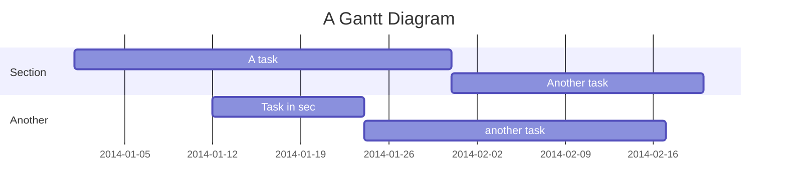

# Gantt diagrams

> A Gantt chart is a type of bar chart, first developed by Karol Adamiecki in 1896, and independently by Henry Gantt in the 1910s, that illustrates a project schedule. Gantt charts illustrate the start and finish dates of the terminal elements and summary elements of a project.

Mermaid can render Gantt diagrams.

```
gantt
    title A Gantt Diagram
    dateFormat  YYYY-MM-DD
    section Section
    A task           :a1, 2014-01-01, 30d
    Another task     :after a1  , 20d
    section Another
    Task in sec      :2014-01-12  , 12d
    another task      : 24d
```

## Syntax

```
gantt
       dateFormat  YYYY-MM-DD
       title Adding GANTT diagram functionality to mermaid

       section A section
       Completed task            :done,    des1, 2014-01-06,2014-01-08
       Active task               :active,  des2, 2014-01-09, 3d
       Future task               :         des3, after des2, 5d
       Future task2              :         des4, after des3, 5d

       section Critical tasks
       Completed task in the critical line :crit, done, 2014-01-06,24h
       Implement parser and jison          :crit, done, after des1, 2d
       Create tests for parser             :crit, active, 3d
       Future task in critical line        :crit, 5d
       Create tests for renderer           :2d
       Add to mermaid                      :1d

       section Documentation
       Describe gantt syntax               :active, a1, after des1, 3d
       Add gantt diagram to demo page      :after a1  , 20h
       Add another diagram to demo page    :doc1, after a1  , 48h

       section Last section
       Describe gantt syntax               :after doc1, 3d
       Add gantt diagram to demo page      :20h
       Add another diagram to demo page    :48h
   ```
```mermaid
gantt
       dateFormat  YYYY-MM-DD
       title Adding GANTT diagram functionality to mermaid

       section A section
       Completed task            :done,    des1, 2014-01-06,2014-01-08
       Active task               :active,  des2, 2014-01-09, 3d
       Future task               :         des3, after des2, 5d
       Future task2              :         des4, after des3, 5d

       section Critical tasks
       Completed task in the critical line :crit, done, 2014-01-06,24h
       Implement parser and jison          :crit, done, after des1, 2d
       Create tests for parser             :crit, active, 3d
       Future task in critical line        :crit, 5d
       Create tests for renderer           :2d
       Add to mermaid                      :1d

       section Documentation
       Describe gantt syntax               :active, a1, after des1, 3d
       Add gantt diagram to demo page      :after a1  , 20h
       Add another diagram to demo page    :doc1, after a1  , 48h

       section Last section
       Describe gantt syntax               :after doc1, 3d
       Add gantt diagram to demo page      :20h
       Add another diagram to demo page    :48h
   ```

It is possible to set multiple depenendenies separated by space:
```
    gantt
        apple :a, 2017-07-20, 1w
        banana :crit, b, 2017-07-23, 1d
        cherry :active, c, after b a, 1d
```
```
    gantt
        apple :a, 2017-07-20, 1w
        banana :crit, b, 2017-07-23, 1d
        cherry :active, c, after b a, 1d
```

### Title

Tbd


## Sections statements

Tbd


## Setting dates

Tbd


### Date format

The default date format is YYYY-MM-DD. You can define your ``dateFormat``. For example:

```
dateFormat YYYY MM DD
```


### Diagram definition

Input	Example	Description:

```
YYYY	2014	4 digit year
YY	14	2 digit year
Q	1..4	Quarter of year. Sets month to first month in quarter.
M MM	1..12	Month number
MMM MMMM	January..Dec	Month name in locale set by moment.locale()
D DD	1..31	Day of month
Do	1st..31st	Day of month with ordinal
DDD DDDD	1..365	Day of year
X	1410715640.579	Unix timestamp
x	1410715640579	Unix ms timestamp

Input	Example	Description
H HH	0..23	24 hour time
h hh	1..12	12 hour time used with a A.
a A	am pm	Post or ante meridiem
m mm	0..59	Minutes
s ss	0..59	Seconds
S	0..9	Tenths of a second
SS	0..99	Hundreds of a second
SSS	0..999	Thousandths of a second
Z ZZ	+12:00	Offset from UTC as +-HH:mm, +-HHmm, or Z
```

More info in: http://momentjs.com/docs/#/parsing/string-format/


### Scale

```
%a - abbreviated weekday name.
%A - full weekday name.
%b - abbreviated month name.
%B - full month name.
%c - date and time, as "%a %b %e %H:%M:%S %Y".
%d - zero-padded day of the month as a decimal number [01,31].
%e - space-padded day of the month as a decimal number [ 1,31]; equivalent to %_d.
%H - hour (24-hour clock) as a decimal number [00,23].
%I - hour (12-hour clock) as a decimal number [01,12].
%j - day of the year as a decimal number [001,366].
%m - month as a decimal number [01,12].
%M - minute as a decimal number [00,59].
%L - milliseconds as a decimal number [000, 999].
%p - either AM or PM.
%S - second as a decimal number [00,61].
%U - week number of the year (Sunday as the first day of the week) as a decimal number [00,53].
%w - weekday as a decimal number [0(Sunday),6].
%W - week number of the year (Monday as the first day of the week) as a decimal number [00,53].
%x - date, as "%m/%d/%Y".
%X - time, as "%H:%M:%S".
%y - year without century as a decimal number [00,99].
%Y - year with century as a decimal number.
%Z - time zone offset, such as "-0700".
%% - a literal "%" character.
```

More info in: https://github.com/mbostock/d3/wiki/Time-Formatting

## Comments

Comments can be entered within a gantt chart, which will be ignored by the parser.  Comments need to be on their own line, and must be prefaced with `%%` (double percent signs). Any text after the start of the comment to the next newline will be treated as a comment, including any diagram syntax

```
gantt
    title A Gantt Diagram
    %% this is a comment
    dateFormat  YYYY-MM-DD
    section Section
    A task           :a1, 2014-01-01, 30d
    Another task     :after a1  , 20d
    section Another
    Task in sec      :2014-01-12  , 12d
    another task      : 24d

```

## Styling

Styling of the a gantt diagram is done by defining a number of css classes.  During rendering these classes are extracted from the

### Classes used

Class | Description
---          | ---
actor        | Style for the actor box at the top of the diagram.
text.actor   | Styles for text in the actor box at the top of the diagram.
actor-line   | The vertical line for an actor.
messageLine0 | Styles for the solid message line.
messageLine1 | Styles for the dotted message line.
messageText  | Defines styles for the text on the message arrows.
labelBox     | Defines styles label to left in a loop.
labelText    | Styles for the text in label for loops.
loopText     | Styles for the text in the loop box.
loopLine     | Defines styles for the lines in the loop box.
note         | Styles for the note box.
noteText     | Styles for the text on in the note boxes.

### Sample stylesheet


```css
.grid .tick {
    stroke: lightgrey;
    opacity: 0.3;
    shape-rendering: crispEdges;
}
.grid path {
    stroke-width: 0;
}

#tag {
    color: white;
    background: #FA283D;
    width: 150px;
    position: absolute;
    display: none;
    padding:3px 6px;
    margin-left: -80px;
    font-size: 11px;
}

#tag:before {
    border: solid transparent;
    content: ' ';
    height: 0;
    left: 50%;
    margin-left: -5px;
    position: absolute;
    width: 0;
    border-width: 10px;
    border-bottom-color: #FA283D;
    top: -20px;
}
.taskText {
    fill:white;
    text-anchor:middle;
}
.taskTextOutsideRight {
    fill:black;
    text-anchor:start;
}
.taskTextOutsideLeft {
    fill:black;
    text-anchor:end;
}
```


## Configuration

Is it possible to adjust the margins for rendering the gantt diagram.

This is done by defining the `ganttConfig` part of the configuration object.
How to use the CLI is described in the [mermaidCLI](mermaidCLI.html) page.

mermaid.ganttConfig can be set to a JSON string with config parameters or the corresponding object.

```javascript
mermaid.ganttConfig = {
    titleTopMargin:25,
    barHeight:20,
    barGap:4,
    topPadding:75,
    sidePadding:75
}
```

### Possible configration params:

Param | Descriotion | Default value
--- | --- | ---
mirrorActor|Turns on/off the rendering of actors below the diagram as well as above it|false
bottomMarginAdj|Adjusts how far down the graph ended. Wide borders styles with css could generate unwantewd clipping which is why this config param exists.|1

## Interaction

It is possible to bind a click event to a task, the click can lead to either a javascript callback or to a link which will be opened in the current browser tab. **Note**: This functionality is disabled when using `securityLevel='strict'` and enabled when using `securityLevel='loose'`.

```
click taskId call callback(arguments)
click taskId href URL
```

* taskId is the id of the task
* callback is the name of a javascript function defined on the page displaying the graph, the function will be called with the taskId as the parameter if no other arguments are specified..

Beginners tip, a full example using interactive links in an html context:
```
<body>
  <div class="mermaid">
    gantt
      dateFormat  YYYY-MM-DD

      section Clickable
      Visit mermaidjs           :active, cl1, 2014-01-07, 3d
      Print arguments         :cl2, after cl1, 3d
      Print task              :cl3, after cl2, 3d

      click cl1 href "https://mermaidjs.github.io/"
      click cl2 call printArguments("test1", "test2", test3)
      click cl3 call printTask()
  </div>

  <script>
    var printArguments = function(arg1, arg2, arg3) {
      alert('printArguments called with arguments: ' + arg1 + ', ' + arg2 + ', ' + arg3);
    }
    var printTask = function(taskId) {
      alert('taskId: ' + taskId);
    }
    var config = {
      startOnLoad:true,
      securityLevel:'loose',
    };
    mermaid.initialize(config);
  </script>
</body>
```
