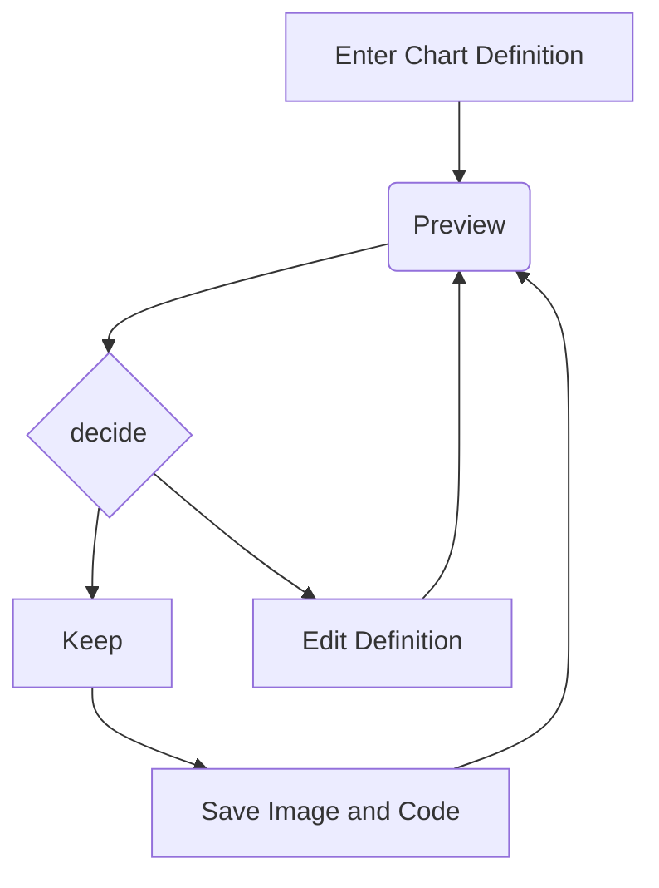
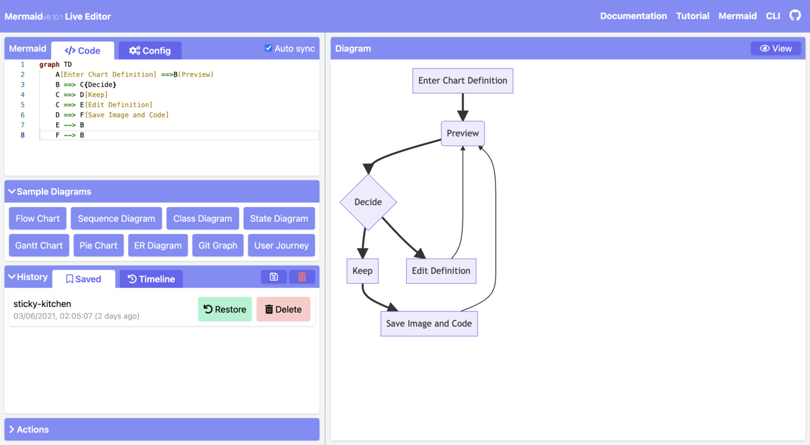
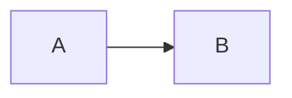

> **Warning**
>
> ## THIS IS AN AUTOGENERATED FILE. DO NOT EDIT.
>
> ## Please edit the corresponding file in [/packages/mermaid/src/docs/intro/getting-started.md](../../packages/mermaid/src/docs/intro/getting-started.md).

# Mermaid User Guide

## Mermaid is composed of three parts

1. Deployment
2. Syntax
3. Configuration

This section talks about the different ways to **deploy** Mermaid.

If you are a beginner:

- Check out the [Diagram Syntax](syntax-reference.md) page
- Check out the [Tutorials](../ecosystem/tutorials.md) page

## Ways to use Mermaid

1. [Using the Mermaid Live Editor](getting-started.md#_1-using-the-mermaid-live-editor)
2. [Using the Mermaid Chart Editor](getting-started.md#_2-using-the-mermaid-chart-editor)
3. [Using Mermaid Plugins and Integrations](getting-started.md#_3-using-mermaid-plugins)
4. [Calling the Mermaid JavaScript API](getting-started.md#_4-calling-the-mermaid-javascript-api)
5. [Adding Mermaid as a dependency](getting-started.md#_5-adding-mermaid-as-a-dependency)

To learn more, visit the [Usage](../config/usage.md) page.

## 1. Using the Mermaid Live Editor

Available at the [Mermaid Live Editor](https://mermaid.live) website.

### Features

<br />

#### • Diagram Code

In the `Code` panel, write or edit Mermaid code, and instantly `Preview` the rendered result in the diagram panel.

Here is an example of Mermaid code and its rendered result:




<br />

#### • Configurations

Configuration options are available in the `Configuration` panel. The options are applied to the diagram in the `Preview` panel.

To learn more, visit the [Configuration Reference](../config/setup/README.md) page



<br />

#### • Editing History

Your code will be autosaved and appear in the `Timeline` tab of the `History` section. Edits are saved every minute and only the last 30 edits are viewable.

Alternatively, you can manually save code by clicking on the `Save` icon from the `History` section.

> **Note**
> History is stored in the browser storage only.

<br />

#### • Saving a diagram

There are multiple ways of saving your diagram from the `Actions` section:

- export PNG
- export SVG
- export as Markdown


<br />

#### • Editing your diagrams

To edit your diagram, you can copy paste existing Mermaid diagram code into the `Code` section of the `Live Editor`.

Or:

- create a new diagram from scratch
- use a Sample Diagram from the `Sample Diagrams` section

<br />

#### • Loading from Gists

The Gist you create should have a `code.mmd` file and optionally a `config.json`, similar to this [example](https://gist.github.com/sidharthv96/6268a23e673a533dcb198f241fd7012a).

> **Note**
> To learn about Gists, visit the GitHub documentation page on [Creating gists](https://docs.github.com/en/get-started/writing-on-github/editing-and-sharing-content-with-gists/creating-gists).

Once you have created a Gist, copy paste the Gist URL into the respective field in the `Actions` section and click on the `Load Gist` button.

Here is an example of a Gist being loaded into the Editor:

<https://mermaid.live/edit?gist=https://gist.github.com/sidharthv96/6268a23e673a533dcb198f241fd7012a>

And, here is the diagram view from the above example:

<https://mermaid.live/view?gist=https://gist.github.com/sidharthv96/6268a23e673a533dcb198f241fd7012a>

## 2. Using the Mermaid Chart Editor

Available at the [Mermaid Chart](https://www.mermaidchart.com/) website.

Mermaid Chart is a web-based diagram editor that allows you to create and edit diagrams in your browser. It is built by the team behind Mermaid.

Features include:

- AI diagramming
- Collaboration & multi-user editing
- Storage
- and more

To learn more, visit the [Mermaid Chart page](/ecosystem/mermaid-chart.html) in the Ecosystem section of the documentation.

Or go to the [Mermaid Chart website](https://www.mermaidchart.com/app/sign-up) to sign up for a Free account.

## 3. Using Mermaid Plugins

### Mermaid Plugins

You can generate Mermaid diagrams from within popular applications using plug-ins.

For a list of Mermaid Plugins and Integrations, visit the [Integrations page](../ecosystem/integrations-community.md).

### Mermaid Chart Plugins

Mermaid Chart plugins are available for:

- [ChatGPT](https://docs.mermaidchart.com/plugins/mermaid-chart-gpt)
- [JetBrains IDE](https://docs.mermaidchart.com/plugins/jetbrains-ide)
- [Microsoft PowerPoint](https://docs.mermaidchart.com/plugins/microsoft-powerpoint)
- [Microsoft Word](https://docs.mermaidchart.com/plugins/microsoft-word)
- [Visual Studio Code](https://docs.mermaidchart.com/plugins/visual-studio-code)

To learn more, visit the [Mermaid Chart Plugins](https://www.mermaidchart.com/plugins) page.

### Native Mermaid Support

For apps that support markdown (e.g. [GitHub](https://docs.github.com/en/get-started/writing-on-github/working-with-advanced-formatting/creating-diagrams) and [GitLab](https://handbook.gitlab.com/handbook/tools-and-tips/mermaid/)), you can add Mermaid diagrams by making a `mermaid` code block.

````markdown
The following code-block will be rendered as a Mermaid diagram:


````

## 4. Calling the Mermaid JavaScript API

This method can be used with any common web server like `Apache`, `IIS`, `Nginx`, and `Node Express`.

You will also need a text editing tool like `Notepad++` to generate an `html` file. It is then deployed by a web browser, i.e. `Firefox`, `Chrome`, `Safari`.

> **Note**
> Internet Explorer is not supported.

The API works by pulling rendering instructions from the source `mermaid.js` in order to render diagrams on the page.

### Requirements for the Mermaid API

When writing the `html` file, we give two instructions inside the `html code` to the `web browser`:

a. The Mermaid code for the diagram we want to create.

b. The importing of the Mermaid library through the `mermaid.esm.mjs` or `mermaid.esm.min.mjs`, and the `mermaid.initialize()` call, which dictates the appearance of diagrams and also starts the rendering process.

#### Examples

- This is an example of an embedded Mermaid diagram definition inside a `<pre class="mermaid">`:

```html
<body>
  Here is a mermaid diagram:
  <pre class="mermaid">
        graph TD
        A[Client] --> B[Load Balancer]
        B --> C[Server01]
        B --> D[Server02]
  </pre>
</body>
```

> **Note**
> Every Mermaid chart/graph/diagram definition should have separate `<pre>` tags.

- This is an example of a Mermaid import and the `mermaid.initialize()` call.

> **Note**
> A `mermaid.initialize()` call takes all the definitions contained within `<pre class="mermaid">` tags and renders them into diagrams.

```html
<body>
  <script type="module">
    import mermaid from 'https://cdn.jsdelivr.net/npm/mermaid@11/dist/mermaid.esm.min.mjs';
    mermaid.initialize({ startOnLoad: true });
  </script>
</body>
```

> **Note**
> Rendering in Mermaid is initialized by the `mermaid.initialize()` call. However, doing the opposite lets you control when it starts looking for `<pre>` tags inside the web page with `mermaid.initialize()`. This is useful when you think that not all `<pre>` tags may have loaded on the execution of `mermaid.esm.min.mjs` file.

`startOnLoad` is one of the parameters that can be defined by `mermaid.initialize()`

| Parameter   | Description                       | Type    | Values      |
| ----------- | --------------------------------- | ------- | ----------- |
| startOnLoad | Toggle for Rendering upon loading | Boolean | true, false |

In this example, the `mermaidAPI` is being called through the `CDN`:

```html
<html>
  <body>
    Here is one mermaid diagram:
    <pre class="mermaid">
            graph TD
            A[Client] --> B[Load Balancer]
            B --> C[Server1]
            B --> D[Server2]
    </pre>

    And here is another:
    <pre class="mermaid">
            graph TD
            A[Client] -->|tcp_123| B
            B(Load Balancer)
            B -->|tcp_456| C[Server1]
            B -->|tcp_456| D[Server2]
    </pre>

    <script type="module">
      import mermaid from 'https://cdn.jsdelivr.net/npm/mermaid@11/dist/mermaid.esm.min.mjs';
      mermaid.initialize({ startOnLoad: true });
    </script>
  </body>
</html>
```

In this example, `mermaid.js` is referenced in `src` as a separate JavaScript file:

```html
<html lang="en">
  <head>
    <meta charset="utf-8" />
  </head>
  <body>
    <pre class="mermaid">
            graph LR
            A --- B
            B-->C[fa:fa-ban forbidden]
            B-->D(fa:fa-spinner);
    </pre>
    <pre class="mermaid">
            graph TD
            A[Client] --> B[Load Balancer]
            B --> C[Server1]
            B --> D[Server2]
    </pre>
    <script type="module">
      import mermaid from 'The/Path/In/Your/Package/mermaid.esm.mjs';
      mermaid.initialize({ startOnLoad: true });
    </script>
  </body>
</html>
```

## 5. Adding Mermaid as a dependency

Below are the steps for adding Mermaid as a dependency:

1. Install `node v16`

> **Note**
> To learn more about downloading and installing `Node.js` and `npm`, visit the [npm Docs website](https://docs.npmjs.com/downloading-and-installing-node-js-and-npm).

1. Install `yarn` using `npm` with this command:

   `npm install -g yarn`

2. After yarn installs, enter this command:

   `yarn add mermaid`

3. To add Mermaid as a dev dependency, enter this command:

   `yarn add --dev mermaid`

## Closing note

> **Note**
> Comments from Knut Sveidqvist, creator of Mermaid:
>
> - In early versions of Mermaid, the `<script>` tag was invoked in the `<head>` part of the web page. Nowadays, we can place it in the `<body>` as seen above. Older parts of the documentation frequently reflect the previous way, which still works.
