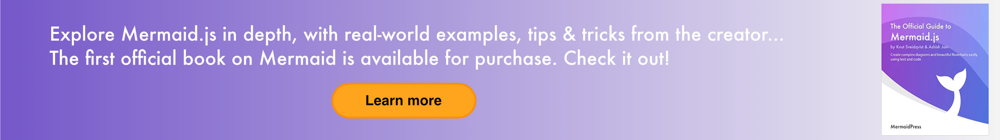
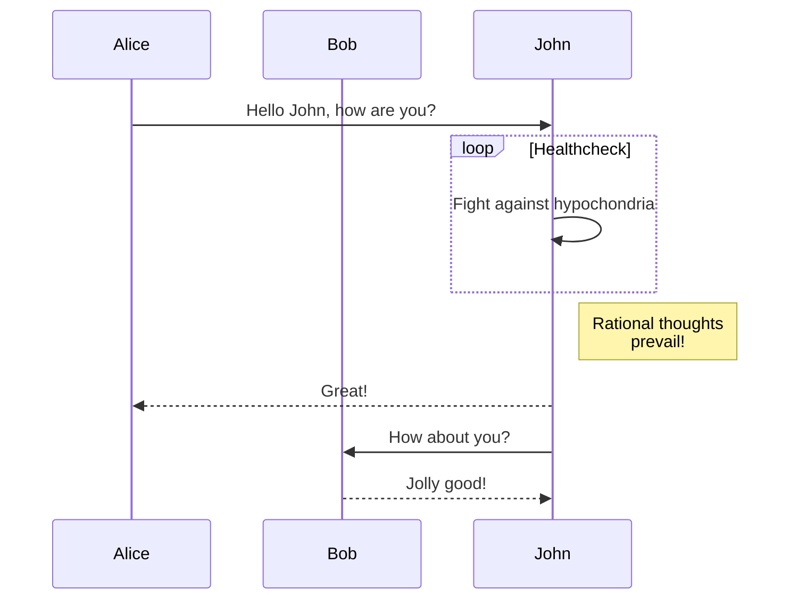
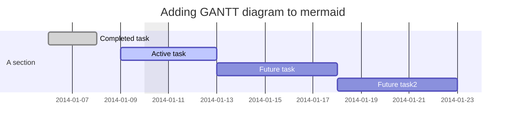
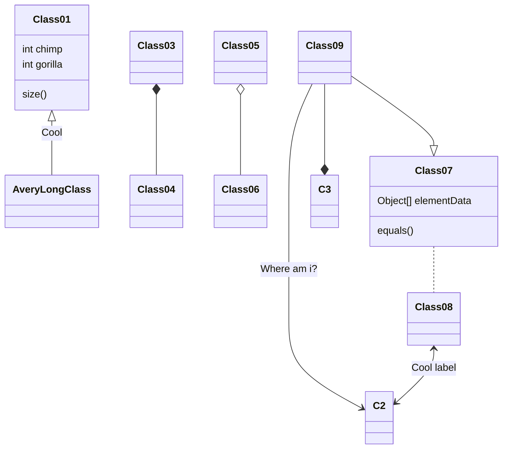
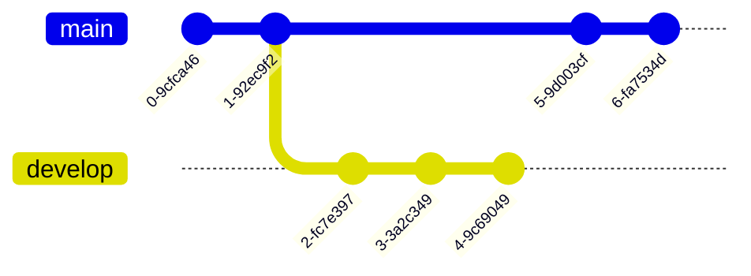
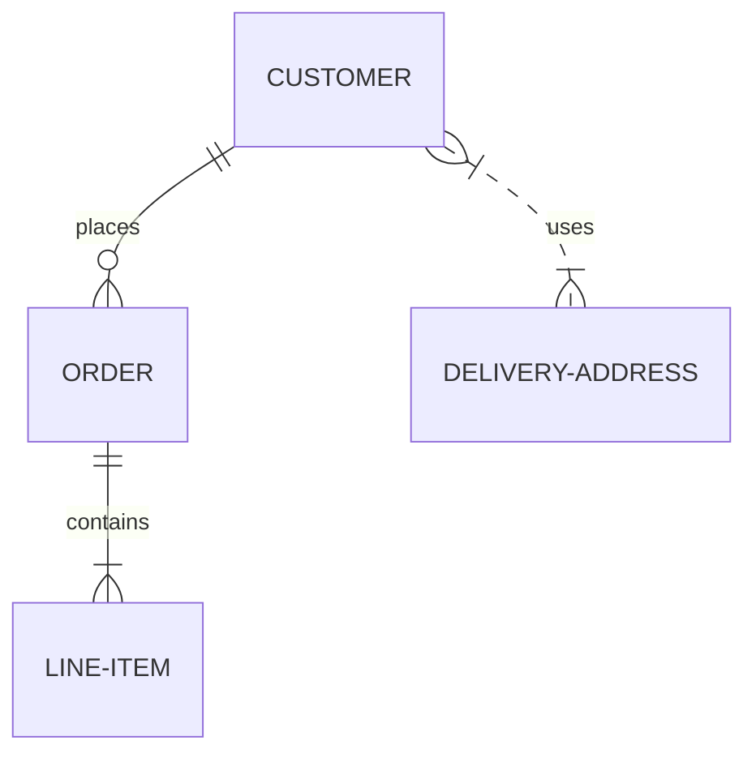
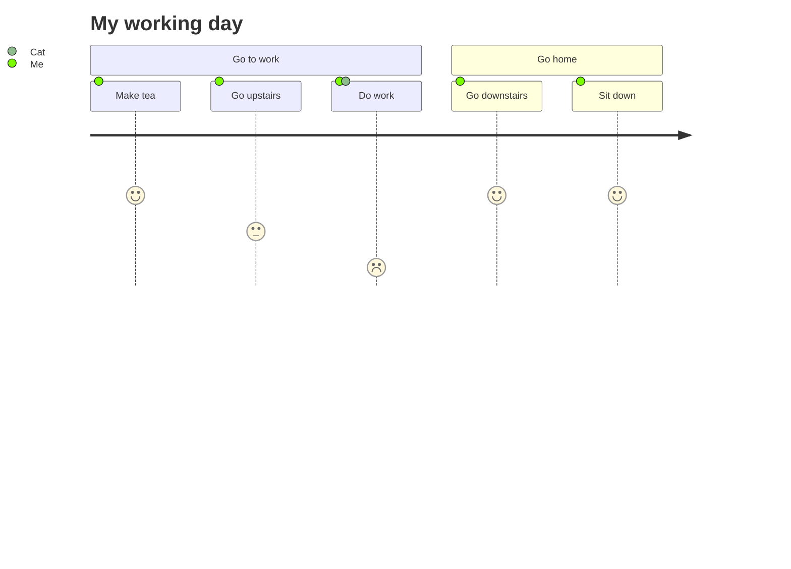
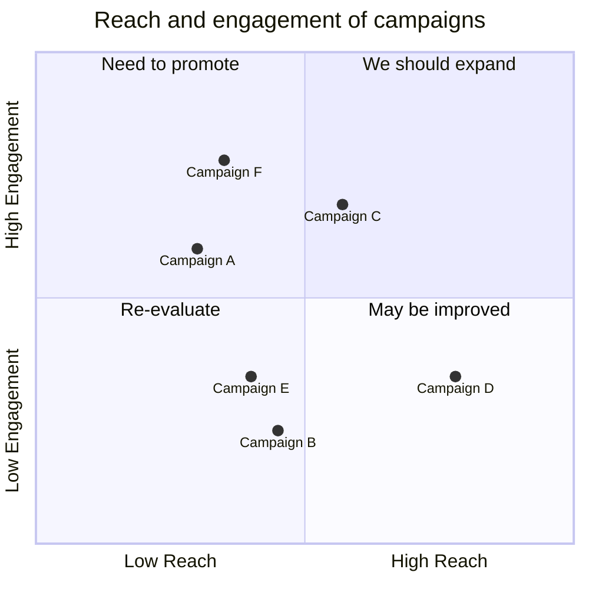
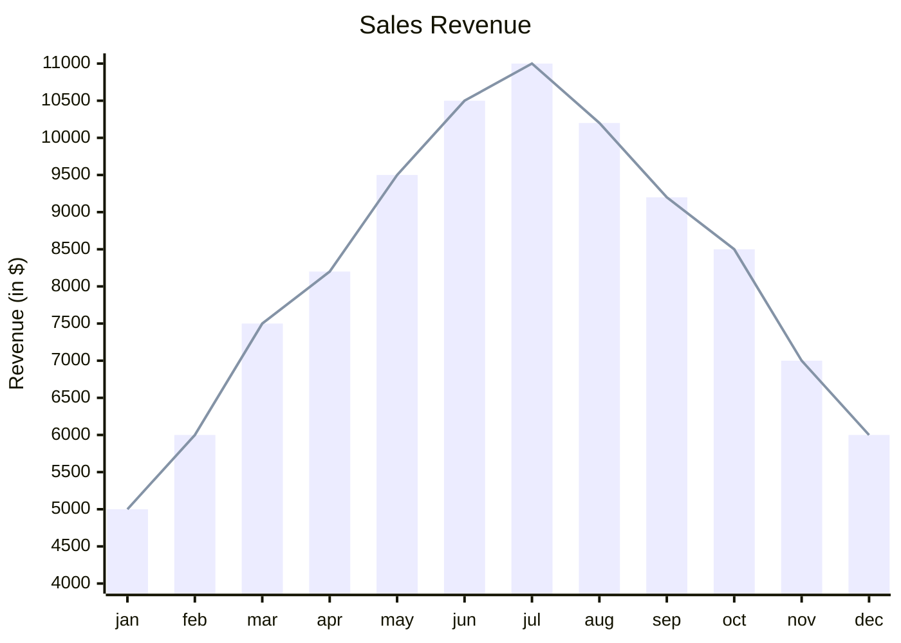

> **Warning**
>
> ## THIS IS AN AUTOGENERATED FILE. DO NOT EDIT.
>
> ## Please edit the corresponding file in [/packages/mermaid/src/docs/intro/index.md](../../packages/mermaid/src/docs/intro/index.md).

# About Mermaid

**Mermaid lets you create diagrams and visualizations using text and code.**

It is a JavaScript based diagramming and charting tool that renders Markdown-inspired text definitions to create and modify diagrams dynamically.

> If you are familiar with Markdown you should have no problem learning [Mermaid's Syntax](syntax-reference.md).


<div class='badges'>

[](https://github.com/mermaid-js/mermaid/actions/workflows/build.yml)
[](https://www.npmjs.com/package/mermaid)
[](https://bundlephobia.com/package/mermaid)
[](https://coveralls.io/github/mermaid-js/mermaid?branch=master)
[](https://www.jsdelivr.com/package/npm/mermaid)
[](https://www.npmjs.com/package/mermaid)
[](https://join.slack.com/t/mermaid-talk/shared_invite/enQtNzc4NDIyNzk4OTAyLWVhYjQxOTI2OTg4YmE1ZmJkY2Y4MTU3ODliYmIwOTY3NDJlYjA0YjIyZTdkMDMyZTUwOGI0NjEzYmEwODcwOTE)
[](https://twitter.com/mermaidjs_)

</div>

<!-- Mermaid book banner -->

[](https://mermaid-js.github.io/mermaid/landing/)

<!-- <Main description> -->

Mermaid is a JavaScript based diagramming and charting tool that uses Markdown-inspired text definitions and a renderer to create and modify complex diagrams. The main purpose of Mermaid is to help documentation catch up with development.

> Doc-Rot is a Catch-22 that Mermaid helps to solve.

Diagramming and documentation costs precious developer time and gets outdated quickly.
But not having diagrams or docs ruins productivity and hurts organizational learning.<br/>
Mermaid addresses this problem by enabling users to create easily modifiable diagrams, it can also be made part of production scripts (and other pieces of code).<br/> <br/>
Mermaid allows even non-programmers to easily create detailed and diagrams through the [Mermaid Live Editor](https://mermaid.live/).<br/>
[Tutorials](../config/Tutorials.md) has video tutorials.

Use Mermaid with your favorite applications, check out the list of [Community Integrations](../ecosystem/integrations-community.md).

For a more detailed introduction to Mermaid and some of its more basic uses, look to the [Beginner's Guide](../intro/getting-started.md) and [Usage](../config/usage.md).

🌐 [CDN](https://www.jsdelivr.com/package/npm/mermaid) | 📖 [Documentation](https://mermaidjs.github.io) | 🙌 [Contribution](../community/development.md) | 🔌 [Plug-Ins](../ecosystem/integrations-community.md)

> 🖖 Keep a steady pulse: mermaid needs more Collaborators, [Read More](https://github.com/knsv/mermaid/issues/866).

:trophy: **Mermaid was nominated and won the [JS Open Source Awards (2019)](https://osawards.com/javascript/#nominees) in the category "The most exciting use of technology"!!!**

**Thanks to all involved, people committing pull requests, people answering questions and special thanks to Tyler Long who is helping me maintain the project 🙏**

In our release process we rely heavily on visual regression tests using [applitools](https://applitools.com/). Applitools is a great service which has been easy to use and integrate with our tests.

<a href="https://applitools.com/">
<svg width="170" height="32" viewBox="0 0 170 32" fill="none" xmlns="http://www.w3.org/2000/svg"><mask id="a" maskUnits="userSpaceOnUse" x="27" y="0" width="143" height="32"><path fill-rule="evenodd" clip-rule="evenodd" d="M27.732.227h141.391v31.19H27.733V.227z" fill="#fff"></path></mask><g mask="url(#a)"><path fill-rule="evenodd" clip-rule="evenodd" d="M153.851 22.562l1.971-3.298c1.291 1.219 3.837 2.402 5.988 2.402 1.971 0 2.903-.753 2.903-1.829 0-2.832-10.253-.502-10.253-7.313 0-2.904 2.51-5.45 7.099-5.45 2.904 0 5.234 1.004 6.955 2.367l-1.829 3.226c-1.039-1.075-3.011-2.008-5.126-2.008-1.65 0-2.725.717-2.725 1.685 0 2.546 10.289.395 10.289 7.386 0 3.19-2.724 5.52-7.528 5.52-3.012 0-5.916-1.003-7.744-2.688zm-5.7 2.259h4.553V.908h-4.553v23.913zm-6.273-8.676c0-2.689-1.578-5.02-4.446-5.02-2.832 0-4.409 2.331-4.409 5.02 0 2.724 1.577 5.055 4.409 5.055 2.868 0 4.446-2.33 4.446-5.055zm-13.588 0c0-4.912 3.442-9.07 9.142-9.07 5.736 0 9.178 4.158 9.178 9.07 0 4.911-3.442 9.106-9.178 9.106-5.7 0-9.142-4.195-9.142-9.106zm-5.628 0c0-2.689-1.577-5.02-4.445-5.02-2.832 0-4.41 2.331-4.41 5.02 0 2.724 1.578 5.055 4.41 5.055 2.868 0 4.445-2.33 4.445-5.055zm-13.587 0c0-4.912 3.441-9.07 9.142-9.07 5.736 0 9.178 4.158 9.178 9.07 0 4.911-3.442 9.106-9.178 9.106-5.701 0-9.142-4.195-9.142-9.106zm-8.425 4.338v-8.999h-2.868v-3.98h2.868V2.773h4.553v4.733h3.514v3.979h-3.514v7.78c0 1.111.574 1.936 1.578 1.936.681 0 1.326-.251 1.577-.538l.968 3.478c-.681.609-1.9 1.11-3.8 1.11-3.191 0-4.876-1.648-4.876-4.767zm-8.962 4.338h4.553V7.505h-4.553V24.82zm-.43-21.905a2.685 2.685 0 012.688-2.69c1.506 0 2.725 1.184 2.725 2.69a2.724 2.724 0 01-2.725 2.724c-1.47 0-2.688-1.219-2.688-2.724zM84.482 24.82h4.553V.908h-4.553v23.913zm-6.165-8.676c0-2.976-1.793-5.02-4.41-5.02-1.47 0-3.119.825-3.908 1.973v6.094c.753 1.111 2.438 2.008 3.908 2.008 2.617 0 4.41-2.044 4.41-5.055zm-8.318 6.453v8.82h-4.553V7.504H70v2.187c1.327-1.685 3.227-2.618 5.342-2.618 4.446 0 7.672 3.299 7.672 9.07 0 5.773-3.226 9.107-7.672 9.107-2.043 0-3.907-.86-5.342-2.653zm-10.718-6.453c0-2.976-1.793-5.02-4.41-5.02-1.47 0-3.119.825-3.908 1.973v6.094c.753 1.111 2.438 2.008 3.908 2.008 2.617 0 4.41-2.044 4.41-5.055zm-8.318 6.453v8.82H46.41V7.504h4.553v2.187c1.327-1.685 3.227-2.618 5.342-2.618 4.446 0 7.672 3.299 7.672 9.07 0 5.773-3.226 9.107-7.672 9.107-2.043 0-3.908-.86-5.342-2.653zm-11.758-1.936V18.51c-.753-1.004-2.187-1.542-3.657-1.542-1.793 0-3.263.968-3.263 2.617 0 1.65 1.47 2.582 3.263 2.582 1.47 0 2.904-.502 3.657-1.506zm0 4.159v-1.829c-1.183 1.434-3.227 2.259-5.485 2.259-2.761 0-5.988-1.864-5.988-5.736 0-4.087 3.227-5.593 5.988-5.593 2.33 0 4.337.753 5.485 2.115V13.85c0-1.756-1.506-2.904-3.8-2.904-1.829 0-3.55.717-4.984 2.044L28.63 9.8c2.115-1.901 4.84-2.726 7.564-2.726 3.98 0 7.6 1.578 7.6 6.561v11.186h-4.588z" fill="#00A298"></path></g><path fill-rule="evenodd" clip-rule="evenodd" d="M14.934 16.177c0 1.287-.136 2.541-.391 3.752-1.666-1.039-3.87-2.288-6.777-3.752 2.907-1.465 5.11-2.714 6.777-3.753.255 1.211.39 2.466.39 3.753m4.6-7.666V4.486a78.064 78.064 0 01-4.336 3.567c-1.551-2.367-3.533-4.038-6.14-5.207C11.1 4.658 12.504 6.7 13.564 9.262 5.35 15.155 0 16.177 0 16.177s5.35 1.021 13.564 6.915c-1.06 2.563-2.463 4.603-4.507 6.415 2.607-1.169 4.589-2.84 6.14-5.207a77.978 77.978 0 014.336 3.568v-4.025s-.492-.82-2.846-2.492c.6-1.611.93-3.354.93-5.174a14.8 14.8 0 00-.93-5.174c2.354-1.673 2.846-2.492 2.846-2.492" fill="#00A298"></path></svg>
</a>

## Diagram Types

### [Flowchart](../syntax/flowchart.md?id=flowcharts-basic-syntax)


### [Sequence diagram](../syntax/sequenceDiagram.md)




### [Gantt diagram](../syntax/gantt.md)




### [Class diagram](../syntax/classDiagram.md)




### [Git graph](../syntax/gitgraph.md)




### [Entity Relationship Diagram - :exclamation: experimental](../syntax/entityRelationshipDiagram.md)




### [User Journey Diagram](../syntax/userJourney.md)




### [Quadrant Chart](../syntax/quadrantChart.md)




### [XY Chart](../syntax/xyChart.md)




## Installation

**In depth guides and examples can be found at [Getting Started](./getting-started.md) and [Usage](../config/usage.md).**

**It would also be helpful to learn more about mermaid's [Syntax](./syntax-reference.md).**

### CDN

    https://cdn.jsdelivr.net/npm/mermaid@<version>/dist/

To select a version:

Replace `<version>` with the desired version number.

Latest Version: <https://cdn.jsdelivr.net/npm/mermaid@10>

## Deploying Mermaid

To Deploy Mermaid:

1.  You will need to install node v16, which would have npm
2.  Install mermaid
    - NPM: `npm i mermaid`
    - Yarn: `yarn add mermaid`
    - Pnpm: `pnpm add mermaid`

### [Mermaid API](../config/setup/README.md):

**To deploy mermaid without a bundler, insert a `script` tag with an absolute address and a `mermaid.initialize` call into the HTML using the following example:**

```html
<script type="module">
  import mermaid from 'https://cdn.jsdelivr.net/npm/mermaid@10/dist/mermaid.esm.min.mjs';
  mermaid.initialize({ startOnLoad: true });
</script>
```

**Doing so commands the mermaid parser to look for the `<div>` or `<pre>` tags with `class="mermaid"`. From these tags, mermaid tries read the diagram/chart definitions and render them into SVG charts.**

**Examples can be found in** [Other examples](../syntax/examples.md)

## Sibling projects

- [Mermaid Live Editor](https://github.com/mermaid-js/mermaid-live-editor)
- [Mermaid CLI](https://github.com/mermaid-js/mermaid-cli)
- [Mermaid Webpack Demo](https://github.com/mermaidjs/mermaid-webpack-demo)
- [Mermaid Parcel Demo](https://github.com/mermaidjs/mermaid-parcel-demo)

## Request for Assistance

Things are piling up and I have a hard time keeping up. It would be great if we could form a core team of developers to cooperate
with the future development of mermaid.

As part of this team you would get write access to the repository and would
represent the project when answering questions and issues.

Together we could continue the work with things like:

- Adding more types of diagrams like mindmaps, ert diagrams, etc.
- Improving existing diagrams

Don't hesitate to contact me if you want to get involved!

## Contributors

<div class='badges'>

[](https://github.com/mermaid-js/mermaid/issues?q=is%3Aissue+is%3Aopen+label%3A%22Good+first+issue%21%22)
[](https://github.com/mermaid-js/mermaid/graphs/contributors)
[](https://github.com/mermaid-js/mermaid/graphs/contributors)

</div>

Mermaid is a growing community and is always accepting new contributors. There's a lot of different ways to help out and we're always looking for extra hands! Look at [this issue](https://github.com/mermaid-js/mermaid/issues/866) if you want to know where to start helping out.

Detailed information about how to contribute can be found in the [contribution guideline](/community/development).

### Requirements

- [volta](https://volta.sh/) to manage node versions.
- [Node.js](https://nodejs.org/en/). `volta install node`
- [pnpm](https://pnpm.io/) package manager. `volta install pnpm`

### Development Installation

```bash
git clone git@github.com:mermaid-js/mermaid.git
cd mermaid
# npx is required for first install as volta support for pnpm is not added yet.
npx pnpm install
pnpm test
```

### Lint

```sh
pnpm lint
```

We use [eslint](https://eslint.org/).
We recommend you to install [editor plugins](https://eslint.org/docs/user-guide/integrations) to get real time lint result.

### Test

```sh
pnpm test
```

Manual test in browser: open `dist/index.html`

### Release

For those who have the permission to do so:

Update version number in `package.json`.

```sh
npm publish
```

The above command generates files into the `dist` folder and publishes them to [npmjs.com](https://www.npmjs.com/).

## Security and safe diagrams

For public sites, it can be precarious to retrieve text from users on the internet, storing that content for presentation in a browser at a later stage. The reason is that the user content can contain embedded malicious scripts that will run when the data is presented. For Mermaid this is a risk, specially as mermaid diagrams contain many characters that are used in html which makes the standard sanitation unusable as it also breaks the diagrams. We still make an effort to sanitize the incoming code and keep refining the process but it is hard to guarantee that there are no loop holes.

As an extra level of security for sites with external users we are happy to introduce a new security level in which the diagram is rendered in a sandboxed iframe preventing JavaScript in the code from being executed. This is a great step forward for better security.

_Unfortunately you can not have a cake and eat it at the same time which in this case means that some of the interactive functionality gets blocked along with the possible malicious code._

## Reporting vulnerabilities

To report a vulnerability, please e-mail <security@mermaid.live> with a description of the issue, the steps you took to create the issue, affected versions, and if known, mitigations for the issue.

## Appreciation

A quick note from Knut Sveidqvist:

> _Many thanks to the [d3](https://d3js.org/) and [dagre-d3](https://github.com/cpettitt/dagre-d3) projects for providing the graphical layout and drawing libraries!_
>
> _Thanks also to the [js-sequence-diagram](https://bramp.github.io/js-sequence-diagrams) project for usage of the grammar for the sequence diagrams. Thanks to Jessica Peter for inspiration and starting point for gantt rendering._
>
> _Thank you to [Tyler Long](https://github.com/tylerlong) who has been a collaborator since April 2017._
>
> _Thank you to the ever-growing list of [contributors](https://github.com/knsv/mermaid/graphs/contributors) that brought the project this far!_

---

_Mermaid was created by Knut Sveidqvist for easier documentation._

<style scoped>
 .badges > p {
    display: flex;
  }

  .badges > p > a {
    margin: 0 0.5rem;
  }

  .dark #VPContent > div > div > div.content > div > main > div > div > img {
    filter: invert(1) hue-rotate(217deg)  contrast(0.72);
  }
</style>
