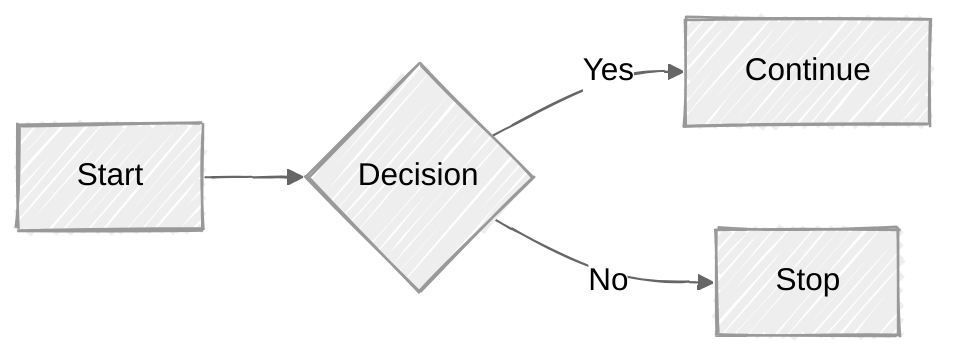
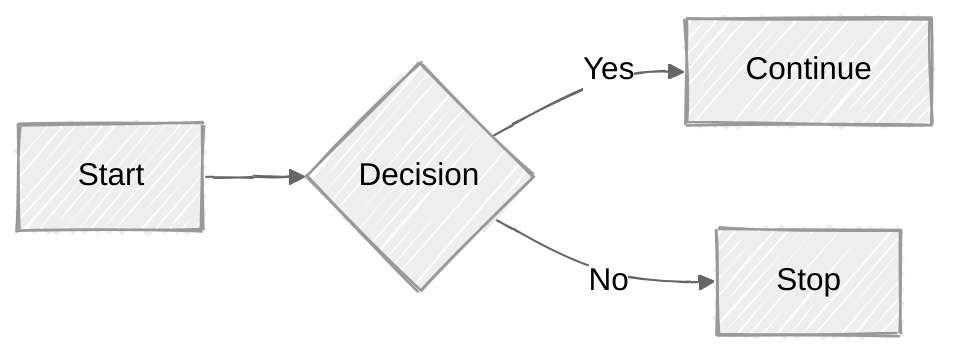

> **Warning**
>
> ## THIS IS AN AUTOGENERATED FILE. DO NOT EDIT.
>
> ## Please edit the corresponding file in [/packages/mermaid/src/docs/intro/syntax-reference.md](../../packages/mermaid/src/docs/intro/syntax-reference.md).

# Diagram Syntax

Mermaid's syntax is used to create diagrams. You'll find that it is not too tricky and can be learned in a day. The next sections dive deep into the syntax of each diagram type.

Syntax, together with Deployment and Configuration constitute the whole of Mermaid.

Diagram Examples can be found in the [Mermaid Live Editor](https://mermaid.live), it is also a great practice area.

## Syntax Structure

One would notice that all **Diagrams definitions begin** with a declaration of the **diagram type**, followed by the definitions of the diagram and its contents. This declaration notifies the parser which kind of diagram the code is supposed to generate. The only exception to this a [Frontmatter](#frontmatter-for-diagram-code) configuration.

Line comments can ignore anything on the line after '%% '.

Unknown words and misspellings will break a diagram, while parameters silently fail.

**Example** : The code below is for an Entity Relationship Diagram, specified by the `erDiagram` declaration. What follows is the definition of the different `Entities` represented in it.


The [Getting Started](./getting-started.md) section can also provide some practical examples of mermaid syntax.

## Diagram Breaking

One should **beware the use of some words or symbols** that can break diagrams. These words or symbols are few and often only affect specific types of diagrams. The table below will continuously be updated.

| Diagram Breakers                                                                     | Reason                                                                  | Solution                                          |
| ------------------------------------------------------------------------------------ | ----------------------------------------------------------------------- | ------------------------------------------------- |
| **Comments**                                                                         |                                                                         |                                                   |
| [`%%{``}%%`](https://github.com/mermaid-js/mermaid/issues/1968)                      | Similar to [Directives](../config/directives.md) confuses the renderer. | In comments using `%%`, avoid using "{}".         |
| **Flow-Charts**                                                                      |                                                                         |                                                   |
| 'end'                                                                                | The word "End" can cause Flowcharts and Sequence diagrams to break      | Wrap them in quotation marks to prevent breakage. |
| [Nodes inside Nodes](../syntax/flowchart.md?id=special-characters-that-break-syntax) | Mermaid gets confused with nested shapes                                | wrap them in quotation marks to prevent breaking  |

## Mermaid Live Editor

Now, that you've seen what you should not add to your diagrams, you can play around with them in the [Mermaid Live Editor](https://mermaid.live).

## Configuration

Configuration is the third part of Mermaid, after deployment and syntax. It deals with the different ways that Mermaid can be customized across different deployments.

If you are interested in altering and customizing your Mermaid Diagrams, you will find the methods and values available for [Configuration](../config/setup/README.md) here. It includes themes.
This section will introduce the different methods of configuring the behaviors and appearances of Mermaid Diagrams.
The following are the most commonly used methods, and they are all tied to Mermaid [Deployment](./getting-started.md) methods.

### Configuration Section in the [Live Editor](https://mermaid.live).

Here you can edit certain values to change the behavior and appearance of the diagram.

Each of these techniques are functionally equivalent, but better for different deployments.

### [The initialize() call](./getting-started.md#_3-calling-the-javascript-api)

Used when Mermaid is called via an API, or through a `<script>` tag.

### Frontmatter for diagram code

Frontmatter is the term for adding YAML metadata at the start of code. This allows for reconfiguration of a diagram before it is rendered. You can pass metadata Frontmatter with your definition by adding `---` to the lines before and after the definition. This 'triple dash' MUST be the only character on the first line.

Frontmatter uses YAML syntax. It requires any indentation to be consistent and settings are case sensitive. Mermaid will silently ignore misspelling, but badly formed parameters will break the diagram.


### [Directives](../config/directives.md)

Allows for the limited reconfiguration of a diagram just before it is rendered. It can alter the font style, color and other aesthetic aspects of the diagram. You can pass a directive alongside your definition inside `%%{ }%%`. It can be done either above or below your diagram definition.

### [Theme Manipulation](../config/theming.md)

An application of using Directives to change [Themes](../config/theming.md). `Theme` is a value within Mermaid's configuration that dictates the color scheme for diagrams.

### Layout and look

We've restructured how Mermaid renders diagrams, enabling new features like selecting layout and look. **Currently, this is supported for flowcharts and state diagrams**, with plans to extend support to all diagram types.

### Selecting Diagram Looks

Mermaid offers a variety of styles or “looks” for your diagrams, allowing you to tailor the visual appearance to match your specific needs or preferences. Whether you prefer a hand-drawn or classic style, you can easily customize your diagrams.

**Available Looks:**

- Hand-Drawn Look: For a more personal, creative touch, the hand-drawn look brings a sketch-like quality to your diagrams. This style is perfect for informal settings or when you want to add a bit of personality to your diagrams.
- Classic Look: If you prefer the traditional Mermaid style, the classic look maintains the original appearance that many users are familiar with. It’s great for consistency across projects or when you want to keep the familiar aesthetic.

**How to Select a Look:**

You can select a look by adding the look parameter in the metadata section of your Mermaid diagram code. Here’s an example:





#### Selecting Layout Algorithms

In addition to customizing the look of your diagrams, Mermaid Chart now allows you to choose different layout algorithms to better organize and present your diagrams, especially when dealing with more complex structures. The layout algorithm dictates how nodes and edges are arranged on the page.

#### Supported Layout Algorithms:

- Dagre (default): This is the classic layout algorithm that has been used in Mermaid for a long time. It provides a good balance of simplicity and visual clarity, making it ideal for most diagrams.
- ELK: For those who need more sophisticated layout capabilities, especially when working with large or intricate diagrams, the ELK (Eclipse Layout Kernel) layout offers advanced options. It provides a more optimized arrangement, potentially reducing overlapping and improving readability. This is not included out the box but needs to be added when integrating mermaid for sites/applications that want to have elk support.

#### How to Select a Layout Algorithm:

You can specify the layout algorithm directly in the metadata section of your Mermaid diagram code. Here’s an example:


In this example, the `layout: elk` line configures the diagram to use the ELK layout algorithm, along with the hand drawn look and forest theme.

#### Customizing ELK Layout:

When using the ELK layout, you can further refine the diagram’s configuration, such as how nodes are placed and whether parallel edges should be combined:

- To combine parallel edges, use mergeEdges: true | false.
- To configure node placement, use nodePlacementStrategy with the following options:
  - SIMPLE
  - NETWORK_SIMPLEX
  - LINEAR_SEGMENTS
  - BRANDES_KOEPF (default)

**Example configuration:**

```
---
config:
  layout: elk
  elk:
    mergeEdges: true
    nodePlacementStrategy: LINEAR_SEGMENTS
---
flowchart LR
  A[Start] --> B{Choose Path}
  B -->|Option 1| C[Path 1]
  B -->|Option 2| D[Path 2]

```

#### Using Dagre Layout with Classic Look:

Another example:

```
---
config:
  layout: dagre
  look: classic
  theme: default
---

flowchart LR
A[Start] --> B{Choose Path}
B -->|Option 1| C[Path 1]
B -->|Option 2| D[Path 2]

```

These options give you the flexibility to create diagrams that not only look great but are also arranged to best suit your data’s structure and flow.

When integrating Mermaid, you can include look and layout configuration with the initialize call. This is also where you add the loading of elk.
