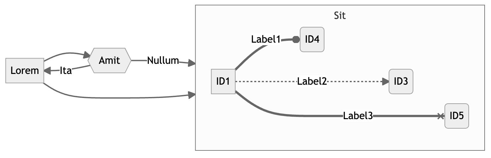
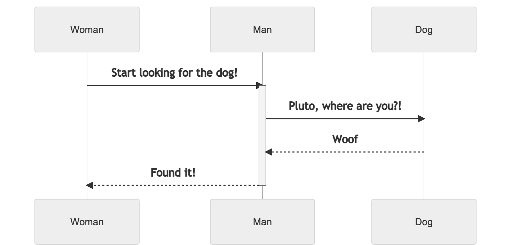
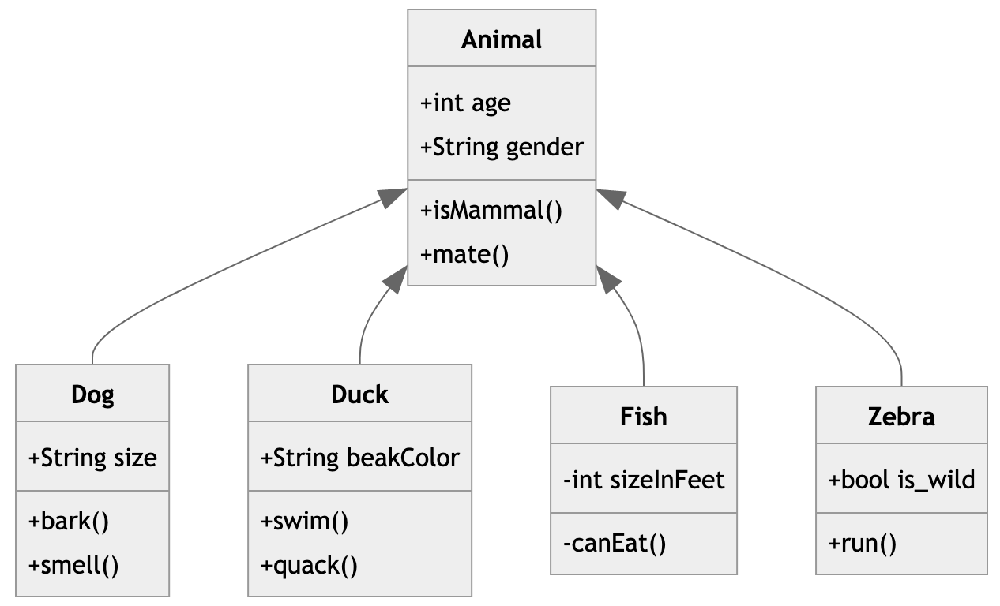
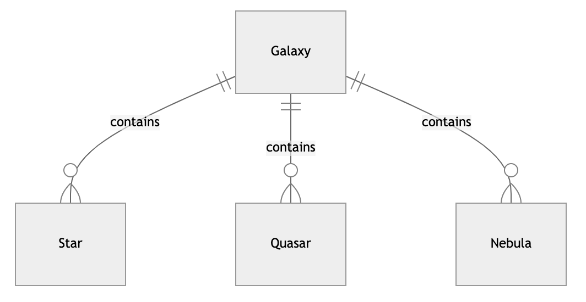
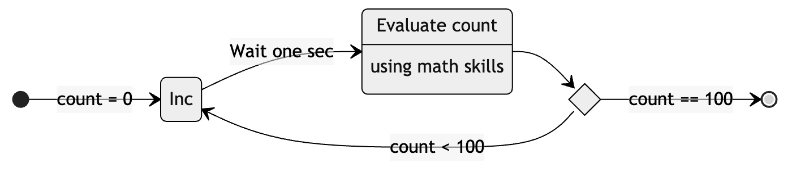
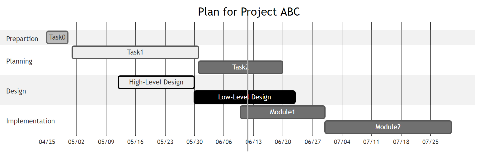

> **Warning**
>
> ## THIS IS AN AUTOGENERATED FILE. DO NOT EDIT.
>
> ## Please edit the corresponding file in [/packages/mermaid/src/docs/landing/index.md](../../packages/mermaid/src/docs/landing/index.md).

---

title: The Official Guide to Mermaid.js
description: >-
Landing page for the book The Official Guide to Mermaid.js: Create complex diagrams and beautiful flowcharts easily using text and code
author: Knut Sveidqvist, Ashish Jain

---

# The Official Guide to Mermaid.js

Learn to create complex diagrams and beautiful flowcharts easily using text and
code using Mermaid.js.

[Purchase on Amazon](https://www.amazon.com/Official-Guide-Mermaid-js-beautiful-flowcharts-dp-1801078025/dp/1801078025/ref=mt_other?_encoding=UTF8&me=&qid=1628153965)

## Get up to speed with using Mermaid diagrams along with real-world examples and expert tips from the authors to facilitate a seamless development workflow

Flowcharts is a diagram type that visualizes a process or an algorithm by showing the
steps in order, as well as the different paths the execution can take.

Sequence diagrams lets you model and visualize interactions between different actors
or objects in a system, as well as the order of those interactions

A class diagram is a graphical representation that is used to visualize and describe
an object-oriented system.

An entity-relationship diagram is a graphical representation that is used to
visualize the different types of entities that exist within a system.

Use State diagrams to model and document state machines, an abstract way of
representing a system or an algorithm.

A Gantt chart is a graphical representation that is used to visualize and describe
tasks (events or activities) over time.

These were a few of the diagrams supported by Mermaid.

## Book Description

Mermaid lets you represent diagrams using text and code which simplifies the maintenance
of complex diagrams. This is a great option for developers as they’re more familiar with
code, rather than special tools for generating diagrams. Besides, diagrams in code
simplify maintenance and ensure that the code is supported by version control systems.
In some cases, Mermaid makes refactoring support for name changes possible while also
enabling team collaboration for review distribution and updates.

Developers working with any system will be able to put their knowledge to work with this
practical guide to using Mermaid for documentation. The book is also a great reference
for looking up the syntax for specific diagrams when authoring diagrams.

You’ll start by getting up to speed with the importance of accurate and visual
documentation. Next, the book introduces Mermaid and establishes how to use it to create
effective documentation. By using different tools, editors, or a custom documentation
platform, you’ll also learn how to use Mermaid syntax for various diagrams. Later
chapters cover advanced configuration settings and theme options to manipulate your
diagram as per your needs.

By the end of this Mermaid book, you’ll have become well-versed with the different types
of Mermaid diagrams and how they can be used in your workflows.

## What you will learn

- Understand good and bad documentation, and the art of effective documentation
- Become well-versed with maintaining complex diagrams with ease
- Learn how to set up a custom documentation system
- Learn how to implement Mermaid diagrams in your workflows
- Understand how to set up themes for a Mermaid diagram for an entire site
- Discover how to draw different types of diagrams such as flowcharts, class diagrams, Gantt charts, and more

## Purchase The Official Guide to Mermaid.js

Written by Knut Sveidqvist and Ashish Jain.

Knut is the creator of Mermaid and both authors are active core team members of the
Mermaid open-source project.

[Purchase on Amazon](https://www.amazon.com/Official-Guide-Mermaid-js-beautiful-flowcharts-dp-1801078025/dp/1801078025/ref=mt_other?_encoding=UTF8&me=&qid=1628153965)
