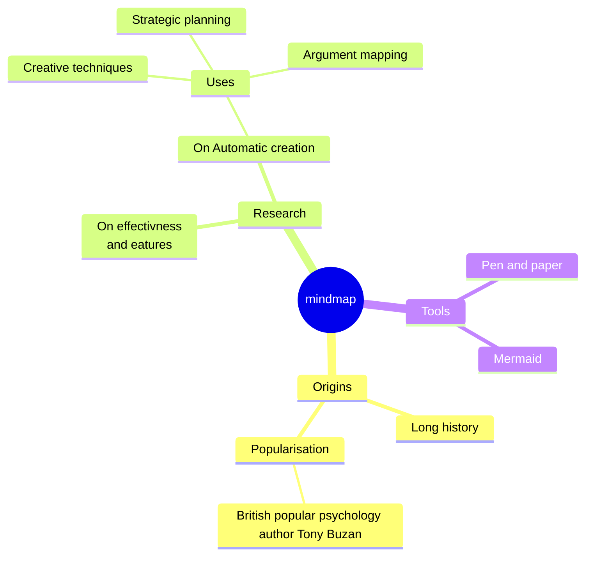
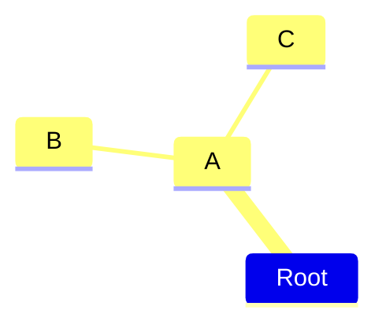
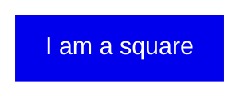
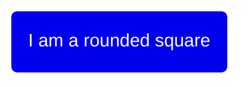
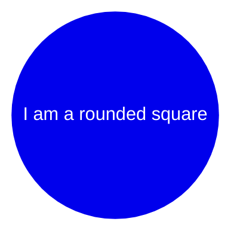

# Mindmap

**Edit this Page** [](https://github.com/mermaid-js/mermaid/blob/develop/docs/mindmap.md)
> Mindmap: This is an experimental diagram for now. The syntax and properties can change in future releases. The syntax is stabel except for the icon integration which is the experimental part.

"A mind map is a diagram used to visually organize information into a hierarchy, showing relationships among pieces of the whole. It is often created around a single concept, drawn as an image in the center of a blank page, to which associated representations of ideas such as images, words and parts of words are added. Major ideas are connected directly to the central concept, and other ideas branch out from those major ideas."  Wikipedia

### An example of a mindmap.

## Syntax

The syntax for creating Mindmaps is simple and relies on indentation for setting the levels in the hierarchy.

In the following example you can see how there are 3 dufferent levels. One with starting at the left of the text and another level with two rows starting at the same column, defining the node A. At the end there is one more level where the text is indented further then the prevoius lines defining the nodes B and C.
```
mindmap
    Root
        A
            B
            C
```

In summary is is a simple text outline where there are one node at the root level called `Root` which has one child `A`. A in turn has two children `B`and `C`. In the diagram below we can see this rendered as a mindmap.



In this way we can use a text outline to generate a hierarchical mindmap.

## Different shapes
Mermaids mindmaps can show node using different shapes. When specifying a shape for a node the synax for the is similar to flowchart nodes, with an id followed by the shape definition and with the text within the shape delimiters. Where possible we try/will try to keep the same shapes as for flowcharts even though they are not all supported from the start.

Mindmap can show the following shapes:

### Square


### Rounded square


### Circle



## Unclear indentation
The actual indentation does not really matter only compared with the previous rows. If we take the previous example and disrupt it a little we can se how the calculations are performed. Let us start with placing C with a smaller indentation than `B`but larger then `A`.

```
mindmap
    Root
        A
            B
          C
```

This outline is unclear as `B` clearly is a child of `A` but when we move on to `C` the clarity is lost. `C` is not a child of `B` with a highter indentation nor does ot haver the same indentation as `B`. The only thing that is clear is that the first node with smaller indentation, indicating a parent, is A. Then Mermaid relies on this known truth and compensates for the unclear indentation and selects `A` as a parent of `C` leading till the same diagram with `B` and `C` as sieblings.


