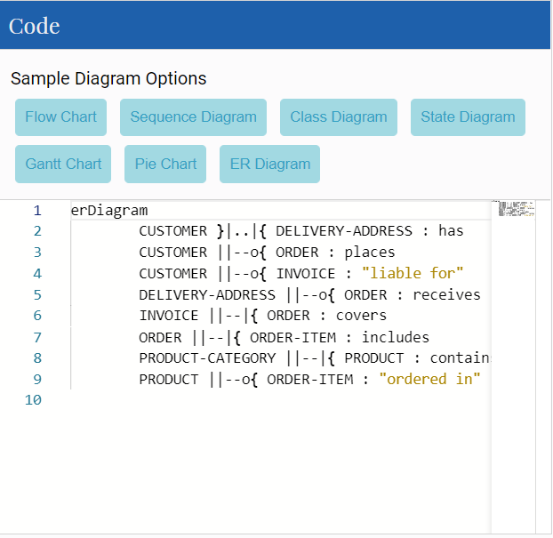
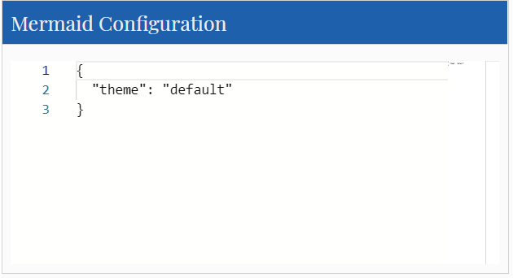

# A Mermaid User-Guide for Beginners

Creating diagrams and charts using mermaid code is simple.
mermaid allows you to dynamically code and modify diagrams.
when called, mermaid renders code definitions into a diagram in SVG format.

>The live editor is enough for most general uses of mermaid
## Absolute beginners are recommended to view the Video [Tutorials](./Tutorials.md) on the Live Editor, to gain a better understanding of mermaid.


## For beginners, there are Four ways you can use mermaid:
1. Using the mermaid [Live Editor](https://mermaid-js.github.io/mermaid-live-editor/).
    - Learning the [Syntax](./n00b-syntaxReference) would be helpful.
2. Using one of the many [mermaid plugins](./integrations.md).
3. Hosting mermaid on a webpage, with an absolute link.
4. Downloading mermaid and hosting it on your Web Page.

**Note: It is our recommendation that you review all approaches, and choose the one that is best for your project.**

>More in depth information can be found on [Usage](./usage.md).

# Following any of these examples, you can get started with creating your own diagrams using mermaid code.

## 1. The mermaid live editor:

 A great way to get started with mermaid is to visit [The mermaid live editor](https://mermaidjs.github.io/mermaid-live-editor).

In the `Code` section one can write or edit raw mermaid code, and instantly `Preview` the rendered result on the panel beside it.

**This is a great way to learn how to define a mermaid diagram.**

The Live Editor opens on a [Flowchart](./flowchart.md), one of the many charts that mermaid can render. 



**Saving a Diagram:**
Downloading the image is recommended. he Links and markdown code can be referenced to display the diagram.


**Configuration**

*The Mermaid configuration* is for configuring the appearance and behavior of mermaid diagrams. An easy introduction to mermaid configuration is found in the [Advanced usage](./n00b-advanced.md) section. A complete configuration reference cataloguing default values is found on the [mermaidAPI](Setup.md) page.




## 2. Using mermaid plugins:

Thanks to the growing popularity of mermaid, many plugins already allow the generation of mermaid diagrams from within popular applications. An extensive list of applications the support mermaid plugins can be found [here](./integrations.md).

**This is covered in greater detail in the [Usage section](usage.md)**

## 3. Deploying mermaid with Inline JavaScript

This method can be used with any common web server. Apache, IIS, nginx, node express [...], you pick your favourite.

You will need a text editting tool like Notepad++, to generate an html file. It is then deployed by a web browser (such as Firefox, Chrome, Safari, but not Internet Explorer).

Just create an HTML file locally and open it using a desired browser.

###  Written in the html `<body>` section of the web page.

When writing the html file, we give the web browser three instructions inside the html code:

a. A reference for fetching the online mermaid renderer, which is written in Javascript.

b. The mermaid code for the diagram we want to create.

c. The `mermaid.initialize()` call to start the rendering process.


## Three requirements for the mermaidAPI to render a diagram:

### a. A reference to the external CDN in a `<script src>` tag, or a reference to mermaid.js as a separate file.:

```html
<body>
  <script src="https://cdn.jsdelivr.net/npm/mermaid/dist/mermaid.min.js"></script>
</body>
```

### b. The embedded mermaid diagram definition inside a `<div class="mermaid">`:

```html
<body>
  Here is a mermaid diagram:
  <div class="mermaid">
    graph TD
    A[Client] --> B[Load Balancer]
    B --> C[Server01]
    B --> D[Server02]
  </div>
</body>
```
**Notes**: every mermaid chart/graph/diagram definition, has to have separate `<div>` tags.

### c. The `mermaid.initialize()` call.

`mermaid.initialize()` calls take all the definitions contained in `<div class="mermaid">` tags it can find in the html body and render. Example:

| Parameter | Description     | Type   | Values                                               |
| --------- | --------------- | ------ | ---------------------------------------------------- |
|startOnLoad| Toggle for Rendering upon loading | Boolean | true, false                       |

```html
<body>
  <script>mermaid.initialize({startOnLoad:true});</script>
</body>
```
**Notes**:
Mermaid rendering is initalized with `mermaid.initialize()`.You can place `mermaid.initialize()` inside of `mermaid.min.js` for brevity. However, not doin so lets you control when it starts looking for `<div>`tags inside the web page with `mermaid.initialize()`, such as when you think that noy all `<div>` tags may not have been loaded when `mermaid.min.js` runs.


### Here is a full working example of the mermaidAPI being called through the CDN:

```html
<html>
  <body>
    <script src="https://cdn.jsdelivr.net/npm/mermaid/dist/mermaid.min.js"></script>
    <script>mermaid.initialize({startOnLoad:true});</script>

    Here is one mermaid diagram:
    <div class="mermaid">
      graph TD
      A[Client] --> B[Load Balancer]
      B --> C[Server1]
      B --> D[Server2]
    </div>

    And here is another:
    <div class="mermaid">
      graph TD
      A[Client] -->|tcp_123| B(Load Balancer)
      B -->|tcp_456| C[Server1]
      B -->|tcp_456| D[Server2]
    </div>
  </body>
</html>
```
**Another Option:**
In this example mermaid.js is referenced in `src` as a separate JavaScript file, in an example Path. 
```html
<html lang="en">
<head>
  <meta charset="utf-8">
</head>
<body>
  <div class="mermaid">
  graph LR
      A --- B
      B-->C[fa:fa-ban forbidden]
      B-->D(fa:fa-spinner);
  </div>
  <div class="mermaid">
     graph TD
     A[Client] --> B[Load Balancer]
     B --> C[Server1]
     B --> D[Server2]
  </div>
  <script src="The\Path\In\Your\PC\mermaid.js"></script>
  <script>mermaid.initialize({startOnLoad:true});</script>
</body>
</html>
```


---
## 4. Adding mermaid as a dependency.

1. install node v10 or 12, which would have npm

2. download yarn using npm by entering the command below:
    npm install -g yarn

3. After yarn installs, enter the following command:
    yarn add mermaid
    
4. To add Mermaid as a Dev Dependency
    yarn add --dev mermaid
    


**Comments from Knut Sveidqvist, creator of mermaid:**
- In early versions of mermaid, the `<script src>` tag was invoked in the `<head>` part of the web page. Nowadays we can place it in the `<body>` as seen above. Older parts of the documentation frequently reflects the previous way which still works.
