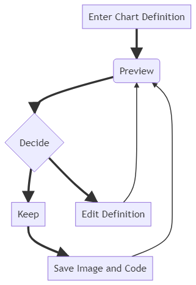
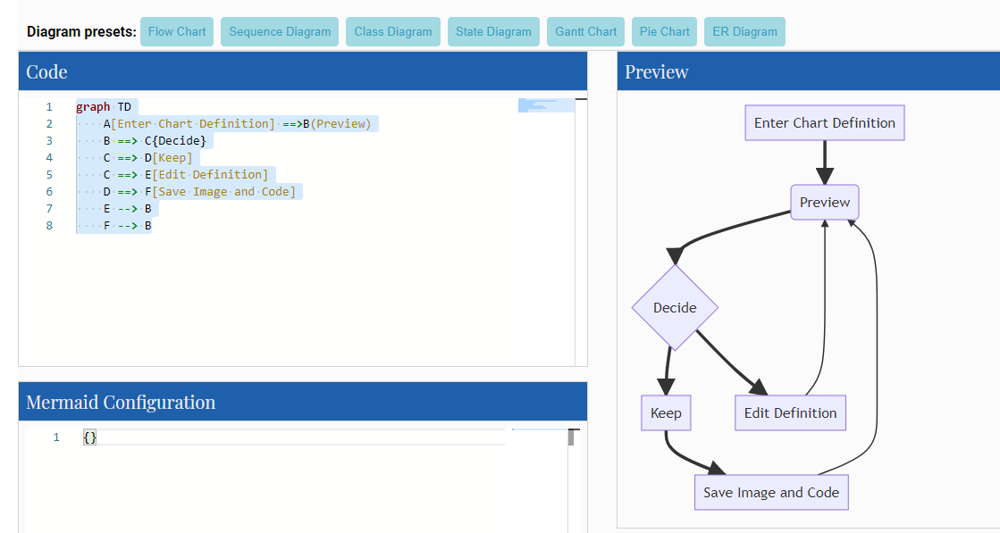
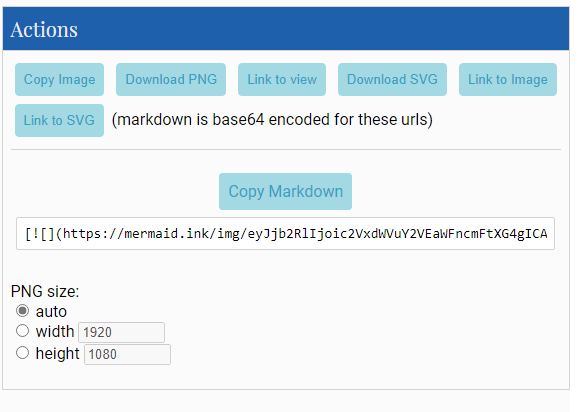

# A Mermaid User-Guide for Beginners

Mermaid is composed of three parts, Deployment, Syntax and Configuration.

This section talks about the different ways to deploy Mermaid. Learning the [Syntax](./n00b-syntaxReference.md) ahead of time would be more helpful to the beginner.

> Generally the live editor is enough for most general uses of mermaid, and is a good place to start learning.

**Absolute beginners are recommended to view the Video [Tutorials](./Tutorials.md) on the Live Editor, to gain a better understanding of mermaid.**

## Four ways of using mermaid:

1. Using the mermaid [Live Editor](https://mermaid-js.github.io/mermaid-live-editor/).
2. Using [mermaid plugins](./integrations.md) with programs you are familiar with.
3. Calling the Mermaid Javascript API.
4. Deploying Mermaid as a dependency.

**Note: It is our recommendation that you review all approaches, and choose the one that is best for your project.**

> More in depth information can be found on [Usage](./usage.md).

## 1. Using [The Live Editor](https://mermaidjs.github.io/mermaid-live-editor/edit).



In the `Code` section one can write or edit raw mermaid code, and instantly `Preview` the rendered result on the panel beside it.

The `Configuration` Section is for changing the appearance and behavior of mermaid diagrams. An easy introduction to mermaid configuration is found in the [Advanced usage](./n00b-advanced.md) section. A complete configuration reference cataloguing default values is found on the [mermaidAPI](Setup.md) page.



### Editing History

Your code will be autosaved every minute into the Timeline tab of History, having the most recent 30 items.

You can also manually save code by clicking the Save icon in History section which can be accessed in the Saved tab. This is stored only in the browser storage.

### Saving a Diagram:

You may choose any of the methods below, to save it

**We recommend that you save your diagram code on top of any method you choose, in order to make edits and modifications further down the line.**



### Editing your diagrams

Editing is as easy as pasting your **Diagram code**, into the `code` section of the `Live Editor`.

### Loading from Gists

The Gist you create should have a code.mmd file and optionally a config.json. [Example](https://gist.github.com/sidharthv96/6268a23e673a533dcb198f241fd7012a)

To load a gist into the Editor, you can use https://mermaid-js.github.io/mermaid-live-editor/edit?gist=https://gist.github.com/sidharthv96/6268a23e673a533dcb198f241fd7012a

and to View, https://mermaid-js.github.io/mermaid-live-editor/view?gist=https://gist.github.com/sidharthv96/6268a23e673a533dcb198f241fd7012a

## 2. Using Mermaid Plugins:

Using plug-ins you can generate mermaid diagrams from within popular applications, the same way that you would use the Live Editor. Here's a list of [Mermaid Plugins](./integrations.md).

**This is covered in greater detail in the [Usage section](usage.md)**

## 3. Calling the Javascript API

This method can be used with any common web server. Apache, IIS, nginx, node express, you are free to choose.

You will also need a text editting tool like Notepad++, to generate an html file. It is then deployed by a web browser (such as Firefox, Chrome, Safari, but not Internet Explorer).

The API works by pulling rendering instructions from a source from `mermaid.js` to render diagrams in the page.

### Requirements for the Mermaid API.

When writing the html file, we give the web browser three instructions inside the html code:

a. A reference for fetching the online mermaid renderer, through the `mermaid.js` or `mermaid.min.js`.

b. The mermaid code for the diagram we want to create.

c. The `mermaid.initialize()` call, which can dictate the appreance of diagrams and also start the rendering process .

**a. A reference to the external CDN in a `<script src>` tag, or a reference to mermaid.js as a separate file.:**

```html
<body>
    <script src="https://cdn.jsdelivr.net/npm/mermaid/dist/mermaid.min.js"></script>
</body>
```

**b. The embedded mermaid diagram definition inside a `<div class="mermaid">`:**

```html
<body>
    Here is a mermaid diagram:
    <div class="mermaid">
        graph TD A[Client] --> B[Load Balancer] B --> C[Server01] B --> D[Server02]
    </div>
</body>
```

**Notes**: every mermaid chart/graph/diagram definition, has to have separate `<div>` tags.

**c. The `mermaid.initialize()` call.**

`mermaid.initialize()` calls take all the definitions contained in `<div class="mermaid">` tags it can find in the html body and renders them into diagrams. Example:

```html
<body>
    <script>
        mermaid.initialize({ startOnLoad: true });
    </script>
</body>
```

**Notes**:
Mermaid rendering is initalized with `mermaid.initialize()`.You can place `mermaid.initialize()` inside of `mermaid.min.js` for brevity. However, doing the opposite lets you control when it starts looking for `<div>`tags inside the web page with `mermaid.initialize()`, such as when you think that noy all `<div>` tags may not have been loaded when `mermaid.min.js` runs.

`startOnLoad` is one of the parameters that can be defined by `mermaid.initialize()`

| Parameter   | Description                       | Type    | Values      |
| ----------- | --------------------------------- | ------- | ----------- |
| startOnLoad | Toggle for Rendering upon loading | Boolean | true, false |

### Working Examples

**Here is a full working example of the mermaidAPI being called through the CDN:**

```html
<html>
    <body>
        <script src="https://cdn.jsdelivr.net/npm/mermaid/dist/mermaid.min.js"></script>
        <script>
            mermaid.initialize({ startOnLoad: true });
        </script>

        Here is one mermaid diagram:
        <div class="mermaid">
            graph TD A[Client] --> B[Load Balancer] B --> C[Server1] B --> D[Server2]
        </div>

        And here is another:
        <div class="mermaid">
            graph TD A[Client] -->|tcp_123| B(Load Balancer) B -->|tcp_456| C[Server1] B
            -->|tcp_456| D[Server2]
        </div>
    </body>
</html>
```

**Another Option:**
In this example mermaid.js is referenced in `src` as a separate JavaScript file, in an example Path.

```html
<html lang="en">
    <head>
        <meta charset="utf-8" />
    </head>
    <body>
        <div class="mermaid">
            graph LR A --- B B-->C[fa:fa-ban forbidden] B-->D(fa:fa-spinner);
        </div>
        <div class="mermaid">
            graph TD A[Client] --> B[Load Balancer] B --> C[Server1] B --> D[Server2]
        </div>
        <script src="The\Path\In\Your\Package\mermaid.js"></script>
        <script>
            mermaid.initialize({ startOnLoad: true });
        </script>
    </body>
</html>
```

---

## 4. Adding Mermaid as a dependency.

1. install node v16, which would have npm

2. download yarn using npm by entering the command below:
   npm install -g yarn

3. After yarn installs, enter the following command:
   yarn add mermaid

4. To add Mermaid as a Dev Dependency
   yarn add --dev mermaid

**Comments from Knut Sveidqvist, creator of mermaid:**

-   In early versions of mermaid, the `<script src>` tag was invoked in the `<head>` part of the web page. Nowadays we can place it in the `<body>` as seen above. Older parts of the documentation frequently reflects the previous way which still works.
