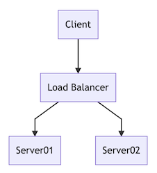

# Overview for n00bs

As a sysadmin I frequently have to document things, including drawing stuff.

Using mermaid, I can type this as a comment in a script:

```
graph TD
A[Client] --> B[Load Balancer]
B --> C[Server01]
B --> D[Server02]
```

And end up with this in the documentation:



Most of the stuff I need to visualize can be scripted in a similar way, with a varitety of different symbols and chart types available. Since the diagram source is text based, it can be part of production scripts (and other pieces of code). So less time needs be spent on documenting as a separate task.

Comparing with Visio and similar applications, mermaid is a really fast way to create good visualizations. This is especially apparent when editing a complex visualisation, this could take me hours in a desktop application but takes minutes (or even less if generation has been scripted) with mermaid.

With mermaid I can spend a fraction of the time I normally would spend, and instead automate the diagram generation and end up saving even more time. I love it!


However, a lot of the mermaid documentation is geared to professional frontend developers, presuming a skill set which I simply do not have.

I needed a really basic instruction. And here it is.
