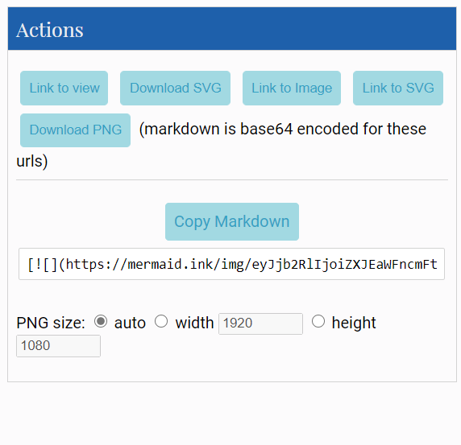

## Diagram syntax

If you are new to mermaid, read the [Getting Started](../getting-started/n00b-gettingStarted.md) and [Overview](../overview/n00b-overview.md) sections, to learn the basics of mermaid.
Video Tutorials can be found at the bottom of the Overview Section.

This section is a list of diagram types supported by mermaid. Below is a list of links to articles that explain the syntax of the diagrams or charts that can be called.

They also detail how diagrams can be defined, or described in the manner with which the diagram is to be rendered by Mermaid.

### The benefits of text based diagramming are its speed and modifiability. Mermaid allows for easy maintenance and modification of diagrams. This means your diagrams will always be up to date and closely follow your code and improve your documentation.

## mermaid tag
These Diagram Definitions can be entered within a \<div class=mermaid> tag.
like so :
```html
<div class="mermaid">
     graph LR
      A --- B
      B-->C[fa:fa-ban forbidden]
      B-->D(fa:fa-spinner);
</div>
```
## Mermaid Live Editor
You can proofread your definitions in real-time with the [Mermaid Live Editor](https://mermaid-js.github.io/mermaid-live-editor), additionally, you can also render and download them immediately using the Live Editor.

This would then offer you the following choices to download the diagram:



**Note:** Copying the markdown will allow you to link to your unique diagram from anywhere online. 

## Directives:
[Directives](./directives.md) gives a diagram author the capability to alter the appearance of a diagram before rendering, by changing some of the applied configurations and can alter the font style, color and other aesthetic aspects of the diagram. 

## Theme Creation:
Mermaid allows [Customized Themes](./theming.md) for websites and even individual diagrams.This is done using directives and can be very helpful, not only for styling but for simplifying more complex diagrams. 


