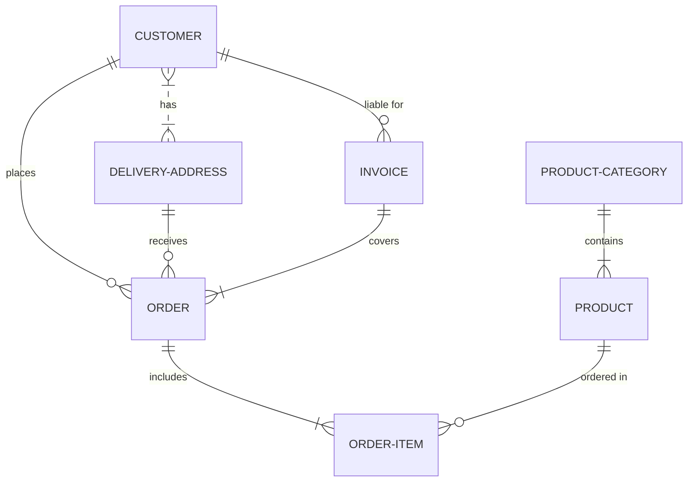

# Diagram Syntax
Mermaid's syntax is used to create diagrams. You'll find that it is not too tricky and can be learned in a day. The next sections dive deep into the syntax of each diagram type.  

Syntax, together with Deployment and Configuration constitute the whole of Mermaid. 

Diagram Examples can be found in the [Mermaid Live Editor](https://mermaid-js.github.io/mermaid-live-editor), it is also a great practice area.

## Syntax Structure
One would notice that all **Diagrams definitions begin** with a declaration of the **diagram type**, followed by the definitions of the diagram and its contents. This declaration notifies the parser which kind of diagram the code is supposed to generate. 

**Example** :  The code below is for an Entity Relationship Diagram, specified by the `erDiagram` declaration. What follows is the definition of the different `Entities` represented in it.

```
erDiagram
          CUSTOMER }|..|{ DELIVERY-ADDRESS : has
          CUSTOMER ||--o{ ORDER : places
          CUSTOMER ||--o{ INVOICE : "liable for"
          DELIVERY-ADDRESS ||--o{ ORDER : receives
          INVOICE ||--|{ ORDER : covers
          ORDER ||--|{ ORDER-ITEM : includes
          PRODUCT-CATEGORY ||--|{ PRODUCT : contains
          PRODUCT ||--o{ ORDER-ITEM : "ordered in"
```



The [Getting Started](./n00b-gettingStarted.md) section can also provide some practical examples of mermaid syntax.

 

## Diagram Breaking

One should **beware the use of some words or symbols** that can break diagrams. These words or symbols are few and often only affect specific types of diagrams. The table below will continuously be updated.


| Diagram Breakers  | Reason |Solution|
| ---               | ---    |---|
|  **Comments**     |        |   |
|[`%%{``}%%`](https://github.com/mermaid-js/mermaid/issues/1968) |  Similar to [Directives](./directives.md) confuses the renderer.|In comments using `%%`, avoid using "{}".|
|  **Flow-Charts**  |        |   |
|'end'              |  The word "End" can cause Flowcharts and Sequence diagrams to break |                  Wrap them in quotation marks to prevent breakage.|
| [Nodes inside Nodes](https://mermaid-js.github.io/mermaid/#/flowchart?id=special-characters-that-break-syntax)|  Mermaid gets confused with nested shapes | wrap them in quotation marks to prevent breaking|
                                                                                                   


### Mermaid Live Editor
Now, that you've seen what you should not add to your diagrams, you can play around with them in the [Mermaid Live Editor](https://mermaid-js.github.io/mermaid-live-editor). 

# Configuration

Configuration is the third part of Mermaid, after deployment and syntax. It deals with the different ways that Mermaid can be customized across different deployments. 

If you are interested in altering and customizing your Mermaid Diagrams, you will find the methods and values available for [Configuration](./Setup.md) here. It includes themes
This section will introduce the different methods of configuring of the behaviors and apperances of Mermaid Diagrams. 
The Following are the most commonly used methods, and are all tied to Mermaid [Deployment](./n00b-gettingStarted.md) methods. 

### Configuration Section in the [Live Editor](./Live-Editor.md). 
Here you can edit certain values to change the behavior and appearance of the diagram. 

### [The initialize() call](https://mermaid-js.github.io/mermaid/#/n00b-gettingStarted?id=_3-calling-the-javascript-api), 
Used when Mermaid is called via an API, or through a `<script>` tag. 


### [Directives](./directives.md),
Allows for the limited reconfiguration of a diagram just before it is rendered. It can alter the font style, color and other aesthetic aspects of the diagram. you can pass a directive alongside your defintion inside `%%{ }%%`, either above or below your diagram defintion. 

### [Theme Manipulation](./theming.md):
An application of using Directives to change [Themes](./theming.md). `Theme` is an value within mermaid's configuration that dictates the color scheme for diagrams. 


