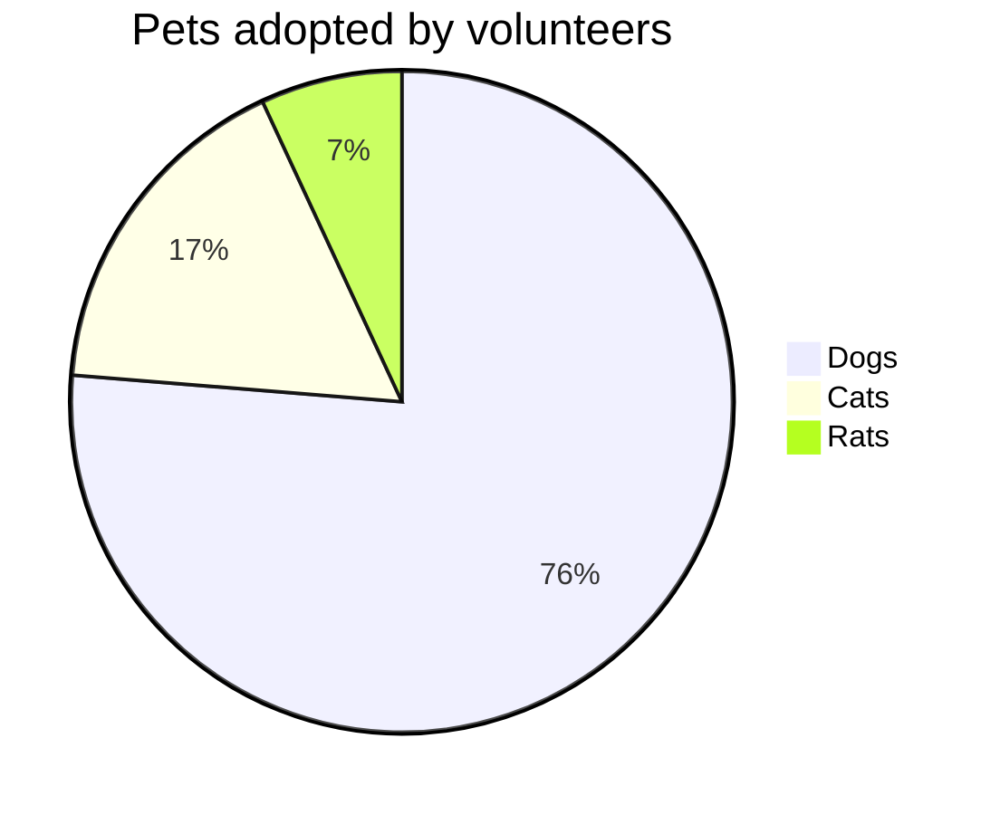

# Pie chart diagrams

> A pie chart (or a circle chart) is a circular statistical graphic, which is divided into slices to illustrate numerical proportion. In a pie chart, the arc length of each slice (and consequently its central angle and area), is proportional to the quantity it represents. While it is named for its resemblance to a pie which has been sliced, there are variations on the way it can be presented. The earliest known pie chart is generally credited to William Playfair's Statistical Breviary of 1801

Mermaid can render Pie Chart diagrams.

```
pie
    "Dogs" : 386
    "Cats" : 85
    "Rats" : 15 
```



## Syntax

```
pie
    "DataKey1" : Positive numeric value (upto two decimal places)
    "Calcium" : 42.96
    "Potassium" : 50.05
    "Magnesium" : 10.01
    "Iron" :  5
```
```mermaid
pie title Key elements in Product X
    "Calcium" : 42.96
    "Potassium" : 50.05
    "Magnesium" : 25.01
    "Iron" :  15
 ```
