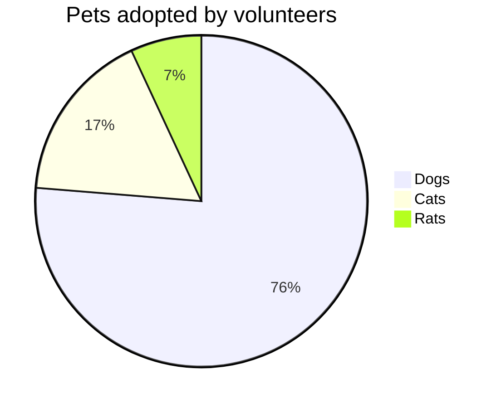

# Pie chart diagrams

> A pie chart (or a circle chart) is a circular statistical graphic, which is divided into slices to illustrate numerical proportion. In a pie chart, the arc length of each slice (and consequently its central angle and area), is proportional to the quantity it represents. While it is named for its resemblance to a pie which has been sliced, there are variations on the way it can be presented. The earliest known pie chart is generally credited to William Playfair's Statistical Breviary of 1801
-Wikipedia

Mermaid can render Pie Chart diagrams.

```
pie title Pets adopted by volunteers
    "Dogs" : 386
    "Cats" : 85
    "Rats" : 15 
```



## Syntax
Drawing a pie chart is really simple in mermaid. 
- Start with `pie` keyword to begin the diagram
- Followed by `title` keyword and its value in string to give a title to the pie-chart. This is ***OPTIONAL***
- Followed by dataSet
    - `label` for a section in the pie diagram within `" "` quotes.
    - Followed by `:` semi-colon as separator
    - Followed by `positive numeric value` (supported upto two decimal places) 

[pie]
     [title] [titlevalue]  (OPTIONAL)  
      "[datakey1]" : [dataValue1]  
      "[datakey2]" : [dataValue2]  
      "[datakey3]" : [dataValue3]  
      .  
      .

## Example 
```
pie
    title Key elements in Product X
    "Calcium" : 42.96
    "Potassium" : 50.05
    "Magnesium" : 10.01
    "Iron" :  5
```
```mermaid
pie 
title Key elements in Product X
    "Calcium" : 42.96
    "Potassium" : 50.05
    "Magnesium" : 25.01
    "Iron" :  15
 ```
