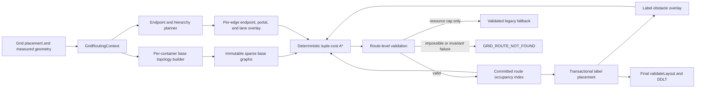

# Introduction

The Mermaid grid layout currently routes edges through container-wide
`verticalCorridors` and `horizontalCorridors`. Each item attaches to one global
corridor per side, and `routeWithinContainer()` selects among fixed routing
cases. This model cannot express that a track may be occupied in one logical
cell and traversable in another. In `test-mermaid-unusual.mmd`, `v1` at
row 1/column 1 and `v2` at row 1/column 3 have a clear horizontal route through
empty row 1/column 2, while `v2p` occupies row 2/column 2. The current global
corridors nevertheless detour `v1 --> v2` above row 1.

This plan replaces that routing model with a path-complete, sparse rectilinear
visibility graph built from measured geometry once per container per layout
invocation. Deterministic tuple-cost A\* chooses valid orthogonal routes.
Straight routes emerge naturally because they have minimum Manhattan length
and zero bends; there is no direct-route special case.

This PRD **supersedes**
`docs/projects/feature-grid-direct-edge-routing/feature-grid-direct-edge-routing.prd.md`.
The superseded plan proposed a narrow direct-edge fast path and explicitly
excluded general pathfinding. It MUST NOT be implemented alongside this plan.
The old document is retained only as decision history and is marked
superseded.

The key words "MUST", "MUST NOT", "REQUIRED", "SHALL", "SHALL NOT", "SHOULD",
"SHOULD NOT", "RECOMMENDED", "MAY", and "OPTIONAL" in this document are to be
interpreted as described in RFC 2119.

**Cross-reference conventions**: This document uses standardized prefixes for
traceability — `FR-` (functional requirements), `NFR-` (non-functional
requirements), `FM-` (failure modes), `AC-` (acceptance criteria), and `RD-`
(resolved decisions). No separate `.req.md` exists for this initiative.

## 1. Goals and Non-Goals

- **Goal 1**: Route grid edges through obstacle-free space based on actual
  measured geometry rather than occupancy anywhere in an entire logical track.
- **Goal 2**: Build one sparse, path-complete base topology per container and
  reuse it across edge searches without allocating a dense rows-by-columns
  matrix or depending on raw logical coordinate magnitude.
- **Goal 3**: Preserve deterministic hierarchy traversal, endpoint separation,
  shape clipping, labels, self-loops, and parallel/reverse edge distinction.
- **Goal 4**: Preserve the existing 1,000-node/500-edge under-500-ms contract
  and add structural metrics that expose graph/search growth.
- **Goal 5**: Deliver the replacement incrementally with test-only comparison,
  explicit validated fallback, and objective legacy-router removal criteria.
- **Non-Goal 1**: Globally optimize crossings or solve an NP-hard global edge
  routing problem.
- **Non-Goal 2**: Change node placement, grid compaction, group sizing, or the
  interpretation of sparse row/column placement.
- **Non-Goal 3**: Model exact silhouettes for every Mermaid shape during
  routing.
- **Non-Goal 4**: Change routing in Dagre, ELK, swimlanes, or any non-grid
  layout.

### In Scope

- Geometry-derived obstacle, container-boundary, endpoint, portal, and lane
  semantics for grid routing.
- A reduced rectilinear visibility graph with nearest-visible projections and
  deterministic tuple-cost A\*.
- Per-edge endpoint/lane overlays and per-label-pass obstacle overlays over an
  immutable invocation-local base topology.
- Nested-container route composition through paired boundary portals.
- Test-first migration of the existing grid routing and label-routing paths.
- Internal instrumentation, deterministic resource caps, validated fallback,
  DDLT migration, visual review, and eventual legacy removal.

### Out of Scope (deferred)

- Global crossing minimization — v1 uses only local costs against already
  committed routes and therefore makes no order-independent optimum claim.
- Exact shape silhouettes — measured bounding rectangles are conservative
  obstacles; the common painter retains actual shape-boundary clipping.
- Process-global topology or final-route caches — measured geometry and route
  occupancy are invocation-specific.
- A public routing selector or feature flag — rollout controls and dual routing
  remain internal or test-only.
- Placement changes to create more routing space — failure remains explicit
  when existing geometry contains no valid route.

## 2. Terminology

| Term              | Definition                                                                                                                                          |
| ----------------- | --------------------------------------------------------------------------------------------------------------------------------------------------- |
| Logical cell      | A placement key `(row, column)`. Logical coordinates determine ordering, not routing occupancy or allocation size.                                  |
| Track rectangle   | The full `cellLeft`, `cellTop`, `cellWidth`, and `cellHeight` area recorded for placement/alignment. It is not an obstacle.                         |
| Measured geometry | The actual node/group bounding rectangle after `layoutContainer()` and `materializeAbsoluteGeometry()`.                                             |
| Inflated obstacle | Measured geometry expanded by `ROUTE_CLEARANCE_PX = 6`, except for explicitly legal terminal channels and portals.                                  |
| Routing site      | An obstacle corner, container corner, portal site, endpoint slot, lane site, or nearest-visible projection used by the reduced graph.               |
| Base topology     | Immutable per-container graph derived from container geometry and direct-child obstacles, excluding edge occupancy and labels.                      |
| Overlay           | Invocation-local graph additions/disabled transitions for one endpoint pair, lane bundle, or label-reservation pass.                                |
| Portal range      | A legal interval on one group side after excluding corners, title space, and padding constraints.                                                   |
| Paired portal     | Matching child-interior and parent-exterior vertices connected by one perpendicular hierarchy transition.                                           |
| Terminal channel  | The only segment allowed to cross an endpoint owner's inflated obstacle, from a measured boundary port outward to clear space.                      |
| Pair bundle       | All parallel and reverse edges sharing one unordered endpoint pair.                                                                                 |
| Occupancy         | Segments from already committed valid routes, stored separately from base topology.                                                                 |
| Path-complete     | If a valid orthogonal route exists under this document's rectangular obstacle, portal, clearance, and terminal-channel model, a graph route exists. |
| Legacy router     | The current global-corridor implementation, retained temporarily behind enumerated resource-limit fallback only.                                    |

## 3. Solution Architecture

### 3.1 Current contracts and integration point

The implementation MUST preserve these current contracts:

- `layoutCore.ts:63-238` computes compact placement from only the sorted
  occupied row/column keys, positions actual contents within track rectangles,
  reserves 24 px group routing gutters and 20 px group routing clearance, and
  records global corridor arrays.
- `layoutCore.ts:395-442` materializes absolute geometry, calls
  `routeGridEdges()`, and then calls `positionGridEdgeLabels()`.
- `router.ts:165-346` plans hierarchy endpoints, spreads demand, and implements
  the global-corridor fixed-case router.
- `router.ts:645-766` routes each hierarchy chain and the LCA segment, then
  normalizes the combined polyline.
- `edgeLabels.ts:1908-2153` transactionally tries multiple label placement
  orders and can reroute owning or foreign edges.
- `validateLayout.ts:604-1320` validates obstacle/title intersections,
  orthogonality, endpoint direction and approach, distinct ports, shared
  subpaths, labels, arrowheads, group borders, bends, and crossings.
- `rendering-elements/edges.js:593-667` clips grid endpoints with each rendered
  shape's `intersect()` method while retaining orthogonal terminal direction.
- `ddlt/backends.ts:67-103` runs the production-equivalent
  prepare-measure-grid-core pipeline for grid fixtures.
- `performance.spec.ts:226-231` requires 1,000 nodes and 500 edges in under
  500 ms.

The new router MUST run after absolute geometry exists and before final label
placement. Placement and painting remain separate stages.

### 3.2 Component model



### 3.3 Exact graph representation

The implementation MUST add these internal contracts. Names MAY change only if
the replacement preserves every field and invariant.

```ts
type RouterVertexId = number;

interface RouterPoint {
  x: number;
  y: number;
}

interface RouterVertex {
  id: RouterVertexId; // Stable sorted ordinal, not a coordinate hash.
  point: RouterPoint;
  kind: 'corner' | 'projection' | 'portal' | 'endpoint' | 'lane';
  ownerId?: string;
  side?: GridSide;
}

interface RouterArc {
  from: RouterVertexId;
  to: RouterVertexId;
  orientation: 'H' | 'V';
  length: number;
  kind: 'visibility' | 'terminal' | 'portal' | 'lane';
  intervalStart: number;
  intervalEnd: number;
}

interface ContainerRoutingTopology {
  containerId: GridContainerId;
  bounds: Rect;
  obstacles: RouterObstacle[];
  vertices: readonly RouterVertex[];
  adjacency: ReadonlyMap<RouterVertexId, readonly RouterArc[]>;
  horizontalIntervals: OrthogonalIntervalIndex;
  verticalIntervals: OrthogonalIntervalIndex;
  portalRanges: readonly PortalRange[];
}

interface GridRoutingContext {
  topologies: Map<GridContainerId, ContainerRoutingTopology>;
  occupancy: RouteOccupancyIndex;
  metrics?: GridRoutingInstrumentation;
}
```

`OrthogonalIntervalIndex` and `RouteOccupancyIndex` MUST be coordinate-compressed
sorted interval/sweep indexes. They MUST NOT enumerate fixed-size buckets
between minimum and maximum coordinates.

Base topology sites MUST consist only of:

1. corners of normalized inflated obstacles;
2. container routing-boundary corners;
3. stable endpoints of legal portal ranges; and
4. nearest-visible horizontal/vertical projections produced from those sites.

The builder MUST connect only consecutive mutually visible sites on one sweep
line. It MUST NOT materialize every intersection of independent horizontal and
vertical candidate lines, every logical cell, every row/column pair, or a Hanan
grid.

The reduced construction MUST be path-complete for axis-aligned rectangular
obstacles. A test-only dense coordinate-compressed Dijkstra oracle MUST verify
small generated cases: whenever the oracle finds a valid path, the reduced
graph plus endpoint overlay MUST also find one.

The normative reduced-graph construction is:

1. Treat every inflated obstacle interior as closed and blocked. Its boundary
   is free space at exactly the required clearance.
2. Create seed sites at every obstacle/domain corner and portal-range endpoint.
   Merge exact coincident sites after normalizing `-0` to `0`; retain the
   lexicographically smallest role/owner metadata as the canonical record.
3. From every seed site, cast exactly four rays in side order
   `left`, `right`, `top`, `bottom`. Stop each ray at the first obstacle
   boundary or routing-domain boundary. Order collinear blocking intervals by
   near coordinate, far coordinate, then obstacle ID.
4. Create one projection site at every distinct ray hit. Projection sites MUST
   NOT recursively cast new rays.
5. For every horizontal/vertical obstacle or domain boundary side, sort its
   seed/projection sites by the varying coordinate and connect consecutive
   sites when the open interval does not enter blocked interior.
6. Connect each seed to each projection when the open ray interval does not
   enter blocked interior. Drop zero-length arcs and deduplicate equal directed
   arcs by the sorted arc key.
7. A ray along a shared boundary of normalized obstacles uses the union
   boundary and MUST NOT create an arc through the union interior.

**Path-completeness invariant**: for closed axis-aligned rectangular obstacle
interiors, every bend of a valid rectilinear path can be translated along one
incident segment until it reaches a seed ray or free obstacle/domain boundary
without entering blocked interior. Repeating the transformation maps the path
onto seed-to-projection rays and consecutive free boundary intervals in this
graph. The dense oracle is supplementary regression evidence for the
invariant, not its definition.

For `S = obstacle corners + container corners + portal-range endpoints`, the
target base graph bounds are `V <= 5*S + 32` vertices and directed adjacency
entries `A <= 8*V`. Degenerate geometry MAY exceed the target only until a
deterministic resource cap triggers container-scoped fallback. Per-edge
endpoint/lane overlays MUST add at most 32 vertices and 64 directed adjacency
entries.

### 3.4 Deterministic vertex identity

Coordinates MUST remain exact finite JavaScript numbers; `-0` MUST normalize to
`0`. Geometry MUST NOT be quantized for identity. The builder MUST sort vertex
records by:

1. container ancestry path;
2. vertex kind;
3. orientation/side;
4. exact `x`;
5. exact `y`;
6. interval endpoints;
7. owner ID.

It MUST then assign compact ordinal IDs. Adjacency lists MUST be sorted by arc
kind, orientation, destination coordinates, and destination ID. Map insertion
order, source array order, and priority-queue implementation details MUST NOT
change a route.

### 3.5 Cell and obstacle semantics

| Geometry                               | Router semantics                                                                                   |
| -------------------------------------- | -------------------------------------------------------------------------------------------------- |
| Logical cell                           | Placement ordering only; never materialized as a routing object.                                   |
| Track rectangle                        | Available space except where actual measured geometry occupies it.                                 |
| Leaf node                              | Measured bounding rectangle inflated by 6 px.                                                      |
| Nonrectangular node                    | Same conservative inflated bounding rectangle in v1; actual shape clipping remains in the painter. |
| Direct child group as seen from parent | Inflated solid rectangle except legal terminal/transit portals.                                    |
| Group as its own container             | Container frame/boundary; child routing stays inside the existing 24 px routing gutter.            |
| Group title                            | `groupTitleRect` inflated by 6 px and excluded from portal/routing space.                          |
| Empty or unused aligned space          | Traversable when no inflated measured geometry intersects it.                                      |
| Label helper before placement          | Not a base obstacle.                                                                               |
| Frozen label reservation               | Pass-local inflated obstacle with local visibility projections.                                    |

Inflated obstacles MUST be normalized into non-overlapping blocked rectangles or
an equivalent interval union before visibility sweeps. Inflated-obstacle
interiors are blocked; their boundaries are traversable at exactly 6 px
clearance. An arc MUST NOT enter the interior. Terminal channels and portals
are the only arcs allowed to cross an inflated owner/group obstacle.

Routing domains are exact:

- The root domain is the bounding rectangle of root direct-child track
  rectangles expanded by `ROOT_OUTER_MARGIN = 24` on all sides, matching
  `rootContainerMeta()`.
- A group interior domain is
  `[contentLeft - 20, contentRight + 20] ×
[contentTop - 20, contentBottom + 20]`, clipped to the measured group
  rectangle and excluding the inflated group title. This preserves the current
  24 px routing gutter and 20 px clearance from `layoutContainer()`.
- In a parent topology, the same group is its measured rectangle inflated by
  6 px, except where a legal portal transition crosses it.

### 3.6 Endpoint candidates, demand spreading, and clipping

For each owner and legal side, the planner MUST allocate deterministic
candidate slots for all incident non-self edge demands before path search:

1. Sort side demands by opposite endpoint coordinate, unordered endpoint pair,
   directed endpoint pair, then edge ID.
2. Define the usable side interval by removing 6 px from corners, the group
   title plus 6 px, and illegal portal/frame zones.
3. For `n = 1`, place the slot at the midpoint. For `n > 1`, place slot `i` at
   `low + i * (high - low) / (n - 1)`.
4. If adjacent spacing is less than 4 px, mark that entire owner-side
   unavailable for this invocation. Do not collapse or selectively drop
   demands. If an edge has no candidate on any side, throw
   `GRID_ROUTE_NOT_FOUND`.
5. Rank an edge's surviving candidates by
   `[Manhattan distance from slot to opposite-center, sideOrdinal]`, where
   `sideOrdinal` is `right=0`, `bottom=1`, `left=2`, `top=3`. A group top side
   intersecting its title exclusion is illegal.

Each endpoint candidate MUST include:

- a port on the measured owner rectangle;
- one perpendicular terminal channel crossing only that owner's inflated
  rectangle;
- at least `TERMINAL_APPROACH_PX = 12` of straight route before the first bend;
- a projection into visible base or overlay topology.

The owner remains an obstacle after the terminal channel; later segments MUST
NOT re-enter it. Search may choose among the edge's preassigned side-specific
slots. The common painter MUST continue clipping the selected terminal
direction to the actual shape. No painter change is planned.

The terminal channel begins at the measured owner boundary port, exits the
6 px inflated owner boundary, and continues straight to its first
base/overlay vertex. The full port-to-first-vertex segment MUST be at least
12 px, so the first bend is at least 12 px from the measured port.

Self-loops MUST choose two distinct legal slots on one owner and search a
non-zero orthogonal cycle outside the inflated owner. Same-cell stacks use the
same geometry rules: actual intervening items block a route; unused track space
does not.

### 3.7 Hierarchy and boundary portals


Each containment transition MUST use a paired portal with:

- equal tangential coordinates on the child and parent sides of the same frame;
- owner group and side;
- an interior vertex and exterior vertex;
- one explicit perpendicular boundary-transition arc;
- `terminal` or `transit` usage;
- at least 6 px corner/title clearance.

For a measured group rectangle `R`, an interior portal lies 6 px inward from
the selected side and the exterior portal lies 6 px outward. The transition
length is exactly 12 px and crosses the frame perpendicularly. Legal tangential
portal intervals are:

- left/right: `[max(R.top + 6, title.bottom + 6), R.bottom - 6]` when a title
  exists, otherwise `[R.top + 6, R.bottom - 6]`;
- bottom: `[R.left + 6, R.right - 6]`;
- top: `[R.left + 6, R.right - 6]` only when no title exclusion intersects the
  top transition strip; otherwise empty.

An interval with `high < low` is empty. An interval with `high === low`
provides one portal only if no other demand requires 4 px separation;
otherwise it is unavailable.

Hierarchy planning determines required transitions; unrelated group boundaries
MUST NOT be crossed. Every required boundary MUST be crossed exactly once.
Edges MUST NOT travel along a group frame. A group endpoint terminates on its
boundary without entering its child topology. A member-to-ancestor-group edge
terminates at that ancestor boundary. Cross-container member/member edges
compose child, ancestor, and target-child searches without flattening all
containers into one graph.

The base topology stores legal portal ranges. Demand-specific paired portal
points are per-edge overlays projected into both adjacent base graphs. Thus one
base graph is built per container while hierarchy demand remains edge-specific.

### 3.8 Deterministic search and cost

Production routing MUST use A\*. Dijkstra MAY exist only as the small-graph test
oracle. Search state is `(vertexId, incomingOrientation)` so bends are counted
exactly.

Semantic path cost `g` MUST be this additive lexicographic tuple:

```text
[
  Manhattan length,
  bend count,
  required boundary-transition count,
  occupied/shared length,
  local crossing count,
  endpoint candidate rank
]
```

Invalid transitions are omitted rather than assigned high cost. Required
boundary transitions are fixed by hierarchy composition and appear in the
tuple for deterministic comparison of legal endpoint/portal alternatives.
Pair-bundle shared-lane violations are hard-invalid. Per-arc increments are
`[arc.length, turn ? 1 : 0, portalArc ? 1 : 0, occupiedLength,
crossingEvents, 0]`. Endpoint candidate rank is charged exactly once on the
synthetic source arc.

The admissible, consistent A\* heuristic is:

```text
[
  Manhattan distance to target,
  minimum remaining bends implied by displacement and endpoint orientations,
  0,
  0,
  0,
  0
]
```

Congestion and crossings therefore influence only routes tied on length, bends,
and boundary transitions. v1 MUST NOT take an arbitrarily longer route solely
to reduce crossings and MUST NOT claim global crossing minimization.

The externally meaningful result is the minimum semantic tuple cost followed
by the lexicographically smallest complete state sequence
`[(vertexId, incomingOrientationOrdinal), ...]`. Queue insertion order,
queue-pop order, and other discovery-order details are implementation details
and MUST NOT affect that result. Relaxation replaces a state on lower `g`;
equal-cost alternatives MUST resolve to the canonical lexicographically
smallest state sequence. Reopening is REQUIRED when a lower `g` is found.
After a best goal exists, search MAY terminate only when the smallest open `f`
is **strictly greater than** the best goal `g`; equal-`f` states remain eligible
to supply the canonical result. Epsilon-based priority comparisons are
forbidden because they are not transitive. Tests MUST perturb queue tie order
and compare the production heuristic with `h = 0` to prove result independence.

### 3.9 Routing order, occupancy, and cache behavior

Plans MUST be sorted by:

```text
[
  routeClass,
  descending requiredBoundaryCount,
  endpointCandidateCountProduct,
  unorderedEndpointPair,
  directedEndpointPair,
  edgeId
]
```

`routeClass` order is:

1. self-loops;
2. group/member and ancestor/member terminal edges;
3. cross-container member/member edges;
4. same-container parallel/reverse bundles;
5. other same-container edges.

Edges in one unordered pair MUST remain contiguous. A route updates occupancy
only after route-level validation succeeds. Earlier valid routes MAY influence
later equal-length/equal-bend choices through soft occupancy/crossing costs;
this intentional order dependence is deterministic.

Base topologies are cached only within one `runGridLayoutCore()` invocation.
Endpoint, lane, occupancy, and label overlays MUST remain outside the base
cache. Final routes MUST NOT be cached. v1 MUST NOT add a process-global cache.

### 3.10 Parallel, reverse, and lane policy

For each unordered endpoint pair with `n` edges:

1. Sort by directed endpoint pair and edge ID.
2. Assign preferred offsets
   `offset(i) = (i - (n - 1) / 2) * LANE_SEPARATION_PX`, where
   `LANE_SEPARATION_PX = 8`.
3. Add obstacle-clear pair-local lane sites/tracks and distinct endpoint slots.
4. Prohibit reuse of another pair member's nonterminal subpath for 8 px or
   more.
5. Require coexisting parallel sections to remain at least 8 px apart.
6. If a preferred offset is blocked, search independently with the same hard
   pair constraints.
7. Throw `GRID_ROUTE_NOT_FOUND` if no distinct valid route exists.

Congestion remains soft for unrelated edges. It MUST NOT substitute for these
hard bundle constraints.

### 3.11 Labels and termination

Labels follow route-then-place semantics because their sizes are measured but
their positions depend on routes. The current label subsystem MUST migrate to
a deterministic transactional maximum of two global passes:

1. Save one rollback snapshot containing every route and label position.
2. Pass 1 starts from the pre-label routes with no committed label positions.
   In source-index then edge-ID order, choose a provisional label position
   against routes and all earlier provisional reservations; do not reroute
   edges during this step.
3. After every label has a provisional position, freeze the complete
   reservation set. A label with no provisional position marks the pass
   invalid but does not mutate routes.
4. Build label overlays from the frozen set and compute the impacted edge set:
   every owning edge whose anchor is invalid plus every foreign edge
   intersecting a reservation.
5. Reroute impacted edges once each in the normal routing order against all
   frozen reservations. Preserve every owning-label anchor.
6. Validate all routes, anchors, labels, frames, and arrowheads. On success,
   commit pass 1 and finish.
7. On pass-1 failure, pass 2 starts from the pass-1 route results. It keeps
   valid label positions/reservations frozen, clears only labels whose anchor
   or reservation failed validation, and provisionally replaces those labels
   in source-index then edge-ID order.
8. Freeze the complete pass-2 reservation set, recompute the impacted edge set,
   and reroute each impacted edge at most once in pass 2. An edge MAY therefore
   be rerouted once in each pass, never twice in one pass.
9. Validate globally. On success, commit pass 2. On failure or any missing
   provisional position, restore the rollback snapshot and throw
   `GRID_ROUTE_NOT_FOUND`.

The implementation MUST NOT invoke legacy fallback for label non-convergence.
The existing five-order label fallback MAY remain only during a measured
transition phase; it MUST be removed when the deterministic two-pass tests
cover equivalent dense-label cases.

### 3.12 Failure and staged fallback

Search outcomes MUST be classified exactly:

| Outcome                                                            | Legacy fallback allowed            |
| ------------------------------------------------------------------ | ---------------------------------- |
| Complete path-complete graph searched to exhaustion                | No; throw `GRID_ROUTE_NOT_FOUND`   |
| Vertex cap reached during base construction                        | Yes, reason `vertex_cap`           |
| Adjacency cap reached during base construction                     | Yes, reason `adjacency_cap`        |
| Estimated-memory cap reached                                       | Yes, reason `estimated_memory_cap` |
| Per-edge or invocation search-state cap reached                    | Yes, reason `search_state_cap`     |
| Internal invariant violation, malformed graph, non-finite geometry | No; throw                          |
| Wall-clock timeout                                                 | Forbidden; nondeterministic        |
| Label convergence failure                                          | No; restore and throw              |

A base-construction fallback is container-scoped: every segment routed inside
that container MUST use the legacy router for that invocation. Arbitrary
exceptions MUST NOT be caught and converted to fallback.

Fallback is a migration mechanism. Before legacy removal the table above
applies. After every removal gate in Section 9 holds and the legacy
implementation is deleted, the same four resource-cap outcomes MUST throw
`GRID_ROUTE_NOT_FOUND` with the fixed reason in error details.

Every fallback MUST:

- increment instrumentation and record one fixed reason;
- emit one structured debug log;
- validate the legacy route for finite orthogonal geometry, obstacle/title
  clearance, hierarchy transitions, port direction, distinct ports, and
  terminal approach;
- throw instead of committing an invalid fallback route.

Test-only dual routing SHOULD record route validity, length, bends, crossings,
and fallback reason for new and legacy outputs. It MUST NOT alter production
selection or expose a public configuration key.

### 3.13 Algorithms

Base topology construction:

```text
buildContainerTopology(container, directChildren):
  obstacles = normalizeAndInflateActualGeometry(directChildren, 6)
  sites = obstacleCorners(obstacles)
        + containerRoutingBoundaryCorners(container)
        + portalRangeEndpoints(container)
  assert no work depends on logical row/column magnitude

  horizontalEvents = sort(sites and obstacle interval events by y, then x, then role)
  verticalEvents   = sort(sites and obstacle interval events by x, then y, then role)

  for each sweep:
    project each site only to its nearest visible blocking boundary/site
    add projection site when distinct
    connect only consecutive mutually visible sites on the sweep line

  canonicalize exact coordinates and assign stable ordinal IDs
  sort adjacency deterministically
  assert structural/resource caps
  return immutable topology and interval indexes
```

Per-edge search:

```text
routePlan(plan, context):
  candidates = buildEndpointSlotsAndTerminalChannels(plan)
  hierarchy = buildRequiredPairedPortalOverlays(plan)
  lanes = buildPairLaneOverlay(plan.bundle)

  for each legal candidate pair in deterministic rank order:
    overlay = compose(base topologies, candidates, hierarchy, lanes, labels)
    result = tupleAStar(
      state = (vertexId, incomingOrientation),
      occupancy = committed routes,
      heuristic = admissible tuple heuristic
    )
    if result satisfies route-level invariants:
      choose least tuple-cost result

  if valid result exists:
    normalize polyline, commit occupancy, return points
  if resource cap occurred:
    run and validate enumerated legacy fallback
  otherwise:
    throw GRID_ROUTE_NOT_FOUND
```

## 4. Requirements

**Summary**: Requirements replace track-wide routing with sparse geometry-aware
routing while preserving hierarchy, determinism, rendering, validity, and
performance.

**Items**:

- **FR-001**: The motivating `v1 --> v2` edge MUST route as one horizontal
  segment through empty row 1/column 2 despite `v2p` occupying row 2/column 2.
- **FR-002**: Straight edges MUST emerge from normal graph search as the
  cheapest valid route; production code MUST NOT contain a direct-route fast
  path.
- **FR-003**: Each container MUST have one immutable base topology built from
  actual measured direct-child geometry, container boundaries, title
  exclusions, and portal ranges.
- **FR-004**: The graph MUST be sparse and path-complete and MUST NOT allocate
  by rows×columns, distinct-X×distinct-Y, or raw coordinate magnitude.
- **FR-005**: Track rectangles and unused aligned space MUST remain traversable;
  measured leaf/group geometry inflated by 6 px MUST block transit.
- **FR-006**: Endpoint routing MUST provide deterministic legal-side slots,
  distinct ports, a single owner exception channel, and 12 px straight terminal
  approach before a bend.
- **FR-007**: Nested group routes MUST compose container searches through paired
  perpendicular portals and cross only hierarchy-required boundaries.
- **FR-008**: Same-cell stacks, group/member, ancestor/member, cross-group,
  group endpoint, group self-loop, and leaf self-loop cases MUST either produce
  a valid route or explicitly throw `GRID_ROUTE_NOT_FOUND`.
- **FR-009**: Parallel and reverse pair bundles MUST use distinct slots and
  routes with 8 px lane separation and no shared nonterminal subpath of 8 px or
  more.
- **FR-010**: Labels MUST use route-then-place semantics with at most two
  transactional global passes and at most one reroute per impacted edge per
  pass against the complete frozen reservation set.
- **FR-011**: Route occupancy MAY influence later equal-length/equal-bend
  choices only through deterministic local congestion and crossing costs.
- **FR-012**: While the legacy router is retained, fallback MUST be limited to
  the four enumerated deterministic resource-cap reasons and every fallback
  route MUST be surfaced and validated. After legacy removal, those caps MUST
  throw with the same fixed reason.
- **FR-013**: The common painter MUST retain actual shape clipping; the router
  MUST preserve orthogonal terminal direction and MUST NOT require painter
  changes.
- **FR-014**: The old direct-fast-path PRD MUST remain in the repository marked
  superseded and MUST NOT be implemented.
- **NFR-001**: Equivalent input MUST produce byte-equivalent node geometry,
  route point arrays, label positions, instrumentation counts, and fallback
  reasons across 100 repeated runs.
- **NFR-002**: The existing 1,000-node/500-edge test MUST remain under 500 ms
  with instrumentation disabled and MUST use zero fallback.
- **NFR-003**: Warm reference measurements SHOULD have median under 400 ms and
  p95 under 500 ms over at least 10 runs.
- **NFR-004**: The 1,000/500 case MUST retain less than 64 MiB estimated routing
  topology/overlay memory, expand fewer than 2,000,000 orientation states in
  total, and remain below the caps in Section 7.
- **NFR-005**: Logical coordinate variants `{1,2}` and `{1,10000}` with
  equivalent occupied ordering MUST produce equal topology sizes and MUST NOT
  execute a loop or allocate an array of length 10,000.
- **NFR-006**: No runtime dependency, public API, public configuration key, or
  process-global cache MAY be added.
- **CON-001**: Placement, group sizing, and sparse coordinate compaction in
  `layoutCore.ts` MUST remain behaviorally unchanged.
- **CON-002**: Existing 24 px group routing gutters and root exterior margin
  MUST be retained unless a separately approved placement PRD changes them.
- **CON-003**: Grid DDLT uses the same prepare-measure-core orchestration as
  production; tests MUST NOT bypass that pipeline for integration acceptance.
- **CON-004**: Non-grid layouts and the swimlane aggregate baseline MUST remain
  unchanged.
- **PAT-001**: Existing `normalizePolyline()`, `rectForNode()`, and validation
  semantics SHOULD be reused; shared helper changes MUST preserve non-grid
  behavior.
- **FM-001**: Complete graph exhaustion MUST throw `GRID_ROUTE_NOT_FOUND` and
  MUST NOT silently invoke legacy routing.
- **FM-002**: Invalid fallback geometry MUST increment
  `fallbackValidationFailures` and throw; it MUST NOT be committed.
- **FM-003**: Label non-convergence MUST restore pre-label routes/positions and
  throw.
- **FM-004**: Non-finite geometry, invalid containment, or malformed graph
  invariants MUST throw the existing appropriate grid error without fallback.

## 5. Risk Classification

**Risk**: 🔴 HIGH RISK

**Summary**: This is a core routing architecture replacement affecting every
grid edge, hierarchy boundary, label conflict, and route-quality baseline.
Correctness, performance, and migration risk require staged enablement and
retention of validated legacy fallback until objective removal criteria hold.

**Items**:

- **RISK-001**: A nominally sparse graph can become Cartesian through segment
  intersections. Mitigation: nearest-visible reduced graph, structural metrics,
  and explicit graph-size assertions.
- **RISK-002**: An incomplete graph can misclassify reachable paths as
  impossible. Mitigation: path-completeness contract and dense small-case
  Dijkstra oracle.
- **RISK-003**: Endpoint-owner inflation can either block every route or permit
  node re-entry. Mitigation: one explicit terminal channel and normal obstacle
  treatment afterward.
- **RISK-004**: Hierarchy composition can cross unrelated frames or title
  regions. Mitigation: paired portal ranges and exact boundary-transition
  validation.
- **RISK-005**: Sequential routing can make route quality order-dependent.
  Mitigation: fixed order, hard validity independent of occupancy, and soft
  occupancy only after length/bend priorities.
- **RISK-006**: Label overlays can oscillate. Mitigation: frozen reservations,
  two transactional passes, rollback, and explicit failure.
- **RISK-007**: Parallel/reverse routes can collapse despite congestion costs.
  Mitigation: hard pair-lane constraints and distinct endpoint slots.
- **RISK-008**: Legacy fallback can conceal defects indefinitely. Mitigation:
  fixed reasons, counters, validation, no broad catches, and removal gates.
- **RISK-009**: Existing DDLT scores can change broadly even when routes become
  valid. Mitigation: per-fixture before/after review and intentional baseline
  update, never an unexplained baseline reduction.
- **RISK-010**: Same-container tuple-cost routing currently misses the retained
  1,000-node/500-edge performance target: official EPIC-003 measurements range
  from 1.3 to 1.7 seconds versus the required 500 ms, with zero fallback.
  Mitigation: treat this as explicit performance debt, preserve NFR-002 and
  AC-011 unchanged, and require EPIC-007/ITEM-021 to revisit measured search,
  topology, indexing, and later-routing optimization options before claiming
  performance closure or removing the legacy router.
- **ASSUMPTION-001**: Measured bounding rectangles are conservative enough for
  v1 obstacle routing while painter-time `intersect()` handles visual shape
  boundaries.
- **ASSUMPTION-002**: Existing placement provides sufficient routing space for
  supported diagrams; the router may fail explicitly when no valid path exists.

## 6. Dependencies

**Summary**: No external package is required. The implementation depends on
existing measured geometry, containment metadata, validators, DDLT, and common
painting.

**Items**:

- **DEP-001**: Grid placement and absolute geometry in
  `grid/layoutCore.ts:63-238` and `grid/layoutCore.ts:395-442`.
- **DEP-002**: Containment forest and ancestor checks in `grid/groups.ts`.
- **DEP-003**: Existing endpoint planning, demand ordering, self-loop behavior,
  and legacy fallback in `grid/router.ts`.
- **DEP-004**: Measured label helpers and current transactional label behavior
  in `grid/edgeLabels.ts`.
- **DEP-005**: Geometry helpers and polyline normalization in
  `layout-utils/helpers.ts` and `layout-utils/geometry.ts`.
- **DEP-006**: Full validity contract and route scoring in
  `layout-utils/validateLayout.ts`.
- **DEP-007**: Grid endpoint clipping in
  `rendering-elements/edges.js:593-667` and common paint orchestration in
  `layout-algorithms/common/index.ts:286-327`.
- **DEP-008**: Parser-backed fixture execution in `ddlt/backends.ts`,
  `ddlt/loadDdltFixture.ts`, and grid DDLT specs.
- **DEP-009**: Browser-captured fixture sizes and freshness metadata in
  `e2e/platform/dev-diagrams/layout-tests`.

## 7. Quality & Testing

**Summary**: Every epic begins with failing tests or characterization metrics.
Unit tests prove graph/search invariants; generated oracle comparisons prove
completeness; DDLT and visual review prove production integration.

**Items**:

- **TEST-001**: Add the exact motivating source as
  `grid/routing-cell-aware-empty-cell.mmd` with browser-captured sizes. Assert
  `v1 --> v2` normalizes to exactly one horizontal segment and the full layout
  validates.
- **TEST-002**: Add reduced-graph unit tests for obstacle corners, nearest
  projections, no all-line intersections, stable IDs, sorted adjacency,
  overlapping obstacle normalization, and path completeness against a dense
  test-only oracle.
- **TEST-003**: Generate at least 10,000 deterministic small rectangle cases;
  compare reduced A\* reachability and shortest Manhattan length/bends with the
  dense Dijkstra oracle.
- **TEST-004**: Add sparse-coordinate twins using rows/columns `{1,2}` and
  `{1,10000}`; assert equal compact geometry, graph sizes, overlay sizes, and
  bounded event counts.
- **TEST-005**: Cover horizontal/vertical straight routes, detours, aligned
  small contents, unused track space, same-cell adjacent/nonadjacent stacks,
  zero gaps, and conservative nonrectangular obstacles.
- **TEST-006**: Cover legal-side capacity, title-excluded slots, 4 px attachment
  distinction, 12 px terminal approach, owner non-reentry, and arrowhead
  clearance.
- **TEST-007**: Cover nested siblings, group/member, ancestor/member,
  cross-group members, group endpoints, title-adjacent portals, and exact
  required boundary-transition counts.
- **TEST-008**: Cover self-loops and parallel/reverse bundles, including blocked
  preferred lanes, 8 px separation, no 8 px shared subpaths, deterministic
  bundle order, and explicit no-route failure.
- **TEST-009**: Cover labels that fit existing segments, force owning-edge
  changes, force multiple foreign-edge changes, invalidate earlier anchors,
  converge on pass 2, and fail with transactional rollback.
- **TEST-010**: Add instrumentation tests proving one base build per container,
  bounded overlays, stable counts, fixed fallback reasons, and rejected invalid
  fallbacks.
- **TEST-011**: Retain the hard 1,000/500 `<500 ms` test; add dense, sparse,
  nested, parallel, and labelled benchmark cases plus structural/memory caps.
- **TEST-012**: Run all grid unit/DDLT specs, fixture freshness, aggregate
  validation, TypeScript checks, and relevant common painter tests. Run the
  repository's existing non-grid layout tests needed to prove isolation.

### Instrumentation and benchmark thresholds

`GridRoutingInstrumentation` MUST include:

| Metric                                                      | Contract                                         |
| ----------------------------------------------------------- | ------------------------------------------------ |
| `containersBuilt`, `baseTopologyBuilds`                     | Exactly one per routed container per invocation. |
| `baseVertices`, `baseAdjacencyEntries`, `buildSweepEvents`  | Stable counts; no coordinate-magnitude growth.   |
| `endpointOverlayBuilds`, `endpointOverlayVertices`          | At most 32 vertices per edge attempt.            |
| `labelOverlayBuilds`, `labelOverlayVertices`                | Reported per pass and container.                 |
| `searches`, `expandedStates`, `maxOpenSet`                  | Stable deterministic counts.                     |
| `routesFound`, `routesImpossible`                           | Sum consistent with attempted routes.            |
| `resourceLimitFallbacks`, `fallbackReasons`                 | Only four fixed reasons.                         |
| `fallbackValidationFailures`                                | Must remain zero.                                |
| `routeLength`, `bendCount`, `crossingCount`, `sharedLength` | Reported per route and aggregate.                |
| `estimatedBytes`                                            | Under 64 MiB for the 1,000/500 benchmark.        |

Deterministic caps:

- maximum 50,000 base vertices per container;
- maximum 200,000 directed adjacency entries per container;
- maximum 100,000 expanded orientation states per edge;
- maximum 2,000,000 expanded orientation states per invocation;
- maximum 64 MiB estimated topology/overlay memory per invocation.

Benchmark matrix:

| Case                                                | Required result                                                                                  |
| --------------------------------------------------- | ------------------------------------------------------------------------------------------------ |
| Existing 1,000 nodes/500 edges                      | `<500 ms`, zero fallback, `<64 MiB`, `<2M` expanded states                                       |
| 1,000 densely packed nodes/500 long edges           | Completes under deterministic caps; fallback, if any, uses a fixed surfaced reason and validates |
| 1,000 sparse logical coordinates spanning 1..10,000 | Same topology counts as compact-coordinate twin; no magnitude-proportional work                  |
| 10-level nested groups with cross-container edges   | Correct portal counts, bounded topology per container, no stack overflow                         |
| 100 pair bundles plus reverse edges                 | All routes distinct and valid; deterministic counts                                              |
| Dense measured labels crossing many routes          | Converges within two passes or rolls back and throws; no partial state                           |

### Acceptance Criteria

| ID     | Criterion                                                                                                                                                                        | Verification                                    | Traces To              |
| ------ | -------------------------------------------------------------------------------------------------------------------------------------------------------------------------------- | ----------------------------------------------- | ---------------------- |
| AC-001 | The exact unusual fixture routes `v1 --> v2` as one clear horizontal segment through row 1/column 2, without special-case production code.                                       | DDLT point-array assertion and code review      | FR-001, FR-002         |
| AC-002 | Equivalent compact and row/column-10000 diagrams have equal graph/overlay sizes and no magnitude-proportional loops or arrays.                                                   | Sparse-coordinate unit and performance tests    | FR-004, NFR-005        |
| AC-003 | Reduced A\* finds every route found by the dense oracle across deterministic generated cases and matches shortest length/bend priority.                                          | 10,000-case oracle property test                | FR-004                 |
| AC-004 | Routes use actual geometry, traverse unused track space, and never intersect inflated unrelated leaf/group/title obstacles.                                                      | Router geometry matrix plus `validateLayout()`  | FR-003, FR-005         |
| AC-005 | Every endpoint has a legal distinct port, one owner exit channel, 12 px pre-bend approach, correct direction, and painter-compatible clipping.                                   | Endpoint tests, validator, painter tests        | FR-006, FR-013         |
| AC-006 | Same-cell, self-loop, group/member, ancestor/member, cross-group, and nested routes cross exactly the required boundaries and no others.                                         | Hierarchy/portal test matrix                    | FR-007, FR-008         |
| AC-007 | Parallel/reverse edges remain distinct, at least 8 px apart where parallel, and share no nonterminal subpath of 8 px or more.                                                    | Bundle tests and validator                      | FR-009                 |
| AC-008 | Label placement converges within two passes or restores the complete pre-label state and throws; no partial route/label mutation survives.                                       | Label transactional tests                       | FR-010, FM-003         |
| AC-009 | Repeated runs produce byte-equivalent geometry, labels, route arrays, metrics, and fallback reasons.                                                                             | 100-run determinism tests                       | NFR-001                |
| AC-010 | Only enumerated resource caps invoke fallback; every fallback is logged, counted, validated, and invalid fallback is rejected.                                                   | Instrumentation/fault-injection tests           | FR-012, FM-001, FM-002 |
| AC-011 | Existing 1,000/500 benchmark remains under 500 ms with zero fallback and all memory/state caps satisfied.                                                                        | `performance.spec.ts`                           | NFR-002, NFR-004       |
| AC-012 | All grid DDLT fixtures validate with no exemptions; intentional route changes have per-fixture score/bend/crossing deltas reviewed; the grid baseline is not reduced below 9470. | DDLT sweep and visual review record             | CON-003                |
| AC-013 | Non-grid geometry/tests and swimlane aggregate baseline remain unchanged.                                                                                                        | Targeted non-grid suites and baseline assertion | CON-004                |
| AC-014 | The old PRD is marked superseded and no direct-route fast path is introduced.                                                                                                    | Documentation and diff review                   | FR-014                 |

**EPIC-003 acceptance status (2026-09-22)**: Same-container correctness,
minimum-tuple canonical determinism, resource caps, zero-fallback behavior, and
the motivating one-segment route are accepted. AC-011 and NFR-002 are not met:
the official 1,000-node/500-edge benchmark currently measures 1.3–1.7 seconds
against the unchanged 500 ms target, with zero fallback. By explicit project
decision, this performance debt is deferred to EPIC-007/ITEM-021 so later
routing steps can inform the optimization choice. This deferral does not waive,
weaken, or satisfy AC-011 or NFR-002.

## 8. Security Considerations

No security boundary changes are introduced. The router processes in-memory
diagram geometry, but resource exhaustion from adversarial diagram structure is
relevant.

- **Data handling**: No sensitive data, network access, or persistence is added.
- **Input validation**: Existing finite measurement and containment validation
  remains mandatory; graph construction adds deterministic vertex, adjacency,
  memory, and search-state caps.
- **Access control**: Not applicable.
- **Secrets**: Not applicable.
- **Denial of service**: No wall-clock loops, raw-coordinate allocation, dense
  Cartesian graph, or unbounded label iteration is permitted.

## 9. Deployment & Rollback

Rollout is internal and staged; no public config flag is justified.

1. Add characterization, instrumentation, and topology/search tests without
   changing production route selection.
2. Run test-only dual routing for same-container edges and record validity and
   quality deltas.
3. Enable the new router for same-container edges, retaining validated
   container-scoped legacy fallback only for resource caps.
4. Enable hierarchy, bundles, and labels after their respective acceptance
   suites pass.
5. Make the sparse router the sole default for grid and review the complete
   grid DDLT corpus and visual diffs.
6. Remove the legacy router only after:
   - zero fallback across all grid DDLT fixtures;
   - zero fallback in every required benchmark;
   - zero fallback across at least 10,000 generated cases covering nesting,
     labels, self-loops, and bundles;
   - zero fallback-validation failures;
   - all peak resource metrics below 75% of caps;
   - the criteria hold for two release cycles or two successive release-branch
     validations.

Before legacy removal, rollback disables the new selection point internally and
uses the existing validated corridor router for all grid routes. After legacy
removal, rollback is a source revert of the removal change. No schema or
persisted-data migration exists.

The current grid manifest has no `allowLevel1Failure` entries. This migration
MUST NOT add one without revising this PRD. Every new fixture is non-exempt.
`GRID_TOTAL_SCORE_BASELINE` starts at 9470 and MUST NOT be lowered. Any new
exact baseline MUST equal the accepted measured aggregate and be accompanied
in implementation review by a per-fixture table of score, bends, crossings,
validity, and fallback deltas. The swimlane baseline `11754` MUST remain
byte-for-byte unchanged.

Fallback metrics MUST be visible in tests and debug logging. A successful
fallback MUST NOT appear indistinguishable from a new-router success.

## 10. Resolved Decisions

| ID     | Decision                                                                                                                                                                                                                       | Rationale                                                                                                                                                         |
| ------ | ------------------------------------------------------------------------------------------------------------------------------------------------------------------------------------------------------------------------------ | ----------------------------------------------------------------------------------------------------------------------------------------------------------------- |
| RD-001 | Replace, rather than augment, global corridors with a sparse path-complete visibility graph.                                                                                                                                   | A direct fast path fixes one symptom but leaves the track-wide representation unable to model cell-local occupancy.                                               |
| RD-002 | Use a reduced nearest-visible projection graph, not all candidate-line intersections.                                                                                                                                          | All intersections recreate a dense Cartesian graph and violate the performance/sparsity goal.                                                                     |
| RD-003 | Treat logical cells and track rectangles as placement metadata, not obstacles.                                                                                                                                                 | The motivating defect requires traversal of unused space inside a track.                                                                                          |
| RD-004 | Use measured bounding rectangles inflated by 6 px; retain painter-time exact shape clipping.                                                                                                                                   | This is conservative, compatible with current geometry, and avoids shape-specific router complexity.                                                              |
| RD-005 | Use one invocation-local immutable base topology per container plus endpoint/lane/label overlays.                                                                                                                              | It satisfies graph reuse without stale global caches or rebuilding for every edge.                                                                                |
| RD-006 | Use paired portals and container-by-container composition.                                                                                                                                                                     | Hierarchy legality is clearer and safer than flattening nested geometry.                                                                                          |
| RD-007 | Generate side-specific demand slots before search and require at least 4 px port distinction.                                                                                                                                  | Candidate selection and demand spreading otherwise become circular and can collapse incident edges.                                                               |
| RD-008 | Use tuple-cost A\* with state `(vertex, incoming orientation)`, an admissible consistent `[Manhattan, minBends, 0...]` heuristic, and canonical result-level state-sequence tie-breaking independent of queue discovery order. | It enforces length/bend priority without unsafe scalar weights while allowing queue and storage optimizations that cannot change the externally meaningful route. |
| RD-009 | Put length and bends ahead of local congestion/crossings.                                                                                                                                                                      | Straight edges emerge naturally while v1 avoids promising global crossing optimization.                                                                           |
| RD-010 | Make pair-lane separation a hard constraint, not a congestion preference.                                                                                                                                                      | Existing validation rejects shared/too-close bundle routes even when they are shortest.                                                                           |
| RD-011 | Route in one fixed class/hierarchy/pair/ID order and keep occupancy outside topology.                                                                                                                                          | This makes intentional local order influence deterministic and preserves topology reuse.                                                                          |
| RD-012 | Use two transactional label passes over frozen reservation sets.                                                                                                                                                               | It bounds iteration and lets each rerouted edge account for all current labels at once.                                                                           |
| RD-013 | Permit legacy fallback only for deterministic resource caps, never ordinary no-path or arbitrary exceptions.                                                                                                                   | Fallback must protect rollout without concealing correctness defects.                                                                                             |
| RD-014 | Use deterministic count/memory caps, not wall-clock timeouts.                                                                                                                                                                  | Timing-dependent fallback would make output nondeterministic.                                                                                                     |
| RD-015 | Keep dual routing test-only and add no public flag.                                                                                                                                                                            | This is an internal architecture correction, not a user-selectable product mode.                                                                                  |
| RD-016 | Mark the direct-fast-path PRD superseded and do not combine approaches.                                                                                                                                                        | Two route-selection systems would increase ambiguity and migration risk.                                                                                          |

## 11. Alternatives Considered

| Alternative                                                    | Pros                                                           | Cons                                                                          | Decision                               |
| -------------------------------------------------------------- | -------------------------------------------------------------- | ----------------------------------------------------------------------------- | -------------------------------------- |
| Narrow aligned direct-route fast path                          | Small and low initial cost                                     | Special case; leaves global corridor model and most cell-aware cases unsolved | Rejected and superseded                |
| Dense rows×columns occupancy matrix                            | Simple indexing                                                | Memory/time depend on sparse coordinate magnitude; violates requirement       | Rejected                               |
| Full Hanan grid or all candidate-line intersections            | Path search is straightforward                                 | Can produce quadratic/Cartesian vertices and miss the 500 ms budget           | Rejected                               |
| Flatten all nested containers into one graph                   | One search per edge                                            | Complicates group legality, titles, terminal groups, and boundary transitions | Rejected                               |
| Scalar weighted A\*                                            | Conventional numeric priority                                  | Cannot guarantee lexicographic priorities without global upper bounds         | Rejected                               |
| Dijkstra in production                                         | Simpler heuristic story                                        | Expands more states; A\* has a safe admissible tuple heuristic                | Rejected; retained only as test oracle |
| Global route/crossing optimizer                                | Potential visual improvements                                  | High complexity, order/global-state cost, no need for motivating defect       | Deferred                               |
| Exact per-shape obstacles                                      | Tighter routes                                                 | Duplicates painter shape logic and expands v1 scope                           | Deferred                               |
| Process-global topology cache                                  | Potential repeat-render speedup                                | Stale measured geometry and unbounded retention risk                          | Rejected for v1                        |
| Public `gridRouter` flag                                       | Easy manual rollback                                           | Exposes transitional architecture and doubles supported behavior              | Rejected                               |
| Sparse per-container graph with deterministic overlays and A\* | Solves representation defect with bounded, testable components | Larger migration than fast path                                               | Selected                               |

## 12. Files

- **FILE-001**:
  `packages/mermaid/src/rendering-util/layout-algorithms/grid/router.ts` —
  retain endpoint/hierarchy orchestration initially, call sparse routing,
  classify fallback, and eventually remove fixed routing cases.
- **FILE-002**:
  `packages/mermaid/src/rendering-util/layout-algorithms/grid/routerTopology.ts`
  — new obstacle normalization, reduced visibility sweeps, interval indexes,
  portals, overlays, and stable IDs.
- **FILE-003**:
  `packages/mermaid/src/rendering-util/layout-algorithms/grid/routerSearch.ts`
  — new tuple costs, stable priority queue, A\*, route reconstruction, and
  test-only Dijkstra oracle hooks.
- **FILE-004**:
  `packages/mermaid/src/rendering-util/layout-algorithms/grid/routerInstrumentation.ts`
  — new private instrumentation and resource caps.
- **FILE-005**:
  `packages/mermaid/src/rendering-util/layout-algorithms/grid/types.ts` —
  internal shared routing types; retain legacy corridor fields until fallback
  removal, then delete them.
- **FILE-006**:
  `packages/mermaid/src/rendering-util/layout-algorithms/grid/layoutCore.ts` —
  create the invocation-local routing context and stop producing corridor
  metadata only in the final removal epic.
- **FILE-007**:
  `packages/mermaid/src/rendering-util/layout-algorithms/grid/edgeLabels.ts` —
  replace independent detour search with bounded label overlays and reroute
  callbacks.
- **FILE-008**:
  `packages/mermaid/src/rendering-util/layout-algorithms/grid/groups.ts` —
  add reusable containment path helpers only if portal composition cannot use
  existing forest data directly.
- **FILE-009**:
  `packages/mermaid/src/rendering-util/layout-algorithms/grid/router.spec.ts` —
  endpoint, hierarchy, stack, self-loop, bundle, fallback, and determinism
  coverage.
- **FILE-010**:
  `packages/mermaid/src/rendering-util/layout-algorithms/grid/routerTopology.spec.ts`
  — new graph sparsity, completeness, stable-ID, and sparse-coordinate tests.
- **FILE-011**:
  `packages/mermaid/src/rendering-util/layout-algorithms/grid/routerSearch.spec.ts`
  — new tuple-cost, heuristic, A\*/Dijkstra parity, and cap tests.
- **FILE-012**:
  `packages/mermaid/src/rendering-util/layout-algorithms/grid/edgeLabels.spec.ts`
  — transactional two-pass and rollback tests.
- **FILE-013**:
  `packages/mermaid/src/rendering-util/layout-algorithms/grid/performance.spec.ts`
  — benchmark matrix and structural instrumentation assertions.
- **FILE-014**:
  `packages/mermaid/src/rendering-util/layout-algorithms/grid/testMatrix.ddlt.spec.ts`
  — exact route assertions and fixture matrix expansion.
- **FILE-015**:
  `packages/mermaid/src/rendering-util/layout-algorithms/grid/ddltParity.spec.ts`
  — preserve production/DDLT orchestration parity.
- **FILE-016**:
  `packages/mermaid/src/rendering-util/layout-algorithms/ddlt/layout-fixtures.ddlt.spec.ts`
  — register accepted grid corpus and update only the measured grid baseline.
- **FILE-017**:
  `e2e/platform/dev-diagrams/layout-tests/ddlt-manifest.json` — register new
  grid fixtures.
- **FILE-018**:
  `e2e/platform/dev-diagrams/layout-tests/grid/*.mmd` and matching
  `*.sizes.json` — motivating, sparse, hierarchy, bundle, and label fixtures.
- **FILE-019**:
  `docs/projects/feature-grid-direct-edge-routing/feature-grid-direct-edge-routing.prd.md`
  — mark superseded; retain content for history.
- **FILE-020**:
  `test-mermaid-unusual.mmd` — read-only source for the exact motivating
  fixture; this plan does not modify it.
- **FILE-021**:
  `layout-utils/helpers.ts`, `layout-utils/validateLayout.ts`,
  `ddlt/backends.ts`, `ddlt/types.ts`, `rendering-elements/edges.js`, and
  `layout-algorithms/common/index.ts` — reviewed contracts; no production
  change planned unless an implementation finding requires PRD revision.

## 13. Simplicity Rationale

- **Scope justification**: EPIC-001 creates characterization and metrics needed
  to detect regressions. EPIC-002 provides the minimal reusable topology/search
  foundation. EPIC-003 routes ordinary edges and proves the motivating case.
  EPIC-004 adds required hierarchy behavior. EPIC-005 adds validity-critical
  bundles/self-loops. EPIC-006 integrates labels. EPIC-007 performs migration,
  performance closure, and legacy removal. Every epic traces to FR-001 through
  FR-014 or NFR-001 through NFR-005.
- **Abstractions check**: Three new modules isolate topology, search, and
  instrumentation. Inline implementation in `router.ts` would combine geometry
  sweeps, graph contracts, priority queues, hierarchy planning, fallback, and
  orchestration in an already large file. No strategy hierarchy, factory, or
  public interface is introduced.
- **Configuration check**: No public configuration, feature flag, dependency,
  or extension point is introduced. Constants and caps are private,
  deterministic implementation contracts.
- **Could this be simpler?**: The simplest change is the superseded direct-route
  branch. It would fix `v1 --> v2` but preserve the incorrect assumption that
  one occupied cell blocks an entire row/column corridor and would require more
  special cases for groups, stacks, and labels. A reduced per-container graph
  plus one deterministic search algorithm is more implementation work but is
  the smallest architecture that represents the required geometry correctly.
  Dense grids, exact shape routing, global optimization, process caches, and
  public switches are deliberately excluded.

## 14. Implementation Plan

- EPIC-001: Characterize current behavior and establish metrics — Completed

| Task     | Description                                                                                                                                                                                                                                         | Status    | Relevant Files                                                                                                                                                                                                                                                                                                                                         |
| -------- | --------------------------------------------------------------------------------------------------------------------------------------------------------------------------------------------------------------------------------------------------- | --------- | ------------------------------------------------------------------------------------------------------------------------------------------------------------------------------------------------------------------------------------------------------------------------------------------------------------------------------------------------------ |
| ITEM-001 | Add the exact unusual DDLT fixture from `test-mermaid-unusual.mmd`, captured through the existing browser size workflow. Add a failing assertion that `v1 --> v2` is one horizontal segment while retaining whole-layout validation.                | Completed | `test-mermaid-unusual.mmd`, `e2e/platform/dev-diagrams/layout-tests/grid/routing-cell-aware-empty-cell.mmd`, `e2e/platform/dev-diagrams/layout-tests/grid/routing-cell-aware-empty-cell.sizes.json`, `e2e/platform/dev-diagrams/layout-tests/ddlt-manifest.json`, `packages/mermaid/src/rendering-util/layout-algorithms/grid/testMatrix.ddlt.spec.ts` |
| ITEM-002 | Add internal instrumentation types and no-op-by-default counters for current route length, bends, crossings, route order, and future graph/fallback metrics. Assert instrumentation does not change geometry.                                       | Completed | `packages/mermaid/src/rendering-util/layout-algorithms/grid/routerInstrumentation.ts`, `packages/mermaid/src/rendering-util/layout-algorithms/grid/router.ts`, `packages/mermaid/src/rendering-util/layout-algorithms/grid/router.spec.ts`, `packages/mermaid/src/rendering-util/layout-algorithms/grid/performance.spec.ts`                           |
| ITEM-003 | Record current per-fixture validity, score, bends, crossings, route signatures, and the grid aggregate baseline. Add characterization cases for hierarchy, stacks, loops, bundles, labels, and sparse coordinates without accepting invalid output. | Completed | `packages/mermaid/src/rendering-util/layout-algorithms/grid/router.spec.ts`, `packages/mermaid/src/rendering-util/layout-algorithms/grid/testMatrix.ddlt.spec.ts`, `packages/mermaid/src/rendering-util/layout-algorithms/ddlt/layout-fixtures.ddlt.spec.ts`                                                                                           |

Implementation note: the current dev explorer disables its **Save sizes**
button for non-swimlane layouts. ITEM-001 therefore used the same browser
capture hook and `/dev/api/sizes` persistence endpoint directly in headless
Chromium; the resulting grid measurements are browser-captured, not inferred.
The motivating assertion is intentionally `it.fails` until EPIC-003 changes
production route selection: the legacy router currently produces five segments
instead of one. The new valid fixture scores 965, raising the recorded grid
aggregate baseline from 9470 to 10435. The aggregate sweep itself is currently
blocked before layout by pre-existing stale freshness metadata for
`grid/simple`; that unrelated fixture was left unchanged.

- EPIC-002: Build and prove the sparse topology and deterministic search — Completed

| Task     | Description                                                                                                                                                                                                                                                          | Status    | Relevant Files                                                                                                                                                                                                                                         |
| -------- | -------------------------------------------------------------------------------------------------------------------------------------------------------------------------------------------------------------------------------------------------------------------- | --------- | ------------------------------------------------------------------------------------------------------------------------------------------------------------------------------------------------------------------------------------------------------ |
| ITEM-004 | Write failing topology tests for actual-geometry obstacles, 6 px inflation, title exclusion, nearest-visible projections, no Cartesian intersections, exact-coordinate stable ordinals, interval queries, structural bounds, and compact-vs-10000 coordinate parity. | Completed | `packages/mermaid/src/rendering-util/layout-algorithms/grid/routerTopology.spec.ts`, `packages/mermaid/src/rendering-util/layout-algorithms/grid/routerTopology.ts`                                                                                    |
| ITEM-005 | Implement normalized obstacles, portal ranges, reduced horizontal/vertical sweeps, nearest-visible projections, sorted adjacency, coordinate-compressed interval indexes, and resource accounting. Keep the topology immutable after construction.                   | Completed | `packages/mermaid/src/rendering-util/layout-algorithms/grid/routerTopology.ts`, `packages/mermaid/src/rendering-util/layout-algorithms/grid/types.ts`, `packages/mermaid/src/rendering-util/layout-algorithms/grid/routerInstrumentation.ts`           |
| ITEM-006 | Write failing tuple-cost tests, then implement stable A\* over `(vertex, incomingOrientation)`, admissible tuple heuristic, exact bend counting, reconstruction, and deterministic caps. Implement dense Dijkstra only as a test oracle.                             | Completed | `packages/mermaid/src/rendering-util/layout-algorithms/grid/routerSearch.spec.ts`, `packages/mermaid/src/rendering-util/layout-algorithms/grid/routerSearch.ts`, `packages/mermaid/src/rendering-util/layout-algorithms/grid/routerInstrumentation.ts` |
| ITEM-007 | Run at least 10,000 seeded small rectangular cases against the dense oracle. Require reachability and shortest length/bend parity before production integration.                                                                                                     | Completed | `packages/mermaid/src/rendering-util/layout-algorithms/grid/routerTopology.spec.ts`, `packages/mermaid/src/rendering-util/layout-algorithms/grid/routerSearch.spec.ts`                                                                                 |

- EPIC-003: Route same-container edges through cell-aware geometry — Completed

| Task     | Description                                                                                                                                                                                                                                                                                                                                                                                                         | Status    | Relevant Files                                                                                                                                                                                                                                                                                                                                                                                                                                                                 |
| -------- | ------------------------------------------------------------------------------------------------------------------------------------------------------------------------------------------------------------------------------------------------------------------------------------------------------------------------------------------------------------------------------------------------------------------- | --------- | ------------------------------------------------------------------------------------------------------------------------------------------------------------------------------------------------------------------------------------------------------------------------------------------------------------------------------------------------------------------------------------------------------------------------------------------------------------------------------ |
| ITEM-008 | Add failing endpoint tests for legal-side slots, demand order, title/corner exclusion, 4 px distinction, terminal channels, 12 px approach, owner non-reentry, same-cell stacks, and nonrectangular measured bounds.                                                                                                                                                                                                | Completed | `packages/mermaid/src/rendering-util/layout-algorithms/grid/router.spec.ts`                                                                                                                                                                                                                                                                                                                                                                                                    |
| ITEM-009 | Create one `GridRoutingContext` per layout invocation, build one base topology per container, add endpoint overlays, route ordinary same-container edges with A\*, and commit occupancy only after route-level validation. Before production selection, implement the four resource-cap classifications, container-scoped legacy fallback, route validation, structured metrics/logging, and fault-injection tests. | Completed | `packages/mermaid/src/rendering-util/layout-algorithms/grid/layoutCore.ts`, `packages/mermaid/src/rendering-util/layout-algorithms/grid/router.ts`, `packages/mermaid/src/rendering-util/layout-algorithms/grid/routerTopology.ts`, `packages/mermaid/src/rendering-util/layout-algorithms/grid/routerSearch.ts`, `packages/mermaid/src/rendering-util/layout-algorithms/grid/routerInstrumentation.ts`, `packages/mermaid/src/rendering-util/layout-algorithms/grid/types.ts` |
| ITEM-010 | After ITEM-009 passes, add test-only dual-route comparison and enable new production selection for same-container ordinary edges. Prove the motivating straight route is selected by normal tuple cost and no fast-path predicate exists.                                                                                                                                                                           | Completed | `packages/mermaid/src/rendering-util/layout-algorithms/grid/router.ts`, `packages/mermaid/src/rendering-util/layout-algorithms/grid/router.spec.ts`, `packages/mermaid/src/rendering-util/layout-algorithms/grid/testMatrix.ddlt.spec.ts`                                                                                                                                                                                                                                      |

EPIC-003 completion accepts the verified correctness and determinism scope.
Performance closure is deliberately excluded from this completion decision:
official measurements remain 1.3–1.7 seconds versus the retained 500 ms target,
with zero fallback. EPIC-007/ITEM-021 owns the deferred investigation and MUST
revisit optimization options after the hierarchy, bundle, and label routing
steps; it MUST NOT treat this completion status as evidence that NFR-002 or
AC-011 passed.

- EPIC-004: Add hierarchical endpoints and paired portals — Completed

| Task     | Description                                                                                                                                                                                                             | Status    | Relevant Files                                                                                                                                                                                                                                                                                                                                      |
| -------- | ----------------------------------------------------------------------------------------------------------------------------------------------------------------------------------------------------------------------- | --------- | --------------------------------------------------------------------------------------------------------------------------------------------------------------------------------------------------------------------------------------------------------------------------------------------------------------------------------------------------- |
| ITEM-011 | Add failing tests for nested siblings, group/member, ancestor/member, cross-group members, group endpoints, title-adjacent portals, corner clearance, and exact required boundary transitions.                          | Completed | `packages/mermaid/src/rendering-util/layout-algorithms/grid/router.spec.ts`, `packages/mermaid/src/rendering-util/layout-algorithms/grid/testMatrix.ddlt.spec.ts`                                                                                                                                                                                   |
| ITEM-012 | Implement containment paths, legal portal ranges, paired demand-specific portal overlays, perpendicular transition arcs, and container-by-container route composition. Reject unrelated or repeated boundary crossings. | Completed | `packages/mermaid/src/rendering-util/layout-algorithms/grid/router.ts`, `packages/mermaid/src/rendering-util/layout-algorithms/grid/routerTopology.ts`, `packages/mermaid/src/rendering-util/layout-algorithms/grid/groups.ts`, `packages/mermaid/src/rendering-util/layout-algorithms/grid/types.ts`                                               |
| ITEM-013 | Register hierarchy DDLT fixtures and assert final validation, transition counts, deterministic signatures, and unchanged production/DDLT orchestration parity.                                                          | Completed | `e2e/platform/dev-diagrams/layout-tests/ddlt-manifest.json`, `e2e/platform/dev-diagrams/layout-tests/grid/*.mmd`, `e2e/platform/dev-diagrams/layout-tests/grid/*.sizes.json`, `packages/mermaid/src/rendering-util/layout-algorithms/grid/testMatrix.ddlt.spec.ts`, `packages/mermaid/src/rendering-util/layout-algorithms/grid/ddltParity.spec.ts` |

EPIC-004 completion routes isolated hierarchy edges container-by-container
through deterministic paired portals 6 px inside and outside each required
group frame. The hierarchy DDLT fixture builds four base topologies, crosses
three required boundaries through three 12 px portal pairs, produces signature
`f16caa3b660b48df29626620b374757376d1e37090eda473c6aed3c2bd16fb77`,
and records zero resource fallback. Routes touching endpoints that also
participate in deferred parallel/reverse bundles retain legacy composition
until EPIC-005 so the existing bundle geometry remains unchanged. The
EPIC-003 performance debt remains deferred to EPIC-007/ITEM-021.

- EPIC-005: Enforce self-loop and parallel/reverse lane validity

| Task     | Description                                                                                                                                                                                                                    | Status      | Relevant Files                                                                                                                                                                                                                       |
| -------- | ------------------------------------------------------------------------------------------------------------------------------------------------------------------------------------------------------------------------------ | ----------- | ------------------------------------------------------------------------------------------------------------------------------------------------------------------------------------------------------------------------------------ |
| ITEM-014 | Add failing self-loop and bundle tests for distinct ports, centered 8 px offsets, blocked preferred lanes, no shared 8 px subpaths, at least 8 px parallel separation, reverse ordering, and explicit impossible-route errors. | Not Started | `packages/mermaid/src/rendering-util/layout-algorithms/grid/router.spec.ts`, `packages/mermaid/src/rendering-util/layout-algorithms/grid/performance.spec.ts`                                                                        |
| ITEM-015 | Implement self-loop endpoint pairs and pair-local lane overlays. Enforce bundle reuse/separation as hard constraints while leaving unrelated congestion soft.                                                                  | Not Started | `packages/mermaid/src/rendering-util/layout-algorithms/grid/router.ts`, `packages/mermaid/src/rendering-util/layout-algorithms/grid/routerTopology.ts`, `packages/mermaid/src/rendering-util/layout-algorithms/grid/routerSearch.ts` |
| ITEM-016 | Extend existing loop/parallel DDLT assertions and 100-run determinism checks to route arrays, occupancy metrics, expanded states, and lane offsets.                                                                            | Not Started | `packages/mermaid/src/rendering-util/layout-algorithms/grid/testMatrix.ddlt.spec.ts`, `packages/mermaid/src/rendering-util/layout-algorithms/grid/performance.spec.ts`                                                               |

- EPIC-006: Integrate bounded transactional label routing

| Task     | Description                                                                                                                                                                                                                                                              | Status      | Relevant Files                                                                                                                                                                                                                                                                                                                |
| -------- | ------------------------------------------------------------------------------------------------------------------------------------------------------------------------------------------------------------------------------------------------------------------------ | ----------- | ----------------------------------------------------------------------------------------------------------------------------------------------------------------------------------------------------------------------------------------------------------------------------------------------------------------------------- |
| ITEM-017 | Add failing tests for existing-segment placement, owner reroute, multiple foreign reroutes, frozen reservations, preserved anchors, second-pass convergence, resource accounting, and full rollback on failure.                                                          | Not Started | `packages/mermaid/src/rendering-util/layout-algorithms/grid/edgeLabels.spec.ts`, `packages/mermaid/src/rendering-util/layout-algorithms/grid/performance.spec.ts`                                                                                                                                                             |
| ITEM-018 | Refactor label placement into at most two transactional passes. Add pass-local label obstacle/projection overlays and route impacted edges once per pass against all frozen reservations.                                                                                | Not Started | `packages/mermaid/src/rendering-util/layout-algorithms/grid/edgeLabels.ts`, `packages/mermaid/src/rendering-util/layout-algorithms/grid/router.ts`, `packages/mermaid/src/rendering-util/layout-algorithms/grid/routerTopology.ts`, `packages/mermaid/src/rendering-util/layout-algorithms/grid/routerInstrumentation.ts`     |
| ITEM-019 | Replace the existing fixed-cell spatial hash for grid label queries with the same coordinate-compressed interval index where necessary to guarantee no absolute-coordinate-span allocation. Remove the five-order transitional fallback after dense-label parity passes. | Not Started | `packages/mermaid/src/rendering-util/layout-algorithms/grid/edgeLabels.ts`, `packages/mermaid/src/rendering-util/layout-algorithms/grid/routerTopology.ts`, `packages/mermaid/src/rendering-util/layout-algorithms/grid/edgeLabels.spec.ts`, `packages/mermaid/src/rendering-util/layout-algorithms/grid/performance.spec.ts` |

- EPIC-007: Complete migration, performance closure, and legacy removal

| Task     | Description                                                                                                                                                                                                                                                                                                                                                                                                                                                                             | Status      | Relevant Files                                                                                                                                                                                                                                                                                                                                                                           |
| -------- | --------------------------------------------------------------------------------------------------------------------------------------------------------------------------------------------------------------------------------------------------------------------------------------------------------------------------------------------------------------------------------------------------------------------------------------------------------------------------------------- | ----------- | ---------------------------------------------------------------------------------------------------------------------------------------------------------------------------------------------------------------------------------------------------------------------------------------------------------------------------------------------------------------------------------------- |
| ITEM-020 | Audit the resource-cap behavior introduced by ITEM-009 across hierarchy, bundles, and labels. Prove complete-search no-path and label failure never fall back, all fallback routes validate, and post-removal cap failures carry the same fixed reason in `GRID_ROUTE_NOT_FOUND` details.                                                                                                                                                                                               | Not Started | `packages/mermaid/src/rendering-util/layout-algorithms/grid/router.ts`, `packages/mermaid/src/rendering-util/layout-algorithms/grid/routerInstrumentation.ts`, `packages/mermaid/src/rendering-util/layout-algorithms/grid/router.spec.ts`                                                                                                                                               |
| ITEM-021 | Revisit the deferred EPIC-003 performance debt after hierarchy, bundle, and label routing are implemented; evaluate options against measured topology/search/index bottlenecks, execute the benchmark matrix, and require the existing 1,000/500 case below 500 ms with zero fallback plus all structural/memory caps. Prove canonical minimum-tuple results are byte-identical under queue-order perturbation and `h = 0`; queue discovery order itself is not an acceptance contract. | Not Started | `packages/mermaid/src/rendering-util/layout-algorithms/grid/performance.spec.ts`, `packages/mermaid/src/rendering-util/layout-algorithms/grid/routerTopology.ts`, `packages/mermaid/src/rendering-util/layout-algorithms/grid/routerSearch.ts`, `packages/mermaid/src/rendering-util/layout-algorithms/grid/edgeLabels.ts`                                                               |
| ITEM-022 | Run the full grid DDLT corpus with zero grid exemptions, record before/after validity/score/bends/crossings/fallbacks per fixture, review visual diffs, and add exact assertions for intentional route changes. Update `GRID_TOTAL_SCORE_BASELINE` only to the accepted measured result and never below 9470. Verify the swimlane baseline remains exactly 11754 and non-grid tests remain unchanged.                                                                                   | Not Started | `packages/mermaid/src/rendering-util/layout-algorithms/ddlt/layout-fixtures.ddlt.spec.ts`, `packages/mermaid/src/rendering-util/layout-algorithms/grid/testMatrix.ddlt.spec.ts`, `packages/mermaid/src/rendering-util/layout-algorithms/grid/ddltParity.spec.ts`, `e2e/platform/dev-diagrams/layout-tests/ddlt-manifest.json`                                                            |
| ITEM-023 | After every removal gate in Section 9 holds, delete `routeWithinContainer()`, corridor selection/helpers, corridor fields from grid metadata, fallback/shadow code, and obsolete tests. Retain sparse-router instrumentation and regression fixtures.                                                                                                                                                                                                                                   | Not Started | `packages/mermaid/src/rendering-util/layout-algorithms/grid/router.ts`, `packages/mermaid/src/rendering-util/layout-algorithms/grid/layoutCore.ts`, `packages/mermaid/src/rendering-util/layout-algorithms/grid/types.ts`, `packages/mermaid/src/rendering-util/layout-algorithms/grid/router.spec.ts`, `packages/mermaid/src/rendering-util/layout-algorithms/grid/performance.spec.ts` |

## 15. Change Log

- 2026-09-22: Marked EPIC-003 and ITEM-008 through ITEM-010 Completed based on
  verified correctness, canonical determinism, resource-cap behavior, and
  zero-fallback same-container routing. Recorded the explicit decision to defer
  the unmet 1,000-node/500-edge performance target to EPIC-007/ITEM-021:
  official measurements are currently 1.3–1.7 seconds versus 500 ms. NFR-002
  and AC-011 remain unchanged and unmet; this status update does not claim
  performance acceptance.
- 2026-09-21: Created version 1.0. Superseded the narrow direct-route
  fast-path plan after grounding the design in current grid placement, routing,
  labels, containment, validator, DDLT, performance, and painter contracts.
  Resolved sparse graph representation, path completeness, exact IDs,
  obstacle/cell semantics, hierarchy portals, endpoint slots, tuple-cost A\*,
  route order, bundles, bounded label convergence, fallback, performance caps,
  migration, and legacy removal.
