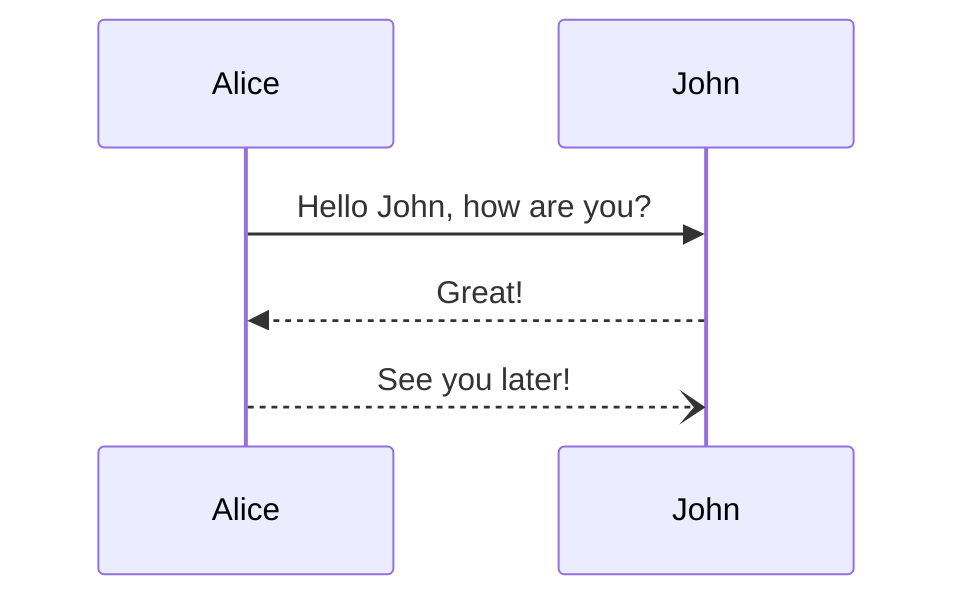
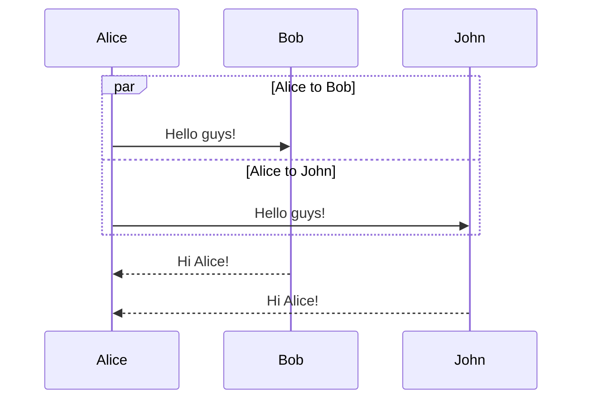
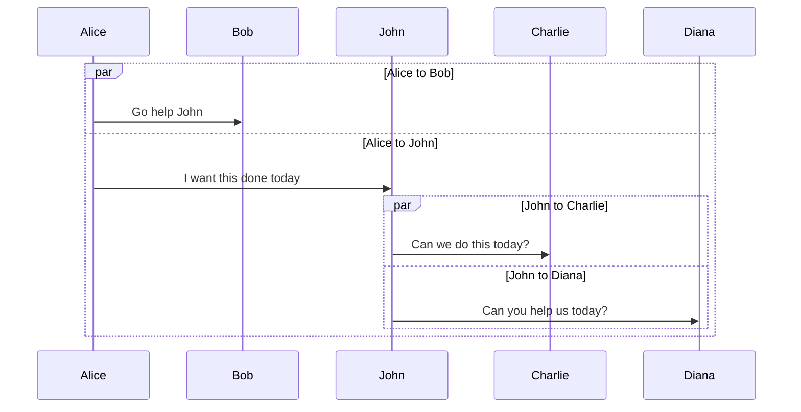
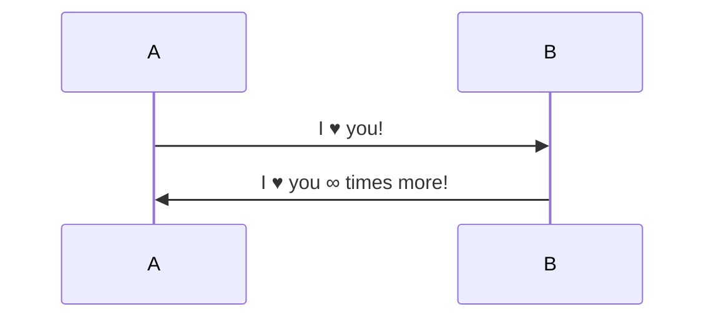

# Sequence diagrams

**Edit this Page** [](https://github.com/mermaid-js/mermaid/blob/develop/docs/sequenceDiagram.md)
> A Sequence diagram is an interaction diagram that shows how processes operate with one another and in what order.

Mermaid can render sequence diagrams.

```
sequenceDiagram
    Alice->>John: Hello John, how are you?
    John-->>Alice: Great!
    Alice-)John: See you later!
```



```note
A note on nodes, the word "end" could potentially break the diagram, due to the way that the mermaid language is scripted.

If unavoidable, one must use parentheses(), quotation marks "", or brackets {},[], to enclose the word "end". i.e : (end), [end], {end}.
```

## Syntax

### Participants

The participants can be defined implicitly as in the first example on this page. The participants or actors are
rendered in order of appearance in the diagram source text. Sometimes you might want to show the participants in a
different order than how they appear in the first message. It is possible to specify the actor's order of
appearance by doing the following:

```
sequenceDiagram
    participant John
    participant Alice
    Alice->>John: Hello John, how are you?
    John-->>Alice: Great!
```


### Aliases

The actor can have a convenient identifier and a descriptive label.

```
sequenceDiagram
    participant A as Alice
    participant J as John
    A->>J: Hello John, how are you?
    J->>A: Great!
```


## Messages

Messages can be of two displayed either solid or with a dotted line.

```
[Actor][Arrow][Actor]:Message text
```

There are six types of arrows currently supported:

| Type | Description                                 |
| ---- | ------------------------------------------- |
| ->   | Solid line without arrow                    |
| -->  | Dotted line without arrow                   |
| ->>  | Solid line with arrowhead                   |
| -->> | Dotted line with arrowhead                  |
| -x   | Solid line with a cross at the end          |
| --x  | Dotted line with a cross at the end.        |
| -)   | Solid line with an open arrow at the end (async)  |
| --)  | Dotted line with a open arrow at the end (async) |

## Activations

It is possible to activate and deactivate an actor. (de)activation can be dedicated declarations:

```
sequenceDiagram
    Alice->>John: Hello John, how are you?
    activate John
    John-->>Alice: Great!
    deactivate John
```


There is also a shortcut notation by appending `+`/`-` suffix to the message arrow:

```
sequenceDiagram
    Alice->>+John: Hello John, how are you?
    John-->>-Alice: Great!
```


Activations can be stacked for same actor:

```
sequenceDiagram
    Alice->>+John: Hello John, how are you?
    Alice->>+John: John, can you hear me?
    John-->>-Alice: Hi Alice, I can hear you!
    John-->>-Alice: I feel great!
```


## Notes

It is possible to add notes to a sequence diagram. This is done by the notation
Note [ right of | left of | over ] [Actor]: Text in note content

See the example below:

```
sequenceDiagram
    participant John
    Note right of John: Text in note
```


It is also possible to create notes spanning two participants:

```
sequenceDiagram
    Alice->John: Hello John, how are you?
    Note over Alice,John: A typical interaction
```


## Loops

It is possible to express loops in a sequence diagram. This is done by the notation

```
loop Loop text
... statements ...
end
```

See the example below:

```
sequenceDiagram
    Alice->John: Hello John, how are you?
    loop Every minute
        John-->Alice: Great!
    end
```


## Alt

It is possible to express alternative paths in a sequence diagram. This is done by the notation

```
alt Describing text
... statements ...
else
... statements ...
end
```

or if there is sequence that is optional (if without else).

```
opt Describing text
... statements ...
end
```

See the example below:

```
sequenceDiagram
    Alice->>Bob: Hello Bob, how are you?
    alt is sick
        Bob->>Alice: Not so good :(
    else is well
        Bob->>Alice: Feeling fresh like a daisy
    end
    opt Extra response
        Bob->>Alice: Thanks for asking
    end
```


## Parallel

It is possible to show actions that are happening in parallel.

This is done by the notation

```
par [Action 1]
... statements ...
and [Action 2]
... statements ...
and [Action N]
... statements ...
end
```

See the example below:



It is also possible to nest parallel blocks.



## Background Highlighting

It is possible to highlight flows by providing colored background rects. This is done by the notation

The colors are defined using rgb and rgba syntax.

```
rect rgb(0, 255, 0)
... content ...
end
```

```
rect rgba(0, 0, 255, .1)
... content ...
end
```

See the examples below:


## Comments

Comments can be entered within a sequence diagram, which will be ignored by the parser.  Comments need to be on their own line, and must be prefaced with `%%` (double percent signs). Any text after the start of the comment to the next newline will be treated as a comment, including any diagram syntax

```
sequenceDiagram
    Alice->>John: Hello John, how are you?
    %% this is a comment
    John-->>Alice: Great!
```

## Entity codes to escape characters

It is possible to escape characters using the syntax exemplified here.

```
sequenceDiagram
    A->>B: I #9829; you!
    B->>A: I #9829; you #infin; times more!
```


Numbers given are base 10, so `#` can be encoded as `#35;`. It is also supported to use HTML character names.

Because semicolons can be used instead of line breaks to define the markup, you need to use `#59;` to include a semicolon in message text.

## sequenceNumbers

It is possible to get a sequence number attached to each arrow in a sequence diagram. This can be configured when adding mermaid to the website as shown below:

```
    <script>
      mermaid.initialize({
        sequence: { showSequenceNumbers: true },
      });
    </script>
```

It can also be be turned on via the diagram code as in the diagram:

```
sequenceDiagram
    autonumber
    Alice->>John: Hello John, how are you?
    loop Healthcheck
        John->>John: Fight against hypochondria
    end
    Note right of John: Rational thoughts!
    John-->>Alice: Great!
    John->>Bob: How about you?
    Bob-->>John: Jolly good!
```


## Styling

Styling of a sequence diagram is done by defining a number of css classes. During rendering these classes are extracted from the file located at src/themes/sequence.scss

### Classes used

| Class        | Description                                                 |
| ------------ | ----------------------------------------------------------- |
| actor        | Style for the actor box at the top of the diagram.          |
| text.actor   | Styles for text in the actor box at the top of the diagram. |
| actor-line   | The vertical line for an actor.                             |
| messageLine0 | Styles for the solid message line.                          |
| messageLine1 | Styles for the dotted message line.                         |
| messageText  | Defines styles for the text on the message arrows.          |
| labelBox     | Defines styles label to left in a loop.                     |
| labelText    | Styles for the text in label for loops.                     |
| loopText     | Styles for the text in the loop box.                        |
| loopLine     | Defines styles for the lines in the loop box.               |
| note         | Styles for the note box.                                    |
| noteText     | Styles for the text on in the note boxes.                   |

### Sample stylesheet

```css
body {
    background: white;
}

.actor {
    stroke: #ccccff;
    fill: #ececff;
}
text.actor {
    fill: black;
    stroke: none;
    font-family: Helvetica;
}

.actor-line {
    stroke: grey;
}

.messageLine0 {
    stroke-width: 1.5;
    stroke-dasharray: '2 2';
    marker-end: 'url(#arrowhead)';
    stroke: black;
}

.messageLine1 {
    stroke-width: 1.5;
    stroke-dasharray: '2 2';
    stroke: black;
}

#arrowhead {
    fill: black;
}

.messageText {
    fill: black;
    stroke: none;
    font-family: 'trebuchet ms', verdana, arial;
    font-size: 14px;
}

.labelBox {
    stroke: #ccccff;
    fill: #ececff;
}

.labelText {
    fill: black;
    stroke: none;
    font-family: 'trebuchet ms', verdana, arial;
}

.loopText {
    fill: black;
    stroke: none;
    font-family: 'trebuchet ms', verdana, arial;
}

.loopLine {
    stroke-width: 2;
    stroke-dasharray: '2 2';
    marker-end: 'url(#arrowhead)';
    stroke: #ccccff;
}

.note {
    stroke: #decc93;
    fill: #fff5ad;
}

.noteText {
    fill: black;
    stroke: none;
    font-family: 'trebuchet ms', verdana, arial;
    font-size: 14px;
}
```

## Configuration

Is it possible to adjust the margins for rendering the sequence diagram.

This is done by defining `mermaid.sequenceConfig` or by the CLI to use a json file with the configuration.
How to use the CLI is described in the [mermaidCLI](mermaidCLI) page.
`mermaid.sequenceConfig` can be set to a JSON string with config parameters or the corresponding object.

```javascript
mermaid.sequenceConfig = {
    diagramMarginX: 50,
    diagramMarginY: 10,
    boxTextMargin: 5,
    noteMargin: 10,
    messageMargin: 35,
    mirrorActors: true
};
```

### Possible configuration parameters:

| Parameter         | Description                                                                                                                                | Default value                  |
| ----------------- | ------------------------------------------------------------------------------------------------------------------------------------------ | ------------------------------ |
| mirrorActors      | Turns on/off the rendering of actors below the diagram as well as above it                                                                 | false                          |
| bottomMarginAdj   | Adjusts how far down the graph ended. Wide borders styles with css could generate unwanted clipping which is why this config param exists. | 1                              |
| actorFontSize     | Sets the font size for the actor's description                                                                                             | 14                             |
| actorFontFamily   | Sets the font family for the actor's description                                                                                           | "Open-Sans", "sans-serif"      |
| actorFontWeight   | Sets the font weight for the actor's description                                                                                           | "Open-Sans", "sans-serif"      |
| noteFontSize      | Sets the font size for actor-attached notes                                                                                                | 14                             |
| noteFontFamily    | Sets the font family for actor-attached notes                                                                                              | "trebuchet ms", verdana, arial |
| noteFontWeight    | Sets the font weight for actor-attached notes                                                                                              | "trebuchet ms", verdana, arial |
| noteAlign         | Sets the text alignment for text in actor-attached notes                                                                                   | center                         |
| messageFontSize   | Sets the font size for actor<->actor messages                                                                                              | 16                             |
| messageFontFamily | Sets the font family for actor<->actor messages                                                                                            | "trebuchet ms", verdana, arial |
| messageFontWeight | Sets the font weight for actor<->actor messages                                                                                            | "trebuchet ms", verdana, arial |
