# State diagrams

> A state diagram is a type of diagram used in computer science and related fields to describe the behavior of systems. State diagrams require that the system described is composed of a finite number of states; sometimes, this is indeed the case, while at other times this is a reasonable abstraction.

Mermaid can render state diagrams with a syntax derived from plantUml, this to make the diagrams easier to use.

```
stateDiagram
    [*] --> Still
    Still --> [*]

    Still --> Moving
    Moving --> Still
    Moving --> Crash
    Crash --> [*]
```
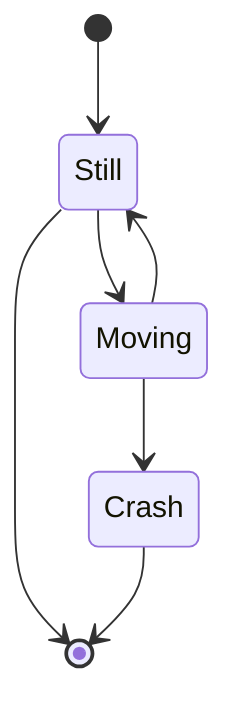

## States

A state can be declares in multiple ways. The simplest way is to define a state id as a description.

```
stateDiagram
    s1
```
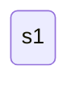

Another way is by using the state key word as per below:
```
stateDiagram
    state "This ia state decription" as s2
```
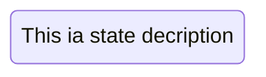

## Transitions

Transitions are path/edges when one state passes into another. This is represented using text arrow, "-->".

Transitions from and to states that are not defined implicitly defines these states.

```
stateDiagram
    s1 --> s2
```
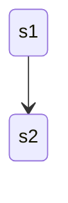

It is possieblt to add text to a transition.

```
stateDiagram
    s1 --> s2: A transition
```
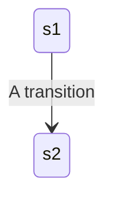

There are two special states indicating the start of the diagram and the stop of the diagram. These are written with the [*] syntax.

```
stateDiagram
    [*] --> s1
    s1 --> [*]
```
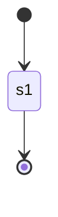


## Composit states

In a real world use of state diagrams you often end up with diagrams that are multi-dimensional as one state can have several internal states.

In order to define a composit state you need to use the state keyword as per below:

```
stateDiagram
    [*] --> First
    state First {
        [*] --> second
        second --> [*]
    }
```
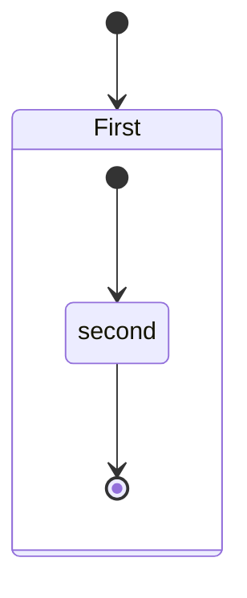

You can do this in several layers:

```
stateDiagram
    [*] --> First
    First --> Second
    First --> Third

    state First {
        [*] --> fir
        fir --> [*]
    }
    state Second {
        [*] --> sec
        sec --> [*]
    }
    state Third {
        [*] --> thi
        thi --> [*]
    }
```
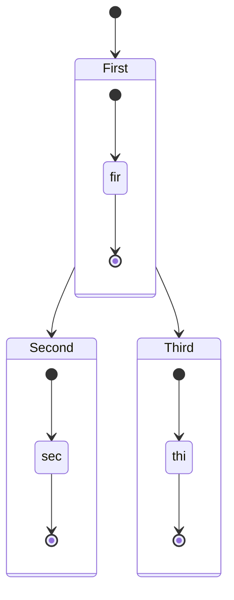

## Forks

It is possible to specify a fork in the diagram using &lt;&lt;fork&gt;&gt; &lt;&lt;join&gt;&gt;.

```
   stateDiagram
    state fork_state <<fork>>
      [*] --> fork_state
      fork_state --> State2
      fork_state --> State3

      state join_state <<join>>
      State2 --> join_state
      State3 --> join_state
      join_state --> State4
      State4 --> [*]
```
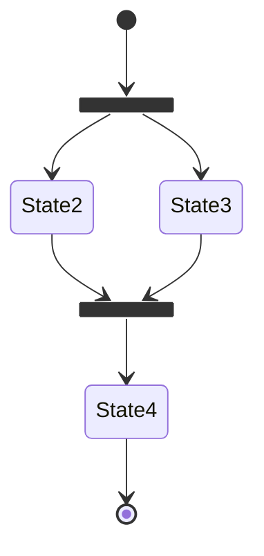

## Notes

Sometimes nothing says it better then a postit note. That is also the case in state diagrams.

Here you can't choose to put the onte to the right or to the left of a node.

```
    stateDiagram
        State1: The state with a note
        note right of State1
            Important information! You can write
            notes.
        end note
        State1 --> State2
        note left of State2 : This is the note to the left.
```
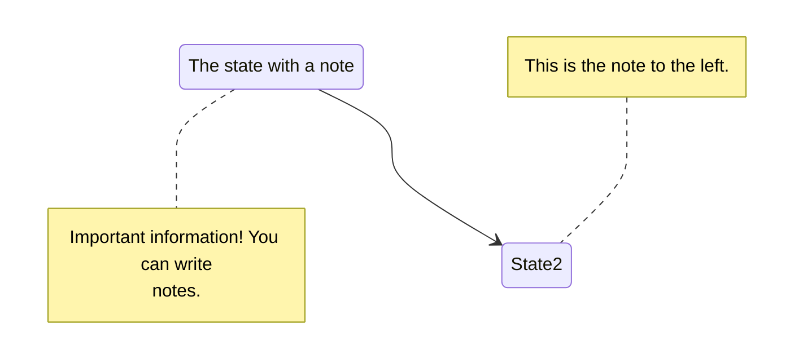

## Concurrency

As in plantUml you can specify concurrency using the -- symbol.
```
    stateDiagram
        [*] --> Active

        state Active {
            [*] --> NumLockOff
            NumLockOff --> NumLockOn : EvNumLockPressed
            NumLockOn --> NumLockOff : EvNumLockPressed
            --
            [*] --> CapsLockOff
            CapsLockOff --> CapsLockOn : EvCapsLockPressed
            CapsLockOn --> CapsLockOff : EvCapsLockPressed
            --
            [*] --> ScrollLockOff
            ScrollLockOff --> ScrollLockOn : EvCapsLockPressed
            ScrollLockOn --> ScrollLockOff : EvCapsLockPressed
        }
```


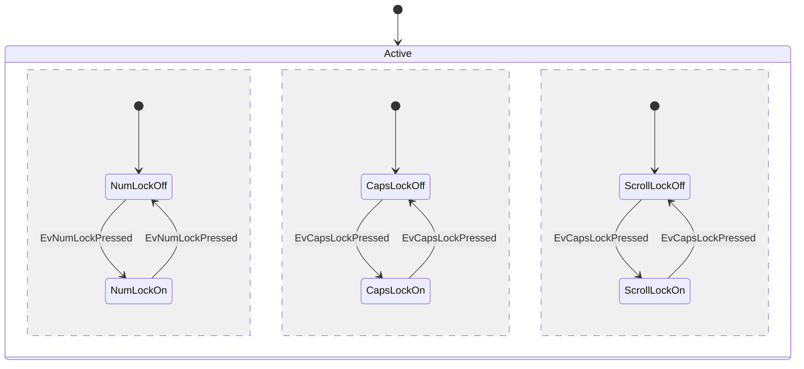

## Styling

Styling of the a sequence diagram is done by defining a number of css classes.  During rendering these classes are extracted from the file located at src/themes/sequence.scss

### Classes used (TB Written)

Class        | Description
---          | ---
Fakenote         | Styles for the note box.
FakenoteText     | Styles for the text on in the note boxes.


## Configuration

Is it possible to adjust the margins etc for the stateDiagram ... TB written

```javascript
mermaid.stateConfig = {
};
```

### Possible configuration params:

Param | Description | Default value
--- | --- | ---
TBS | Turns on/off the rendering of actors below the diagram as well as above it | false

