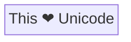

> **Warning**
>
> ## THIS IS AN AUTOGENERATED FILE. DO NOT EDIT.
>
> ## Please edit the corresponding file in [/packages/mermaid/src/docs/syntax/block-old.md](../../packages/mermaid/src/docs/syntax/block-old.md).

# Block Diagrams - Basic Syntax

Block diagrams are a fundamental tool in technical and engineering documentation, offering a straightforward way to represent complex systems and processes.

A block diagram, at its core, is a graphical representation of a system that uses blocks to depict different components or functions and arrows to show the relationship or flow between them. This form of diagram is invaluable in simplifying the understanding of large-scale systems, breaking them down into individual, easily digestible components.

With block diagrams you can create clear, concise, and visually appealing representations of systems. This is particularly beneficial for technical teams and stakeholders who need to document, analyze, or communicate complex processes without getting entangled in the intricacies of detailed schematics. Whether it's for software architecture, network systems, or process management, Mermaid's block diagrams offer an accessible and efficient way to visualize and convey crucial information.

> **Warning**
> If you are using the word "end" in a Flowchart block, capitalize the entire word or any of the letters (e.g., "End" or "END"), or apply this [workaround](https://github.com/mermaid-js/mermaid/issues/1444#issuecomment-639528897). Typing "end" in all lowercase letters will break the Flowchart.

### A block (default)

```mermaid
---
title: Block
---
block-beta
    id
```




> **Note**
> The id is what is displayed in the box.

### A block with text

It is also possible to set text in the box that differs from the id. If this is done several times, it is the last text
found for the block that will be used. Also if you define edges for the block later on, you can omit text definitions. The
one previously defined will be used when rendering the box.

```mermaid-example
---
title: Node with text
---
block-beta
    id1[This is the text in the box]
```

```mermaid
---
title: Node with text
---
block-beta
    id1[This is the text in the box]
```

#### Unicode text

Use `"` to enclose the unicode text.




#### Markdown formatting

Use double quotes and backticks "\` text \`" to enclose the markdown text.

```mermaid-example
%%{init: {"flowchart": {"htmlLabels": false}} }%%
block-beta
    markdown["`This **is** _Markdown_`"]
    newLines["`Line1
    Line 2
    Line 3`"]
    markdown --> newLines
```

```mermaid
%%{init: {"flowchart": {"htmlLabels": false}} }%%
block-beta
    markdown["`This **is** _Markdown_`"]
    newLines["`Line1
    Line 2
    Line 3`"]
    markdown --> newLines
```

## Block shapes

### A block with round edges

```mermaid-example
block-beta
    id1(This is the text in the box)
```

```mermaid
block-beta
    id1(This is the text in the box)
```

### A stadium-shaped block

```mermaid-example
block-beta
    id1([This is the text in the box])
```

```mermaid
block-beta
    id1([This is the text in the box])
```

### A block in a subroutine shape

```mermaid-example
block-beta
    id1[[This is the text in the box]]
```

```mermaid
block-beta
    id1[[This is the text in the box]]
```

### A block in a cylindrical shape

```mermaid-example
block-beta
    id1[(Database)]
```

```mermaid
block-beta
    id1[(Database)]
```

### A block in the form of a circle

```mermaid-example
block-beta
    id1((This is the text in the circle))
```

```mermaid
block-beta
    id1((This is the text in the circle))
```

### A block in an asymmetric shape

```mermaid-example
block-beta
    id1>This is the text in the box]
```

```mermaid
block-beta
    id1>This is the text in the box]
```

### A block (rhombus)

```mermaid-example
block-beta
    id1{This is the text in the box}
```

```mermaid
block-beta
    id1{This is the text in the box}
```

### A hexagon block

```mermaid-example
block-beta
    id1{{This is the text in the box}}
```

```mermaid
block-beta
    id1{{This is the text in the box}}
```

### Parallelogram

```mermaid-example
flowchart TD
    id1[/This is the text in the box/]
```

```mermaid
flowchart TD
    id1[/This is the text in the box/]
```

### Parallelogram alt

```mermaid-example
flowchart TD
    id1[\This is the text in the box\]
```

```mermaid
flowchart TD
    id1[\This is the text in the box\]
```

### Trapezoid

```mermaid-example
flowchart TD
    A[/Christmas\]
```

```mermaid
flowchart TD
    A[/Christmas\]
```

### Trapezoid alt

```mermaid-example
flowchart TD
    B[\Go shopping/]
```

```mermaid
flowchart TD
    B[\Go shopping/]
```

### Double circle

```mermaid-example
flowchart TD
    id1(((This is the text in the circle)))
```

```mermaid
flowchart TD
    id1(((This is the text in the circle)))
```

## Links between blocks

Blocks can be connected with links/edges. It is possible to have different types of links or attach a text string to a link.

### A link with arrow head

```mermaid-example
block-beta
    A-->B
```

```mermaid
block-beta
    A-->B
```

### An open link

```mermaid-example
block-beta
    A --- B
```

```mermaid
block-beta
    A --- B
```

### Text on links

```mermaid-example
block-beta
    A-- This is the text! ---B
```

```mermaid
block-beta
    A-- This is the text! ---B
```

or

```mermaid-example
block-beta
    A---|This is the text|B
```

```mermaid
block-beta
    A---|This is the text|B
```

### A link with arrow head and text

```mermaid-example
block-beta
    A-->|text|B
```

```mermaid
block-beta
    A-->|text|B
```

or

```mermaid-example
block-beta
    A-- text -->B
```

```mermaid
block-beta
    A-- text -->B
```

### Dotted link

```mermaid-example
block-beta
   A-.->B;
```

```mermaid
block-beta
   A-.->B;
```

### Dotted link with text

```mermaid-example
block-beta
   A-. text .-> B
```

```mermaid
block-beta
   A-. text .-> B
```

### Thick link

```mermaid-example
block-beta
   A ==> B
```

```mermaid
block-beta
   A ==> B
```

### Thick link with text

```mermaid-example
block-beta
   A == text ==> B
```

```mermaid
block-beta
   A == text ==> B
```

### Different types of links

There are new types of arrows supported as per below:

```mermaid-example
block-beta
    A --o B
    B --x C
```

```mermaid
block-beta
    A --o B
    B --x C
```

### Multi directional arrows

There is the possibility to use multidirectional arrows.

```mermaid-example
block-beta
    A o--o B
    B <--> C
    C x--x D
```

```mermaid
block-beta
    A o--o B
    B <--> C
    C x--x D
```

## Special characters that break syntax

It is possible to put text within quotes in order to render more troublesome characters. As in the example below:

```mermaid-example
block-beta
    id1["This is the (text) in the box"]
```

```mermaid
block-beta
    id1["This is the (text) in the box"]
```

### Entity codes to escape characters

It is possible to escape characters using the syntax exemplified here.

```mermaid-example
    block-beta
        A["A double quote:#quot;"] -->B["A dec char:#9829;"]
```

```mermaid
    block-beta
        A["A double quote:#quot;"] -->B["A dec char:#9829;"]
```

Numbers given are base 10, so `#` can be encoded as `#35;`. It is also supported to use HTML character names.

## Blocks in blocks

    block-beta
        block definition
    end

An example below:

```mermaid-example
block-beta
    block
        A["square"]
        B("rounded")
    end
    C(("circle"))
```

```mermaid
block-beta
    block
        A["square"]
        B("rounded")
    end
    C(("circle"))
```

### Comments

Comments can be entered within a flow diagram, which will be ignored by the parser. Comments need to be on their own line, and must be prefaced with `%%` (double percent signs). Any text after the start of the comment to the next newline will be treated as a comment, including any flow syntax

```mermaid-example
block-beta
%% this is a comment A -- text --> B{block}
   A -- text --> B -- text2 --> C
```

```mermaid
block-beta
%% this is a comment A -- text --> B{block}
   A -- text --> B -- text2 --> C
```

## Styling and classes

### Styling a block

It is possible to apply specific styles such as a thicker border or a different background color to a block.

```mermaid-example
block-beta
    id1(Start)-->id2(Stop)
    style id1 fill:#f9f,stroke:#333,stroke-width:4px
    style id2 fill:#bbf,stroke:#f66,stroke-width:2px,color:#fff,stroke-dasharray: 5 5
```

```mermaid
block-beta
    id1(Start)-->id2(Stop)
    style id1 fill:#f9f,stroke:#333,stroke-width:4px
    style id2 fill:#bbf,stroke:#f66,stroke-width:2px,color:#fff,stroke-dasharray: 5 5
```

#### Classes

More convenient than defining the style every time is to define a class of styles and attach this class to the blocks that
should have a different look.

A class definition looks like the example below:

        classDef className fill:#f9f,stroke:#333,stroke-width:4px;

Also, it is possible to define style to multiple classes in one statement:

        classDef firstClassName,secondClassName font-size:12pt;

Attachment of a class to a block is done as per below:

        class blockId1 className;

It is also possible to attach a class to a list of blocks in one statement:

        class blockId1,blockId2 className;
